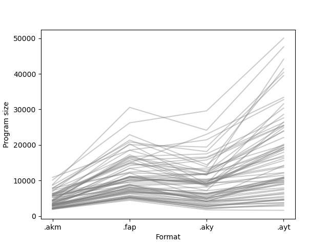
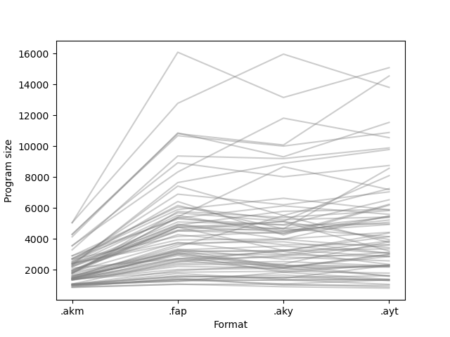
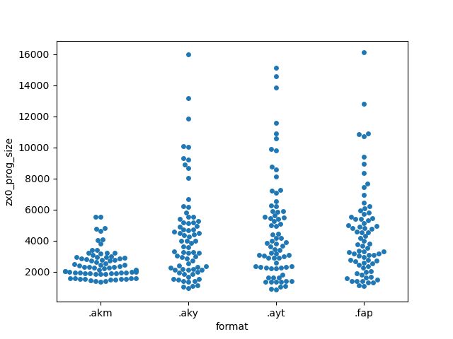
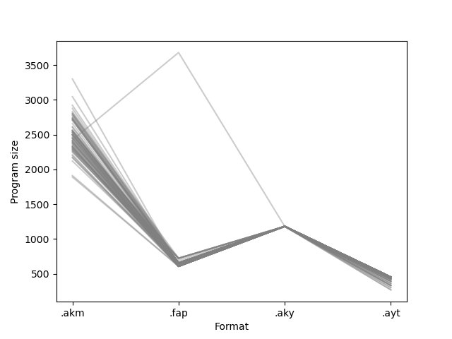
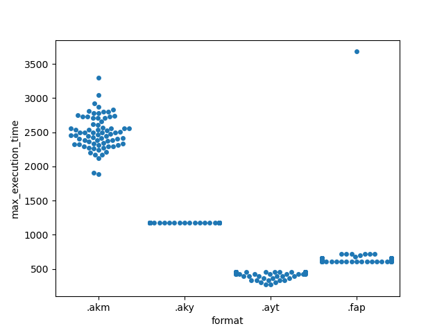

# Raw program size

|    | sources                                    |   .akm |   .aky |   .ayt |   .fap |
|---:|:-------------------------------------------|-------:|-------:|-------:|-------:|
|  0 | 2018_EA_demosong                           |   2788 |   4241 |   6196 |   6500 |
|  1 | 2018_nq_skrju_demosong                     |   4404 |   6365 |   7935 |   8292 |
|  2 | Andy Severn - Lop Ears                     |   2231 |   4170 |   6698 |   8804 |
|  3 | Doclands - Buzz-o-Meter (YM)               |   5948 |   9548 |  20189 |   9572 |
|  4 | Doclands - Pong Cracktro (YM)              |   7859 |  11670 |  19393 |  12132 |
|  5 | Doclands - Slowly But (YM)                 |   5196 |   8158 |  12115 |   7524 |
|  6 | Doclands - The Rivals (YM)                 |   6303 |  11824 |  18655 |   9572 |
|  7 | Doclands - The Saga (YM)                   |   5722 |   9234 |  15623 |   8548 |
|  8 | Doclands - Tiny Things (YM)                |   5274 |   9070 |  16233 |  10852 |
|  9 | Doclands - Truly Yours (YM)                |   6363 |  11944 |  16635 |  10596 |
| 10 | Doclands - Your Credits (YM)               |   4098 |   5908 |   9998 |   8804 |
| 11 | Excellence in Art 2018 - Just add cream    |   4280 |   8628 |  18685 |  17252 |
| 12 | FenyxKell - BD10n'nOeuf                    |   3197 |  10326 |  12225 |  11108 |
| 13 | FenyxKell - Bobline                        |   2895 |   6229 |  10623 |   8036 |
| 14 | FenyxKell - KellyOn                        |   5555 |  10355 |  14074 |  10084 |
| 15 | FenyxKell - Smoke                          |   2296 |   2907 |   3795 |   4964 |
| 16 | FenyxKell - Solarium                       |   2927 |   3731 |   6424 |   6244 |
| 17 | FenyxKell - Spectrum Castle                |   4352 |  15789 |  25435 |  13412 |
| 18 | Giherem - Bancaloide                       |   3000 |   5373 |  10632 |   7012 |
| 19 | Playing with effects                       |   2151 |   6398 |   9688 |   6756 |
| 20 | PulkoMandy - Renegade Remix                |   4547 |  11565 |  44113 |  16484 |
| 21 | SoundEffects                               |   1909 |   1758 |   1625 |   4452 |
| 22 | Targhan - A Harmless Grenade               |   2742 |   4985 |   8979 |   7012 |
| 23 | Targhan - Crtc                             |   7898 |  19414 |  40395 |  20068 |
| 24 | Targhan - Crtc - End part                  |   3137 |   9127 |  11474 |   9060 |
| 25 | Targhan - Dead On Time - Ingame            |   3436 |   7126 |   9536 |   7268 |
| 26 | Targhan - Dead On Time - Main Menu         |   3081 |   5625 |   8979 |   6756 |
| 27 | Targhan - Dead On Time - Sound Effects     |   2126 |   2059 |   3098 |   4964 |
| 28 | Targhan - DemoIzArt - End Part             |  10135 |  29589 |  50026 |  26212 |
| 29 | Targhan - DemoIzArt - Twist Part           |   7467 |  17498 |  27600 |  16740 |
| 30 | Targhan - Hocus Pocus                      |   6117 |  16591 |  26314 |  15722 |
| 31 | Targhan - Midline Process - Carpet         |   8680 |  18135 |  39500 |  20836 |
| 32 | Targhan - Midline Process - Molusk         |   8861 |  24133 |  47587 |  30564 |
| 33 | Targhan - Ooops                            |   2093 |   2652 |   4705 |   5476 |
| 34 | Targhan - Orion Prime - Danger Ahead       |   1989 |   2429 |   2818 |   4708 |
| 35 | Targhan - Orion Prime - Fight              |   2105 |   2818 |   4517 |   5220 |
| 36 | Targhan - Orion Prime - Introduction       |   6091 |  23009 |  33390 |  14948 |
| 37 | Targhan - Orion Prime - Level 1            |   3572 |   8854 |  24890 |  11114 |
| 38 | Targhan - Orion Prime - Level 4 - Theme 1  |   3450 |   7181 |  26473 |  11108 |
| 39 | Targhan - Orion Prime - Level 4 - Theme 2  |   3730 |  16386 |  25564 |  14180 |
| 40 | Targhan - Star Sabre - Boss Theme          |   2532 |   4014 |   5219 |   5732 |
| 41 | Targhan - Star Sabre - Ingame              |   4076 |   9850 |  17036 |  10084 |
| 42 | Targhan - Star Sabre - Intermission        |   2924 |   6375 |  10892 |   8036 |
| 43 | Targhan - Star Sabre - Main Menu           |   3755 |   9690 |  17950 |  10340 |
| 44 | Targhan - Wunderbar                        |   2510 |   4117 |  10953 |   7012 |
| 45 | Tom&Jerry - Boules Et Bits (Extended)      |   4520 |   8557 |  19924 |  16228 |
| 46 | Tom&Jerry - From Scratch - Part 1          |   3503 |   6090 |  10964 |   6500 |
| 47 | Tom&Jerry - From Scratch - Part 2          |   2894 |   4081 |  10358 |   8804 |
| 48 | Tom&Jerry - From Scratch - Part 3          |   3253 |   5191 |   7604 |   7780 |
| 49 | Tom&Jerry - From Scratch - Part 4          |   3235 |   4694 |  10628 |   7524 |
| 50 | Tom&Jerry - Le Crime Du Parking - End Game |   2308 |   3485 |   5571 |   5732 |
| 51 | Tom&Jerry - Le Crime Du Parking - Intro    |   3377 |   8898 |  19123 |  13412 |
| 52 | Tom&Jerry - Sudoku - Menu                  |   2196 |   3223 |   4517 |   5476 |
| 53 | Tom&Jerry - Sudoku - Notice                |   2021 |   2672 |   4817 |   5220 |
| 54 | Tom&Jerry - Sudoku - Sundat                |   2216 |   4266 |   4545 |   5220 |
| 55 | Tom&Jerry - Sudoku - Theme 1               |   4679 |   9081 |  31579 |  20324 |
| 56 | Tom&Jerry - Sudoku - Theme 2               |   4336 |  11934 |  25338 |  11114 |
| 57 | Tom&Jerry - Sudoku - Victory               |   2215 |   3145 |   3692 |   5220 |
| 58 | Totta - BaraBadaBastu                      |   2906 |   4658 |   7412 |   8042 |
| 59 | Totta - Crawlers                           |   5645 |  10030 |  13730 |  10090 |
| 60 | Totta - Hardy                              |  10893 |  21442 |  32747 |  18538 |
| 61 | Totta - Mellow                             |   5734 |  12951 |  22085 |  14692 |
| 62 | Totta - Rezzy                              |   7203 |  13483 |  19911 |  12388 |
| 63 | Totta - Room5                              |   3737 |   9343 |   9971 |  10852 |
| 64 | UltraSyd - Dead Floppy                     |   2915 |   4920 |  14242 |  12132 |
| 65 | UltraSyd - Fractal                         |   5757 |   8330 |  19279 |  15460 |
| 66 | UltraSyd - Fuck It                         |   6436 |  11578 |  23981 |  14954 |
| 67 | UltraSyd - Robot                           |   5953 |  12452 |  28603 |  18532 |
| 68 | UltraSyd - The End                         |   6934 |  14430 |  30368 |  22884 |
| 69 | UltraSyd - YM Type                         |   4265 |  12346 |  23867 |  16746 |
| 70 | Ultrasyd - Morons                          |   7827 |  13856 |  41449 |  21348 |
| 71 | jinj_med                                   |   1927 |   2138 |   3366 |   5220 |
| 72 | maryjane2                                  |   3325 |   5035 |   9333 |   7268 |

Mean

| format   |        0 |
|:---------|---------:|
| .akm     |  4356.33 |
| .aky     |  9029.55 |
| .ayt     | 16765.6  |
| .fap     | 11066.6  |

 - .akm vs .fap: dissimilar (best=.akm)
 - .akm vs .aky: dissimilar (best=.akm)
 - .akm vs .ayt: dissimilar (best=.akm)
 - .fap vs .aky: dissimilar (best=.aky)
 - .fap vs .ayt: dissimilar (best=.fap)
 - .aky vs .ayt: dissimilar (best=.aky)

# Crunch (zx0) program size (without decrunch routine and data reloction)

|    | sources                                    |   .akm |   .aky |   .ayt |   .fap |
|---:|:-------------------------------------------|-------:|-------:|-------:|-------:|
|  0 | 2018_EA_demosong                           |   1901 |   2115 |   1636 |   2049 |
|  1 | 2018_nq_skrju_demosong                     |   2211 |   2707 |   3155 |   3371 |
|  2 | Andy Severn - Lop Ears                     |   1549 |   2330 |   1604 |   1977 |
|  3 | Doclands - Buzz-o-Meter (YM)               |   2883 |   4010 |   4446 |   3970 |
|  4 | Doclands - Pong Cracktro (YM)              |   3412 |   4919 |   4995 |   5318 |
|  5 | Doclands - Slowly But (YM)                 |   2612 |   3216 |   2365 |   2748 |
|  6 | Doclands - The Rivals (YM)                 |   3170 |   4488 |   4951 |   4191 |
|  7 | Doclands - The Saga (YM)                   |   2924 |   3830 |   3092 |   3758 |
|  8 | Doclands - Tiny Things (YM)                |   2510 |   3639 |   3649 |   4302 |
|  9 | Doclands - Truly Yours (YM)                |   2921 |   5163 |   3978 |   4601 |
| 10 | Doclands - Your Credits (YM)               |   2103 |   2253 |   2209 |   3285 |
| 11 | Excellence in Art 2018 - Just add cream    |   2326 |   4563 |   5099 |   5407 |
| 12 | FenyxKell - BD10n'nOeuf                    |   2077 |   5519 |   3796 |   3532 |
| 13 | FenyxKell - Bobline                        |   1993 |   3562 |   3087 |   3317 |
| 14 | FenyxKell - KellyOn                        |   3209 |   6151 |   5610 |   5383 |
| 15 | FenyxKell - Smoke                          |   1566 |   1686 |   1329 |   1555 |
| 16 | FenyxKell - Solarium                       |   1889 |   1921 |   1807 |   1875 |
| 17 | FenyxKell - Spectrum Castle                |   2778 |   8911 |   9805 |   7676 |
| 18 | Giherem - Bancaloide                       |   1835 |   2404 |   3838 |   2355 |
| 19 | Playing with effects                       |   1583 |   3308 |   2880 |   2565 |
| 20 | PulkoMandy - Renegade Remix                |   3007 |   5158 |   8123 |   5716 |
| 21 | SoundEffects                               |   1357 |    924 |    832 |   1106 |
| 22 | Targhan - A Harmless Grenade               |   1971 |   2981 |   2894 |   3091 |
| 23 | Targhan - Crtc                             |   4782 |  10096 |  14575 |  10843 |
| 24 | Targhan - Crtc - End part                  |   2037 |   3992 |   3458 |   3667 |
| 25 | Targhan - Dead On Time - Ingame            |   2325 |   3281 |   3374 |   3189 |
| 26 | Targhan - Dead On Time - Main Menu         |   2137 |   2849 |   2600 |   2726 |
| 27 | Targhan - Dead On Time - Sound Effects     |   1513 |   1104 |   1365 |   1404 |
| 28 | Targhan - DemoIzArt - End Part             |   5554 |  15982 |  13836 |  12804 |
| 29 | Targhan - DemoIzArt - Twist Part           |   4052 |   8047 |   8770 |   8955 |
| 30 | Targhan - Hocus Pocus                      |   3790 |   9222 |   9910 |   9395 |
| 31 | Targhan - Midline Process - Carpet         |   4627 |   9325 |  11571 |  10888 |
| 32 | Targhan - Midline Process - Molusk         |   5554 |  13170 |  15112 |  16109 |
| 33 | Targhan - Ooops                            |   1517 |   1387 |   1407 |   1792 |
| 34 | Targhan - Orion Prime - Danger Ahead       |   1399 |   1093 |    917 |   1089 |
| 35 | Targhan - Orion Prime - Fight              |   1496 |   1466 |   2309 |   1647 |
| 36 | Targhan - Orion Prime - Introduction       |   4068 |  11831 |  10582 |   8360 |
| 37 | Targhan - Orion Prime - Level 1            |   2436 |   4376 |   6259 |   4550 |
| 38 | Targhan - Orion Prime - Level 4 - Theme 1  |   2367 |   3029 |   3893 |   3802 |
| 39 | Targhan - Orion Prime - Level 4 - Theme 2  |   2275 |   8680 |   7212 |   5449 |
| 40 | Targhan - Star Sabre - Boss Theme          |   1852 |   2133 |   2210 |   2249 |
| 41 | Targhan - Star Sabre - Ingame              |   2804 |   4935 |   6552 |   5126 |
| 42 | Targhan - Star Sabre - Intermission        |   1946 |   3218 |   4401 |   3253 |
| 43 | Targhan - Star Sabre - Main Menu           |   2481 |   4704 |   5415 |   4899 |
| 44 | Targhan - Wunderbar                        |   1845 |   2188 |   3004 |   2763 |
| 45 | Tom&Jerry - Boules Et Bits (Extended)      |   2700 |   4008 |   5514 |   4981 |
| 46 | Tom&Jerry - From Scratch - Part 1          |   1925 |   2928 |   3630 |   2551 |
| 47 | Tom&Jerry - From Scratch - Part 2          |   1950 |   1993 |   2311 |   2652 |
| 48 | Tom&Jerry - From Scratch - Part 3          |   1875 |   2551 |   2280 |   2446 |
| 49 | Tom&Jerry - From Scratch - Part 4          |   1968 |   2121 |   3036 |   3029 |
| 50 | Tom&Jerry - Le Crime Du Parking - End Game |   1594 |   1528 |   1635 |   1606 |
| 51 | Tom&Jerry - Le Crime Du Parking - Intro    |   2287 |   4506 |   5243 |   4805 |
| 52 | Tom&Jerry - Sudoku - Menu                  |   1519 |   1551 |   1330 |   1399 |
| 53 | Tom&Jerry - Sudoku - Notice                |   1447 |   1345 |   1357 |   1386 |
| 54 | Tom&Jerry - Sudoku - Sundat                |   1568 |   1866 |   1398 |   1286 |
| 55 | Tom&Jerry - Sudoku - Theme 1               |   2958 |   4267 |   6206 |   6448 |
| 56 | Tom&Jerry - Sudoku - Theme 2               |   2756 |   5804 |   5917 |   4924 |
| 57 | Tom&Jerry - Sudoku - Victory               |   1502 |   1375 |   1079 |   1300 |
| 58 | Totta - BaraBadaBastu                      |   1928 |   2317 |   2260 |   3063 |
| 59 | Totta - Crawlers                           |   2704 |   4698 |   4164 |   4542 |
| 60 | Totta - Hardy                              |   4809 |  10020 |  10906 |  10709 |
| 61 | Totta - Mellow                             |   3405 |   5269 |   5437 |   6096 |
| 62 | Totta - Rezzy                              |   3234 |   6650 |   5898 |   5930 |
| 63 | Totta - Room5                              |   2395 |   5128 |   3237 |   4776 |
| 64 | UltraSyd - Dead Floppy                     |   1877 |   2177 |   2880 |   3151 |
| 65 | UltraSyd - Fractal                         |   2449 |   3270 |   4171 |   4795 |
| 66 | UltraSyd - Fuck It                         |   2865 |   4369 |   5485 |   5554 |
| 67 | UltraSyd - Robot                           |   3056 |   6228 |   7067 |   6925 |
| 68 | UltraSyd - The End                         |   2862 |   5542 |   7274 |   7448 |
| 69 | UltraSyd - YM Type                         |   2263 |   5407 |   5848 |   5806 |
| 70 | Ultrasyd - Morons                          |   3221 |   4670 |   8600 |   6196 |
| 71 | jinj_med                                   |   1399 |   1031 |   1021 |   1482 |
| 72 | maryjane2                                  |   2025 |   1869 |   2350 |   2953 |

Mean

| format   |       0 |
|:---------|--------:|
| .akm     | 2509.38 |
| .aky     | 4333.62 |
| .ayt     | 4677.34 |
| .fap     | 4470.49 |

 - .akm vs .fap: dissimilar (best=.akm)
 - .akm vs .aky: dissimilar (best=.akm)
 - .akm vs .ayt: dissimilar (best=.akm)
 - .fap vs .aky: dissimilar (best=.aky)
 - .fap vs .ayt: similar
 - .aky vs .ayt: dissimilar (best=.aky)

# Maximum execution time (in nops)

|    | sources                                    |   .akm |   .aky |   .ayt |   .fap |
|---:|:-------------------------------------------|-------:|-------:|-------:|-------:|
|  0 | 2018_EA_demosong                           |   3045 |   1181 |    392 |    631 |
|  1 | 2018_nq_skrju_demosong                     |   2776 |   1181 |    392 |    631 |
|  2 | Andy Severn - Lop Ears                     |   3299 |   1181 |    422 |    607 |
|  3 | Doclands - Buzz-o-Meter (YM)               |   2658 |   1181 |    453 |    631 |
|  4 | Doclands - Pong Cracktro (YM)              |   2750 |   1181 |    423 |    655 |
|  5 | Doclands - Slowly But (YM)                 |   2725 |   1181 |    392 |    607 |
|  6 | Doclands - The Rivals (YM)                 |   2731 |   1181 |    453 |    655 |
|  7 | Doclands - The Saga (YM)                   |   2614 |   1181 |    453 |    607 |
|  8 | Doclands - Tiny Things (YM)                |   2708 |   1181 |    423 |    655 |
|  9 | Doclands - Truly Yours (YM)                |   2712 |   1181 |    453 |    655 |
| 10 | Doclands - Your Credits (YM)               |   2499 |   1181 |    453 |    655 |
| 11 | Excellence in Art 2018 - Just add cream    |   2799 |   1181 |    453 |    655 |
| 12 | FenyxKell - BD10n'nOeuf                    |   2492 |   1181 |    422 |    607 |
| 13 | FenyxKell - Bobline                        |   2388 |   1181 |    423 |    655 |
| 14 | FenyxKell - KellyOn                        |   2498 |   1181 |    453 |    655 |
| 15 | FenyxKell - Smoke                          |   2476 |   1181 |    362 |    607 |
| 16 | FenyxKell - Solarium                       |   2533 |   1181 |    453 |    655 |
| 17 | FenyxKell - Spectrum Castle                |   2552 |   1181 |    453 |    655 |
| 18 | Giherem - Bancaloide                       |   2315 |   1181 |    453 |    655 |
| 19 | Playing with effects                       |   2169 |   1181 |    331 |    607 |
| 20 | PulkoMandy - Renegade Remix                |   2371 |   1181 |    453 |    655 |
| 21 | SoundEffects                               |   1890 |   1181 |    269 |    607 |
| 22 | Targhan - A Harmless Grenade               |   2779 |   1181 |    453 |    655 |
| 23 | Targhan - Crtc                             |   2830 |   1181 |    453 |    655 |
| 24 | Targhan - Crtc - End part                  |   2731 |   1181 |    453 |    655 |
| 25 | Targhan - Dead On Time - Ingame            |   2209 |   1181 |    301 |    607 |
| 26 | Targhan - Dead On Time - Main Menu         |   2876 |   1181 |    422 |    631 |
| 27 | Targhan - Dead On Time - Sound Effects     |   1911 |   1181 |    269 |    607 |
| 28 | Targhan - DemoIzArt - End Part             |   2557 |   1181 |    423 |    631 |
| 29 | Targhan - DemoIzArt - Twist Part           |   2539 |   1181 |    453 |    655 |
| 30 | Targhan - Hocus Pocus                      |   2809 |   1181 |    453 |    723 |
| 31 | Targhan - Midline Process - Carpet         |   2568 |   1181 |    453 |    655 |
| 32 | Targhan - Midline Process - Molusk         |   2604 |   1181 |    453 |    631 |
| 33 | Targhan - Ooops                            |   2402 |   1181 |    453 |    655 |
| 34 | Targhan - Orion Prime - Danger Ahead       |   2504 |   1181 |    392 |    607 |
| 35 | Targhan - Orion Prime - Fight              |   2921 |   1181 |    453 |    655 |
| 36 | Targhan - Orion Prime - Introduction       |   2552 |   1181 |    453 |    655 |
| 37 | Targhan - Orion Prime - Level 1            |   2291 |   1181 |    423 |    723 |
| 38 | Targhan - Orion Prime - Level 4 - Theme 1  |   2443 |   1181 |    453 |    655 |
| 39 | Targhan - Orion Prime - Level 4 - Theme 2  |   2382 |   1181 |    423 |    607 |
| 40 | Targhan - Star Sabre - Boss Theme          |   2739 |   1181 |    453 |    655 |
| 41 | Targhan - Star Sabre - Ingame              |   2422 |   1181 |    453 |   3679 |
| 42 | Targhan - Star Sabre - Intermission        |   2559 |   1181 |    453 |    655 |
| 43 | Targhan - Star Sabre - Main Menu           |   2522 |   1181 |    453 |    655 |
| 44 | Targhan - Wunderbar                        |   2410 |   1181 |    453 |    655 |
| 45 | Tom&Jerry - Boules Et Bits (Extended)      |   2534 |   1181 |    453 |    655 |
| 46 | Tom&Jerry - From Scratch - Part 1          |   2499 |   1181 |    453 |    607 |
| 47 | Tom&Jerry - From Scratch - Part 2          |   2363 |   1181 |    423 |    655 |
| 48 | Tom&Jerry - From Scratch - Part 3          |   2259 |   1181 |    453 |    655 |
| 49 | Tom&Jerry - From Scratch - Part 4          |   2272 |   1181 |    453 |    655 |
| 50 | Tom&Jerry - Le Crime Du Parking - End Game |   2346 |   1181 |    331 |    607 |
| 51 | Tom&Jerry - Le Crime Du Parking - Intro    |   2441 |   1181 |    453 |    655 |
| 52 | Tom&Jerry - Sudoku - Menu                  |   2331 |   1181 |    332 |    607 |
| 53 | Tom&Jerry - Sudoku - Notice                |   2322 |   1181 |    361 |    607 |
| 54 | Tom&Jerry - Sudoku - Sundat                |   2271 |   1181 |    332 |    607 |
| 55 | Tom&Jerry - Sudoku - Theme 1               |   2294 |   1181 |    453 |    655 |
| 56 | Tom&Jerry - Sudoku - Theme 2               |   2387 |   1181 |    453 |    675 |
| 57 | Tom&Jerry - Sudoku - Victory               |   2324 |   1181 |    332 |    607 |
| 58 | Totta - BaraBadaBastu                      |   2496 |   1181 |    423 |    723 |
| 59 | Totta - Crawlers                           |   2450 |   1181 |    453 |    723 |
| 60 | Totta - Hardy                              |   2798 |   1181 |    453 |    699 |
| 61 | Totta - Mellow                             |   2407 |   1181 |    392 |    607 |
| 62 | Totta - Rezzy                              |   2706 |   1181 |    453 |    655 |
| 63 | Totta - Room5                              |   2452 |   1181 |    299 |    607 |
| 64 | UltraSyd - Dead Floppy                     |   2120 |   1181 |    453 |    655 |
| 65 | UltraSyd - Fractal                         |   2335 |   1181 |    453 |    631 |
| 66 | UltraSyd - Fuck It                         |   2244 |   1181 |    453 |    723 |
| 67 | UltraSyd - Robot                           |   2461 |   1181 |    453 |    655 |
| 68 | UltraSyd - The End                         |   2414 |   1181 |    453 |    655 |
| 69 | UltraSyd - YM Type                         |   2292 |   1181 |    453 |    723 |
| 70 | Ultrasyd - Morons                          |   2169 |   1181 |    453 |    655 |
| 71 | jinj_med                                   |   2197 |   1181 |    361 |    607 |
| 72 | maryjane2                                  |   2309 |   1181 |    392 |    607 |

Mean

| format   |        0 |
|:---------|---------:|
| .akm     | 2493.88  |
| .aky     | 1181     |
| .ayt     |  422.11  |
| .fap     |  686.781 |

 - .akm vs .fap: dissimilar (best=.fap)
 - .akm vs .aky: dissimilar (best=.aky)
 - .akm vs .ayt: dissimilar (best=.ayt)
 - .fap vs .aky: dissimilar (best=.fap)
 - .fap vs .ayt: dissimilar (best=.ayt)
 - .aky vs .ayt: dissimilar (best=.ayt)

