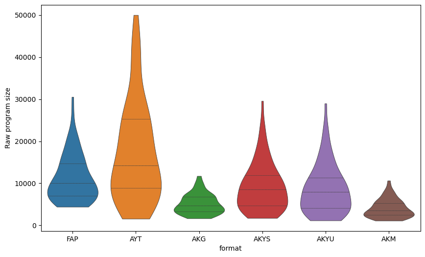
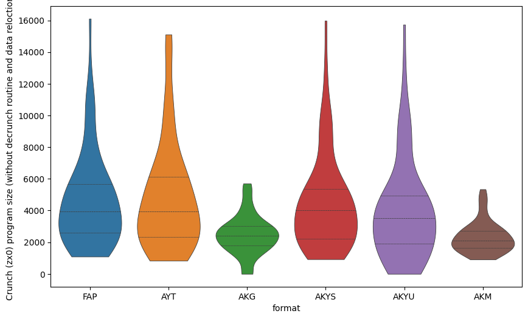
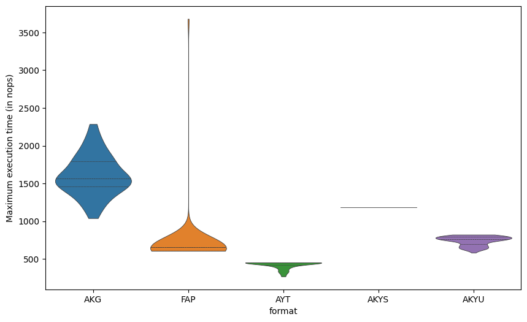
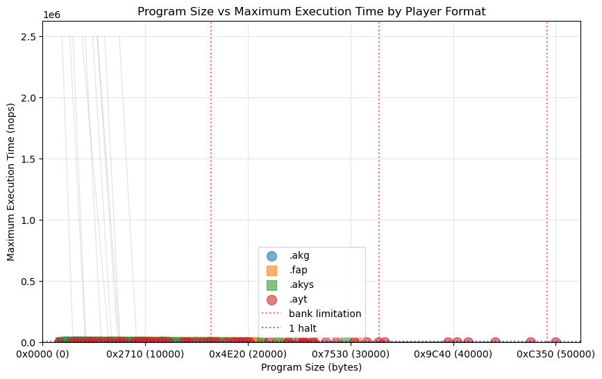
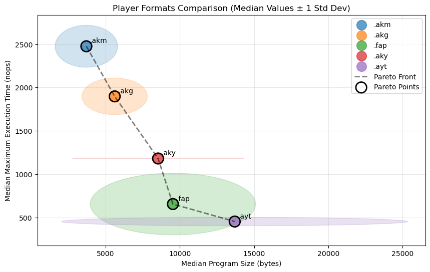

# Raw program size

|    | sources                                    |   AKG |   AKM |   AKYS |   AKYU |   AYT |   FAP |
|---:|:-------------------------------------------|------:|------:|-------:|-------:|------:|------:|
|  0 | 2018_EA_demosong                           |  3574 |  2400 |   4216 |   3399 |  6159 |  6460 |
|  1 | 2018_nq_skrju_demosong                     |  5566 |  4025 |   6340 |   5542 |  7898 |  8252 |
|  2 | Andy Severn - Lop Ears                     |  2953 |  1892 |   4145 |   3328 |  6661 |  8764 |
|  3 | Doclands - Buzz-o-Meter (YM)               |  6558 |  5667 |   9523 |   8990 | 20152 |  9532 |
|  4 | Doclands - GinFizz                         |  6458 |  3817 |   8369 |   7571 | 11543 | 10044 |
|  5 | Doclands - Pong Cracktro (YM)              |  9159 |  7481 |  11645 |  11094 | 19356 | 12092 |
|  6 | Doclands - Slowly But (YM)                 |  6276 |  4701 |   8133 |   7315 | 12078 |  7484 |
|  7 | Doclands - The Rivals (YM)                 |  7648 |  5921 |  11799 |  11266 | 18618 |  9532 |
|  8 | Doclands - The Saga (YM)                   |  7488 |  5334 |   9209 |   8676 | 15586 |  8508 |
|  9 | Doclands - Tiny Things (YM)                |  6728 |  4880 |   9045 |   8508 | 16196 | 10812 |
| 10 | Doclands - Truly Yours (YM)                |  7136 |  5973 |  11919 |  11386 | 16598 | 10556 |
| 11 | Doclands - Your Credits (YM)               |  4754 |  3573 |   5883 |   5332 |  9961 |  8764 |
| 12 | Excellence in Art 2018 - Just add cream    |  5709 |  4145 |   8603 |   8052 | 18648 | 17212 |
| 13 | FenyxKell - BD10n'nOeuf                    |  3125 |  2572 |  10301 |   9484 | 12188 | 11068 |
| 14 | FenyxKell - Bobline                        |  3372 |  2484 |   6204 |   5653 | 10586 |  7996 |
| 15 | FenyxKell - KellyOn                        |  5606 |  5138 |  10330 |   9779 | 14037 | 10044 |
| 16 | FenyxKell - Smoke                          |  2348 |  1758 |   2882 |   2064 |  3758 |  4924 |
| 17 | FenyxKell - Solarium                       |  3030 |  2393 |   3706 |   3136 |  6387 |  6204 |
| 18 | FenyxKell - Spectrum Castle                |  4971 |  3944 |  15764 |  15194 | 25398 | 13372 |
| 19 | Giherem - Bancaloide                       |  3306 |  2474 |   5348 |   4811 | 10595 |  6972 |
| 20 | Ok3anos - Cpc Dream                        |  4978 |  4399 |   8530 |   7979 | 14851 | 10300 |
| 21 | Playing with effects                       |  3620 |  1966 |   6373 |   5519 |  9651 |  6716 |
| 22 | PulkoMandy - Renegade Remix                |  5679 |  4038 |  11540 |  10989 | 44076 | 16444 |
| 23 | SoundEffects                               |  1739 |  1248 |   1733 |   1163 |  1588 |  4412 |
| 24 | Targhan - A Harmless Grenade               |  4165 |  2654 |   4960 |   4409 |  8942 |  6972 |
| 25 | Targhan - Aganamemnon (soft drums version) |  7314 |  5307 |  15280 |  14840 | 25367 | 14652 |
| 26 | Targhan - Crtc                             |  9698 |  7846 |  19389 |  18838 | 40358 | 20028 |
| 27 | Targhan - Dead On Time - Ingame            |  3763 |  2888 |   7101 |   6247 |  9499 |  7228 |
| 28 | Targhan - Dead On Time - Main Menu         |  3775 |  2556 |   5600 |   4802 |  8942 |  6716 |
| 29 | Targhan - Dead On Time - Sound Effects     |  2192 |  1606 |   2034 |   1483 |  3061 |  4924 |
| 30 | Targhan - DemoIzArt - End Part             | 11545 |  9705 |  29564 |  28971 | 49989 | 26172 |
| 31 | Targhan - DemoIzArt - Twist Part           |  8100 |  7046 |  17473 |  16903 | 27563 | 16700 |
| 32 | Targhan - Hocus Pocus                      |  7532 |  6043 |  16566 |  16133 | 26277 | 15682 |
| 33 | Targhan - Midline Process - Carpet         |  9510 |   nan |  18110 |  17559 | 39463 | 20796 |
| 34 | Targhan - Midline Process - Molusk         |  9752 |  8468 |  24108 |  23557 | 47550 | 30524 |
| 35 | Targhan - Ooops                            |  2478 |  1657 |   2627 |   2071 |  4668 |  5436 |
| 36 | Targhan - Orion Prime - Danger Ahead       |  2086 |  1438 |   2404 |   1740 |  2781 |  4668 |
| 37 | Targhan - Orion Prime - Fight              |  2455 |  1691 |   2793 |   2242 |  4480 |  5180 |
| 38 | Targhan - Orion Prime - Introduction       |  6958 |  5678 |  22984 |  22433 | 33353 | 14908 |
| 39 | Targhan - Orion Prime - Level 1            |  4225 |  3149 |   8829 |   8222 | 24853 | 11074 |
| 40 | Targhan - Orion Prime - Level 4 - Theme 1  |  4071 |  2929 |   7156 |   6586 | 26436 | 11068 |
| 41 | Targhan - Orion Prime - Level 4 - Theme 2  |  4688 |  3324 |  16361 |  15805 | 25527 | 14140 |
| 42 | Targhan - Star Sabre - Boss Theme          |  2870 |  2112 |   3989 |   3438 |  5182 |  5692 |
| 43 | Targhan - Star Sabre - Ingame              |  5089 |  3644 |   9825 |   9274 | 16999 | 10044 |
| 44 | Targhan - Star Sabre - Intermission        |  3234 |  2498 |   6350 |   5817 | 10855 |  7996 |
| 45 | Targhan - Star Sabre - Main Menu           |  4175 |  3216 |   9665 |   9114 | 17913 | 10300 |
| 46 | Targhan - Wunderbar                        |  3182 |  2105 |   4092 |   3541 | 10916 |  6972 |
| 47 | Tom&Jerry - Boules Et Bits (Extended)      |  4555 |  4097 |   8532 |   7976 | 19887 | 16188 |
| 48 | Tom&Jerry - From Scratch - Part 1          |  3668 |  3080 |   6065 |   5495 | 10927 |  6460 |
| 49 | Tom&Jerry - From Scratch - Part 2          |  3361 |  2467 |   4056 |   3486 | 10321 |  8764 |
| 50 | Tom&Jerry - From Scratch - Part 3          |  3272 |  2811 |   5166 |   4596 |  7567 |  7740 |
| 51 | Tom&Jerry - From Scratch - Part 4          |  3783 |  2821 |   4669 |   4099 | 10591 |  7484 |
| 52 | Tom&Jerry - Le Crime Du Parking - End Game |  2398 |  1653 |   3460 |   2606 |  5534 |  5692 |
| 53 | Tom&Jerry - Le Crime Du Parking - Intro    |  4159 |  2963 |   8873 |   8303 | 19086 | 13372 |
| 54 | Tom&Jerry - Sudoku - Menu                  |  2290 |  1541 |   3198 |   2344 |  4480 |  5436 |
| 55 | Tom&Jerry - Sudoku - Notice                |  2026 |  1365 |   2647 |   1793 |  4780 |  5180 |
| 56 | Tom&Jerry - Sudoku - Sundat                |  2237 |  1561 |   4241 |   3387 |  4508 |  5180 |
| 57 | Tom&Jerry - Sudoku - Theme 1               |  5586 |  4253 |   9056 |   8537 | 31542 | 20284 |
| 58 | Tom&Jerry - Sudoku - Theme 2               |  5236 |  3821 |  11909 |  11289 | 25301 | 11074 |
| 59 | Tom&Jerry - Sudoku - Victory               |  2146 |  1560 |   3120 |   2266 |  3655 |  5180 |
| 60 | Totta - BaraBadaBastu                      |  3997 |  2631 |   4633 |   4114 |  7375 |  8002 |
| 61 | Totta - Crawlers                           |  6590 |  5386 |  10005 |   9486 | 13693 | 10050 |
| 62 | Totta - Hardy                              | 11739 | 10653 |  21417 |  21011 | 32710 | 18498 |
| 63 | Totta - Mellow                             |  5305 |  5081 |  12926 |  12072 | 22048 | 14652 |
| 64 | Totta - Rezzy                              |  7030 |  6927 |  13458 |  12921 | 19874 | 12348 |
| 65 | Totta - Room5                              |  4527 |  3263 |   9318 |   8501 |  9934 | 10812 |
| 66 | UltraSyd - Dead Floppy                     |  3609 |  2485 |   4895 |   4344 | 14205 | 12092 |
| 67 | UltraSyd - Fractal                         |  5713 |  5339 |   8305 |   7772 | 19242 | 15420 |
| 68 | UltraSyd - Fuck It                         |  6946 |  6017 |  11553 |  11120 | 23944 | 14914 |
| 69 | UltraSyd - Robot                           |  6824 |  5535 |  12427 |  11876 | 28566 | 18492 |
| 70 | UltraSyd - The End                         |  7146 |  6525 |  14405 |  13868 | 30331 | 22844 |
| 71 | UltraSyd - YM Type                         |  4655 |  3847 |  12321 |  11802 | 23830 | 16706 |
| 72 | Ultrasyd - Morons                          |  7600 |  7235 |  13831 |  13280 | 41412 | 21308 |
| 73 | jinj_med                                   |  1654 |  1128 |   2113 |   1259 |  3329 |  5180 |
| 74 | maryjane2                                  |  3565 |  2541 |   5010 |   4193 |  9296 |  7228 |

Mean

| format   |        0 |
|:---------|---------:|
| AKG      |  5016.73 |
| AKM      |  3896.88 |
| AKYS     |  9072.12 |
| AKYU     |  8454.01 |
| AYT      | 16820.1  |
| FAP      | 11078.9  |

 - FAP vs AYT: dissimilar (best=FAP)
 - FAP vs AKG: dissimilar (best=AKG)
 - FAP vs AKYS: dissimilar (best=AKYS)
 - FAP vs AKYU: dissimilar (best=AKYU)
 - FAP vs AKM: similar
 - AYT vs AKG: dissimilar (best=AKG)
 - AYT vs AKYS: dissimilar (best=AKYS)
 - AYT vs AKYU: dissimilar (best=AKYU)
 - AYT vs AKM: similar
 - AKG vs AKYS: dissimilar (best=AKG)
 - AKG vs AKYU: dissimilar (best=AKG)
 - AKG vs AKM: similar
 - AKYS vs AKYU: dissimilar (best=AKYU)
 - AKYS vs AKM: similar
 - AKYU vs AKM: similar

# Crunch (zx0) program size (without decrunch routine and data reloction)

|    | sources                                    |   AKG |   AKM |   AKYS |   AKYU |   AYT |   FAP |
|---:|:-------------------------------------------|------:|------:|-------:|-------:|------:|------:|
|  0 | 2018_EA_demosong                           |  1988 |  1701 |   2115 |   1793 |  1636 |  2049 |
|  1 | 2018_nq_skrju_demosong                     |  2452 |  2012 |   2707 |   2389 |  3155 |  3371 |
|  2 | Andy Severn - Lop Ears                     |  1754 |  1353 |   2330 |   2006 |  1604 |  1977 |
|  3 | Doclands - Buzz-o-Meter (YM)               |  2947 |  2761 |   4010 |   3789 |  4446 |  3970 |
|  4 | Doclands - GinFizz                         |  2800 |  2068 |   4020 |   3707 |  2559 |  3352 |
|  5 | Doclands - Pong Cracktro (YM)              |  3662 |  3229 |   4919 |   4692 |  4995 |  5318 |
|  6 | Doclands - Slowly But (YM)                 |  2607 |  2340 |   3216 |   2894 |  2365 |  2748 |
|  7 | Doclands - The Rivals (YM)                 |  3144 |  2978 |   4488 |   4272 |  4951 |  4191 |
|  8 | Doclands - The Saga (YM)                   |  3131 |  2727 |   3830 |   3613 |  3092 |  3758 |
|  9 | Doclands - Tiny Things (YM)                |  2677 |  2311 |   3639 |   3419 |  3649 |  4302 |
| 10 | Doclands - Truly Yours (YM)                |  3021 |  2730 |   5163 |   4941 |  3978 |  4601 |
| 11 | Doclands - Your Credits (YM)               |  1960 |  1825 |   2253 |   2032 |  2209 |  3285 |
| 12 | Excellence in Art 2018 - Just add cream    |  2931 |  2271 |   4563 |   4336 |  5099 |  5407 |
| 13 | FenyxKell - BD10n'nOeuf                    |  1881 |  1711 |   5519 |   5194 |  3796 |  3532 |
| 14 | FenyxKell - Bobline                        |  2035 |  1781 |   3562 |   3336 |  3087 |  3317 |
| 15 | FenyxKell - KellyOn                        |  3184 |  3007 |   6151 |   5923 |  5610 |  5383 |
| 16 | FenyxKell - Smoke                          |  1470 |  1265 |   1686 |   1360 |  1329 |  1555 |
| 17 | FenyxKell - Solarium                       |  1805 |  1604 |   1921 |   1687 |  1807 |  1875 |
| 18 | FenyxKell - Spectrum Castle                |  2903 |  2583 |   8911 |   8675 |  9805 |  7676 |
| 19 | Giherem - Bancaloide                       |  1725 |  1545 |   2404 |   2186 |  3838 |  2355 |
| 20 | Ok3anos - Cpc Dream                        |  2549 |  2371 |   4081 |   3852 |  4119 |  3948 |
| 21 | Playing with effects                       |  2337 |  1462 |   3308 |   2958 |  2880 |  2565 |
| 22 | PulkoMandy - Renegade Remix                |  2917 |  2734 |   5158 |   4932 |  8123 |  5716 |
| 23 | SoundEffects                               |  1124 |   974 |    924 |    694 |   832 |  1106 |
| 24 | Targhan - A Harmless Grenade               |  2577 |  1937 |   2981 |   2751 |  2894 |  3091 |
| 25 | Targhan - Aganamemnon (soft drums version) |  3982 |  3125 |   7261 |   7078 |  6970 |  7409 |
| 26 | Targhan - Crtc                             |  5516 |  4777 |  10096 |   9870 | 14575 | 10843 |
| 27 | Targhan - Dead On Time - Ingame            |  2195 |  2011 |   3281 |   2931 |  3374 |  3189 |
| 28 | Targhan - Dead On Time - Main Menu         |  2081 |  1838 |   2849 |   2534 |  2600 |  2726 |
| 29 | Targhan - Dead On Time - Sound Effects     |  1404 |  1240 |   1104 |    881 |  1365 |  1404 |
| 30 | Targhan - DemoIzArt - End Part             |  5702 |  5337 |  15982 |  15732 | 13836 | 12804 |
| 31 | Targhan - DemoIzArt - Twist Part           |  3941 |  3848 |   8047 |   7812 |  8770 |  8955 |
| 32 | Targhan - Hocus Pocus                      |  4271 |  3779 |   9222 |   9034 |  9910 |  9395 |
| 33 | Targhan - Midline Process - Carpet         |  4627 |   nan |   9325 |   9099 | 11571 | 10888 |
| 34 | Targhan - Midline Process - Molusk         |  5338 |  5341 |  13170 |  12943 | 15112 | 16109 |
| 35 | Targhan - Ooops                            |  1567 |  1303 |   1387 |   1159 |  1407 |  1792 |
| 36 | Targhan - Orion Prime - Danger Ahead       |  1274 |  1091 |   1093 |    814 |   917 |  1089 |
| 37 | Targhan - Orion Prime - Fight              |  1556 |  1288 |   1466 |   1244 |  2309 |  1647 |
| 38 | Targhan - Orion Prime - Introduction       |  4128 |  3859 |  11831 |  11604 | 10582 |  8360 |
| 39 | Targhan - Orion Prime - Level 1            |  2426 |  2223 |   4376 |   4119 |  6259 |  4550 |
| 40 | Targhan - Orion Prime - Level 4 - Theme 1  |  2203 |  2085 |   3029 |   2798 |  3893 |  3802 |
| 41 | Targhan - Orion Prime - Level 4 - Theme 2  |  2415 |  2069 |   8680 |   8456 |  7212 |  5449 |
| 42 | Targhan - Star Sabre - Boss Theme          |  1885 |  1641 |   2133 |   1904 |  2210 |  2249 |
| 43 | Targhan - Star Sabre - Ingame              |  2847 |  2600 |   4935 |   4706 |  6552 |  5126 |
| 44 | Targhan - Star Sabre - Intermission        |  1961 |  1722 |   3218 |   2998 |  4401 |  3253 |
| 45 | Targhan - Star Sabre - Main Menu           |  2335 |  2181 |   4704 |   4477 |  5415 |  4899 |
| 46 | Targhan - Wunderbar                        |  1870 |  1638 |   2188 |   1963 |  3004 |  2763 |
| 47 | Tom&Jerry - Boules Et Bits (Extended)      |  2638 |  2478 |   4008 |   3779 |  5514 |  4981 |
| 48 | Tom&Jerry - From Scratch - Part 1          |  1995 |  1705 |   2928 |   2696 |  3630 |  2551 |
| 49 | Tom&Jerry - From Scratch - Part 2          |  1933 |  1737 |   1993 |   1759 |  2311 |  2652 |
| 50 | Tom&Jerry - From Scratch - Part 3          |  1822 |  1651 |   2551 |   2316 |  2280 |  2446 |
| 51 | Tom&Jerry - From Scratch - Part 4          |  1953 |  1752 |   2121 |   1884 |  3036 |  3029 |
| 52 | Tom&Jerry - Le Crime Du Parking - End Game |  1391 |  1212 |   1528 |   1176 |  1635 |  1606 |
| 53 | Tom&Jerry - Le Crime Du Parking - Intro    |  2279 |  2076 |   4506 |   4270 |  5243 |  4805 |
| 54 | Tom&Jerry - Sudoku - Menu                  |  1371 |  1132 |   1551 |   1201 |  1330 |  1399 |
| 55 | Tom&Jerry - Sudoku - Notice                |  1282 |  1068 |   1345 |    991 |  1357 |  1386 |
| 56 | Tom&Jerry - Sudoku - Sundat                |  1382 |  1182 |   1866 |   1515 |  1398 |  1286 |
| 57 | Tom&Jerry - Sudoku - Theme 1               |  3014 |  2741 |   4267 |   4052 |  6206 |  6448 |
| 58 | Tom&Jerry - Sudoku - Theme 2               |  2785 |  2468 |   5804 |   5569 |  5917 |  4924 |
| 59 | Tom&Jerry - Sudoku - Victory               |  1316 |  1119 |   1375 |   1025 |  1079 |  1300 |
| 60 | Totta - BaraBadaBastu                      |  2259 |  1802 |   2317 |   2104 |  2260 |  3063 |
| 61 | Totta - Crawlers                           |  3060 |  2592 |   4698 |   4488 |  4164 |  4542 |
| 62 | Totta - Hardy                              |  5227 |  4702 |  10020 |   9838 | 10906 | 10709 |
| 63 | Totta - Mellow                             |  3025 |  3027 |   5269 |   4918 |  5437 |  6096 |
| 64 | Totta - Rezzy                              |  3592 |  3113 |   6650 |   6429 |  5898 |  5930 |
| 65 | Totta - Room5                              |  2785 |  2127 |   5128 |   4801 |  3237 |  4776 |
| 66 | UltraSyd - Dead Floppy                     |  1843 |  1647 |   2177 |   1951 |  2880 |  3151 |
| 67 | UltraSyd - Fractal                         |  2397 |  2240 |   3270 |   3050 |  4171 |  4795 |
| 68 | UltraSyd - Fuck It                         |  2838 |  2661 |   4369 |   4181 |  5485 |  5554 |
| 69 | UltraSyd - Robot                           |  3010 |  2853 |   6228 |   6000 |  7067 |  6925 |
| 70 | UltraSyd - The End                         |  2812 |  2662 |   5542 |   5321 |  7274 |  7448 |
| 71 | UltraSyd - YM Type                         |  2262 |  2051 |   5407 |   5195 |  5848 |  5806 |
| 72 | Ultrasyd - Morons                          |  3001 |  2923 |   4670 |   4445 |  8600 |  6196 |
| 73 | jinj_med                                   |  1084 |   907 |   1031 |    678 |  1021 |  1482 |
| 74 | maryjane2                                  |  1682 |  1552 |   1869 |   1546 |  2350 |  2953 |

Mean

| format   |       0 |
|:---------|--------:|
| AKG      | 2575.24 |
| AKM      | 2262.92 |
| AKYS     | 4369.65 |
| AKYU     | 4116.87 |
| AYT      | 4688.48 |
| FAP      | 4498.51 |

 - FAP vs AYT: similar
 - FAP vs AKG: dissimilar (best=AKG)
 - FAP vs AKYS: dissimilar (best=AKYS)
 - FAP vs AKYU: dissimilar (best=AKYU)
 - FAP vs AKM: similar
 - AYT vs AKG: dissimilar (best=AKG)
 - AYT vs AKYS: dissimilar (best=AKYS)
 - AYT vs AKYU: dissimilar (best=AKYU)
 - AYT vs AKM: similar
 - AKG vs AKYS: dissimilar (best=AKG)
 - AKG vs AKYU: dissimilar (best=AKG)
 - AKG vs AKM: similar
 - AKYS vs AKYU: dissimilar (best=AKYU)
 - AKYS vs AKM: similar
 - AKYU vs AKM: similar

# Maximum execution time (in nops)

|    | sources                                    |   AKG |            AKM |   AKYS |   AKYU |   AYT |   FAP |
|---:|:-------------------------------------------|------:|---------------:|-------:|-------:|------:|------:|
|  0 | 2018_EA_demosong                           |  2026 | 2795           |   1181 |    693 |   392 |   631 |
|  1 | 2018_nq_skrju_demosong                     |  1833 | 2536           |   1181 |    704 |   392 |   631 |
|  2 | Andy Severn - Lop Ears                     |  2278 |    2.50003e+06 |   1181 |    677 |   422 |   607 |
|  3 | Doclands - Buzz-o-Meter (YM)               |  1822 | 2482           |   1181 |    805 |   453 |   631 |
|  4 | Doclands - GinFizz                         |  1979 |    2.50005e+06 |   1181 |    693 |   422 |   631 |
|  5 | Doclands - Pong Cracktro (YM)              |  1814 |    2.50004e+06 |   1181 |    772 |   423 |   655 |
|  6 | Doclands - Slowly But (YM)                 |  1731 | 2374           |   1181 |    668 |   392 |   607 |
|  7 | Doclands - The Rivals (YM)                 |  1884 | 2443           |   1181 |    766 |   453 |   655 |
|  8 | Doclands - The Saga (YM)                   |  1759 |    2.50003e+06 |   1181 |    756 |   453 |   607 |
|  9 | Doclands - Tiny Things (YM)                |  1835 |    2.50005e+06 |   1181 |    810 |   423 |   655 |
| 10 | Doclands - Truly Yours (YM)                |  1830 | 2424           |   1181 |    805 |   453 |   655 |
| 11 | Doclands - Your Credits (YM)               |  1580 | 2149           |   1181 |    802 |   453 |   655 |
| 12 | Excellence in Art 2018 - Just add cream    |  2083 |    2.50006e+06 |   1181 |    779 |   453 |   655 |
| 13 | FenyxKell - BD10n'nOeuf                    |  1470 | 2098           |   1181 |    686 |   422 |   607 |
| 14 | FenyxKell - Bobline                        |  1555 | 2192           |   1181 |    737 |   423 |   655 |
| 15 | FenyxKell - KellyOn                        |  1650 | 2253           |   1181 |    772 |   453 |   655 |
| 16 | FenyxKell - Smoke                          |  1517 | 2163           |   1181 |    668 |   362 |   607 |
| 17 | FenyxKell - Solarium                       |  1498 | 2174           |   1181 |    763 |   453 |   655 |
| 18 | FenyxKell - Spectrum Castle                |  1618 | 2342           |   1181 |    781 |   453 |   655 |
| 19 | Giherem - Bancaloide                       |  1389 | 1969           |   1181 |    801 |   453 |   655 |
| 20 | Ok3anos - Cpc Dream                        |  1425 | 1964           |   1181 |    793 |   453 |   607 |
| 21 | Playing with effects                       |  1468 | 2041           |   1181 |    640 |   331 |   607 |
| 22 | PulkoMandy - Renegade Remix                |  1508 | 2050           |   1181 |    747 |   453 |   655 |
| 23 | SoundEffects                               |  1040 | 1620           |   1181 |    633 |   269 |   607 |
| 24 | Targhan - A Harmless Grenade               |  2034 |    2.50006e+06 |   1181 |    802 |   453 |   655 |
| 25 | Targhan - Aganamemnon (soft drums version) |  2286 |    2.50004e+06 |   1181 |    756 |   453 |   655 |
| 26 | Targhan - Crtc                             |  2130 | 2795           |   1181 |    756 |   453 |   655 |
| 27 | Targhan - Dead On Time - Ingame            |  1341 | 1933           |   1181 |    584 |   301 |   607 |
| 28 | Targhan - Dead On Time - Main Menu         |  1796 | 2584           |   1181 |    686 |   422 |   631 |
| 29 | Targhan - Dead On Time - Sound Effects     |  1192 | 1729           |   1181 |    663 |   269 |   607 |
| 30 | Targhan - DemoIzArt - End Part             |  1731 | 2288           |   1181 |    767 |   423 |   631 |
| 31 | Targhan - DemoIzArt - Twist Part           |  1583 | 2305           |   1181 |    802 |   453 |   655 |
| 32 | Targhan - Hocus Pocus                      |  2130 |    2.50005e+06 |   1181 |    805 |   453 |   723 |
| 33 | Targhan - Midline Process - Carpet         |  1671 |  nan           |   1181 |    802 |   453 |   655 |
| 34 | Targhan - Midline Process - Molusk         |  1700 | 2370           |   1181 |    772 |   453 |   631 |
| 35 | Targhan - Ooops                            |  1462 | 2150           |   1181 |    805 |   453 |   655 |
| 36 | Targhan - Orion Prime - Danger Ahead       |  1456 | 2131           |   1181 |    736 |   392 |   607 |
| 37 | Targhan - Orion Prime - Fight              |  1965 | 2716           |   1181 |    809 |   453 |   655 |
| 38 | Targhan - Orion Prime - Introduction       |  1652 | 2331           |   1181 |    802 |   453 |   655 |
| 39 | Targhan - Orion Prime - Level 1            |  1573 | 2081           |   1181 |    759 |   423 |   723 |
| 40 | Targhan - Orion Prime - Level 4 - Theme 1  |  1545 | 2122           |   1181 |    772 |   453 |   655 |
| 41 | Targhan - Orion Prime - Level 4 - Theme 2  |  1635 | 2202           |   1181 |    801 |   423 |   607 |
| 42 | Targhan - Star Sabre - Boss Theme          |  1919 | 2518           |   1181 |    763 |   453 |   655 |
| 43 | Targhan - Star Sabre - Ingame              |  1547 | 2199           |   1181 |    753 |   453 |  3679 |
| 44 | Targhan - Star Sabre - Intermission        |  1557 | 2333           |   1181 |    796 |   453 |   655 |
| 45 | Targhan - Star Sabre - Main Menu           |  1486 | 2162           |   1181 |    818 |   453 |   655 |
| 46 | Targhan - Wunderbar                        |  1554 | 2218           |   1181 |    756 |   453 |   655 |
| 47 | Tom&Jerry - Boules Et Bits (Extended)      |  1662 | 2313           |   1181 |    810 |   453 |   655 |
| 48 | Tom&Jerry - From Scratch - Part 1          |  1637 | 2266           |   1181 |    786 |   453 |   607 |
| 49 | Tom&Jerry - From Scratch - Part 2          |  1437 | 2129           |   1181 |    779 |   423 |   655 |
| 50 | Tom&Jerry - From Scratch - Part 3          |  1342 | 2018           |   1181 |    754 |   453 |   655 |
| 51 | Tom&Jerry - From Scratch - Part 4          |  1390 | 2062           |   1181 |    756 |   453 |   655 |
| 52 | Tom&Jerry - Le Crime Du Parking - End Game |  1309 | 1913           |   1181 |    640 |   331 |   607 |
| 53 | Tom&Jerry - Le Crime Du Parking - Intro    |  1531 | 2221           |   1181 |    793 |   453 |   655 |
| 54 | Tom&Jerry - Sudoku - Menu                  |  1223 | 1895           |   1181 |    640 |   332 |   607 |
| 55 | Tom&Jerry - Sudoku - Notice                |  1303 | 1889           |   1181 |    640 |   361 |   607 |
| 56 | Tom&Jerry - Sudoku - Sundat                |  1218 | 1838           |   1181 |    640 |   332 |   607 |
| 57 | Tom&Jerry - Sudoku - Theme 1               |  1464 | 2072           |   1181 |    804 |   453 |   655 |
| 58 | Tom&Jerry - Sudoku - Theme 2               |  1476 | 2104           |   1181 |    754 |   453 |   675 |
| 59 | Tom&Jerry - Sudoku - Victory               |  1207 | 1888           |   1181 |    640 |   332 |   607 |
| 60 | Totta - BaraBadaBastu                      |  1795 | 2335           |   1181 |    766 |   423 |   723 |
| 61 | Totta - Crawlers                           |  1788 | 2327           |   1181 |    766 |   453 |   723 |
| 62 | Totta - Hardy                              |  1940 | 2666           |   1181 |    822 |   453 |   699 |
| 63 | Totta - Mellow                             |  1357 | 1959           |   1181 |    640 |   392 |   607 |
| 64 | Totta - Rezzy                              |  1822 | 2539           |   1181 |    810 |   453 |   655 |
| 65 | Totta - Room5                              |  1581 | 2190           |   1181 |    627 |   299 |   607 |
| 66 | UltraSyd - Dead Floppy                     |  1302 | 1886           |   1181 |    716 |   453 |   655 |
| 67 | UltraSyd - Fractal                         |  1534 | 2110           |   1181 |    749 |   453 |   631 |
| 68 | UltraSyd - Fuck It                         |  1496 | 2048           |   1181 |    707 |   453 |   723 |
| 69 | UltraSyd - Robot                           |  1587 | 2222           |   1181 |    772 |   453 |   655 |
| 70 | UltraSyd - The End                         |  1563 | 2194           |   1181 |    801 |   453 |   655 |
| 71 | UltraSyd - YM Type                         |  1492 | 2067           |   1181 |    762 |   453 |   723 |
| 72 | Ultrasyd - Morons                          |  1442 | 1878           |   1181 |    725 |   453 |   655 |
| 73 | jinj_med                                   |  1071 | 1706           |   1181 |    640 |   361 |   607 |
| 74 | maryjane2                                  |  1156 | 1798           |   1181 |    684 |   392 |   607 |

Mean

| format   |          0 |
|:---------|-----------:|
| AKG      |   1608.83  |
| AKM      | 305975     |
| AKYS     |   1181     |
| AKYU     |    743.187 |
| AYT      |    422.52  |
| FAP      |    684.973 |

 - FAP vs AYT: dissimilar (best=AYT)
 - FAP vs AKG: dissimilar (best=FAP)
 - FAP vs AKYS: dissimilar (best=FAP)
 - FAP vs AKYU: dissimilar (best=FAP)
 - FAP vs AKM: similar
 - AYT vs AKG: dissimilar (best=AYT)
 - AYT vs AKYS: dissimilar (best=AYT)
 - AYT vs AKYU: dissimilar (best=AYT)
 - AYT vs AKM: similar
 - AKG vs AKYS: dissimilar (best=AKYS)
 - AKG vs AKYU: dissimilar (best=AKYU)
 - AKG vs AKM: similar
 - AKYS vs AKYU: dissimilar (best=AKYU)
 - AKYS vs AKM: similar
 - AKYU vs AKM: similar

# Spider Charts by Player Format

Note: In spider charts, values closer to the center (0.0) indicate better performance (lower size/time).

# Program Size vs Maximum Execution Time

# Player Formats Comparison (Median Values)

Note: Shaded regions show ±1 standard deviation (ellipse for circle markers, square for stable players). The dashed line represents the Pareto front (non-dominated players).
