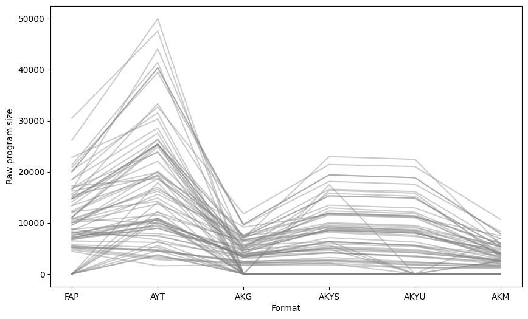
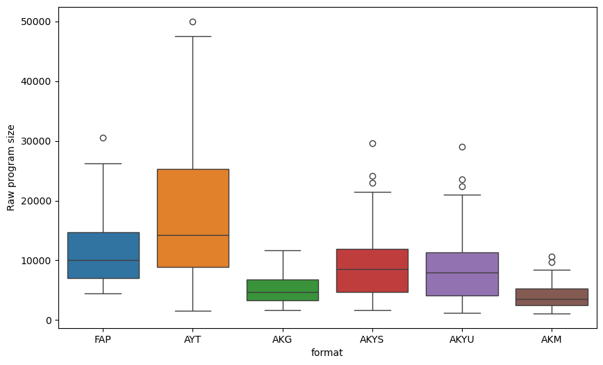
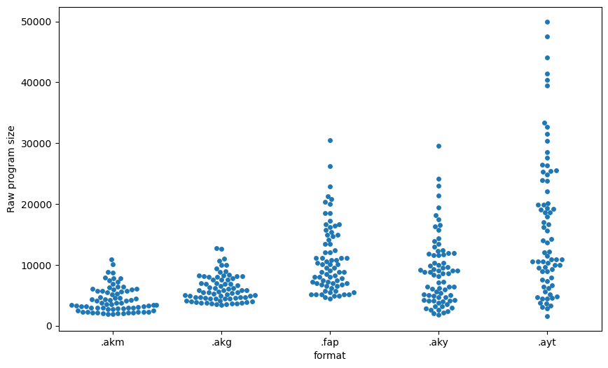
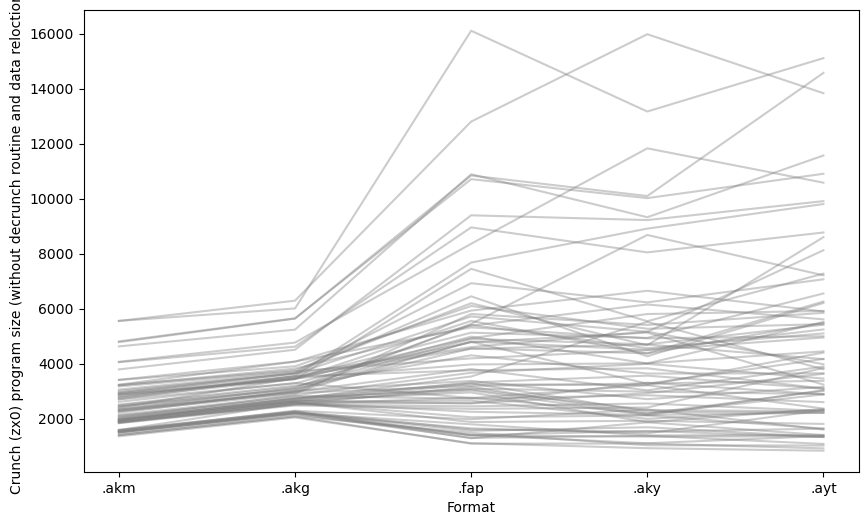
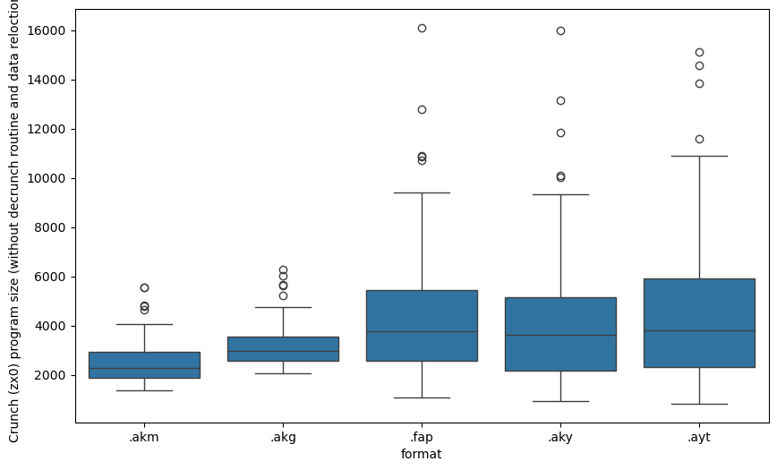
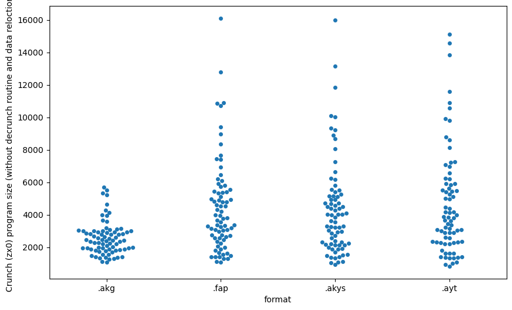
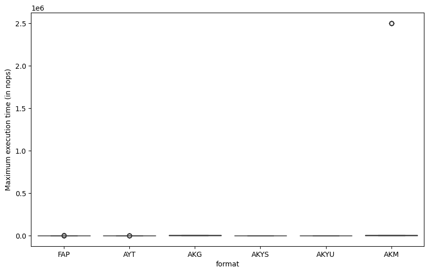
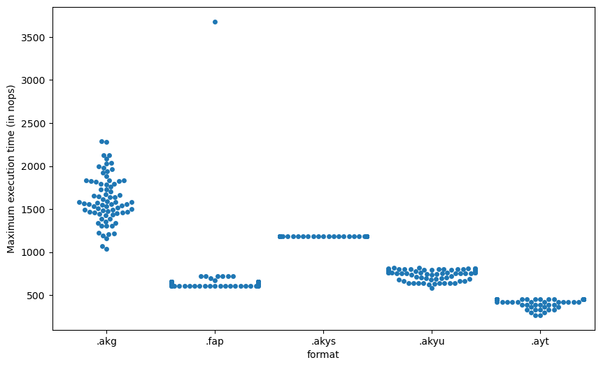
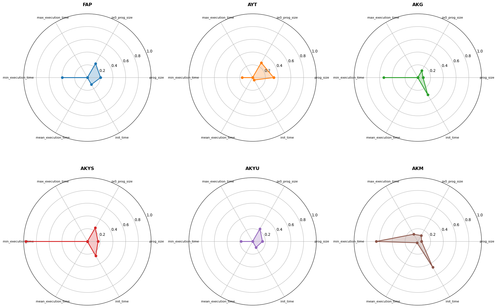

# Raw program size

|    | sources                                    |   .akg |   .akm |   .aky |   .ayt |   .fap |
|---:|:-------------------------------------------|-------:|-------:|-------:|-------:|-------:|
|  0 | 2018_EA_demosong                           |   4720 |   2764 |   4216 |   6159 |   6460 |
|  1 | 2018_nq_skrju_demosong                     |   6659 |   4380 |   6340 |   7898 |   8252 |
|  2 | Andy Severn - Lop Ears                     |   3936 |   2207 |   4145 |   6661 |   8764 |
|  3 | Doclands - Buzz-o-Meter (YM)               |   7525 |   5924 |   9523 |  20152 |   9532 |
|  4 | Doclands - Pong Cracktro (YM)              |   9926 |   7835 |  11645 |  19356 |  12092 |
|  5 | Doclands - Slowly But (YM)                 |   7583 |   5172 |   8133 |  12078 |   7484 |
|  6 | Doclands - The Rivals (YM)                 |   8762 |   6279 |  11799 |  18618 |   9532 |
|  7 | Doclands - The Saga (YM)                   |   8246 |   5698 |   9209 |  15586 |   8508 |
|  8 | Doclands - Tiny Things (YM)                |   7734 |   5250 |   9045 |  16196 |  10812 |
|  9 | Doclands - Truly Yours (YM)                |   8287 |   6339 |  11919 |  16598 |  10556 |
| 10 | Doclands - Your Credits (YM)               |   6178 |   4074 |   5883 |   9961 |   8764 |
| 11 | Excellence in Art 2018 - Just add cream    |   6044 |   4256 |   8603 |  18648 |  17212 |
| 12 | FenyxKell - BD10n'nOeuf                    |   4674 |   3173 |  10301 |  12188 |  11068 |
| 13 | FenyxKell - Bobline                        |   4605 |   2871 |   6204 |  10586 |   7996 |
| 14 | FenyxKell - KellyOn                        |   6821 |   5531 |  10330 |  14037 |  10044 |
| 15 | FenyxKell - Smoke                          |   3762 |   2272 |   2882 |   3758 |   4924 |
| 16 | FenyxKell - Solarium                       |   4468 |   2903 |   3706 |   6387 |   6204 |
| 17 | FenyxKell - Spectrum Castle                |   6182 |   4328 |  15764 |  25398 |  13372 |
| 18 | Giherem - Bancaloide                       |   4702 |   2976 |   5348 |  10595 |   6972 |
| 19 | Playing with effects                       |   4047 |   2127 |   6373 |   9651 |   6716 |
| 20 | PulkoMandy - Renegade Remix                |   6988 |   4523 |  11540 |  44076 |  16444 |
| 21 | SoundEffects                               |   3362 |   1885 |   1733 |   1588 |   4412 |
| 22 | Targhan - A Harmless Grenade               |   4487 |   2718 |   4960 |   8942 |   6972 |
| 23 | Targhan - Crtc                             |   9938 |   7874 |  19389 |  40358 |  20028 |
| 24 | Targhan - Crtc - End part                  |   4923 |   3113 |   9102 |  11437 |   9020 |
| 25 | Targhan - Dead On Time - Ingame            |   5196 |   3412 |   7101 |   9499 |   7228 |
| 26 | Targhan - Dead On Time - Main Menu         |   5152 |   3057 |   5600 |   8942 |   6716 |
| 27 | Targhan - Dead On Time - Sound Effects     |   3623 |   2102 |   2034 |   3061 |   4924 |
| 28 | Targhan - DemoIzArt - End Part             |  12685 |  10111 |  29564 |  49989 |  26172 |
| 29 | Targhan - DemoIzArt - Twist Part           |   9366 |   7443 |  17473 |  27563 |  16700 |
| 30 | Targhan - Hocus Pocus                      |   8022 |   6093 |  16566 |  26277 |  15682 |
| 31 | Targhan - Midline Process - Carpet         |  10665 |   8656 |  18110 |  39463 |  20796 |
| 32 | Targhan - Midline Process - Molusk         |  11004 |   8837 |  24108 |  47550 |  30524 |
| 33 | Targhan - Ooops                            |   3694 |   2069 |   2627 |   4668 |   5436 |
| 34 | Targhan - Orion Prime - Danger Ahead       |   3543 |   1965 |   2404 |   2781 |   4668 |
| 35 | Targhan - Orion Prime - Fight              |   3666 |   2081 |   2793 |   4480 |   5180 |
| 36 | Targhan - Orion Prime - Introduction       |   8152 |   6067 |  22984 |  33353 |  14908 |
| 37 | Targhan - Orion Prime - Level 1            |   5418 |   3548 |   8829 |  24853 |  11074 |
| 38 | Targhan - Orion Prime - Level 4 - Theme 1  |   5490 |   3426 |   7156 |  26436 |  11068 |
| 39 | Targhan - Orion Prime - Level 4 - Theme 2  |   5811 |   3706 |  16361 |  25527 |  14140 |
| 40 | Targhan - Star Sabre - Boss Theme          |   4133 |   2508 |   3989 |   5182 |   5692 |
| 41 | Targhan - Star Sabre - Ingame              |   6322 |   4052 |   9825 |  16999 |  10044 |
| 42 | Targhan - Star Sabre - Intermission        |   4488 |   2900 |   6350 |  10855 |   7996 |
| 43 | Targhan - Star Sabre - Main Menu           |   5613 |   3731 |   9665 |  17913 |  10300 |
| 44 | Targhan - Wunderbar                        |   4433 |   2486 |   4092 |  10916 |   6972 |
| 45 | Tom&Jerry - Boules Et Bits (Extended)      |   5806 |   4496 |   8532 |  19887 |  16188 |
| 46 | Tom&Jerry - From Scratch - Part 1          |   4893 |   3479 |   6065 |  10927 |   6460 |
| 47 | Tom&Jerry - From Scratch - Part 2          |   4627 |   2870 |   4056 |  10321 |   8764 |
| 48 | Tom&Jerry - From Scratch - Part 3          |   4552 |   3229 |   5166 |   7567 |   7740 |
| 49 | Tom&Jerry - From Scratch - Part 4          |   5046 |   3211 |   4669 |  10591 |   7484 |
| 50 | Tom&Jerry - Le Crime Du Parking - End Game |   4015 |   2284 |   3460 |   5534 |   5692 |
| 51 | Tom&Jerry - Le Crime Du Parking - Intro    |   5424 |   3353 |   8873 |  19086 |  13372 |
| 52 | Tom&Jerry - Sudoku - Menu                  |   3877 |   2172 |   3198 |   4480 |   5436 |
| 53 | Tom&Jerry - Sudoku - Notice                |   3613 |   1997 |   2647 |   4780 |   5180 |
| 54 | Tom&Jerry - Sudoku - Sundat                |   3824 |   2192 |   4241 |   4508 |   5180 |
| 55 | Tom&Jerry - Sudoku - Theme 1               |   6814 |   4655 |   9056 |  31542 |  20284 |
| 56 | Tom&Jerry - Sudoku - Theme 2               |   6483 |   4312 |  11909 |  25301 |  11074 |
| 57 | Tom&Jerry - Sudoku - Victory               |   3733 |   2191 |   3120 |   3655 |   5180 |
| 58 | Totta - BaraBadaBastu                      |   4965 |   2882 |   4633 |   7375 |   8002 |
| 59 | Totta - Crawlers                           |   7533 |   5621 |  10005 |  13693 |  10050 |
| 60 | Totta - Hardy                              |  12562 |  10869 |  21417 |  32710 |  18498 |
| 61 | Totta - Mellow                             |   6905 |   5710 |  12926 |  22048 |  14652 |
| 62 | Totta - Rezzy                              |   7990 |   7179 |  13458 |  19874 |  12348 |
| 63 | Totta - Room5                              |   5823 |   3713 |   9318 |   9934 |  10812 |
| 64 | UltraSyd - Dead Floppy                     |   4868 |   2891 |   4895 |  14205 |  12092 |
| 65 | UltraSyd - Fractal                         |   6974 |   5733 |   8305 |  19242 |  15420 |
| 66 | UltraSyd - Fuck It                         |   8088 |   6412 |  11553 |  23944 |  14914 |
| 67 | UltraSyd - Robot                           |   8076 |   5929 |  12427 |  28566 |  18492 |
| 68 | UltraSyd - The End                         |   8369 |   6910 |  14405 |  30331 |  22844 |
| 69 | UltraSyd - YM Type                         |   5844 |   4241 |  12321 |  23830 |  16706 |
| 70 | Ultrasyd - Morons                          |   8987 |   7803 |  13831 |  41412 |  21308 |
| 71 | jinj_med                                   |   3468 |   1903 |   2113 |   3329 |   5180 |
| 72 | maryjane2                                  |   5308 |   3301 |   5010 |   9296 |   7228 |

Mean

| format   |        0 |
|:---------|---------:|
| .akg     |  6157.56 |
| .akm     |  4332.33 |
| .aky     |  9004.55 |
| .ayt     | 16728.6  |
| .fap     | 11026.6  |

 - .akm vs .akg: dissimilar (best=.akm)
 - .akm vs .fap: dissimilar (best=.akm)
 - .akm vs .aky: dissimilar (best=.akm)
 - .akm vs .ayt: dissimilar (best=.akm)
 - .akg vs .fap: dissimilar (best=.akg)
 - .akg vs .aky: dissimilar (best=.akg)
 - .akg vs .ayt: dissimilar (best=.akg)
 - .fap vs .aky: dissimilar (best=.aky)
 - .fap vs .ayt: dissimilar (best=.fap)
 - .aky vs .ayt: dissimilar (best=.aky)

# Crunch (zx0) program size (without decrunch routine and data reloction)

|    | sources                                    |   .akg |   .akm |   .aky |   .ayt |   .fap |
|---:|:-------------------------------------------|-------:|-------:|-------:|-------:|-------:|
|  0 | 2018_EA_demosong                           |   2585 |   1901 |   2115 |   1636 |   2049 |
|  1 | 2018_nq_skrju_demosong                     |   3010 |   2211 |   2707 |   3155 |   3371 |
|  2 | Andy Severn - Lop Ears                     |   2288 |   1549 |   2330 |   1604 |   1977 |
|  3 | Doclands - Buzz-o-Meter (YM)               |   3464 |   2883 |   4010 |   4446 |   3970 |
|  4 | Doclands - Pong Cracktro (YM)              |   4075 |   3412 |   4919 |   4995 |   5318 |
|  5 | Doclands - Slowly But (YM)                 |   3296 |   2612 |   3216 |   2365 |   2748 |
|  6 | Doclands - The Rivals (YM)                 |   3724 |   3170 |   4488 |   4951 |   4191 |
|  7 | Doclands - The Saga (YM)                   |   3538 |   2924 |   3830 |   3092 |   3758 |
|  8 | Doclands - Tiny Things (YM)                |   3198 |   2510 |   3639 |   3649 |   4302 |
|  9 | Doclands - Truly Yours (YM)                |   3637 |   2921 |   5163 |   3978 |   4601 |
| 10 | Doclands - Your Credits (YM)               |   2762 |   2103 |   2253 |   2209 |   3285 |
| 11 | Excellence in Art 2018 - Just add cream    |   3117 |   2326 |   4563 |   5099 |   5407 |
| 12 | FenyxKell - BD10n'nOeuf                    |   2712 |   2077 |   5519 |   3796 |   3532 |
| 13 | FenyxKell - Bobline                        |   2692 |   1993 |   3562 |   3087 |   3317 |
| 14 | FenyxKell - KellyOn                        |   3820 |   3209 |   6151 |   5610 |   5383 |
| 15 | FenyxKell - Smoke                          |   2224 |   1566 |   1686 |   1329 |   1555 |
| 16 | FenyxKell - Solarium                       |   2590 |   1889 |   1921 |   1807 |   1875 |
| 17 | FenyxKell - Spectrum Castle                |   3549 |   2778 |   8911 |   9805 |   7676 |
| 18 | Giherem - Bancaloide                       |   2479 |   1835 |   2404 |   3838 |   2355 |
| 19 | Playing with effects                       |   2552 |   1583 |   3308 |   2880 |   2565 |
| 20 | PulkoMandy - Renegade Remix                |   3633 |   3007 |   5158 |   8123 |   5716 |
| 21 | SoundEffects                               |   2041 |   1357 |    924 |    832 |   1106 |
| 22 | Targhan - A Harmless Grenade               |   2724 |   1971 |   2981 |   2894 |   3091 |
| 23 | Targhan - Crtc                             |   5636 |   4782 |  10096 |  14575 |  10843 |
| 24 | Targhan - Crtc - End part                  |   2848 |   2037 |   3992 |   3458 |   3667 |
| 25 | Targhan - Dead On Time - Ingame            |   2936 |   2325 |   3281 |   3374 |   3189 |
| 26 | Targhan - Dead On Time - Main Menu         |   2821 |   2137 |   2849 |   2600 |   2726 |
| 27 | Targhan - Dead On Time - Sound Effects     |   2214 |   1513 |   1104 |   1365 |   1404 |
| 28 | Targhan - DemoIzArt - End Part             |   6290 |   5554 |  15982 |  13836 |  12804 |
| 29 | Targhan - DemoIzArt - Twist Part           |   4618 |   4052 |   8047 |   8770 |   8955 |
| 30 | Targhan - Hocus Pocus                      |   4505 |   3790 |   9222 |   9910 |   9395 |
| 31 | Targhan - Midline Process - Carpet         |   5236 |   4627 |   9325 |  11571 |  10888 |
| 32 | Targhan - Midline Process - Molusk         |   6007 |   5554 |  13170 |  15112 |  16109 |
| 33 | Targhan - Ooops                            |   2204 |   1517 |   1387 |   1407 |   1792 |
| 34 | Targhan - Orion Prime - Danger Ahead       |   2081 |   1399 |   1093 |    917 |   1089 |
| 35 | Targhan - Orion Prime - Fight              |   2193 |   1496 |   1466 |   2309 |   1647 |
| 36 | Targhan - Orion Prime - Introduction       |   4765 |   4068 |  11831 |  10582 |   8360 |
| 37 | Targhan - Orion Prime - Level 1            |   3066 |   2436 |   4376 |   6259 |   4550 |
| 38 | Targhan - Orion Prime - Level 4 - Theme 1  |   2980 |   2367 |   3029 |   3893 |   3802 |
| 39 | Targhan - Orion Prime - Level 4 - Theme 2  |   2996 |   2275 |   8680 |   7212 |   5449 |
| 40 | Targhan - Star Sabre - Boss Theme          |   2576 |   1852 |   2133 |   2210 |   2249 |
| 41 | Targhan - Star Sabre - Ingame              |   3492 |   2804 |   4935 |   6552 |   5126 |
| 42 | Targhan - Star Sabre - Intermission        |   2634 |   1946 |   3218 |   4401 |   3253 |
| 43 | Targhan - Star Sabre - Main Menu           |   3149 |   2481 |   4704 |   5415 |   4899 |
| 44 | Targhan - Wunderbar                        |   2529 |   1845 |   2188 |   3004 |   2763 |
| 45 | Tom&Jerry - Boules Et Bits (Extended)      |   3280 |   2700 |   4008 |   5514 |   4981 |
| 46 | Tom&Jerry - From Scratch - Part 1          |   2651 |   1925 |   2928 |   3630 |   2551 |
| 47 | Tom&Jerry - From Scratch - Part 2          |   2618 |   1950 |   1993 |   2311 |   2652 |
| 48 | Tom&Jerry - From Scratch - Part 3          |   2504 |   1875 |   2551 |   2280 |   2446 |
| 49 | Tom&Jerry - From Scratch - Part 4          |   2617 |   1968 |   2121 |   3036 |   3029 |
| 50 | Tom&Jerry - Le Crime Du Parking - End Game |   2264 |   1594 |   1528 |   1635 |   1606 |
| 51 | Tom&Jerry - Le Crime Du Parking - Intro    |   2958 |   2287 |   4506 |   5243 |   4805 |
| 52 | Tom&Jerry - Sudoku - Menu                  |   2241 |   1519 |   1551 |   1330 |   1399 |
| 53 | Tom&Jerry - Sudoku - Notice                |   2154 |   1447 |   1345 |   1357 |   1386 |
| 54 | Tom&Jerry - Sudoku - Sundat                |   2258 |   1568 |   1866 |   1398 |   1286 |
| 55 | Tom&Jerry - Sudoku - Theme 1               |   3656 |   2958 |   4267 |   6206 |   6448 |
| 56 | Tom&Jerry - Sudoku - Theme 2               |   3435 |   2756 |   5804 |   5917 |   4924 |
| 57 | Tom&Jerry - Sudoku - Victory               |   2174 |   1502 |   1375 |   1079 |   1300 |
| 58 | Totta - BaraBadaBastu                      |   2750 |   1928 |   2317 |   2260 |   3063 |
| 59 | Totta - Crawlers                           |   3543 |   2704 |   4698 |   4164 |   4542 |
| 60 | Totta - Hardy                              |   5649 |   4809 |  10020 |  10906 |  10709 |
| 61 | Totta - Mellow                             |   3903 |   3405 |   5269 |   5437 |   6096 |
| 62 | Totta - Rezzy                              |   4073 |   3234 |   6650 |   5898 |   5930 |
| 63 | Totta - Room5                              |   3471 |   2395 |   5128 |   3237 |   4776 |
| 64 | UltraSyd - Dead Floppy                     |   2524 |   1877 |   2177 |   2880 |   3151 |
| 65 | UltraSyd - Fractal                         |   3071 |   2449 |   3270 |   4171 |   4795 |
| 66 | UltraSyd - Fuck It                         |   3444 |   2865 |   4369 |   5485 |   5554 |
| 67 | UltraSyd - Robot                           |   3680 |   3056 |   6228 |   7067 |   6925 |
| 68 | UltraSyd - The End                         |   3438 |   2862 |   5542 |   7274 |   7448 |
| 69 | UltraSyd - YM Type                         |   2898 |   2263 |   5407 |   5848 |   5806 |
| 70 | Ultrasyd - Morons                          |   3759 |   3221 |   4670 |   8600 |   6196 |
| 71 | jinj_med                                   |   2084 |   1399 |   1031 |   1021 |   1482 |
| 72 | maryjane2                                  |   2659 |   2025 |   1869 |   2350 |   2953 |

Mean

| format   |       0 |
|:---------|--------:|
| .akg     | 3195.1  |
| .akm     | 2509.38 |
| .aky     | 4333.62 |
| .ayt     | 4677.34 |
| .fap     | 4470.49 |

 - .akm vs .akg: dissimilar (best=.akm)
 - .akm vs .fap: dissimilar (best=.akm)
 - .akm vs .aky: dissimilar (best=.akm)
 - .akm vs .ayt: dissimilar (best=.akm)
 - .akg vs .fap: dissimilar (best=.akg)
 - .akg vs .aky: dissimilar (best=.akg)
 - .akg vs .ayt: dissimilar (best=.akg)
 - .fap vs .aky: dissimilar (best=.aky)
 - .fap vs .ayt: similar
 - .aky vs .ayt: dissimilar (best=.aky)

# Maximum execution time (in nops)

|    | sources                                    |   .akg |   .akm |   .aky |   .ayt |   .fap |
|---:|:-------------------------------------------|-------:|-------:|-------:|-------:|-------:|
|  0 | 2018_EA_demosong                           |   2332 |   3045 |   1181 |    392 |    631 |
|  1 | 2018_nq_skrju_demosong                     |   2102 |   2776 |   1181 |    392 |    631 |
|  2 | Andy Severn - Lop Ears                     |   2508 |   3299 |   1181 |    422 |    607 |
|  3 | Doclands - Buzz-o-Meter (YM)               |   2068 |   2658 |   1181 |    453 |    631 |
|  4 | Doclands - Pong Cracktro (YM)              |   2083 |   2750 |   1181 |    423 |    655 |
|  5 | Doclands - Slowly But (YM)                 |   2081 |   2725 |   1181 |    392 |    607 |
|  6 | Doclands - The Rivals (YM)                 |   2130 |   2731 |   1181 |    453 |    655 |
|  7 | Doclands - The Saga (YM)                   |   2015 |   2614 |   1181 |    453 |    607 |
|  8 | Doclands - Tiny Things (YM)                |   2080 |   2708 |   1181 |    423 |    655 |
|  9 | Doclands - Truly Yours (YM)                |   2118 |   2712 |   1181 |    453 |    655 |
| 10 | Doclands - Your Credits (YM)               |   2001 |   2499 |   1181 |    453 |    655 |
| 11 | Excellence in Art 2018 - Just add cream    |   2169 |   2799 |   1181 |    453 |    655 |
| 12 | FenyxKell - BD10n'nOeuf                    |   1908 |   2492 |   1181 |    422 |    607 |
| 13 | FenyxKell - Bobline                        |   1865 |   2388 |   1181 |    423 |    655 |
| 14 | FenyxKell - KellyOn                        |   1961 |   2498 |   1181 |    453 |    655 |
| 15 | FenyxKell - Smoke                          |   1942 |   2476 |   1181 |    362 |    607 |
| 16 | FenyxKell - Solarium                       |   1898 |   2533 |   1181 |    453 |    655 |
| 17 | FenyxKell - Spectrum Castle                |   1904 |   2552 |   1181 |    453 |    655 |
| 18 | Giherem - Bancaloide                       |   1780 |   2315 |   1181 |    453 |    655 |
| 19 | Playing with effects                       |   1634 |   2169 |   1181 |    331 |    607 |
| 20 | PulkoMandy - Renegade Remix                |   1843 |   2371 |   1181 |    453 |    655 |
| 21 | SoundEffects                               |   1307 |   1890 |   1181 |    269 |    607 |
| 22 | Targhan - A Harmless Grenade               |   2151 |   2779 |   1181 |    453 |    655 |
| 23 | Targhan - Crtc                             |   2177 |   2830 |   1181 |    453 |    655 |
| 24 | Targhan - Crtc - End part                  |   2182 |   2731 |   1181 |    453 |    655 |
| 25 | Targhan - Dead On Time - Ingame            |   1646 |   2209 |   1181 |    301 |    607 |
| 26 | Targhan - Dead On Time - Main Menu         |   2227 |   2876 |   1181 |    422 |    631 |
| 27 | Targhan - Dead On Time - Sound Effects     |   1465 |   1911 |   1181 |    269 |    607 |
| 28 | Targhan - DemoIzArt - End Part             |   2036 |   2557 |   1181 |    423 |    631 |
| 29 | Targhan - DemoIzArt - Twist Part           |   1934 |   2539 |   1181 |    453 |    655 |
| 30 | Targhan - Hocus Pocus                      |   2187 |   2809 |   1181 |    453 |    723 |
| 31 | Targhan - Midline Process - Carpet         |   1997 |   2568 |   1181 |    453 |    655 |
| 32 | Targhan - Midline Process - Molusk         |   2078 |   2604 |   1181 |    453 |    631 |
| 33 | Targhan - Ooops                            |   1808 |   2402 |   1181 |    453 |    655 |
| 34 | Targhan - Orion Prime - Danger Ahead       |   1873 |   2504 |   1181 |    392 |    607 |
| 35 | Targhan - Orion Prime - Fight              |   2313 |   2921 |   1181 |    453 |    655 |
| 36 | Targhan - Orion Prime - Introduction       |   1950 |   2552 |   1181 |    453 |    655 |
| 37 | Targhan - Orion Prime - Level 1            |   1892 |   2291 |   1181 |    423 |    723 |
| 38 | Targhan - Orion Prime - Level 4 - Theme 1  |   1925 |   2443 |   1181 |    453 |    655 |
| 39 | Targhan - Orion Prime - Level 4 - Theme 2  |   1876 |   2382 |   1181 |    423 |    607 |
| 40 | Targhan - Star Sabre - Boss Theme          |   2301 |   2739 |   1181 |    453 |    655 |
| 41 | Targhan - Star Sabre - Ingame              |   1883 |   2422 |   1181 |    453 |   3679 |
| 42 | Targhan - Star Sabre - Intermission        |   1898 |   2559 |   1181 |    453 |    655 |
| 43 | Targhan - Star Sabre - Main Menu           |   1892 |   2522 |   1181 |    453 |    655 |
| 44 | Targhan - Wunderbar                        |   1879 |   2410 |   1181 |    453 |    655 |
| 45 | Tom&Jerry - Boules Et Bits (Extended)      |   1995 |   2534 |   1181 |    453 |    655 |
| 46 | Tom&Jerry - From Scratch - Part 1          |   1875 |   2499 |   1181 |    453 |    607 |
| 47 | Tom&Jerry - From Scratch - Part 2          |   1780 |   2363 |   1181 |    423 |    655 |
| 48 | Tom&Jerry - From Scratch - Part 3          |   1677 |   2259 |   1181 |    453 |    655 |
| 49 | Tom&Jerry - From Scratch - Part 4          |   1688 |   2272 |   1181 |    453 |    655 |
| 50 | Tom&Jerry - Le Crime Du Parking - End Game |   1780 |   2346 |   1181 |    331 |    607 |
| 51 | Tom&Jerry - Le Crime Du Parking - Intro    |   1796 |   2441 |   1181 |    453 |    655 |
| 52 | Tom&Jerry - Sudoku - Menu                  |   1682 |   2331 |   1181 |    332 |    607 |
| 53 | Tom&Jerry - Sudoku - Notice                |   1768 |   2322 |   1181 |    361 |    607 |
| 54 | Tom&Jerry - Sudoku - Sundat                |   1677 |   2271 |   1181 |    332 |    607 |
| 55 | Tom&Jerry - Sudoku - Theme 1               |   1777 |   2294 |   1181 |    453 |    655 |
| 56 | Tom&Jerry - Sudoku - Theme 2               |   1792 |   2387 |   1181 |    453 |    675 |
| 57 | Tom&Jerry - Sudoku - Victory               |   1666 |   2324 |   1181 |    332 |    607 |
| 58 | Totta - BaraBadaBastu                      |   2033 |   2496 |   1181 |    423 |    723 |
| 59 | Totta - Crawlers                           |   1979 |   2450 |   1181 |    453 |    723 |
| 60 | Totta - Hardy                              |   2158 |   2798 |   1181 |    453 |    699 |
| 61 | Totta - Mellow                             |   1852 |   2407 |   1181 |    392 |    607 |
| 62 | Totta - Rezzy                              |   2061 |   2706 |   1181 |    453 |    655 |
| 63 | Totta - Room5                              |   1879 |   2452 |   1181 |    299 |    607 |
| 64 | UltraSyd - Dead Floppy                     |   1586 |   2120 |   1181 |    453 |    655 |
| 65 | UltraSyd - Fractal                         |   1893 |   2335 |   1181 |    453 |    631 |
| 66 | UltraSyd - Fuck It                         |   1812 |   2244 |   1181 |    453 |    723 |
| 67 | UltraSyd - Robot                           |   1947 |   2461 |   1181 |    453 |    655 |
| 68 | UltraSyd - The End                         |   1887 |   2414 |   1181 |    453 |    655 |
| 69 | UltraSyd - YM Type                         |   1838 |   2292 |   1181 |    453 |    723 |
| 70 | Ultrasyd - Morons                          |   1804 |   2169 |   1181 |    453 |    655 |
| 71 | jinj_med                                   |   1503 |   2197 |   1181 |    361 |    607 |
| 72 | maryjane2                                  |   1617 |   2309 |   1181 |    392 |    607 |

Mean

| format   |        0 |
|:---------|---------:|
| .akg     | 1919.19  |
| .akm     | 2493.88  |
| .aky     | 1181     |
| .ayt     |  422.11  |
| .fap     |  686.781 |

 - .akm vs .akg: dissimilar (best=.akg)
 - .akm vs .fap: dissimilar (best=.fap)
 - .akm vs .aky: dissimilar (best=.aky)
 - .akm vs .ayt: dissimilar (best=.ayt)
 - .akg vs .fap: dissimilar (best=.fap)
 - .akg vs .aky: dissimilar (best=.aky)
 - .akg vs .ayt: dissimilar (best=.ayt)
 - .fap vs .aky: dissimilar (best=.fap)
 - .fap vs .ayt: dissimilar (best=.ayt)
 - .aky vs .ayt: dissimilar (best=.ayt)

# Spider Charts by Player Format

Note: In spider charts, values closer to the center (0.0) indicate better performance (lower size/time).
