# Raw program size

|     | sources   |   .akm |   .chp |
|----:|:----------|-------:|-------:|
|   0 | ABADIA1   |   2528 |   1936 |
|   1 | ABADIA2   |   2384 |   1445 |
|   2 | ABADIA3   |   2928 |   3378 |
|   3 | ADDAMSF0  |   2385 |   1689 |
|   4 | ADDAMSF1  |   2409 |   1741 |
|   5 | ADDAMSF2  |   2425 |   2022 |
|   6 | ADDAMSF3  |   1828 |   1049 |
|   7 | AFTEROID  |   2419 |   1992 |
|   8 | AFTERWAR  |   4435 |   3143 |
|   9 | ALEHOP    |   3387 |   1998 |
|  10 | AMAUROTE  |   2192 |   1171 |
|  11 | AMAUROTF  |   2108 |   1107 |
|  12 | AMAUROTG  |   1835 |    964 |
|  13 | AMAUROTH  |   3481 |   2261 |
|  14 | AMAUROTI  |   1797 |    964 |
|  15 | AMAUROTJ  |   2252 |    978 |
|  16 | AMAUROTK  |   1994 |   1053 |
|  17 | AMAUROTL  |   1921 |   1025 |
|  18 | AMC0      |   4296 |   2817 |
|  19 | AMC1      |   5601 |   4789 |
|  20 | AMC2      |   5717 |   4522 |
|  21 | AMC3      |   2068 |   1125 |
|  22 | AMC4      |   1919 |   1079 |
|  23 | ARCYESOD  |   2349 |   1416 |
|  24 | ARKA1C64  |   4632 |   2158 |
|  25 | ARKANO-M  |   2299 |   1239 |
|  26 | ARKANO-Z  |   2027 |   1107 |
|  27 | ARKANOID  |   2139 |   1134 |
|  28 | ARKANOIE  |   2032 |    992 |
|  29 | ARKANOIF  |   2008 |    964 |
|  30 | ARKANOIG  |   2099 |   1036 |
|  31 | ARKANOIH  |   2018 |    975 |
|  32 | ARKOID2A  |   1982 |   1165 |
|  33 | ARKOID2B  |   1940 |   1041 |
|  34 | ARKOID2C  |   2022 |   1026 |
|  35 | ARKOID2D  |   1959 |   1088 |
|  36 | ARKOID2E  |   1840 |   1031 |
|  37 | ARKOS     |   2061 |   1166 |
|  38 | ARMYMOV1  |   1854 |   1089 |
|  39 | ARMYMOV2  |   1907 |   1145 |
|  40 | ASHTRAY   |   3428 |   2975 |
|  41 | ASPHALT   |   4818 |   2406 |
|  42 | ATEAM     |   1937 |   1013 |
|  43 | ATOMINO3  |   3005 |   1956 |
|  44 | AUFMONTY  |   2099 |   1303 |
|  45 | AUFMONTZ  |   4625 |   3317 |
|  46 | AVENGER   |   3599 |   2000 |
|  47 | BACTRON   |   2678 |   1767 |
|  48 | BALLBRKR  |   2745 |   1744 |
|  49 | BATMAN10  |   1899 |   1193 |
|  50 | BATMAN11  |   1826 |   1034 |
|  51 | BATMAN12  |   1806 |    990 |
|  52 | BATMAN20  |   2276 |   1112 |
|  53 | BATMAN21  |   2575 |   1613 |
|  54 | BATMAN22  |   3450 |   2957 |
|  55 | BATMAN23  |   3079 |   2216 |
|  56 | BATMAN30  |   3065 |   2372 |
|  57 | BATMAN31  |   3464 |   2019 |
|  58 | BATMAN32  |   2633 |   1625 |
|  59 | BATMAN33  |   3182 |   2151 |
|  60 | BATMAN34  |   3082 |   1915 |
|  61 | BATMAN35  |   3554 |   2450 |
|  62 | BATMAN36  |   2059 |   1073 |
|  63 | BB128K-0  |   1847 |   1061 |
|  64 | BB128K-1  |   2422 |   1463 |
|  65 | BB128K-2  |   1823 |    958 |
|  66 | BB128K-3  |   1891 |   1018 |
|  67 | BEACHBUG  |   3845 |   2187 |
|  68 | BEVERLYH  |   3852 |   2115 |
|  69 | BEYNDIP1  |   2814 |   1381 |
|  70 | BEYNDIP2  |   6931 |   4080 |
|  71 | BIRDIE    |   2740 |   1728 |
|  72 | BLACKBRD  |   2398 |   1512 |
|  73 | BLKLMP64  |   5824 |   2071 |
|  74 | BLKLMP65  |   2062 |   1096 |
|  75 | BLKLMP66  |   2203 |   1213 |
|  76 | BLKLMPST  |   3127 |   2007 |
|  77 | BLKLMPSU  |   3607 |   2390 |
|  78 | BLKLMPSV  |   2863 |   1109 |
|  79 | BLKLMPZX  |   2941 |   2185 |
|  80 | BLKLMPZY  |   1982 |   1060 |
|  81 | BLOODBRS  |   4094 |   2152 |
|  82 | BMXSIM1   |   2309 |   1314 |
|  83 | BMXSIM2A  |   3865 |   1560 |
|  84 | BMXSIM2B  |   2873 |   1522 |
|  85 | BMXSIM2C  |   3698 |   1453 |
|  86 | BOBO0     |   2793 |   1597 |
|  87 | BOBO1     |   3614 |   2963 |
|  88 | BOBO2     |   4321 |   3068 |
|  89 | BOBO3     |   3639 |   3333 |
|  90 | BOBO4     |   3086 |   1976 |
|  91 | BOBO5     |   3154 |   2029 |
|  92 | BOBO6     |   2293 |   1193 |
|  93 | BOMBUZAL  |   4293 |   1622 |
|  94 | BOSCONIA  |   3434 |   1938 |
|  95 | BOSCONIB  |   2105 |   1271 |
|  96 | BOULDASH  |   2077 |   1166 |
|  97 | BOULDSHR  |   1968 |   1073 |
|  98 | BOUNDER   |   2099 |   1215 |
|  99 | BRAVSTAR  |   3290 |   2337 |
| 100 | BRNBLL-N  |   4276 |   2125 |
| 101 | BRONX     |   5954 |   2308 |
| 102 | BUBBLEMX  |   2112 |   1253 |
| 103 | BUBBLEST  |   2471 |   1573 |
| 104 | BUMPY     |   2403 |   1417 |
| 105 | BURNINR1  |   2744 |   1677 |
| 106 | BURNINR2  |   2425 |   1436 |
| 107 | BURNINR3  |   2284 |   1507 |
| 108 | BURNINR4  |   2316 |   1276 |
| 109 | BURNINR5  |   1915 |    962 |
| 110 | BURNRUB1  |   3334 |   2389 |
| 111 | BURNRUB2  |   2646 |   1474 |
| 112 | BURNRUB3  |   2516 |   1639 |
| 113 | BURNRUB4  |   2596 |   1237 |
| 114 | BURNRUB5  |   1909 |    984 |
| 115 | C64-180A  |   2359 |   1488 |
| 116 | C64-180B  |   2784 |   1026 |
| 117 | C64-180C  |   2162 |   1209 |
| 118 | CAMPEONE  |   2230 |   1278 |
| 119 | CATABALL  |   3364 |   2782 |
| 120 | CATABALM  |   2686 |   2126 |
| 121 | CAULDRN1  |   2005 |   1068 |
| 122 | CAULDRN2  |   3526 |   1960 |
| 123 | CAVEMANI  |   6030 |   3897 |
| 124 | CAVEMANJ  |   2677 |   1604 |
| 125 | CHAINRCT  |   3837 |   2811 |
| 126 | CHARDESI  |   2888 |   1704 |
| 127 | CHASEHQ1  |   3565 |   2140 |
| 128 | CHASEHQ2  |   2159 |   1113 |
| 129 | CHICAG30  |   2639 |   1886 |
| 130 | CHIMERA1  |   6674 |   2756 |
| 131 | CHIMERA2  |   2744 |   1830 |
| 132 | CHUBBYGR  |   2795 |   2081 |
| 133 | CHUBBYGS  |   1946 |   1059 |
| 134 | CMDTRACR  |   2210 |   1497 |
| 135 | COBRAC64  |  10757 |   2792 |
| 136 | COCOATM0  |   2865 |   1890 |
| 137 | COCOATM1  |   3003 |   1804 |
| 138 | COLISEUM  |   3212 |   1402 |
| 139 | COLT36    |   2541 |   1358 |
| 140 | COMBASC1  |   2478 |   1259 |
| 141 | COMBASC2  |   2676 |   1483 |
| 142 | COMBASC3  |   3310 |   1453 |
| 143 | COMBASC4  |   2100 |   1293 |
| 144 | COMBASC5  |   2621 |   1503 |
| 145 | COMICBKR  |   4152 |   2413 |
| 146 | COMICBKS  |   4257 |   1989 |
| 147 | COMICBKT  |   3486 |   1411 |
| 148 | COMICBKU  |   3394 |   1476 |
| 149 | COMMANDO  |   4150 |   3433 |
| 150 | COMMANDP  |   2111 |   1201 |
| 151 | COMMANDQ  |   1792 |   1004 |
| 152 | COMMANDR  |   2234 |   1503 |
| 153 | COMMANDS  |   1942 |   1148 |
| 154 | COMMANDT  |   1801 |    977 |
| 155 | CORSARI1  |   2829 |   1207 |
| 156 | CORSARI2  |   2610 |   1503 |
| 157 | COSANOST  |   2579 |   1313 |
| 158 | COSTACP1  |   2221 |   1790 |
| 159 | COSTACP2  |   2128 |   1636 |
| 160 | CPC-1942  |   3083 |   2705 |
| 161 | CPC-1943  |   3887 |   2473 |
| 162 | CRAFTON1  |   2451 |   1446 |
| 163 | CRAFTON2  |   2372 |   1221 |
| 164 | CRAY_5    |   2264 |   1284 |
| 165 | CRAZYCM1  |   7519 |   2612 |
| 166 | CRAZYCM2  |   2989 |   1968 |
| 167 | CYBERBIG  |   5529 |   2188 |
| 168 | DALEYTOC  |   2973 |   1841 |
| 169 | DARKFUSN  |   2885 |   1954 |
| 170 | DAYMOTEN  |   4309 |   1648 |
| 171 | DDRAGON0  |   2298 |    990 |
| 172 | DDRAGON1  |   4715 |   2761 |
| 173 | DDRAGON2  |   2382 |   1147 |
| 174 | DEFCOM    |   2894 |   1817 |
| 175 | DEFLEKTR  |   3346 |   2198 |
| 176 | DELTA-IN  |   2739 |   1854 |
| 177 | DELTA-SL  |   2830 |   1612 |
| 178 | DELTA-ZK  |   3421 |   1621 |
| 179 | DESPERA0  |   1801 |    947 |
| 180 | DESPERA1  |   3863 |   2407 |
| 181 | DESPERA2  |   2313 |   1147 |
| 182 | DESPERA3  |   3023 |   1956 |
| 183 | DESPOTIK  |   2148 |   1311 |
| 184 | DEVIANTS  |   2378 |   1287 |
| 185 | DIPDIP    |   2099 |   1361 |
| 186 | DIZZYDTR  |   2721 |   1888 |
| 187 | DIZZYPYF  |   3288 |   1935 |
| 188 | DOORDOOM  |   2952 |   3151 |
| 189 | DRAZEN64  |   2511 |   1547 |
| 190 | DRAZEN65  |   2397 |   1386 |
| 191 | DRDESTRU  |   3311 |   2091 |
| 192 | DRGNINJA  |   3027 |   1927 |
| 193 | DRLAIR10  |   2541 |   1539 |
| 194 | DRLAIR20  |   2681 |   2097 |
| 195 | DRLAIR21  |   2947 |   1612 |
| 196 | DRLAIR22  |   2437 |   1759 |
| 197 | DRLAIR23  |   2236 |   1775 |
| 198 | DRLAIR24  |   2553 |   1925 |
| 199 | DRLAIR25  |   2419 |   1766 |
| 200 | DRLAIR26  |   2433 |   1831 |
| 201 | DRLAIR27  |   2617 |   1653 |
| 202 | DRLAIR28  |   2539 |   1947 |
| 203 | DRLAIR29  |   2318 |   1149 |
| 204 | DROIDS    |   2442 |   1695 |
| 205 | DRUIDRMX  |   3013 |   1322 |
| 206 | DTHWISH3  |   4722 |   2085 |
| 207 | DUSTIN    |   2274 |   1655 |
| 208 | DYNADAN1  |   2274 |   1401 |
| 209 | DYNADUO1  |   4939 |   2042 |
| 210 | DYNADUO2  |   2891 |   1311 |
| 211 | DYNADUO3  |   4829 |   1191 |
| 212 | E-MOTION  |   2519 |   1470 |
| 213 | ELEKTRAG  |   5005 |   2794 |
| 214 | ELEVATOR  |   2640 |   1389 |
| 215 | ELIMNTR0  |   5059 |   3900 |
| 216 | ELIMNTR1  |   2814 |   2006 |
| 217 | ELIMNTR2  |   2522 |   1450 |
| 218 | ELIMNTR3  |   1922 |   1039 |
| 219 | EQUINOX   |   2396 |   1776 |
| 220 | ESPADA    |   2424 |   1535 |
| 221 | EXTRMNTR  |   2325 |   1279 |
| 222 | FERNANDZ  |   2655 |   1523 |
| 223 | FEUD1     |   2093 |   1181 |
| 224 | FEUD2     |   2956 |   1561 |
| 225 | FINDKEEP  |   2987 |   1631 |
| 226 | FINDKEEQ  |   2641 |   1334 |
| 227 | FIRELORD  |   3471 |   2093 |
| 228 | FIRELORE  |   2700 |   1040 |
| 229 | FLINTSTN  |   2693 |   1388 |
| 230 | FLINTSTO  |   2891 |   1669 |
| 231 | FLUFF1    |   2743 |   1242 |
| 232 | FLUFF2    |   3175 |   1555 |
| 233 | FMBASKT1  |   1865 |   1045 |
| 234 | FMBASKT2  |   1909 |   1077 |
| 235 | FOLLIN2B  |   3052 |   1965 |
| 236 | FOLLINOX  |   4345 |   3261 |
| 237 | FORMULA1  |   6448 |   2760 |
| 238 | FORMULE   |   3115 |   2504 |
| 239 | FOTYEAR1  |   5623 |   2854 |
| 240 | FOTYEAR2  |   3280 |   1655 |
| 241 | FOXBACK1  |   3120 |   2380 |
| 242 | FOXBACK2  |   4055 |   3653 |
| 243 | FOXBACK3  |   1992 |   1006 |
| 244 | FOXBACK4  |   1909 |   1012 |
| 245 | FREDDY_H  |   2232 |   1660 |
| 246 | FROGALOT  |   3335 |   1624 |
| 247 | FROSTY    |   2430 |   1897 |
| 248 | FUMIGATR  |   2353 |   1348 |
| 249 | FUNKYMUS  |   2092 |   1287 |
| 250 | FUNKYMUT  |   1934 |   1072 |
| 251 | FUTUREKN  |   2881 |   1538 |
| 252 | F_O_F_T_  |   3836 |   2138 |
| 253 | GALAX_3D  |   4678 |   3174 |
| 254 | GALIOUS1  |   3425 |   2494 |
| 255 | GALIOUS2  |   2926 |   2250 |
| 256 | GAUNTLET  |   1970 |   1007 |
| 257 | GBASKET   |   1854 |   1018 |
| 258 | GEOFFCS1  |   2374 |   1275 |
| 259 | GEOFFCS2  |   2292 |   1250 |
| 260 | GEOFFCS3  |   3171 |   1092 |
| 261 | GEOFFCS4  |   2266 |   1191 |
| 262 | GEOFFCS5  |   2284 |   1228 |
| 263 | GEOFFCS6  |   2335 |   1235 |
| 264 | GHOSTCPC  |   4183 |   1800 |
| 265 | GHOSTMSX  |   2825 |   1281 |
| 266 | GILBERTE  |   3226 |   1634 |
| 267 | GLIDERDR  |   3618 |   2100 |
| 268 | GLIDERDS  |   2161 |   1349 |
| 269 | GNG0      |   4532 |   1960 |
| 270 | GNG1      |   5280 |   2176 |
| 271 | GNG2      |   4181 |   2736 |
| 272 | GNG2-ALT  |   4447 |   1394 |
| 273 | GONZALZ1  |   2278 |   1628 |
| 274 | GONZALZ2  |   2551 |   1751 |
| 275 | GONZALZ3  |   2143 |   1540 |
| 276 | GONZALZ4  |   2343 |   1795 |
| 277 | GOODY     |   3300 |   1858 |
| 278 | GPSIM64A  |   2667 |   1468 |
| 279 | GPSIMCPC  |   2567 |   1883 |
| 280 | GPSIMCPD  |   2818 |   2184 |
| 281 | GPSIMCPE  |   2056 |   1062 |
| 282 | GPX750CC  |   3501 |   2315 |
| 283 | GRANGEHL  |   2181 |   1223 |
| 284 | GREMLIND  |   3180 |   2061 |
| 285 | GRYZOR1   |   2503 |   1743 |
| 286 | GRYZOR2   |   2429 |   1376 |
| 287 | GUILTELL  |   2389 |   1187 |
| 288 | GUNFRITE  |   3018 |   1751 |
| 289 | GUNFRITF  |   2050 |    981 |
| 290 | GUNFRITG  |   2064 |    988 |
| 291 | GUNFRITH  |   2156 |    997 |
| 292 | GUNFRITI  |   2136 |   1005 |
| 293 | GUNFRITJ  |   2145 |   1032 |
| 294 | GUNFRITK  |   2110 |   1017 |
| 295 | GUNFRITL  |   2045 |    969 |
| 296 | GUNFRITM  |   1950 |    978 |
| 297 | HAMMRBY1  |   2918 |   1951 |
| 298 | HAMMRBY2  |   2511 |   1503 |
| 299 | HAMMRBY3  |   2258 |   1386 |
| 300 | HAMMRBY4  |   2825 |   1584 |
| 301 | HATE-AST  |   3225 |   1374 |
| 302 | HATTRICK  |   2775 |   1458 |
| 303 | HEADHEEL  |   2057 |   1316 |
| 304 | HELTERSK  |   2402 |   1427 |
| 305 | HEROBOTX  |   3583 |   2679 |
| 306 | HEXAVIRU  |   2739 |   1122 |
| 307 | HEXAVIRV  |   4972 |   2516 |
| 308 | HISTEEL1  |   2925 |   1413 |
| 309 | HISTEEL2  |   2323 |   1107 |
| 310 | HISTEEL3  |   2320 |    984 |
| 311 | HOPRCOPR  |   3010 |   1676 |
| 312 | HOTSHOT   |   2648 |   1606 |
| 313 | HUMANRC4  |   3362 |   1906 |
| 314 | HUMPHREY  |   2522 |   1837 |
| 315 | HUNCHADV  |   3292 |   2135 |
| 316 | HUNCHMUZ  |   2764 |   1921 |
| 317 | HUNDRA    |   3485 |   3057 |
| 318 | HYDROFOL  |   3318 |   2211 |
| 319 | HYPERBWL  |   2161 |   1284 |
| 320 | H_A_T_E_  |   4325 |   2113 |
| 321 | I3TENIS1  |   4063 |   2577 |
| 322 | I3TENIS2  |   4208 |   2228 |
| 323 | IBALL2ST  |   5709 |   3062 |
| 324 | IKARIWAR  |   3485 |   3603 |
| 325 | IKPLUS    |   4824 |   3941 |
| 326 | IMPOSSML  |   4213 |   2030 |
| 327 | INDIANA3  |   2490 |   1543 |
| 328 | INSIDOUT  |   5039 |   3082 |
| 329 | JACKNIP2  |   3234 |   2169 |
| 330 | JSW1      |   3563 |   2214 |
| 331 | JSW2      |   2011 |   1178 |
| 332 | JSW64-RH  |   4041 |   2837 |
| 333 | JUPITERP  |   3541 |   2381 |
| 334 | KENDOWAR  |   3490 |   2276 |
| 335 | KENDOWAS  |   4967 |   1960 |
| 336 | KETTLE    |   4556 |   3273 |
| 337 | KILLRING  |   5927 |   2910 |
| 338 | KNIGHTYM  |   5276 |   2313 |
| 339 | KNIGHTYN  |   2629 |   1797 |
| 340 | KONGSB64  |   3942 |   2338 |
| 341 | KONGSTCK  |   2669 |   1770 |
| 342 | KRAKOUT   |   3206 |   2416 |
| 343 | KRAKOUU   |   1933 |   1097 |
| 344 | LASTMISN  |   2863 |   1743 |
| 345 | LAZRTAG1  |   5071 |   2071 |
| 346 | LAZRTAG2  |   2381 |   1392 |
| 347 | LEDSTORM  |   5492 |   3187 |
| 348 | LEDSTORN  |   2856 |   1555 |
| 349 | LEDSTORO  |   3184 |   1644 |
| 350 | LEVIATHN  |   3943 |   1694 |
| 351 | LINEFIR1  |   2981 |   1887 |
| 352 | LINEFIR2  |   2488 |   1399 |
| 353 | LINEKER1  |   3732 |   1774 |
| 354 | LINEKER2  |   3082 |   1691 |
| 355 | LITECORE  |   5219 |   3384 |
| 356 | LIVISTN0  |   2464 |   1493 |
| 357 | LIVISTN1  |   2401 |   1809 |
| 358 | LIVISTN2  |   2020 |   1181 |
| 359 | LOADSONG  |   2339 |   1365 |
| 360 | LOPEARS   |   2374 |   1538 |
| 361 | LORNA     |   2703 |   2057 |
| 362 | LWTENNIS  |   4061 |   2510 |
| 363 | MACH3     |   2564 |   1508 |
| 364 | MADBALLS  |   2755 |   1736 |
| 365 | MADDOG    |   1986 |   1163 |
| 366 | MADMIXG0  |   2881 |   1814 |
| 367 | MADMIXG1  |   3334 |   2005 |
| 368 | MADMIXG2  |   2962 |   1800 |
| 369 | MAGICJS1  |   3234 |   2398 |
| 370 | MAGICJS2  |   3404 |   2253 |
| 371 | MANICMN1  |   2021 |   1124 |
| 372 | MANICMN2  |   1897 |   1294 |
| 373 | MARACAIB  |   2741 |   1533 |
| 374 | MASK1     |   3900 |   1685 |
| 375 | MASK2     |   3412 |   1633 |
| 376 | MASK3     |   4166 |   2320 |
| 377 | MASK4     |   1937 |    969 |
| 378 | MASK5     |   2332 |   1194 |
| 379 | MASTUNIV  |   6310 |   3603 |
| 380 | MATAHARI  |   2526 |   1703 |
| 381 | MATCHDY2  |   2349 |   1308 |
| 382 | MAZEMANI  |   3826 |   3809 |
| 383 | MAZEMANJ  |   2078 |   1146 |
| 384 | MAZEMANK  |   1863 |    982 |
| 385 | MAZEMANL  |   2115 |   1099 |
| 386 | MECHANIC  |   6283 |   3264 |
| 387 | MECHANID  |   4534 |   1655 |
| 388 | MECHANIE  |   2294 |   1132 |
| 389 | MEGANOVA  |   2299 |   1494 |
| 390 | MEGANOVB  |   2244 |   1508 |
| 391 | MEGAPHNW  |   2950 |   2162 |
| 392 | MEGAPHNX  |   3352 |   2474 |
| 393 | MEGAPHNY  |   3579 |   2977 |
| 394 | MEGAPHNZ  |   3312 |   2474 |
| 395 | MEGAPOCL  |   4705 |   2949 |
| 396 | MELTDOWN  |   4373 |   2322 |
| 397 | MENACE-1  |   2313 |   1393 |
| 398 | MENACE-2  |   2358 |   1316 |
| 399 | MENACE-3  |   3483 |   1892 |
| 400 | MERMAID1  |   2144 |   1214 |
| 401 | MERMAID2  |   1871 |   1020 |
| 402 | MERMAID3  |   2087 |   1211 |
| 403 | MERMAID4  |   2212 |   1235 |
| 404 | MERMAID5  |   1855 |    957 |
| 405 | METROCRS  |   2584 |   1589 |
| 406 | METROCRT  |   2164 |   1109 |
| 407 | METROCRU  |   1994 |    952 |
| 408 | METROCRV  |   2012 |    974 |
| 409 | METROCRW  |   2179 |   1140 |
| 410 | METROPLS  |   2884 |   1532 |
| 411 | MICROMUS  |   3032 |   2147 |
| 412 | MONACOGO  |   3700 |   2756 |
| 413 | MONACOGP  |   4962 |   3584 |
| 414 | MONACOGQ  |   2440 |   1009 |
| 415 | MONACOGR  |   2487 |   1481 |
| 416 | MONACOGS  |   3105 |   2165 |
| 417 | MONTYRUN  |   4021 |   2786 |
| 418 | MONTYRUO  |   2019 |   1114 |
| 419 | MONTYRUP  |   2326 |   1125 |
| 420 | MOONTORC  |   4145 |   2741 |
| 421 | MORYFIL2  |   4424 |   2705 |
| 422 | MOT1      |   2848 |   1601 |
| 423 | MOT2      |   2335 |   1191 |
| 424 | MOT3      |   4149 |   1258 |
| 425 | MOTOS1    |   2194 |   1274 |
| 426 | MOTOS2    |   2688 |   1277 |
| 427 | MOTOS3    |   2295 |   1222 |
| 428 | MOUNTMIK  |   3038 |   2553 |
| 429 | MPHOENIX  |   3197 |   2129 |
| 430 | MRCRACKS  |   2165 |   1175 |
| 431 | MRCRACKT  |   2219 |   1348 |
| 432 | MRCRACKU  |   1839 |    968 |
| 433 | MRCRACKV  |   1944 |   1101 |
| 434 | MRCRACKW  |   1854 |    979 |
| 435 | MRCRACKX  |   1906 |   1012 |
| 436 | MRCRACKY  |   2312 |   1273 |
| 437 | MRCRACKZ  |   2314 |   1461 |
| 438 | MRHELI    |   3445 |   1431 |
| 439 | MRWINO    |   3266 |   1505 |
| 440 | MUNSTERS  |   3412 |   1907 |
| 441 | MUTANZO1  |   2252 |   1240 |
| 442 | MUTANZO2  |   2024 |   1144 |
| 443 | MYHERO_1  |   2351 |   1381 |
| 444 | MYHERO_2  |   2232 |   1395 |
| 445 | MYHERO_3  |   2514 |   1651 |
| 446 | MYHERO_4  |   1957 |   1102 |
| 447 | MYHERO_5  |   1957 |   1218 |
| 448 | MYSTICAL  |   5944 |   4455 |
| 449 | MYTHOS    |   2321 |   1650 |
| 450 | M_U_L_E_  |   2445 |   1372 |
| 451 | M_U_L_F_  |   2045 |   1099 |
| 452 | M_U_L_G_  |   1925 |    989 |
| 453 | NAVYMOVS  |   2242 |   1447 |
| 454 | NAVYSLS1  |   6375 |   3311 |
| 455 | NAVYSLS2  |   3020 |   1227 |
| 456 | NAVYSLS3  |   2700 |   1262 |
| 457 | NAVYSLS4  |   3283 |   1400 |
| 458 | NAVYSLS5  |   2328 |   1042 |
| 459 | NAVYSLS6  |   3168 |   1111 |
| 460 | NAVYSLS7  |   2403 |   1209 |
| 461 | NEBULUS   |   7211 |   3223 |
| 462 | NEMESTWL  |   4287 |   3708 |
| 463 | NEVEREND  |   3918 |   2539 |
| 464 | NEVERS-S  |   2186 |   1404 |
| 465 | NINELIVE  |   3512 |   4264 |
| 466 | NINELIVS  |   3512 |   4264 |
| 467 | NINJSCTR  |   5415 |   3686 |
| 468 | NITESHFT  |   3819 |   2323 |
| 469 | NONAMED   |   2103 |   1172 |
| 470 | NORTHST1  |   2826 |   1469 |
| 471 | NORTHST2  |   2324 |   1114 |
| 472 | OCTOPLEX  |   4843 |   2852 |
| 473 | OCTOPLEY  |   4069 |   2854 |
| 474 | OCTOPLEZ  |   1976 |   1114 |
| 475 | OH_MUMMY  |   1838 |    982 |
| 476 | ONECOLN1  |   3511 |   2329 |
| 477 | ONEMANDR  |   2277 |   1501 |
| 478 | ONEMANDS  |   4361 |   3310 |
| 479 | OPGUNSHP  |   3363 |   1899 |
| 480 | OPGUNSHQ  |   2621 |   1456 |
| 481 | OPTBOLT0  |   2412 |   1273 |
| 482 | OPTBOLT1  |   2358 |   1000 |
| 483 | OPTBOLT2  |   2376 |   1030 |
| 484 | OPWOLF0   |   2593 |   1217 |
| 485 | OPWOLF1   |   2151 |   1564 |
| 486 | OPWOLF2   |   2013 |   1052 |
| 487 | OPWOLF3   |   2291 |   1275 |
| 488 | OUTWORLD  |   5183 |   3706 |
| 489 | PACLAND0  |   2490 |    967 |
| 490 | PACLAND1  |   2633 |   1490 |
| 491 | PACLAND2  |   2164 |   1207 |
| 492 | PACLAND3  |   2689 |   1475 |
| 493 | PACLAND4  |   2026 |    970 |
| 494 | PACLAND5  |   1921 |   1037 |
| 495 | PACLAND6  |   2916 |   1157 |
| 496 | PACMANI0  |   1908 |   1018 |
| 497 | PACMANI1  |   3344 |   2510 |
| 498 | PACMANI2  |   3011 |   1942 |
| 499 | PACMANI3  |   2435 |   1420 |
| 500 | PERICODG  |   2581 |   1566 |
| 501 | PHANTIS1  |   2159 |   1400 |
| 502 | PHANTIS2  |   2250 |   1507 |
| 503 | PHNTMCLB  |   2299 |   1312 |
| 504 | PHOBOS-N  |   4287 |   2075 |
| 505 | PINKPANT  |   2392 |   1248 |
| 506 | PINKPNTH  |   3324 |   1202 |
| 507 | PIPPOLS0  |   1938 |   1158 |
| 508 | PIPPOLS1  |   2223 |   1417 |
| 509 | PIPPOLS2  |   1962 |   1184 |
| 510 | PIPPOLS3  |   1782 |    955 |
| 511 | PIPPOLS4  |   1973 |   1169 |
| 512 | PIPPOLS5  |   1866 |   1141 |
| 513 | PLATOON0  |   3421 |   1615 |
| 514 | PLATOON1  |   2956 |   1841 |
| 515 | PLATOON2  |   2803 |   1588 |
| 516 | PLATOON3  |   2343 |   1632 |
| 517 | PLATOON4  |   2176 |   1245 |
| 518 | PODEROSC  |   1993 |   1219 |
| 519 | POGOLYMP  |   4758 |   2150 |
| 520 | POOGABOO  |   2184 |   1219 |
| 521 | POWERPLY  |   4026 |   4160 |
| 522 | POWERPLZ  |   2068 |   1102 |
| 523 | PREHIST0  |   2671 |   1887 |
| 524 | PREHIST1  |   2464 |   1829 |
| 525 | PREHIST2  |   2891 |   2282 |
| 526 | PREHIST3  |   4034 |   3021 |
| 527 | PROHIBIT  |   5196 |   3456 |
| 528 | PROHIBIU  |   3669 |   3210 |
| 529 | PSYPIGSU  |   2181 |   1269 |
| 530 | PSYPIGSV  |   2023 |   1049 |
| 531 | PSYPIGSW  |   2045 |   1020 |
| 532 | PSYPIGSX  |   2085 |   1123 |
| 533 | PULSOIDS  |   4690 |   2832 |
| 534 | PULSOIDZ  |   3087 |   2414 |
| 535 | PUZZNIC0  |   4643 |   2940 |
| 536 | PUZZNIC1  |   4551 |   2934 |
| 537 | PUZZNIC2  |   2798 |   1462 |
| 538 | PYJAMA    |   2053 |   1114 |
| 539 | QUARTET4  |   1989 |   1182 |
| 540 | QUARTET5  |   1997 |   1089 |
| 541 | QUARTET6  |   3503 |   1394 |
| 542 | RACETIME  |   4823 |   3183 |
| 543 | RAMBO30   |   2853 |   1533 |
| 544 | RAMBO31   |   2035 |   1016 |
| 545 | RAMBO32   |   2085 |   1072 |
| 546 | RAMPAGE   |   2116 |   1253 |
| 547 | RAMPAGF   |   3877 |   1889 |
| 548 | RAMPAGG   |   2416 |   1167 |
| 549 | RAMPARTS  |   5199 |   3347 |
| 550 | RAMPARTT  |   2822 |   1298 |
| 551 | RAMPARTU  |   2210 |   1078 |
| 552 | RAMPARTV  |   1998 |   1058 |
| 553 | RASPUTIH  |   3883 |   4170 |
| 554 | RASPUTIN  |   2603 |   2038 |
| 555 | RASTRSCN  |   3949 |   2691 |
| 556 | RENEGA10  |   1979 |    983 |
| 557 | RENEGA11  |   2187 |   1311 |
| 558 | RENEGA12  |   2205 |   1356 |
| 559 | RENEGA13  |   2147 |   1378 |
| 560 | RENEGA14  |   2158 |   1241 |
| 561 | RENEGA15  |   1952 |   1055 |
| 562 | RENEGA16  |   1970 |   1066 |
| 563 | RENEGA17  |   1916 |   1026 |
| 564 | RENEGA18  |   1907 |   1002 |
| 565 | RENEGA19  |   1950 |   1045 |
| 566 | RENEGA1A  |   2148 |   1185 |
| 567 | RENEGA30  |   2258 |   1154 |
| 568 | RENEGA31  |   2281 |   1238 |
| 569 | RENEGA32  |   3165 |   1868 |
| 570 | RENEGA33  |   3053 |   1766 |
| 571 | RENEGA34  |   2885 |   2007 |
| 572 | RENEGA35  |   1923 |   1075 |
| 573 | RENEGA36  |   1856 |    985 |
| 574 | RENEGA37  |   2062 |   1061 |
| 575 | RENEGA38  |   2342 |   1232 |
| 576 | RESCATLA  |   3239 |   2307 |
| 577 | RESCATLB  |   5033 |   3126 |
| 578 | RICKDG1A  |   2464 |   1468 |
| 579 | RICKDG1B  |   2063 |   1178 |
| 580 | RICKDG1C  |   1976 |   1018 |
| 581 | RICKDG1D  |   1949 |   1008 |
| 582 | RICKDG1E  |   1949 |   1034 |
| 583 | RICKDG1F  |   1914 |   1012 |
| 584 | RICKDG1G  |   2076 |    951 |
| 585 | RICKDG2A  |   2301 |   1286 |
| 586 | RICKDG2B  |   2247 |   1045 |
| 587 | RICKDG2C  |   2151 |   1055 |
| 588 | RICKDG2D  |   2219 |   1050 |
| 589 | RICKDG2E  |   1868 |   1012 |
| 590 | RICKDG2F  |   2264 |   1040 |
| 591 | RICKDG2G  |   2424 |   1238 |
| 592 | RICKDG2H  |   2023 |   1009 |
| 593 | RLSTUNTX  |   3894 |   2415 |
| 594 | ROADBLST  |   2762 |   1727 |
| 595 | ROBIN     |   2234 |   1236 |
| 596 | ROBOCOP0  |   3597 |   2021 |
| 597 | ROBOCOP1  |   2879 |   1602 |
| 598 | ROBOCOP2  |   2142 |   1196 |
| 599 | ROBOCOP3  |   2280 |   1014 |
| 600 | ROBOCOP4  |   2697 |   1641 |
| 601 | ROBOTCP0  |   2701 |   1995 |
| 602 | ROBOTCP1  |   1939 |    999 |
| 603 | ROBOTCP2  |   1966 |   1057 |
| 604 | ROBOTCP3  |   1996 |   1144 |
| 605 | ROCKNRLR  |   2358 |   1359 |
| 606 | ROINSPAC  |   2253 |   1894 |
| 607 | ROINTIME  |   2009 |   1142 |
| 608 | ROLANDGS  |   1837 |    970 |
| 609 | ROLLRON1  |   3165 |   2545 |
| 610 | ROLLRON2  |   2950 |   1764 |
| 611 | ROLLRON3  |   3138 |   1368 |
| 612 | ROLLRON4  |   2509 |   1486 |
| 613 | RTS-1998  |   4014 |   3747 |
| 614 | RTS-1999  |   3732 |   3743 |
| 615 | RUNGAUNT  |   2307 |   1452 |
| 616 | RYGAR     |   2227 |   1347 |
| 617 | RYGAS     |   2014 |   1285 |
| 618 | RYGAT     |   1883 |   1034 |
| 619 | RYGAU     |   2170 |   1262 |
| 620 | SABOTUR1  |   1975 |   1131 |
| 621 | SABOTUR2  |   3155 |   2131 |
| 622 | SANXION1  |   4566 |   2912 |
| 623 | SANXION2  |   2743 |   1720 |
| 624 | SAVAGE    |   5923 |   3671 |
| 625 | SAVAGF    |   4446 |   2629 |
| 626 | SAVAGG    |   2057 |   1009 |
| 627 | SCOR3020  |   2661 |   1585 |
| 628 | SCUMBALL  |   3882 |   1646 |
| 629 | SEPULCRI  |   2155 |   1480 |
| 630 | SHADSKIM  |   2598 |   1740 |
| 631 | SHARRIR1  |   2942 |   2025 |
| 632 | SHARRIR2  |   2115 |   1208 |
| 633 | SHARRIR3  |   2504 |   1394 |
| 634 | SHARRIR4  |   2704 |   2101 |
| 635 | SHINOBI0  |   3078 |   1397 |
| 636 | SHINOBI1  |   2807 |   1584 |
| 637 | SHINOBI2  |   2256 |   1187 |
| 638 | SHINOBI3  |   2506 |   1312 |
| 639 | SHINOBI4  |   1982 |   1074 |
| 640 | SHINOBI5  |   3055 |   1587 |
| 641 | SHINOBI6  |   1902 |   1056 |
| 642 | SHINOBI7  |   1866 |    983 |
| 643 | SHINOBI8  |   2046 |   1098 |
| 644 | SHINOBI9  |   2442 |   1201 |
| 645 | SHOCKWYR  |   3474 |   2589 |
| 646 | SHRTCRCT  |   4187 |   3356 |
| 647 | SIDEWALK  |   2951 |   2236 |
| 648 | SILKWORM  |   5871 |   2357 |
| 649 | SIMPSONS  |   4216 |   2413 |
| 650 | SIRWOOD   |   2695 |   1262 |
| 651 | SKATECRZ  |   3417 |   2075 |
| 652 | SLAPFITE  |   2844 |   1619 |
| 653 | SLAPFITF  |   3589 |   2394 |
| 654 | SLNTSHDW  |   4853 |   2330 |
| 655 | SOLNEGRO  |   2050 |   1109 |
| 656 | SOLNEGRP  |   4773 |   2355 |
| 657 | SOLO      |   2438 |   1443 |
| 658 | SOLOMON1  |   2412 |   1327 |
| 659 | SOLOMON2  |   2061 |   1076 |
| 660 | SOLOMON3  |   1865 |    993 |
| 661 | SOLOMON4  |   2455 |   1341 |
| 662 | SOLOMON5  |   3787 |   1750 |
| 663 | SORCERY   |   2293 |   1276 |
| 664 | SPELLBND  |   6695 |   3382 |
| 665 | SPELLBNE  |   2794 |   2395 |
| 666 | SPIKYHAR  |   2847 |   1633 |
| 667 | SPIPEL20  |   2182 |   1271 |
| 668 | SPIPEL21  |   1954 |   1054 |
| 669 | SPIPEL22  |   1941 |   1053 |
| 670 | SPIPEL23  |   1948 |   1049 |
| 671 | SPIPEL24  |   2099 |   1173 |
| 672 | SPOTS94A  |   2840 |   2108 |
| 673 | SPOTS94B  |   2850 |   1842 |
| 674 | SPTENIS1  |   3160 |   2243 |
| 675 | SPTENIS2  |   3059 |   2546 |
| 676 | SPTENIS3  |   2090 |   1177 |
| 677 | SQUAROOT  |   3200 |   1446 |
| 678 | STAINLES  |   2602 |   1897 |
| 679 | STARBOWL  |   2150 |   1261 |
| 680 | STARDUST  |   4178 |   1868 |
| 681 | STARDUSU  |   1941 |   1001 |
| 682 | STARION1  |   4898 |   1426 |
| 683 | STARWARS  |   2513 |   1886 |
| 684 | STEG1     |   2133 |   1180 |
| 685 | STEG2     |   2756 |   1410 |
| 686 | STIFFLIP  |   4049 |   2560 |
| 687 | STIFFLIQ  |   2779 |   1913 |
| 688 | STORMBRI  |   4373 |   2190 |
| 689 | STORMBRJ  |   3017 |   2383 |
| 690 | STORMLRD  |   4504 |   3318 |
| 691 | SUBBUTEO  |   3444 |   2638 |
| 692 | SUBWAYVG  |   3088 |   1427 |
| 693 | SUPERKID  |   2654 |   1425 |
| 694 | SUPERKIE  |   2539 |   1367 |
| 695 | SUPERKIF  |   3391 |   2323 |
| 696 | SUPRTRPR  |   2727 |   2755 |
| 697 | SUPSTOCK  |   2186 |   1281 |
| 698 | SUPWBOY1  |   2671 |   1233 |
| 699 | SUPWBOY2  |   2845 |   1514 |
| 700 | SURVIVOR  |   2453 |   1540 |
| 701 | SWTCHBLD  |   4862 |   2975 |
| 702 | SWTCHBLE  |   6505 |   2913 |
| 703 | TANGRAM1  |   4676 |   2751 |
| 704 | TANGRAM2  |   5049 |   3930 |
| 705 | TECHTED1  |   2212 |   1594 |
| 706 | TECHTED2  |   2109 |   1404 |
| 707 | TECHTED3  |   4650 |   2321 |
| 708 | TEMPTATN  |   3141 |   1667 |
| 709 | TETRIS1   |   3479 |   3598 |
| 710 | TETRIS2   |   2392 |   1470 |
| 711 | THANATOS  |   2470 |   1911 |
| 712 | THINGBBK  |   3107 |   2378 |
| 713 | THINGSPR  |   3512 |   2370 |
| 714 | THRUSTST  |   4637 |   2950 |
| 715 | THUNCATS  |   3486 |   2335 |
| 716 | THUNDRBD  |   4490 |   2095 |
| 717 | TIMEMACH  |   5424 |   3780 |
| 718 | TIMETRAX  |   3452 |   2273 |
| 719 | TINTINLN  |   2805 |   1944 |
| 720 | TITANIC   |   3379 |   2618 |
| 721 | TMHT1     |   2958 |   1999 |
| 722 | TNZS1     |   2745 |   1561 |
| 723 | TNZS2     |   2028 |   1111 |
| 724 | TNZS3     |   2143 |   1082 |
| 725 | TNZS4     |   1943 |   1047 |
| 726 | TNZS5     |   2031 |   1035 |
| 727 | TNZS6     |   2561 |   1387 |
| 728 | TOOBIN_1  |   3070 |   1745 |
| 729 | TOOBIN_2  |   2565 |   1483 |
| 730 | TOOBIN_3  |   2565 |   1241 |
| 731 | TOOBIN_4  |   2349 |   1321 |
| 732 | TOOBIN_5  |   2214 |   1253 |
| 733 | TORROSC0  |   2745 |   1760 |
| 734 | TORROSC1  |   2124 |   1298 |
| 735 | TORROSC2  |   2508 |   1214 |
| 736 | TOUR91    |   3116 |   2942 |
| 737 | TRAFFIC   |   3128 |   2106 |
| 738 | TRAILBLZ  |   2415 |   1435 |
| 739 | TRANSMUT  |   2249 |   1280 |
| 740 | TRAPDOOR  |   2662 |   1581 |
| 741 | TRIGGER   |   2716 |   1917 |
| 742 | TRIVIALP  |   2157 |   1675 |
| 743 | TROLL1    |   3311 |   2062 |
| 744 | TROLL2    |   3425 |   2635 |
| 745 | TROLL3    |   2909 |   1697 |
| 746 | TT-RACER  |   3325 |   1407 |
| 747 | TUAREG    |   2593 |   1598 |
| 748 | TUBARUBA  |   2743 |   1748 |
| 749 | TURBOGRL  |   2142 |   1415 |
| 750 | TWINTUV8  |   2718 |   1348 |
| 751 | TYPHOON   |   2078 |   1121 |
| 752 | ULISES    |   2409 |   1483 |
| 753 | UNDERWTR  |   2300 |   1143 |
| 754 | UNTOUCH0  |   1951 |   1227 |
| 755 | UNTOUCH1  |   2873 |   1727 |
| 756 | UNTOUCH2  |   2711 |   1364 |
| 757 | UNTOUCH3  |   2976 |   1793 |
| 758 | UNTOUCH4  |   2417 |   1354 |
| 759 | UNTOUCH5  |   2473 |   1344 |
| 760 | UNTOUCH6  |   2320 |   1535 |
| 761 | UNTOUCH7  |   2813 |   1792 |
| 762 | URIDIUM   |   3969 |   2199 |
| 763 | VAMPIRE1  |   2250 |   1201 |
| 764 | VAMPIRE2  |   2164 |    974 |
| 765 | VAMPIRE3  |   1968 |    959 |
| 766 | VAMPIRE4  |   2000 |    945 |
| 767 | VERMINT1  |   5243 |   3282 |
| 768 | VERMINT2  |   2727 |   1354 |
| 769 | VERMINT3  |   3530 |   2227 |
| 770 | VIAJECEN  |   2791 |   1817 |
| 771 | VICTROAD  |   2828 |   1805 |
| 772 | VIKINGS   |   3258 |   2218 |
| 773 | VINDITR1  |   4620 |   2113 |
| 774 | VINDITR2  |   3348 |   1196 |
| 775 | VINDITR3  |   2817 |   1730 |
| 776 | VINDITR4  |   4333 |   2611 |
| 777 | VIXEN     |   4031 |   3038 |
| 778 | WARHAWK   |   4958 |   3482 |
| 779 | WECLMANS  |   3732 |   1683 |
| 780 | WECLMANT  |   2246 |   1156 |
| 781 | WELLSNFG  |   2813 |   1676 |
| 782 | WESTBNK1  |   2575 |   1522 |
| 783 | WESTBNK2  |   2030 |   1187 |
| 784 | WHERTIME  |   3426 |   1826 |
| 785 | WHOPPERC  |   2761 |   1715 |
| 786 | WINGSOD4  |   4382 |   4370 |
| 787 | WINGSOD5  |   3469 |   2844 |
| 788 | WIZBALLZ  |   2644 |   1773 |
| 789 | WRESTARS  |   2520 |   1541 |
| 790 | WRESTART  |   2464 |   1428 |
| 791 | XENON1    |   2552 |   1603 |
| 792 | XENON2    |   2537 |   1490 |
| 793 | XENON3    |   1972 |   1169 |
| 794 | XOR       |   2297 |   1191 |
| 795 | YOGIBEAR  |   2599 |   2299 |
| 796 | ZAPTBALS  |   4142 |   2858 |
| 797 | ZONA0     |   2868 |   2279 |
| 798 | ZONETROP  |   2533 |   1747 |
| 799 | ZONETROQ  |   1887 |   1039 |
| 800 | ZUB1      |   2395 |   1541 |
| 801 | ZUB2      |   2709 |   1706 |
| 802 | ZUB3      |   2085 |   1196 |
| 803 | ZUB4      |   3140 |   1118 |
| 804 | ZUB5      |   1943 |   1121 |
| 805 | ZUB6      |   1897 |   1125 |
| 806 | ZUB7      |   1971 |   1079 |
| 807 | ZYNAPS    |   6508 |   4151 |

Mean

| format   |       0 |
|:---------|--------:|
| .akm     | 2924.62 |
| .chp     | 1739.86 |

 - .chp vs .akm: dissimilar (best=.chp)

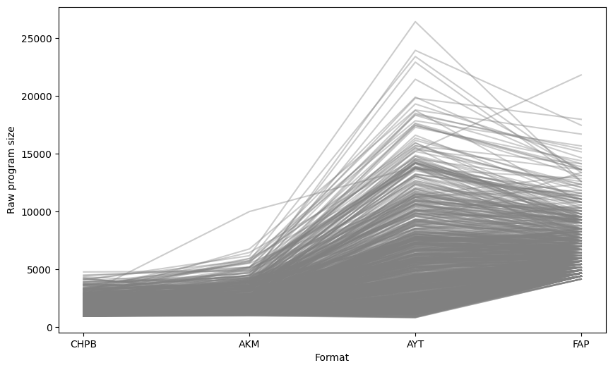

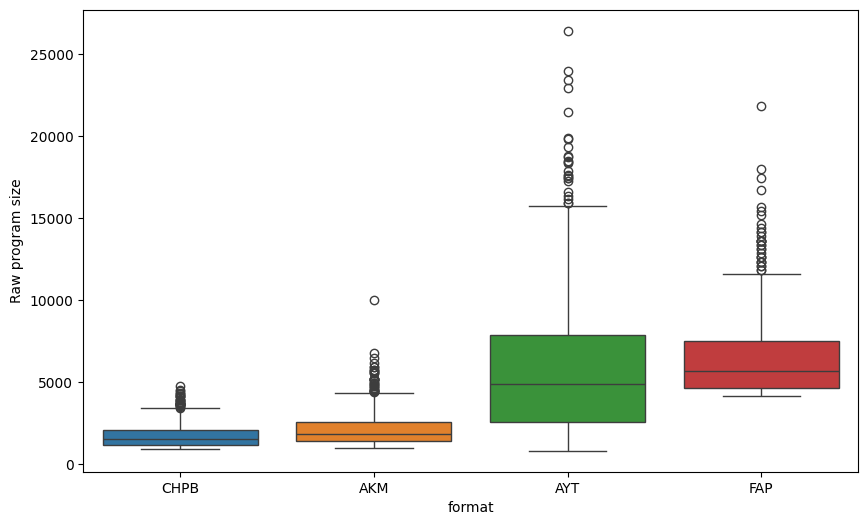

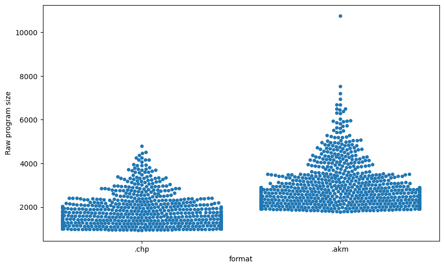
# Crunch (zx0) program size (without decrunch routine and data reloction)

|     | sources   |   .akm |   .chp |
|----:|:----------|-------:|-------:|
|   0 | ABADIA1   |   1791 |   1286 |
|   1 | ABADIA2   |   1525 |    950 |
|   2 | ABADIA3   |   1967 |   1355 |
|   3 | ADDAMSF0  |   1663 |   1203 |
|   4 | ADDAMSF1  |   1674 |   1220 |
|   5 | ADDAMSF2  |   1659 |   1162 |
|   6 | ADDAMSF3  |   1292 |    857 |
|   7 | AFTEROID  |   1752 |   1258 |
|   8 | AFTERWAR  |   3119 |   2036 |
|   9 | ALEHOP    |   2331 |   1459 |
|  10 | AMAUROTE  |   1497 |    945 |
|  11 | AMAUROTF  |   1448 |    900 |
|  12 | AMAUROTG  |   1286 |    814 |
|  13 | AMAUROTH  |   2366 |   1480 |
|  14 | AMAUROTI  |   1267 |    811 |
|  15 | AMAUROTJ  |   1519 |    830 |
|  16 | AMAUROTK  |   1401 |    858 |
|  17 | AMAUROTL  |   1361 |    861 |
|  18 | AMC0      |   2734 |   1672 |
|  19 | AMC1      |   3661 |   2562 |
|  20 | AMC2      |   3610 |   2396 |
|  21 | AMC3      |   1458 |    880 |
|  22 | AMC4      |   1362 |    860 |
|  23 | ARCYESOD  |   1683 |   1113 |
|  24 | ARKA1C64  |   2594 |   1501 |
|  25 | ARKANO-M  |   1620 |    958 |
|  26 | ARKANO-Z  |   1428 |    903 |
|  27 | ARKANOID  |   1507 |    888 |
|  28 | ARKANOIE  |   1415 |    826 |
|  29 | ARKANOIF  |   1404 |    804 |
|  30 | ARKANOIG  |   1472 |    854 |
|  31 | ARKANOIH  |   1401 |    823 |
|  32 | ARKOID2A  |   1381 |    892 |
|  33 | ARKOID2B  |   1387 |    853 |
|  34 | ARKOID2C  |   1342 |    859 |
|  35 | ARKOID2D  |   1373 |    871 |
|  36 | ARKOID2E  |   1291 |    819 |
|  37 | ARKOS     |   1421 |    938 |
|  38 | ARMYMOV1  |   1315 |    898 |
|  39 | ARMYMOV2  |   1364 |    934 |
|  40 | ASHTRAY   |   2303 |   1738 |
|  41 | ASPHALT   |   2293 |   1444 |
|  42 | ATEAM     |   1365 |    857 |
|  43 | ATOMINO3  |   2110 |   1335 |
|  44 | AUFMONTY  |   1504 |   1056 |
|  45 | AUFMONTZ  |   2957 |   2231 |
|  46 | AVENGER   |   2477 |   1396 |
|  47 | BACTRON   |   1842 |   1201 |
|  48 | BALLBRKR  |   1874 |   1308 |
|  49 | BATMAN10  |   1361 |    922 |
|  50 | BATMAN11  |   1291 |    838 |
|  51 | BATMAN12  |   1275 |    824 |
|  52 | BATMAN20  |   1513 |    891 |
|  53 | BATMAN21  |   1826 |   1145 |
|  54 | BATMAN22  |   2286 |   1758 |
|  55 | BATMAN23  |   2017 |   1362 |
|  56 | BATMAN30  |   2018 |   1579 |
|  57 | BATMAN31  |   2268 |   1282 |
|  58 | BATMAN32  |   1783 |   1152 |
|  59 | BATMAN33  |   2102 |   1411 |
|  60 | BATMAN34  |   1881 |   1361 |
|  61 | BATMAN35  |   2338 |   1624 |
|  62 | BATMAN36  |   1439 |    855 |
|  63 | BB128K-0  |   1312 |    870 |
|  64 | BB128K-1  |   1729 |   1149 |
|  65 | BB128K-2  |   1287 |    810 |
|  66 | BB128K-3  |   1329 |    846 |
|  67 | BEACHBUG  |   2580 |   1587 |
|  68 | BEVERLYH  |   2361 |   1382 |
|  69 | BEYNDIP1  |   1934 |   1027 |
|  70 | BEYNDIP2  |   4090 |   2464 |
|  71 | BIRDIE    |   1890 |   1262 |
|  72 | BLACKBRD  |   1707 |   1174 |
|  73 | BLKLMP64  |   2991 |   1549 |
|  74 | BLKLMP65  |   1466 |    907 |
|  75 | BLKLMP66  |   1591 |   1013 |
|  76 | BLKLMPST  |   1912 |   1264 |
|  77 | BLKLMPSU  |   2281 |   1603 |
|  78 | BLKLMPSV  |   1577 |    921 |
|  79 | BLKLMPZX  |   1933 |   1321 |
|  80 | BLKLMPZY  |   1419 |    871 |
|  81 | BLOODBRS  |   2702 |   1556 |
|  82 | BMXSIM1   |   1619 |   1036 |
|  83 | BMXSIM2A  |   2440 |   1172 |
|  84 | BMXSIM2B  |   1923 |   1167 |
|  85 | BMXSIM2C  |   2255 |   1146 |
|  86 | BOBO0     |   1873 |   1062 |
|  87 | BOBO1     |   2283 |   1485 |
|  88 | BOBO2     |   2662 |   1676 |
|  89 | BOBO3     |   2437 |   1569 |
|  90 | BOBO4     |   2146 |   1314 |
|  91 | BOBO5     |   2113 |   1477 |
|  92 | BOBO6     |   1587 |    929 |
|  93 | BOMBUZAL  |   2318 |   1232 |
|  94 | BOSCONIA  |   2239 |   1389 |
|  95 | BOSCONIB  |   1443 |    933 |
|  96 | BOULDASH  |   1507 |    971 |
|  97 | BOULDSHR  |   1420 |    899 |
|  98 | BOUNDER   |   1481 |    995 |
|  99 | BRAVSTAR  |   2239 |   1543 |
| 100 | BRNBLL-N  |   2328 |   1461 |
| 101 | BRONX     |   2688 |   1627 |
| 102 | BUBBLEMX  |   1505 |   1006 |
| 103 | BUBBLEST  |   1736 |   1201 |
| 104 | BUMPY     |   1658 |   1078 |
| 105 | BURNINR1  |   1904 |   1233 |
| 106 | BURNINR2  |   1718 |   1047 |
| 107 | BURNINR3  |   1601 |   1084 |
| 108 | BURNINR4  |   1631 |   1020 |
| 109 | BURNINR5  |   1360 |    812 |
| 110 | BURNRUB1  |   2093 |   1412 |
| 111 | BURNRUB2  |   1808 |   1062 |
| 112 | BURNRUB3  |   1714 |   1142 |
| 113 | BURNRUB4  |   1753 |   1007 |
| 114 | BURNRUB5  |   1355 |    826 |
| 115 | C64-180A  |   1703 |   1112 |
| 116 | C64-180B  |   1768 |    855 |
| 117 | C64-180C  |   1581 |    974 |
| 118 | CAMPEONE  |   1473 |    978 |
| 119 | CATABALL  |   2452 |   1767 |
| 120 | CATABALM  |   1897 |   1318 |
| 121 | CAULDRN1  |   1401 |    887 |
| 122 | CAULDRN2  |   2067 |   1225 |
| 123 | CAVEMANI  |   3432 |   1980 |
| 124 | CAVEMANJ  |   1740 |   1081 |
| 125 | CHAINRCT  |   2363 |   1481 |
| 126 | CHARDESI  |   1929 |   1181 |
| 127 | CHASEHQ1  |   2404 |   1431 |
| 128 | CHASEHQ2  |   1511 |    901 |
| 129 | CHICAG30  |   1891 |   1320 |
| 130 | CHIMERA1  |   3534 |   1851 |
| 131 | CHIMERA2  |   1778 |   1276 |
| 132 | CHUBBYGR  |   1995 |   1426 |
| 133 | CHUBBYGS  |   1372 |    862 |
| 134 | CMDTRACR  |   1541 |   1105 |
| 135 | COBRAC64  |   3888 |   1826 |
| 136 | COCOATM0  |   1985 |   1332 |
| 137 | COCOATM1  |   2062 |   1272 |
| 138 | COLISEUM  |   1749 |   1098 |
| 139 | COLT36    |   1738 |   1066 |
| 140 | COMBASC1  |   1686 |   1008 |
| 141 | COMBASC2  |   1819 |   1151 |
| 142 | COMBASC3  |   2159 |   1120 |
| 143 | COMBASC4  |   1473 |   1004 |
| 144 | COMBASC5  |   1777 |   1112 |
| 145 | COMICBKR  |   2484 |   1704 |
| 146 | COMICBKS  |   2553 |   1472 |
| 147 | COMICBKT  |   2413 |   1125 |
| 148 | COMICBKU  |   2247 |   1205 |
| 149 | COMMANDO  |   2660 |   1961 |
| 150 | COMMANDP  |   1457 |    972 |
| 151 | COMMANDQ  |   1263 |    832 |
| 152 | COMMANDR  |   1623 |   1167 |
| 153 | COMMANDS  |   1385 |    938 |
| 154 | COMMANDT  |   1274 |    820 |
| 155 | CORSARI1  |   1891 |    992 |
| 156 | CORSARI2  |   1780 |   1069 |
| 157 | COSANOST  |   1719 |   1100 |
| 158 | COSTACP1  |   1587 |   1180 |
| 159 | COSTACP2  |   1499 |   1064 |
| 160 | CPC-1942  |   2087 |   1607 |
| 161 | CPC-1943  |   2388 |   1519 |
| 162 | CRAFTON1  |   1697 |   1098 |
| 163 | CRAFTON2  |   1640 |    980 |
| 164 | CRAY_5    |   1610 |   1052 |
| 165 | CRAZYCM1  |   3762 |   1917 |
| 166 | CRAZYCM2  |   2155 |   1431 |
| 167 | CYBERBIG  |   2967 |   1598 |
| 168 | DALEYTOC  |   1990 |   1246 |
| 169 | DARKFUSN  |   1991 |   1290 |
| 170 | DAYMOTEN  |   2463 |   1193 |
| 171 | DDRAGON0  |   1539 |    833 |
| 172 | DDRAGON1  |   2926 |   1840 |
| 173 | DDRAGON2  |   1660 |    942 |
| 174 | DEFCOM    |   1964 |   1281 |
| 175 | DEFLEKTR  |   2282 |   1585 |
| 176 | DELTA-IN  |   1704 |   1211 |
| 177 | DELTA-SL  |   1807 |   1147 |
| 178 | DELTA-ZK  |   2067 |   1247 |
| 179 | DESPERA0  |   1270 |    798 |
| 180 | DESPERA1  |   2453 |   1577 |
| 181 | DESPERA2  |   1634 |    973 |
| 182 | DESPERA3  |   2017 |   1398 |
| 183 | DESPOTIK  |   1485 |   1020 |
| 184 | DEVIANTS  |   1645 |   1053 |
| 185 | DIPDIP    |   1493 |   1011 |
| 186 | DIZZYDTR  |   1948 |   1389 |
| 187 | DIZZYPYF  |   2266 |   1427 |
| 188 | DOORDOOM  |   2058 |   1488 |
| 189 | DRAZEN64  |   1716 |   1123 |
| 190 | DRAZEN65  |   1695 |   1096 |
| 191 | DRDESTRU  |   2157 |   1447 |
| 192 | DRGNINJA  |   1999 |   1338 |
| 193 | DRLAIR10  |   1809 |   1230 |
| 194 | DRLAIR20  |   1978 |   1358 |
| 195 | DRLAIR21  |   2022 |   1194 |
| 196 | DRLAIR22  |   1689 |   1181 |
| 197 | DRLAIR23  |   1606 |   1216 |
| 198 | DRLAIR24  |   1836 |   1299 |
| 199 | DRLAIR25  |   1726 |   1176 |
| 200 | DRLAIR26  |   1740 |   1298 |
| 201 | DRLAIR27  |   1824 |   1153 |
| 202 | DRLAIR28  |   1767 |   1351 |
| 203 | DRLAIR29  |   1592 |    899 |
| 204 | DROIDS    |   1678 |   1111 |
| 205 | DRUIDRMX  |   1897 |   1011 |
| 206 | DTHWISH3  |   2686 |   1475 |
| 207 | DUSTIN    |   1593 |   1088 |
| 208 | DYNADAN1  |   1597 |   1057 |
| 209 | DYNADUO1  |   2955 |   1438 |
| 210 | DYNADUO2  |   1886 |   1021 |
| 211 | DYNADUO3  |   1877 |    950 |
| 212 | E-MOTION  |   1746 |   1059 |
| 213 | ELEKTRAG  |   3120 |   1889 |
| 214 | ELEVATOR  |   1815 |   1076 |
| 215 | ELIMNTR0  |   3129 |   2116 |
| 216 | ELIMNTR1  |   1995 |   1209 |
| 217 | ELIMNTR2  |   1743 |   1053 |
| 218 | ELIMNTR3  |   1344 |    829 |
| 219 | EQUINOX   |   1684 |   1233 |
| 220 | ESPADA    |   1712 |   1129 |
| 221 | EXTRMNTR  |   1621 |   1010 |
| 222 | FERNANDZ  |   1877 |   1073 |
| 223 | FEUD1     |   1451 |    893 |
| 224 | FEUD2     |   1869 |   1100 |
| 225 | FINDKEEP  |   2077 |   1341 |
| 226 | FINDKEEQ  |   1620 |    992 |
| 227 | FIRELORD  |   2352 |   1559 |
| 228 | FIRELORE  |   1682 |    876 |
| 229 | FLINTSTN  |   1861 |   1101 |
| 230 | FLINTSTO  |   2020 |   1305 |
| 231 | FLUFF1    |   1861 |    986 |
| 232 | FLUFF2    |   2109 |   1151 |
| 233 | FMBASKT1  |   1323 |    875 |
| 234 | FMBASKT2  |   1348 |    877 |
| 235 | FOLLIN2B  |   2101 |   1282 |
| 236 | FOLLINOX  |   2385 |   1476 |
| 237 | FORMULA1  |   3649 |   1619 |
| 238 | FORMULE   |   2084 |   1448 |
| 239 | FOTYEAR1  |   3178 |   1926 |
| 240 | FOTYEAR2  |   2182 |   1232 |
| 241 | FOXBACK1  |   2134 |   1463 |
| 242 | FOXBACK2  |   2690 |   1983 |
| 243 | FOXBACK3  |   1426 |    845 |
| 244 | FOXBACK4  |   1357 |    841 |
| 245 | FREDDY_H  |   1601 |   1147 |
| 246 | FROGALOT  |   2090 |   1247 |
| 247 | FROSTY    |   1719 |   1222 |
| 248 | FUMIGATR  |   1636 |   1043 |
| 249 | FUNKYMUS  |   1493 |   1005 |
| 250 | FUNKYMUT  |   1340 |    871 |
| 251 | FUTUREKN  |   2048 |   1225 |
| 252 | F_O_F_T_  |   2419 |   1458 |
| 253 | GALAX_3D  |   2727 |   1773 |
| 254 | GALIOUS1  |   2251 |   1511 |
| 255 | GALIOUS2  |   1946 |   1353 |
| 256 | GAUNTLET  |   1363 |    810 |
| 257 | GBASKET   |   1317 |    855 |
| 258 | GEOFFCS1  |   1604 |   1016 |
| 259 | GEOFFCS2  |   1580 |    949 |
| 260 | GEOFFCS3  |   1908 |    899 |
| 261 | GEOFFCS4  |   1605 |    964 |
| 262 | GEOFFCS5  |   1557 |    974 |
| 263 | GEOFFCS6  |   1553 |    952 |
| 264 | GHOSTCPC  |   2290 |   1246 |
| 265 | GHOSTMSX  |   1874 |    987 |
| 266 | GILBERTE  |   2065 |   1252 |
| 267 | GLIDERDR  |   2389 |   1460 |
| 268 | GLIDERDS  |   1505 |    978 |
| 269 | GNG0      |   2812 |   1392 |
| 270 | GNG1      |   2898 |   1417 |
| 271 | GNG2      |   2934 |   1994 |
| 272 | GNG2-ALT  |   2388 |   1098 |
| 273 | GONZALZ1  |   1554 |   1091 |
| 274 | GONZALZ2  |   1663 |   1160 |
| 275 | GONZALZ3  |   1462 |   1003 |
| 276 | GONZALZ4  |   1620 |   1145 |
| 277 | GOODY     |   2138 |   1268 |
| 278 | GPSIM64A  |   1786 |   1143 |
| 279 | GPSIMCPC  |   1703 |   1175 |
| 280 | GPSIMCPD  |   1850 |   1280 |
| 281 | GPSIMCPE  |   1384 |    855 |
| 282 | GPX750CC  |   2221 |   1510 |
| 283 | GRANGEHL  |   1525 |    980 |
| 284 | GREMLIND  |   2126 |   1424 |
| 285 | GRYZOR1   |   1753 |   1163 |
| 286 | GRYZOR2   |   1717 |   1125 |
| 287 | GUILTELL  |   1518 |    969 |
| 288 | GUNFRITE  |   2142 |   1322 |
| 289 | GUNFRITF  |   1379 |    821 |
| 290 | GUNFRITG  |   1388 |    827 |
| 291 | GUNFRITH  |   1376 |    827 |
| 292 | GUNFRITI  |   1405 |    835 |
| 293 | GUNFRITJ  |   1398 |    837 |
| 294 | GUNFRITK  |   1398 |    843 |
| 295 | GUNFRITL  |   1374 |    812 |
| 296 | GUNFRITM  |   1372 |    825 |
| 297 | HAMMRBY1  |   2027 |   1259 |
| 298 | HAMMRBY2  |   1764 |   1111 |
| 299 | HAMMRBY3  |   1569 |   1050 |
| 300 | HAMMRBY4  |   1883 |   1105 |
| 301 | HATE-AST  |   2161 |   1086 |
| 302 | HATTRICK  |   1807 |   1028 |
| 303 | HEADHEEL  |   1487 |    970 |
| 304 | HELTERSK  |   1728 |   1111 |
| 305 | HEROBOTX  |   2396 |   1790 |
| 306 | HEXAVIRU  |   1681 |    922 |
| 307 | HEXAVIRV  |   2359 |   1413 |
| 308 | HISTEEL1  |   1866 |   1041 |
| 309 | HISTEEL2  |   1549 |    887 |
| 310 | HISTEEL3  |   1565 |    833 |
| 311 | HOPRCOPR  |   2077 |   1249 |
| 312 | HOTSHOT   |   1849 |   1149 |
| 313 | HUMANRC4  |   2216 |   1353 |
| 314 | HUMPHREY  |   1822 |   1287 |
| 315 | HUNCHADV  |   2008 |   1561 |
| 316 | HUNCHMUZ  |   1969 |   1258 |
| 317 | HUNDRA    |   2363 |   1620 |
| 318 | HYDROFOL  |   2359 |   1652 |
| 319 | HYPERBWL  |   1534 |    988 |
| 320 | H_A_T_E_  |   2657 |   1479 |
| 321 | I3TENIS1  |   2621 |   1766 |
| 322 | I3TENIS2  |   2375 |   1516 |
| 323 | IBALL2ST  |   3465 |   1944 |
| 324 | IKARIWAR  |   2256 |   1837 |
| 325 | IKPLUS    |   3020 |   2222 |
| 326 | IMPOSSML  |   2804 |   1533 |
| 327 | INDIANA3  |   1808 |   1192 |
| 328 | INSIDOUT  |   2716 |   1648 |
| 329 | JACKNIP2  |   2309 |   1480 |
| 330 | JSW1      |   2378 |   1638 |
| 331 | JSW2      |   1439 |    966 |
| 332 | JSW64-RH  |   2599 |   1857 |
| 333 | JUPITERP  |   2461 |   1587 |
| 334 | KENDOWAR  |   2235 |   1447 |
| 335 | KENDOWAS  |   2493 |   1384 |
| 336 | KETTLE    |   3239 |   2201 |
| 337 | KILLRING  |   3066 |   1905 |
| 338 | KNIGHTYM  |   3262 |   1583 |
| 339 | KNIGHTYN  |   1948 |   1406 |
| 340 | KONGSB64  |   2556 |   1458 |
| 341 | KONGSTCK  |   1993 |   1296 |
| 342 | KRAKOUT   |   2271 |   1675 |
| 343 | KRAKOUU   |   1349 |    872 |
| 344 | LASTMISN  |   1916 |   1255 |
| 345 | LAZRTAG1  |   3193 |   1531 |
| 346 | LAZRTAG2  |   1688 |   1084 |
| 347 | LEDSTORM  |   3207 |   2011 |
| 348 | LEDSTORN  |   1976 |   1211 |
| 349 | LEDSTORO  |   1926 |   1142 |
| 350 | LEVIATHN  |   2500 |   1265 |
| 351 | LINEFIR1  |   1916 |   1287 |
| 352 | LINEFIR2  |   1714 |   1040 |
| 353 | LINEKER1  |   2479 |   1330 |
| 354 | LINEKER2  |   2155 |   1257 |
| 355 | LITECORE  |   3071 |   2018 |
| 356 | LIVISTN0  |   1747 |   1210 |
| 357 | LIVISTN1  |   1648 |   1186 |
| 358 | LIVISTN2  |   1464 |    969 |
| 359 | LOADSONG  |   1523 |    949 |
| 360 | LOPEARS   |   1657 |   1068 |
| 361 | LORNA     |   1871 |   1492 |
| 362 | LWTENNIS  |   2638 |   1691 |
| 363 | MACH3     |   1726 |   1101 |
| 364 | MADBALLS  |   1861 |   1271 |
| 365 | MADDOG    |   1416 |    949 |
| 366 | MADMIXG0  |   1939 |   1239 |
| 367 | MADMIXG1  |   2088 |   1310 |
| 368 | MADMIXG2  |   2035 |   1318 |
| 369 | MAGICJS1  |   2276 |   1514 |
| 370 | MAGICJS2  |   2189 |   1416 |
| 371 | MANICMN1  |   1446 |    918 |
| 372 | MANICMN2  |   1319 |    858 |
| 373 | MARACAIB  |   1927 |   1177 |
| 374 | MASK1     |   2275 |   1276 |
| 375 | MASK2     |   2285 |   1241 |
| 376 | MASK3     |   2798 |   1607 |
| 377 | MASK4     |   1378 |    810 |
| 378 | MASK5     |   1641 |    951 |
| 379 | MASTUNIV  |   3521 |   2091 |
| 380 | MATAHARI  |   1818 |   1157 |
| 381 | MATCHDY2  |   1597 |    993 |
| 382 | MAZEMANI  |   2415 |   1686 |
| 383 | MAZEMANJ  |   1461 |    933 |
| 384 | MAZEMANK  |   1301 |    824 |
| 385 | MAZEMANL  |   1402 |    860 |
| 386 | MECHANIC  |   3134 |   1862 |
| 387 | MECHANID  |   2137 |   1134 |
| 388 | MECHANIE  |   1568 |    916 |
| 389 | MEGANOVA  |   1601 |   1125 |
| 390 | MEGANOVB  |   1529 |   1136 |
| 391 | MEGAPHNW  |   2048 |   1342 |
| 392 | MEGAPHNX  |   2148 |   1389 |
| 393 | MEGAPHNY  |   2153 |   1548 |
| 394 | MEGAPHNZ  |   2104 |   1389 |
| 395 | MEGAPOCL  |   3196 |   1893 |
| 396 | MELTDOWN  |   2633 |   1645 |
| 397 | MENACE-1  |   1617 |   1027 |
| 398 | MENACE-2  |   1643 |   1055 |
| 399 | MENACE-3  |   2048 |   1380 |
| 400 | MERMAID1  |   1551 |   1006 |
| 401 | MERMAID2  |   1322 |    842 |
| 402 | MERMAID3  |   1504 |    994 |
| 403 | MERMAID4  |   1574 |   1002 |
| 404 | MERMAID5  |   1318 |    804 |
| 405 | METROCRS  |   1869 |   1112 |
| 406 | METROCRT  |   1518 |    919 |
| 407 | METROCRU  |   1378 |    799 |
| 408 | METROCRV  |   1393 |    809 |
| 409 | METROCRW  |   1540 |    895 |
| 410 | METROPLS  |   2020 |   1200 |
| 411 | MICROMUS  |   2104 |   1388 |
| 412 | MONACOGO  |   2426 |   1693 |
| 413 | MONACOGP  |   3103 |   2086 |
| 414 | MONACOGQ  |   1677 |    840 |
| 415 | MONACOGR  |   1559 |    932 |
| 416 | MONACOGS  |   2034 |   1371 |
| 417 | MONTYRUN  |   2605 |   1957 |
| 418 | MONTYRUO  |   1406 |    926 |
| 419 | MONTYRUP  |   1574 |    928 |
| 420 | MOONTORC  |   2541 |   1437 |
| 421 | MORYFIL2  |   2769 |   1541 |
| 422 | MOT1      |   1890 |   1254 |
| 423 | MOT2      |   1496 |    938 |
| 424 | MOT3      |   1852 |   1034 |
| 425 | MOTOS1    |   1494 |    965 |
| 426 | MOTOS2    |   1758 |   1054 |
| 427 | MOTOS3    |   1624 |   1026 |
| 428 | MOUNTMIK  |   2173 |   1666 |
| 429 | MPHOENIX  |   2157 |   1341 |
| 430 | MRCRACKS  |   1529 |    953 |
| 431 | MRCRACKT  |   1578 |   1049 |
| 432 | MRCRACKU  |   1297 |    803 |
| 433 | MRCRACKV  |   1401 |    908 |
| 434 | MRCRACKW  |   1294 |    816 |
| 435 | MRCRACKX  |   1366 |    861 |
| 436 | MRCRACKY  |   1596 |    964 |
| 437 | MRCRACKZ  |   1609 |   1056 |
| 438 | MRHELI    |   2036 |   1107 |
| 439 | MRWINO    |   2140 |   1103 |
| 440 | MUNSTERS  |   2258 |   1348 |
| 441 | MUTANZO1  |   1503 |    970 |
| 442 | MUTANZO2  |   1447 |    909 |
| 443 | MYHERO_1  |   1707 |   1122 |
| 444 | MYHERO_2  |   1613 |   1100 |
| 445 | MYHERO_3  |   1783 |   1235 |
| 446 | MYHERO_4  |   1415 |    906 |
| 447 | MYHERO_5  |   1417 |    942 |
| 448 | MYSTICAL  |   3341 |   2288 |
| 449 | MYTHOS    |   1657 |   1122 |
| 450 | M_U_L_E_  |   1754 |   1116 |
| 451 | M_U_L_F_  |   1448 |    916 |
| 452 | M_U_L_G_  |   1365 |    840 |
| 453 | NAVYMOVS  |   1618 |   1117 |
| 454 | NAVYSLS1  |   3554 |   2143 |
| 455 | NAVYSLS2  |   1923 |    987 |
| 456 | NAVYSLS3  |   1789 |    992 |
| 457 | NAVYSLS4  |   2087 |   1122 |
| 458 | NAVYSLS5  |   1543 |    851 |
| 459 | NAVYSLS6  |   1908 |    921 |
| 460 | NAVYSLS7  |   1608 |    971 |
| 461 | NEBULUS   |   3088 |   1857 |
| 462 | NEMESTWL  |   2782 |   2099 |
| 463 | NEVEREND  |   2233 |   1664 |
| 464 | NEVERS-S  |   1560 |   1031 |
| 465 | NINELIVE  |   2352 |   1759 |
| 466 | NINELIVS  |   2349 |   1759 |
| 467 | NINJSCTR  |   3477 |   2254 |
| 468 | NITESHFT  |   2461 |   1550 |
| 469 | NONAMED   |   1536 |    997 |
| 470 | NORTHST1  |   1824 |   1106 |
| 471 | NORTHST2  |   1625 |    903 |
| 472 | OCTOPLEX  |   2744 |   1723 |
| 473 | OCTOPLEY  |   2515 |   1733 |
| 474 | OCTOPLEZ  |   1354 |    905 |
| 475 | OH_MUMMY  |   1306 |    830 |
| 476 | ONECOLN1  |   2390 |   1630 |
| 477 | ONEMANDR  |   1648 |   1176 |
| 478 | ONEMANDS  |   2750 |   2194 |
| 479 | OPGUNSHP  |   2110 |   1325 |
| 480 | OPGUNSHQ  |   1710 |   1062 |
| 481 | OPTBOLT0  |   1650 |   1006 |
| 482 | OPTBOLT1  |   1506 |    835 |
| 483 | OPTBOLT2  |   1617 |    863 |
| 484 | OPWOLF0   |   1734 |    944 |
| 485 | OPWOLF1   |   1481 |    974 |
| 486 | OPWOLF2   |   1436 |    875 |
| 487 | OPWOLF3   |   1612 |    977 |
| 488 | OUTWORLD  |   3099 |   2022 |
| 489 | PACLAND0  |   1598 |    808 |
| 490 | PACLAND1  |   1853 |   1139 |
| 491 | PACLAND2  |   1543 |    971 |
| 492 | PACLAND3  |   1876 |   1139 |
| 493 | PACLAND4  |   1388 |    821 |
| 494 | PACLAND5  |   1369 |    866 |
| 495 | PACLAND6  |   1949 |    957 |
| 496 | PACMANI0  |   1367 |    855 |
| 497 | PACMANI1  |   2298 |   1613 |
| 498 | PACMANI2  |   2065 |   1280 |
| 499 | PACMANI3  |   1724 |   1124 |
| 500 | PERICODG  |   1749 |   1139 |
| 501 | PHANTIS1  |   1521 |   1062 |
| 502 | PHANTIS2  |   1618 |   1132 |
| 503 | PHNTMCLB  |   1653 |    949 |
| 504 | PHOBOS-N  |   2346 |   1419 |
| 505 | PINKPANT  |   1707 |   1039 |
| 506 | PINKPNTH  |   1921 |   1000 |
| 507 | PIPPOLS0  |   1401 |    906 |
| 508 | PIPPOLS1  |   1597 |   1062 |
| 509 | PIPPOLS2  |   1415 |    935 |
| 510 | PIPPOLS3  |   1258 |    805 |
| 511 | PIPPOLS4  |   1416 |    932 |
| 512 | PIPPOLS5  |   1330 |    868 |
| 513 | PLATOON0  |   2106 |   1217 |
| 514 | PLATOON1  |   1842 |   1329 |
| 515 | PLATOON2  |   1891 |   1163 |
| 516 | PLATOON3  |   1601 |   1155 |
| 517 | PLATOON4  |   1494 |    974 |
| 518 | PODEROSC  |   1422 |    949 |
| 519 | POGOLYMP  |   2741 |   1500 |
| 520 | POOGABOO  |   1552 |    994 |
| 521 | POWERPLY  |   2486 |   1664 |
| 522 | POWERPLZ  |   1446 |    910 |
| 523 | PREHIST0  |   1832 |   1314 |
| 524 | PREHIST1  |   1675 |   1225 |
| 525 | PREHIST2  |   1982 |   1256 |
| 526 | PREHIST3  |   2671 |   1843 |
| 527 | PROHIBIT  |   3308 |   1847 |
| 528 | PROHIBIU  |   2552 |   1779 |
| 529 | PSYPIGSU  |   1537 |   1002 |
| 530 | PSYPIGSV  |   1442 |    886 |
| 531 | PSYPIGSW  |   1419 |    871 |
| 532 | PSYPIGSX  |   1449 |    919 |
| 533 | PULSOIDS  |   2965 |   1866 |
| 534 | PULSOIDZ  |   2080 |   1510 |
| 535 | PUZZNIC0  |   2941 |   1738 |
| 536 | PUZZNIC1  |   2855 |   1746 |
| 537 | PUZZNIC2  |   1828 |   1045 |
| 538 | PYJAMA    |   1433 |    930 |
| 539 | QUARTET4  |   1380 |    899 |
| 540 | QUARTET5  |   1432 |    905 |
| 541 | QUARTET6  |   2145 |   1161 |
| 542 | RACETIME  |   2797 |   1736 |
| 543 | RAMBO30   |   1933 |   1157 |
| 544 | RAMBO31   |   1421 |    834 |
| 545 | RAMBO32   |   1454 |    867 |
| 546 | RAMPAGE   |   1536 |   1043 |
| 547 | RAMPAGF   |   2413 |   1284 |
| 548 | RAMPAGG   |   1627 |    929 |
| 549 | RAMPARTS  |   3316 |   2115 |
| 550 | RAMPARTT  |   1859 |   1038 |
| 551 | RAMPARTU  |   1543 |    903 |
| 552 | RAMPARTV  |   1428 |    882 |
| 553 | RASPUTIH  |   2650 |   2042 |
| 554 | RASPUTIN  |   1763 |   1260 |
| 555 | RASTRSCN  |   2550 |   1765 |
| 556 | RENEGA10  |   1340 |    821 |
| 557 | RENEGA11  |   1507 |    999 |
| 558 | RENEGA12  |   1553 |   1052 |
| 559 | RENEGA13  |   1495 |   1033 |
| 560 | RENEGA14  |   1520 |    979 |
| 561 | RENEGA15  |   1355 |    863 |
| 562 | RENEGA16  |   1387 |    883 |
| 563 | RENEGA17  |   1353 |    851 |
| 564 | RENEGA18  |   1351 |    844 |
| 565 | RENEGA19  |   1366 |    872 |
| 566 | RENEGA1A  |   1510 |    983 |
| 567 | RENEGA30  |   1554 |    916 |
| 568 | RENEGA31  |   1534 |    988 |
| 569 | RENEGA32  |   2096 |   1233 |
| 570 | RENEGA33  |   2055 |   1296 |
| 571 | RENEGA34  |   1830 |   1320 |
| 572 | RENEGA35  |   1384 |    885 |
| 573 | RENEGA36  |   1314 |    835 |
| 574 | RENEGA37  |   1479 |    874 |
| 575 | RENEGA38  |   1623 |    966 |
| 576 | RESCATLA  |   2195 |   1475 |
| 577 | RESCATLB  |   2637 |   1627 |
| 578 | RICKDG1A  |   1642 |   1136 |
| 579 | RICKDG1B  |   1454 |    955 |
| 580 | RICKDG1C  |   1375 |    861 |
| 581 | RICKDG1D  |   1350 |    845 |
| 582 | RICKDG1E  |   1348 |    856 |
| 583 | RICKDG1F  |   1363 |    863 |
| 584 | RICKDG1G  |   1322 |    807 |
| 585 | RICKDG2A  |   1645 |   1029 |
| 586 | RICKDG2B  |   1566 |    862 |
| 587 | RICKDG2C  |   1507 |    879 |
| 588 | RICKDG2D  |   1550 |    874 |
| 589 | RICKDG2E  |   1324 |    842 |
| 590 | RICKDG2F  |   1544 |    851 |
| 591 | RICKDG2G  |   1705 |   1000 |
| 592 | RICKDG2H  |   1423 |    845 |
| 593 | RLSTUNTX  |   2551 |   1560 |
| 594 | ROADBLST  |   1886 |   1152 |
| 595 | ROBIN     |   1525 |   1017 |
| 596 | ROBOCOP0  |   2343 |   1420 |
| 597 | ROBOCOP1  |   1949 |   1166 |
| 598 | ROBOCOP2  |   1505 |    936 |
| 599 | ROBOCOP3  |   1519 |    838 |
| 600 | ROBOCOP4  |   1777 |   1174 |
| 601 | ROBOTCP0  |   1747 |   1354 |
| 602 | ROBOTCP1  |   1369 |    817 |
| 603 | ROBOTCP2  |   1396 |    863 |
| 604 | ROBOTCP3  |   1403 |    896 |
| 605 | ROCKNRLR  |   1680 |   1098 |
| 606 | ROINSPAC  |   1620 |   1255 |
| 607 | ROINTIME  |   1437 |    958 |
| 608 | ROLANDGS  |   1307 |    824 |
| 609 | ROLLRON1  |   2226 |   1541 |
| 610 | ROLLRON2  |   1986 |   1255 |
| 611 | ROLLRON3  |   1901 |   1073 |
| 612 | ROLLRON4  |   1746 |   1114 |
| 613 | RTS-1998  |   2700 |   2054 |
| 614 | RTS-1999  |   2592 |   2047 |
| 615 | RUNGAUNT  |   1588 |   1074 |
| 616 | RYGAR     |   1512 |    976 |
| 617 | RYGAS     |   1423 |   1012 |
| 618 | RYGAT     |   1340 |    853 |
| 619 | RYGAU     |   1516 |    895 |
| 620 | SABOTUR1  |   1394 |    908 |
| 621 | SABOTUR2  |   2221 |   1537 |
| 622 | SANXION1  |   2910 |   1982 |
| 623 | SANXION2  |   2056 |   1392 |
| 624 | SAVAGE    |   3696 |   2129 |
| 625 | SAVAGF    |   2662 |   1740 |
| 626 | SAVAGG    |   1412 |    845 |
| 627 | SCOR3020  |   1864 |   1296 |
| 628 | SCUMBALL  |   2304 |   1322 |
| 629 | SEPULCRI  |   1509 |   1006 |
| 630 | SHADSKIM  |   1844 |   1256 |
| 631 | SHARRIR1  |   1929 |   1336 |
| 632 | SHARRIR2  |   1498 |    974 |
| 633 | SHARRIR3  |   1579 |   1046 |
| 634 | SHARRIR4  |   1812 |   1372 |
| 635 | SHINOBI0  |   2047 |   1082 |
| 636 | SHINOBI1  |   1927 |   1162 |
| 637 | SHINOBI2  |   1591 |    978 |
| 638 | SHINOBI3  |   1780 |   1048 |
| 639 | SHINOBI4  |   1406 |    875 |
| 640 | SHINOBI5  |   2057 |   1213 |
| 641 | SHINOBI6  |   1349 |    891 |
| 642 | SHINOBI7  |   1324 |    830 |
| 643 | SHINOBI8  |   1464 |    912 |
| 644 | SHINOBI9  |   1704 |    986 |
| 645 | SHOCKWYR  |   2475 |   1770 |
| 646 | SHRTCRCT  |   2781 |   1888 |
| 647 | SIDEWALK  |   2061 |   1407 |
| 648 | SILKWORM  |   3544 |   1602 |
| 649 | SIMPSONS  |   2561 |   1461 |
| 650 | SIRWOOD   |   1749 |   1020 |
| 651 | SKATECRZ  |   2396 |   1469 |
| 652 | SLAPFITE  |   1925 |   1227 |
| 653 | SLAPFITF  |   2416 |   1557 |
| 654 | SLNTSHDW  |   2381 |   1610 |
| 655 | SOLNEGRO  |   1475 |    949 |
| 656 | SOLNEGRP  |   2576 |   1585 |
| 657 | SOLO      |   1745 |   1134 |
| 658 | SOLOMON1  |   1682 |    993 |
| 659 | SOLOMON2  |   1481 |    890 |
| 660 | SOLOMON3  |   1320 |    832 |
| 661 | SOLOMON4  |   1674 |   1015 |
| 662 | SOLOMON5  |   2387 |   1237 |
| 663 | SORCERY   |   1572 |    967 |
| 664 | SPELLBND  |   3685 |   2340 |
| 665 | SPELLBNE  |   1865 |   1431 |
| 666 | SPIKYHAR  |   1785 |   1167 |
| 667 | SPIPEL20  |   1566 |   1043 |
| 668 | SPIPEL21  |   1397 |    879 |
| 669 | SPIPEL22  |   1378 |    869 |
| 670 | SPIPEL23  |   1397 |    885 |
| 671 | SPIPEL24  |   1489 |    972 |
| 672 | SPOTS94A  |   2021 |   1397 |
| 673 | SPOTS94B  |   1984 |   1265 |
| 674 | SPTENIS1  |   2191 |   1394 |
| 675 | SPTENIS2  |   2054 |   1425 |
| 676 | SPTENIS3  |   1486 |    962 |
| 677 | SQUAROOT  |   2026 |   1154 |
| 678 | STAINLES  |   1796 |   1275 |
| 679 | STARBOWL  |   1474 |    970 |
| 680 | STARDUST  |   2233 |   1379 |
| 681 | STARDUSU  |   1346 |    840 |
| 682 | STARION1  |   2627 |   1069 |
| 683 | STARWARS  |   1752 |   1122 |
| 684 | STEG1     |   1507 |    982 |
| 685 | STEG2     |   1944 |   1099 |
| 686 | STIFFLIP  |   2884 |   1913 |
| 687 | STIFFLIQ  |   2030 |   1449 |
| 688 | STORMBRI  |   2756 |   1551 |
| 689 | STORMBRJ  |   2093 |   1543 |
| 690 | STORMLRD  |   2958 |   2250 |
| 691 | SUBBUTEO  |   2452 |   1589 |
| 692 | SUBWAYVG  |   2035 |   1089 |
| 693 | SUPERKID  |   1901 |   1111 |
| 694 | SUPERKIE  |   1797 |   1075 |
| 695 | SUPERKIF  |   2246 |   1501 |
| 696 | SUPRTRPR  |   1888 |   1377 |
| 697 | SUPSTOCK  |   1534 |   1002 |
| 698 | SUPWBOY1  |   1831 |   1023 |
| 699 | SUPWBOY2  |   1951 |   1119 |
| 700 | SURVIVOR  |   1798 |   1233 |
| 701 | SWTCHBLD  |   3038 |   1860 |
| 702 | SWTCHBLE  |   3618 |   1874 |
| 703 | TANGRAM1  |   2936 |   1858 |
| 704 | TANGRAM2  |   3237 |   2497 |
| 705 | TECHTED1  |   1595 |   1149 |
| 706 | TECHTED2  |   1486 |   1016 |
| 707 | TECHTED3  |   2303 |   1359 |
| 708 | TEMPTATN  |   1939 |   1249 |
| 709 | TETRIS1   |   2337 |   1787 |
| 710 | TETRIS2   |   1716 |   1072 |
| 711 | THANATOS  |   1799 |   1194 |
| 712 | THINGBBK  |   2236 |   1594 |
| 713 | THINGSPR  |   2552 |   1721 |
| 714 | THRUSTST  |   3006 |   1921 |
| 715 | THUNCATS  |   2355 |   1600 |
| 716 | THUNDRBD  |   2872 |   1630 |
| 717 | TIMEMACH  |   3345 |   2108 |
| 718 | TIMETRAX  |   2294 |   1487 |
| 719 | TINTINLN  |   1981 |   1397 |
| 720 | TITANIC   |   2228 |   1509 |
| 721 | TMHT1     |   1928 |   1361 |
| 722 | TNZS1     |   1956 |   1221 |
| 723 | TNZS2     |   1393 |    874 |
| 724 | TNZS3     |   1446 |    888 |
| 725 | TNZS4     |   1367 |    856 |
| 726 | TNZS5     |   1430 |    861 |
| 727 | TNZS6     |   1815 |   1116 |
| 728 | TOOBIN_1  |   2009 |   1267 |
| 729 | TOOBIN_2  |   1792 |   1070 |
| 730 | TOOBIN_3  |   1548 |    968 |
| 731 | TOOBIN_4  |   1604 |   1017 |
| 732 | TOOBIN_5  |   1559 |   1004 |
| 733 | TORROSC0  |   1863 |   1231 |
| 734 | TORROSC1  |   1519 |   1008 |
| 735 | TORROSC2  |   1626 |    961 |
| 736 | TOUR91    |   2138 |   1613 |
| 737 | TRAFFIC   |   2251 |   1621 |
| 738 | TRAILBLZ  |   1697 |   1152 |
| 739 | TRANSMUT  |   1565 |    967 |
| 740 | TRAPDOOR  |   1933 |   1187 |
| 741 | TRIGGER   |   1900 |   1212 |
| 742 | TRIVIALP  |   1562 |   1048 |
| 743 | TROLL1    |   2077 |   1412 |
| 744 | TROLL2    |   2164 |   1527 |
| 745 | TROLL3    |   1851 |   1222 |
| 746 | TT-RACER  |   1927 |   1007 |
| 747 | TUAREG    |   1780 |   1174 |
| 748 | TUBARUBA  |   1935 |   1142 |
| 749 | TURBOGRL  |   1544 |   1078 |
| 750 | TWINTUV8  |   1784 |   1036 |
| 751 | TYPHOON   |   1488 |    943 |
| 752 | ULISES    |   1644 |   1121 |
| 753 | UNDERWTR  |   1453 |    913 |
| 754 | UNTOUCH0  |   1334 |    876 |
| 755 | UNTOUCH1  |   2017 |   1294 |
| 756 | UNTOUCH2  |   1895 |   1123 |
| 757 | UNTOUCH3  |   2127 |   1356 |
| 758 | UNTOUCH4  |   1706 |   1070 |
| 759 | UNTOUCH5  |   1781 |   1075 |
| 760 | UNTOUCH6  |   1650 |   1080 |
| 761 | UNTOUCH7  |   1765 |   1285 |
| 762 | URIDIUM   |   2559 |   1468 |
| 763 | VAMPIRE1  |   1597 |    957 |
| 764 | VAMPIRE2  |   1477 |    826 |
| 765 | VAMPIRE3  |   1395 |    803 |
| 766 | VAMPIRE4  |   1405 |    797 |
| 767 | VERMINT1  |   3225 |   1962 |
| 768 | VERMINT2  |   1840 |    966 |
| 769 | VERMINT3  |   2078 |   1431 |
| 770 | VIAJECEN  |   1891 |   1257 |
| 771 | VICTROAD  |   1961 |   1322 |
| 772 | VIKINGS   |   2352 |   1643 |
| 773 | VINDITR1  |   2788 |   1526 |
| 774 | VINDITR2  |   2021 |    946 |
| 775 | VINDITR3  |   1938 |   1286 |
| 776 | VINDITR4  |   2868 |   1709 |
| 777 | VIXEN     |   2677 |   1641 |
| 778 | WARHAWK   |   3166 |   1923 |
| 779 | WECLMANS  |   2328 |   1241 |
| 780 | WECLMANT  |   1564 |    935 |
| 781 | WELLSNFG  |   1910 |   1280 |
| 782 | WESTBNK1  |   1906 |   1283 |
| 783 | WESTBNK2  |   1453 |    974 |
| 784 | WHERTIME  |   2107 |   1273 |
| 785 | WHOPPERC  |   1958 |   1339 |
| 786 | WINGSOD4  |   2703 |   2212 |
| 787 | WINGSOD5  |   2229 |   1765 |
| 788 | WIZBALLZ  |   1845 |   1206 |
| 789 | WRESTARS  |   1787 |   1114 |
| 790 | WRESTART  |   1746 |   1051 |
| 791 | XENON1    |   1761 |   1184 |
| 792 | XENON2    |   1722 |   1134 |
| 793 | XENON3    |   1388 |    927 |
| 794 | XOR       |   1496 |    941 |
| 795 | YOGIBEAR  |   1743 |   1414 |
| 796 | ZAPTBALS  |   2669 |   1695 |
| 797 | ZONA0     |   2064 |   1544 |
| 798 | ZONETROP  |   1784 |   1252 |
| 799 | ZONETROQ  |   1336 |    850 |
| 800 | ZUB1      |   1627 |    999 |
| 801 | ZUB2      |   1928 |   1286 |
| 802 | ZUB3      |   1442 |    908 |
| 803 | ZUB4      |   1844 |    914 |
| 804 | ZUB5      |   1386 |    903 |
| 805 | ZUB6      |   1351 |    899 |
| 806 | ZUB7      |   1395 |    903 |
| 807 | ZYNAPS    |   4415 |   2587 |

Mean

| format   |       0 |
|:---------|--------:|
| .akm     | 1924.08 |
| .chp     | 1216.54 |

 - .chp vs .akm: dissimilar (best=.chp)

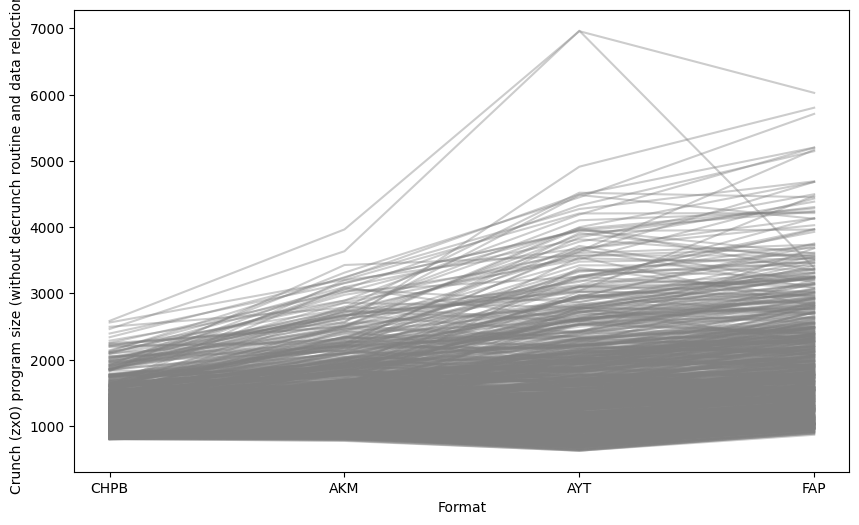

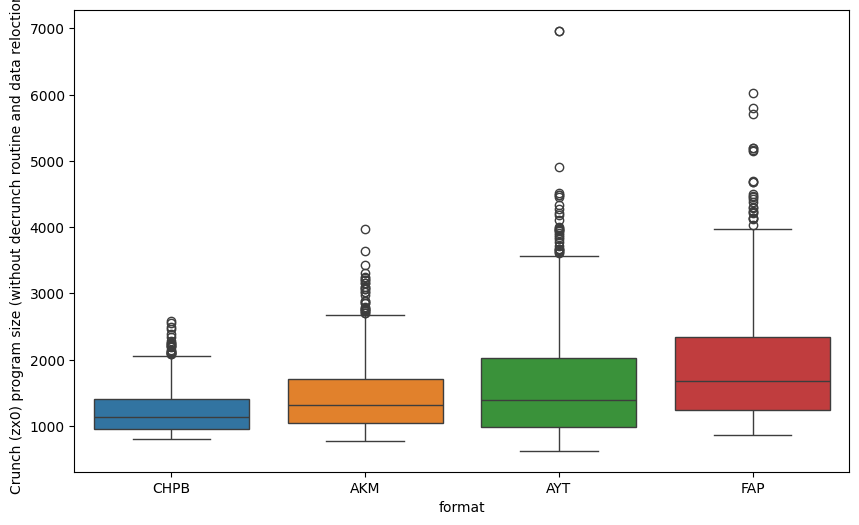

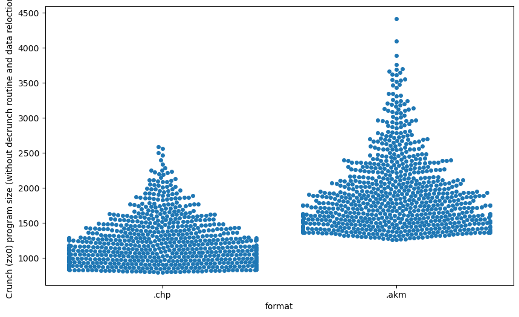
# Maximum execution time (in nops)

|     | sources   |   .akm |   .chp |
|----:|:----------|-------:|-------:|
|   0 | ABADIA1   |   2186 |   2024 |
|   1 | ABADIA2   |   2025 |   1071 |
|   2 | ABADIA3   |   2334 |   2285 |
|   3 | ADDAMSF0  |   2054 |   1758 |
|   4 | ADDAMSF1  |   2054 |   1758 |
|   5 | ADDAMSF2  |   2208 |   2135 |
|   6 | ADDAMSF3  |   2245 |   1838 |
|   7 | AFTEROID  |   2132 |   1608 |
|   8 | AFTERWAR  |   2430 |   2486 |
|   9 | ALEHOP    |   2248 |   2492 |
|  10 | AMAUROTE  |   2342 |   2784 |
|  11 | AMAUROTF  |   2321 |   2351 |
|  12 | AMAUROTG  |   2348 |   2154 |
|  13 | AMAUROTH  |   2459 |   2451 |
|  14 | AMAUROTI  |   2316 |   2393 |
|  15 | AMAUROTJ  |   2316 |   1942 |
|  16 | AMAUROTK  |   2369 |   2525 |
|  17 | AMAUROTL  |   2294 |   2147 |
|  18 | AMC0      |   2351 |   2487 |
|  19 | AMC1      |   2351 |   2224 |
|  20 | AMC2      |   2364 |   2581 |
|  21 | AMC3      |   2305 |   1675 |
|  22 | AMC4      |   2298 |   1876 |
|  23 | ARCYESOD  |   2128 |   1738 |
|  24 | ARKA1C64  |   2297 |   2427 |
|  25 | ARKANO-M  |   2250 |   2659 |
|  26 | ARKANO-Z  |   2357 |   2241 |
|  27 | ARKANOID  |   2253 |   2342 |
|  28 | ARKANOIE  |   2312 |   1562 |
|  29 | ARKANOIF  |   2088 |   1631 |
|  30 | ARKANOIG  |   2307 |   1864 |
|  31 | ARKANOIH  |   1964 |   1678 |
|  32 | ARKOID2A  |   2125 |   1665 |
|  33 | ARKOID2B  |   2007 |   1278 |
|  34 | ARKOID2C  |   1959 |   1807 |
|  35 | ARKOID2D  |   2018 |   1493 |
|  36 | ARKOID2E  |   1853 |   1342 |
|  37 | ARKOS     |   2214 |   2210 |
|  38 | ARMYMOV1  |   2057 |   1620 |
|  39 | ARMYMOV2  |   2071 |   1724 |
|  40 | ASHTRAY   |   2259 |   2699 |
|  41 | ASPHALT   |   2242 |   2402 |
|  42 | ATEAM     |   2274 |   1955 |
|  43 | ATOMINO3  |   2340 |   2279 |
|  44 | AUFMONTY  |   2140 |   1674 |
|  45 | AUFMONTZ  |   2332 |   2154 |
|  46 | AVENGER   |   2259 |   2301 |
|  47 | BACTRON   |   2268 |   2500 |
|  48 | BALLBRKR  |   2229 |   2310 |
|  49 | BATMAN10  |   2260 |   2400 |
|  50 | BATMAN11  |   2251 |   1764 |
|  51 | BATMAN12  |   2293 |   1739 |
|  52 | BATMAN20  |   2201 |   2464 |
|  53 | BATMAN21  |   2309 |   2953 |
|  54 | BATMAN22  |   2364 |   2653 |
|  55 | BATMAN23  |   2396 |   2720 |
|  56 | BATMAN30  |   2277 |   2738 |
|  57 | BATMAN31  |   2344 |   2825 |
|  58 | BATMAN32  |   2278 |   2711 |
|  59 | BATMAN33  |   2334 |   2492 |
|  60 | BATMAN34  |   2327 |   2547 |
|  61 | BATMAN35  |   2320 |   2821 |
|  62 | BATMAN36  |   2300 |   1932 |
|  63 | BB128K-0  |   2320 |   2464 |
|  64 | BB128K-1  |   2349 |   2393 |
|  65 | BB128K-2  |   2231 |   1209 |
|  66 | BB128K-3  |   2274 |   2247 |
|  67 | BEACHBUG  |   2268 |   2614 |
|  68 | BEVERLYH  |   2331 |   2334 |
|  69 | BEYNDIP1  |   2311 |   2645 |
|  70 | BEYNDIP2  |   2330 |   2679 |
|  71 | BIRDIE    |   2259 |   2041 |
|  72 | BLACKBRD  |   2191 |   1910 |
|  73 | BLKLMP64  |   2348 |   2217 |
|  74 | BLKLMP65  |   2087 |   1410 |
|  75 | BLKLMP66  |   2423 |   1976 |
|  76 | BLKLMPST  |   2234 |   2141 |
|  77 | BLKLMPSU  |   2343 |   2665 |
|  78 | BLKLMPSV  |   2254 |   1806 |
|  79 | BLKLMPZX  |   2313 |   2306 |
|  80 | BLKLMPZY  |   2087 |   1795 |
|  81 | BLOODBRS  |   2265 |   2553 |
|  82 | BMXSIM1   |   2347 |   2388 |
|  83 | BMXSIM2A  |   3742 |   3076 |
|  84 | BMXSIM2B  |   2342 |   2443 |
|  85 | BMXSIM2C  |   2438 |   2778 |
|  86 | BOBO0     |   2181 |   1851 |
|  87 | BOBO1     |   2249 |   2455 |
|  88 | BOBO2     |   2295 |   2410 |
|  89 | BOBO3     |   2214 |   2176 |
|  90 | BOBO4     |   2287 |   2492 |
|  91 | BOBO5     |   2277 |   2366 |
|  92 | BOBO6     |   2241 |   2265 |
|  93 | BOMBUZAL  |   2296 |   2421 |
|  94 | BOSCONIA  |   3033 |   2737 |
|  95 | BOSCONIB  |   2270 |   2420 |
|  96 | BOULDASH  |   2103 |   1437 |
|  97 | BOULDSHR  |   2100 |   1507 |
|  98 | BOUNDER   |   2055 |   1564 |
|  99 | BRAVSTAR  |   2258 |   2687 |
| 100 | BRNBLL-N  |   2272 |   2485 |
| 101 | BRONX     |   2825 |   2546 |
| 102 | BUBBLEMX  |   2120 |   1536 |
| 103 | BUBBLEST  |   2301 |   2188 |
| 104 | BUMPY     |   2251 |   2418 |
| 105 | BURNINR1  |   2295 |   2616 |
| 106 | BURNINR2  |   2309 |   2832 |
| 107 | BURNINR3  |   2220 |   2596 |
| 108 | BURNINR4  |   2359 |   2901 |
| 109 | BURNINR5  |   2346 |   1697 |
| 110 | BURNRUB1  |   2313 |   2571 |
| 111 | BURNRUB2  |   2343 |   2859 |
| 112 | BURNRUB3  |   2297 |   2710 |
| 113 | BURNRUB4  |   2373 |   2877 |
| 114 | BURNRUB5  |   2368 |   1665 |
| 115 | C64-180A  |   2240 |   2777 |
| 116 | C64-180B  |   2235 |   2057 |
| 117 | C64-180C  |   2225 |   2286 |
| 118 | CAMPEONE  |   2057 |   1808 |
| 119 | CATABALL  |   2299 |   2529 |
| 120 | CATABALM  |   2243 |   2589 |
| 121 | CAULDRN1  |   2380 |   2072 |
| 122 | CAULDRN2  |   2402 |   2448 |
| 123 | CAVEMANI  |   2328 |   2281 |
| 124 | CAVEMANJ  |   2404 |   2450 |
| 125 | CHAINRCT  |   2373 |   2575 |
| 126 | CHARDESI  |   2226 |   2729 |
| 127 | CHASEHQ1  |   2253 |   2160 |
| 128 | CHASEHQ2  |   2220 |   1967 |
| 129 | CHICAG30  |   2287 |   2598 |
| 130 | CHIMERA1  |   2356 |   2619 |
| 131 | CHIMERA2  |   2265 |   2471 |
| 132 | CHUBBYGR  |   2387 |   2517 |
| 133 | CHUBBYGS  |   2322 |   2189 |
| 134 | CMDTRACR  |   2360 |   2564 |
| 135 | COBRAC64  |   2295 |   2200 |
| 136 | COCOATM0  |   2343 |   2465 |
| 137 | COCOATM1  |   2221 |   2684 |
| 138 | COLISEUM  |   2244 |   2502 |
| 139 | COLT36    |   2281 |   2028 |
| 140 | COMBASC1  |   2286 |   2582 |
| 141 | COMBASC2  |   2299 |   2676 |
| 142 | COMBASC3  |   2355 |   2926 |
| 143 | COMBASC4  |   2420 |   2308 |
| 144 | COMBASC5  |   2383 |   2453 |
| 145 | COMICBKR  |   2373 |   2576 |
| 146 | COMICBKS  |   2413 |   2615 |
| 147 | COMICBKT  |   2235 |   2446 |
| 148 | COMICBKU  |   2231 |   2298 |
| 149 | COMMANDO  |   2413 |   2731 |
| 150 | COMMANDP  |   2332 |   2640 |
| 151 | COMMANDQ  |   2345 |   2501 |
| 152 | COMMANDR  |   2084 |   1561 |
| 153 | COMMANDS  |   2152 |   1668 |
| 154 | COMMANDT  |   2167 |   1558 |
| 155 | CORSARI1  |   2214 |   2264 |
| 156 | CORSARI2  |   2283 |   1788 |
| 157 | COSANOST  |   2128 |   1964 |
| 158 | COSTACP1  |   2042 |   1668 |
| 159 | COSTACP2  |   2005 |    974 |
| 160 | CPC-1942  |   2287 |   2433 |
| 161 | CPC-1943  |   2311 |   2678 |
| 162 | CRAFTON1  |   2337 |   1848 |
| 163 | CRAFTON2  |   2350 |   2176 |
| 164 | CRAY_5    |   2149 |   1894 |
| 165 | CRAZYCM1  |   2430 |   2728 |
| 166 | CRAZYCM2  |   2477 |   2456 |
| 167 | CYBERBIG  |   2269 |   2657 |
| 168 | DALEYTOC  |   2337 |   2571 |
| 169 | DARKFUSN  |   2271 |   2712 |
| 170 | DAYMOTEN  |   2340 |   2236 |
| 171 | DDRAGON0  |   2259 |   1659 |
| 172 | DDRAGON1  |   2240 |   2651 |
| 173 | DDRAGON2  |   2263 |   2468 |
| 174 | DEFCOM    |   2350 |   2735 |
| 175 | DEFLEKTR  |   2320 |   2657 |
| 176 | DELTA-IN  |   2065 |   1760 |
| 177 | DELTA-SL  |   2277 |   2690 |
| 178 | DELTA-ZK  |   2356 |   2757 |
| 179 | DESPERA0  |   2146 |   1124 |
| 180 | DESPERA1  |   2299 |   2297 |
| 181 | DESPERA2  |   2184 |   2348 |
| 182 | DESPERA3  |   2298 |   2470 |
| 183 | DESPOTIK  |   2340 |   2357 |
| 184 | DEVIANTS  |   2301 |   2390 |
| 185 | DIPDIP    |   2143 |   1817 |
| 186 | DIZZYDTR  |   2201 |   2275 |
| 187 | DIZZYPYF  |   2258 |   2629 |
| 188 | DOORDOOM  |   2301 |   2225 |
| 189 | DRAZEN64  |   2231 |   2398 |
| 190 | DRAZEN65  |   2213 |   2489 |
| 191 | DRDESTRU  |   2280 |   2583 |
| 192 | DRGNINJA  |   2324 |   2791 |
| 193 | DRLAIR10  |   2334 |   2461 |
| 194 | DRLAIR20  |   2304 |   2467 |
| 195 | DRLAIR21  |   2369 |   2359 |
| 196 | DRLAIR22  |   2394 |   2577 |
| 197 | DRLAIR23  |   2336 |   2726 |
| 198 | DRLAIR24  |   2394 |   2413 |
| 199 | DRLAIR25  |   2321 |   2805 |
| 200 | DRLAIR26  |   2312 |   2484 |
| 201 | DRLAIR27  |   2302 |   2668 |
| 202 | DRLAIR28  |   2433 |   2676 |
| 203 | DRLAIR29  |   2263 |   2034 |
| 204 | DROIDS    |   2377 |   2415 |
| 205 | DRUIDRMX  |   2463 |   2367 |
| 206 | DTHWISH3  |   2344 |   2744 |
| 207 | DUSTIN    |   2049 |   1668 |
| 208 | DYNADAN1  |   1976 |   1450 |
| 209 | DYNADUO1  |   3144 |   3016 |
| 210 | DYNADUO2  |   2541 |   2905 |
| 211 | DYNADUO3  |   2382 |   2872 |
| 212 | E-MOTION  |   2232 |   2417 |
| 213 | ELEKTRAG  |   2365 |   2325 |
| 214 | ELEVATOR  |   2379 |   2303 |
| 215 | ELIMNTR0  |   2418 |   2839 |
| 216 | ELIMNTR1  |   2392 |   2087 |
| 217 | ELIMNTR2  |   2242 |   2064 |
| 218 | ELIMNTR3  |   2205 |   1755 |
| 219 | EQUINOX   |   2416 |   2513 |
| 220 | ESPADA    |   2271 |   2597 |
| 221 | EXTRMNTR  |   2346 |   2534 |
| 222 | FERNANDZ  |   2323 |   2708 |
| 223 | FEUD1     |   2315 |   2953 |
| 224 | FEUD2     |   2365 |   2691 |
| 225 | FINDKEEP  |   2150 |   1464 |
| 226 | FINDKEEQ  |   2274 |   2482 |
| 227 | FIRELORD  |   2305 |   2579 |
| 228 | FIRELORE  |   2327 |   1889 |
| 229 | FLINTSTN  |   2352 |   2190 |
| 230 | FLINTSTO  |   2310 |   2659 |
| 231 | FLUFF1    |   2275 |   2560 |
| 232 | FLUFF2    |   2270 |   2627 |
| 233 | FMBASKT1  |   2084 |   1459 |
| 234 | FMBASKT2  |   1998 |   1569 |
| 235 | FOLLIN2B  |   2323 |   2256 |
| 236 | FOLLINOX  |   2305 |   2665 |
| 237 | FORMULA1  |   2392 |   2716 |
| 238 | FORMULE   |   2192 |   2178 |
| 239 | FOTYEAR1  |   2374 |   2472 |
| 240 | FOTYEAR2  |   2282 |   2309 |
| 241 | FOXBACK1  |   2294 |   2465 |
| 242 | FOXBACK2  |   2131 |   1668 |
| 243 | FOXBACK3  |   2001 |   1282 |
| 244 | FOXBACK4  |   2128 |   1250 |
| 245 | FREDDY_H  |   2309 |   2596 |
| 246 | FROGALOT  |   2253 |   2377 |
| 247 | FROSTY    |   2349 |   2090 |
| 248 | FUMIGATR  |   2341 |   2043 |
| 249 | FUNKYMUS  |   2282 |   1881 |
| 250 | FUNKYMUT  |   2056 |   1407 |
| 251 | FUTUREKN  |   2231 |   2157 |
| 252 | F_O_F_T_  |   2256 |   2501 |
| 253 | GALAX_3D  |   2525 |   2594 |
| 254 | GALIOUS1  |   2291 |   2407 |
| 255 | GALIOUS2  |   2286 |   2226 |
| 256 | GAUNTLET  |   2192 |   1548 |
| 257 | GBASKET   |   2400 |   1923 |
| 258 | GEOFFCS1  |   2267 |   2443 |
| 259 | GEOFFCS2  |   2298 |   1956 |
| 260 | GEOFFCS3  |   2249 |   2070 |
| 261 | GEOFFCS4  |   2222 |   2488 |
| 262 | GEOFFCS5  |   2265 |   2210 |
| 263 | GEOFFCS6  |   2420 |   2016 |
| 264 | GHOSTCPC  |   2297 |   2791 |
| 265 | GHOSTMSX  |   2180 |   2235 |
| 266 | GILBERTE  |   3893 |   2757 |
| 267 | GLIDERDR  |   2338 |   2345 |
| 268 | GLIDERDS  |   2312 |   2410 |
| 269 | GNG0      |   2422 |   2594 |
| 270 | GNG1      |   2342 |   2594 |
| 271 | GNG2      |   2318 |   2368 |
| 272 | GNG2-ALT  |   2283 |   2434 |
| 273 | GONZALZ1  |   2233 |   1948 |
| 274 | GONZALZ2  |   2290 |   2272 |
| 275 | GONZALZ3  |   2058 |   1476 |
| 276 | GONZALZ4  |   2060 |   1344 |
| 277 | GOODY     |   2296 |   1983 |
| 278 | GPSIM64A  |   2318 |   2868 |
| 279 | GPSIMCPC  |   2290 |   2490 |
| 280 | GPSIMCPD  |   2346 |   2819 |
| 281 | GPSIMCPE  |   2312 |   2901 |
| 282 | GPX750CC  |   2290 |   2449 |
| 283 | GRANGEHL  |   2402 |   2528 |
| 284 | GREMLIND  |   2373 |   2789 |
| 285 | GRYZOR1   |   2336 |   2487 |
| 286 | GRYZOR2   |   2304 |   2628 |
| 287 | GUILTELL  |   2230 |   2211 |
| 288 | GUNFRITE  |   2158 |   1744 |
| 289 | GUNFRITF  |   2187 |   1186 |
| 290 | GUNFRITG  |   2172 |   1163 |
| 291 | GUNFRITH  |   2149 |   1538 |
| 292 | GUNFRITI  |   2174 |   1207 |
| 293 | GUNFRITJ  |   2146 |   1148 |
| 294 | GUNFRITK  |   2134 |   1301 |
| 295 | GUNFRITL  |   2158 |   1154 |
| 296 | GUNFRITM  |   2008 |   1285 |
| 297 | HAMMRBY1  |   2224 |   2295 |
| 298 | HAMMRBY2  |   2216 |   2552 |
| 299 | HAMMRBY3  |   2227 |   2538 |
| 300 | HAMMRBY4  |   2067 |   1953 |
| 301 | HATE-AST  |   2305 |   2310 |
| 302 | HATTRICK  |   2079 |   2287 |
| 303 | HEADHEEL  |   2525 |   2194 |
| 304 | HELTERSK  |   2372 |   2408 |
| 305 | HEROBOTX  |   2298 |   2649 |
| 306 | HEXAVIRU  |   2253 |   2890 |
| 307 | HEXAVIRV  |   2292 |   2495 |
| 308 | HISTEEL1  |   2374 |   2683 |
| 309 | HISTEEL2  |   2316 |   2264 |
| 310 | HISTEEL3  |   2294 |   1859 |
| 311 | HOPRCOPR  |   2270 |   2697 |
| 312 | HOTSHOT   |   2370 |   2587 |
| 313 | HUMANRC4  |   2359 |   2662 |
| 314 | HUMPHREY  |   2217 |   2136 |
| 315 | HUNCHADV  |   2300 |   2345 |
| 316 | HUNCHMUZ  |   2417 |   2707 |
| 317 | HUNDRA    |   2289 |   2444 |
| 318 | HYDROFOL  |   2345 |   2675 |
| 319 | HYPERBWL  |   2238 |   2132 |
| 320 | H_A_T_E_  |   3441 |   2687 |
| 321 | I3TENIS1  |   2405 |   2410 |
| 322 | I3TENIS2  |   2267 |   2511 |
| 323 | IBALL2ST  |   2322 |   2658 |
| 324 | IKARIWAR  |   2303 |   2281 |
| 325 | IKPLUS    |   2286 |   2602 |
| 326 | IMPOSSML  |   2387 |   2261 |
| 327 | INDIANA3  |   2238 |   2296 |
| 328 | INSIDOUT  |   2280 |   2471 |
| 329 | JACKNIP2  |   2208 |   2333 |
| 330 | JSW1      |   2278 |   2071 |
| 331 | JSW2      |   2044 |   1391 |
| 332 | JSW64-RH  |   2250 |   2701 |
| 333 | JUPITERP  |   2426 |   2934 |
| 334 | KENDOWAR  |   2423 |   2734 |
| 335 | KENDOWAS  |   2296 |   2596 |
| 336 | KETTLE    |   2288 |   2295 |
| 337 | KILLRING  |   2322 |   2298 |
| 338 | KNIGHTYM  |   2282 |   2506 |
| 339 | KNIGHTYN  |   2332 |   2481 |
| 340 | KONGSB64  |   2260 |   2073 |
| 341 | KONGSTCK  |   2282 |   1999 |
| 342 | KRAKOUT   |   2326 |   2359 |
| 343 | KRAKOUU   |   2345 |   2050 |
| 344 | LASTMISN  |   2115 |   1773 |
| 345 | LAZRTAG1  |   2276 |   2618 |
| 346 | LAZRTAG2  |   2308 |   2637 |
| 347 | LEDSTORM  |   2278 |   2657 |
| 348 | LEDSTORN  |   2337 |   2358 |
| 349 | LEDSTORO  |   2377 |   2362 |
| 350 | LEVIATHN  |   3079 |   2786 |
| 351 | LINEFIR1  |   2405 |   2503 |
| 352 | LINEFIR2  |   2312 |   2479 |
| 353 | LINEKER1  |   2294 |   2423 |
| 354 | LINEKER2  |   2238 |   2423 |
| 355 | LITECORE  |   2261 |   2609 |
| 356 | LIVISTN0  |   2281 |   2332 |
| 357 | LIVISTN1  |   2111 |   1929 |
| 358 | LIVISTN2  |   2381 |   2420 |
| 359 | LOADSONG  |   2252 |   2266 |
| 360 | LOPEARS   |   2202 |   2357 |
| 361 | LORNA     |   2316 |   2489 |
| 362 | LWTENNIS  |   2248 |   2532 |
| 363 | MACH3     |   2604 |   2446 |
| 364 | MADBALLS  |   2321 |   2769 |
| 365 | MADDOG    |   2269 |   2272 |
| 366 | MADMIXG0  |   2188 |   2419 |
| 367 | MADMIXG1  |   2191 |   2424 |
| 368 | MADMIXG2  |   2299 |   2457 |
| 369 | MAGICJS1  |   2326 |   2958 |
| 370 | MAGICJS2  |   2323 |   2474 |
| 371 | MANICMN1  |   2021 |   1226 |
| 372 | MANICMN2  |   1999 |    925 |
| 373 | MARACAIB  |   2480 |   2514 |
| 374 | MASK1     |   2318 |   2069 |
| 375 | MASK2     |   2317 |   2023 |
| 376 | MASK3     |   2299 |   2737 |
| 377 | MASK4     |   2116 |   1572 |
| 378 | MASK5     |   2314 |   1986 |
| 379 | MASTUNIV  |   2216 |   2209 |
| 380 | MATAHARI  |   2336 |   2595 |
| 381 | MATCHDY2  |   2224 |   1778 |
| 382 | MAZEMANI  |   2248 |   2918 |
| 383 | MAZEMANJ  |   2341 |   2482 |
| 384 | MAZEMANK  |   2304 |   1857 |
| 385 | MAZEMANL  |   2263 |   1793 |
| 386 | MECHANIC  |   2399 |   2827 |
| 387 | MECHANID  |   2561 |   2735 |
| 388 | MECHANIE  |   2380 |   1990 |
| 389 | MEGANOVA  |   2241 |   2432 |
| 390 | MEGANOVB  |   3382 |   2500 |
| 391 | MEGAPHNW  |   2242 |   2244 |
| 392 | MEGAPHNX  |   2224 |   2263 |
| 393 | MEGAPHNY  |   2373 |   2275 |
| 394 | MEGAPHNZ  |   2224 |   2263 |
| 395 | MEGAPOCL  |   2365 |   2571 |
| 396 | MELTDOWN  |   2318 |   2268 |
| 397 | MENACE-1  |   2320 |   2780 |
| 398 | MENACE-2  |   2697 |   2705 |
| 399 | MENACE-3  |   3261 |   2650 |
| 400 | MERMAID1  |   2157 |   1692 |
| 401 | MERMAID2  |   2185 |   1286 |
| 402 | MERMAID3  |   2068 |   1394 |
| 403 | MERMAID4  |   2160 |   1803 |
| 404 | MERMAID5  |   2178 |   1124 |
| 405 | METROCRS  |   2218 |   1857 |
| 406 | METROCRT  |   2323 |   2031 |
| 407 | METROCRU  |   2343 |   1560 |
| 408 | METROCRV  |   2325 |   1559 |
| 409 | METROCRW  |   2265 |   2002 |
| 410 | METROPLS  |   2256 |   2440 |
| 411 | MICROMUS  |   2280 |   2342 |
| 412 | MONACOGO  |   2317 |   2617 |
| 413 | MONACOGP  |   3208 |   3229 |
| 414 | MONACOGQ  |   2372 |   1759 |
| 415 | MONACOGR  |   2395 |   2257 |
| 416 | MONACOGS  |   2299 |   2407 |
| 417 | MONTYRUN  |   2306 |   2373 |
| 418 | MONTYRUO  |   3538 |   1985 |
| 419 | MONTYRUP  |   2303 |   2281 |
| 420 | MOONTORC  |   2319 |   2736 |
| 421 | MORYFIL2  |   3095 |   2306 |
| 422 | MOT1      |   2149 |   1618 |
| 423 | MOT2      |   2221 |   2269 |
| 424 | MOT3      |   2266 |   1846 |
| 425 | MOTOS1    |   2304 |   2251 |
| 426 | MOTOS2    |   3002 |   2482 |
| 427 | MOTOS3    |   2317 |   2534 |
| 428 | MOUNTMIK  |   2294 |   2562 |
| 429 | MPHOENIX  |   2279 |   2485 |
| 430 | MRCRACKS  |   2169 |   1756 |
| 431 | MRCRACKT  |   2127 |   1733 |
| 432 | MRCRACKU  |   2286 |   1548 |
| 433 | MRCRACKV  |   2133 |   1819 |
| 434 | MRCRACKW  |   2311 |   1681 |
| 435 | MRCRACKX  |   2147 |   1717 |
| 436 | MRCRACKY  |   2317 |   2514 |
| 437 | MRCRACKZ  |   2262 |   2540 |
| 438 | MRHELI    |   2256 |   2854 |
| 439 | MRWINO    |   2284 |   2643 |
| 440 | MUNSTERS  |   2284 |   2459 |
| 441 | MUTANZO1  |   2240 |   1495 |
| 442 | MUTANZO2  |   2401 |   1948 |
| 443 | MYHERO_1  |   2230 |   1911 |
| 444 | MYHERO_2  |   2212 |   2089 |
| 445 | MYHERO_3  |   2270 |   2161 |
| 446 | MYHERO_4  |   2262 |   2221 |
| 447 | MYHERO_5  |   2191 |   2329 |
| 448 | MYSTICAL  |   2301 |   2675 |
| 449 | MYTHOS    |   2277 |   2254 |
| 450 | M_U_L_E_  |   2204 |   2238 |
| 451 | M_U_L_F_  |   2235 |   2280 |
| 452 | M_U_L_G_  |   2258 |   1692 |
| 453 | NAVYMOVS  |   2266 |   2016 |
| 454 | NAVYSLS1  |   2294 |   2718 |
| 455 | NAVYSLS2  |   2346 |   2920 |
| 456 | NAVYSLS3  |   2373 |   2146 |
| 457 | NAVYSLS4  |   2335 |   2588 |
| 458 | NAVYSLS5  |   2342 |   2008 |
| 459 | NAVYSLS6  |   2270 |   1877 |
| 460 | NAVYSLS7  |   2337 |   2710 |
| 461 | NEBULUS   |   2385 |   2705 |
| 462 | NEMESTWL  |   2268 |   2610 |
| 463 | NEVEREND  |   2228 |   2181 |
| 464 | NEVERS-S  |   2300 |   2608 |
| 465 | NINELIVE  |   2408 |   2883 |
| 466 | NINELIVS  |   2408 |   2883 |
| 467 | NINJSCTR  |   2234 |   2352 |
| 468 | NITESHFT  |   2496 |   2819 |
| 469 | NONAMED   |   2303 |   1867 |
| 470 | NORTHST1  |   2307 |   2121 |
| 471 | NORTHST2  |   2284 |   2031 |
| 472 | OCTOPLEX  |   2298 |   2550 |
| 473 | OCTOPLEY  |   2298 |   2550 |
| 474 | OCTOPLEZ  |   2297 |   2280 |
| 475 | OH_MUMMY  |   2098 |   1277 |
| 476 | ONECOLN1  |   2344 |   2591 |
| 477 | ONEMANDR  |   2344 |   2547 |
| 478 | ONEMANDS  |   2595 |   2882 |
| 479 | OPGUNSHP  |   2334 |   2600 |
| 480 | OPGUNSHQ  |   2326 |   3036 |
| 481 | OPTBOLT0  |   2278 |   2536 |
| 482 | OPTBOLT1  |   2143 |   2020 |
| 483 | OPTBOLT2  |   2268 |   1973 |
| 484 | OPWOLF0   |   2384 |   2616 |
| 485 | OPWOLF1   |   2382 |   2366 |
| 486 | OPWOLF2   |   2274 |   2194 |
| 487 | OPWOLF3   |   2349 |   2290 |
| 488 | OUTWORLD  |   2487 |   2696 |
| 489 | PACLAND0  |   2032 |   1921 |
| 490 | PACLAND1  |   2400 |   2314 |
| 491 | PACLAND2  |   2193 |   2222 |
| 492 | PACLAND3  |   2318 |   2385 |
| 493 | PACLAND4  |   2029 |   1966 |
| 494 | PACLAND5  |   2309 |   2274 |
| 495 | PACLAND6  |   2138 |   2153 |
| 496 | PACMANI0  |   2300 |   2303 |
| 497 | PACMANI1  |   2273 |   2419 |
| 498 | PACMANI2  |   2245 |   2687 |
| 499 | PACMANI3  |   2233 |   2444 |
| 500 | PERICODG  |   2494 |   2562 |
| 501 | PHANTIS1  |   2281 |   2500 |
| 502 | PHANTIS2  |   2277 |   2269 |
| 503 | PHNTMCLB  |   2277 |   1954 |
| 504 | PHOBOS-N  |   2329 |   2699 |
| 505 | PINKPANT  |   2205 |   2034 |
| 506 | PINKPNTH  |   2288 |   2260 |
| 507 | PIPPOLS0  |   2221 |   1640 |
| 508 | PIPPOLS1  |   2155 |   1855 |
| 509 | PIPPOLS2  |   2236 |   1741 |
| 510 | PIPPOLS3  |   2228 |   1952 |
| 511 | PIPPOLS4  |   2354 |   1964 |
| 512 | PIPPOLS5  |   2204 |   1823 |
| 513 | PLATOON0  |   3399 |   2798 |
| 514 | PLATOON1  |   2312 |   2692 |
| 515 | PLATOON2  |   2271 |   2502 |
| 516 | PLATOON3  |   2201 |   2404 |
| 517 | PLATOON4  |   2313 |   2857 |
| 518 | PODEROSC  |   2118 |   1737 |
| 519 | POGOLYMP  |   2281 |   2590 |
| 520 | POOGABOO  |   2386 |   2582 |
| 521 | POWERPLY  |   2284 |   2166 |
| 522 | POWERPLZ  |   2239 |   2189 |
| 523 | PREHIST0  |   2387 |   2224 |
| 524 | PREHIST1  |   2312 |   1994 |
| 525 | PREHIST2  |   2250 |   2461 |
| 526 | PREHIST3  |   2337 |   2874 |
| 527 | PROHIBIT  |   3758 |   2517 |
| 528 | PROHIBIU  |   2395 |   2299 |
| 529 | PSYPIGSU  |   2123 |   2406 |
| 530 | PSYPIGSV  |   2277 |   2139 |
| 531 | PSYPIGSW  |   2328 |   1679 |
| 532 | PSYPIGSX  |   2305 |   2548 |
| 533 | PULSOIDS  |   3368 |   2498 |
| 534 | PULSOIDZ  |   2324 |   2466 |
| 535 | PUZZNIC0  |   2280 |   2421 |
| 536 | PUZZNIC1  |   2306 |   2421 |
| 537 | PUZZNIC2  |   2388 |   2398 |
| 538 | PYJAMA    |   2220 |   1976 |
| 539 | QUARTET4  |   2308 |   2765 |
| 540 | QUARTET5  |   2144 |   2394 |
| 541 | QUARTET6  |   2350 |   2673 |
| 542 | RACETIME  |   2558 |   2437 |
| 543 | RAMBO30   |   2275 |   2617 |
| 544 | RAMBO31   |   2350 |   1771 |
| 545 | RAMBO32   |   2360 |   1913 |
| 546 | RAMPAGE   |   2040 |   1537 |
| 547 | RAMPAGF   |   2306 |   3109 |
| 548 | RAMPAGG   |   2413 |   2817 |
| 549 | RAMPARTS  |   2315 |   2350 |
| 550 | RAMPARTT  |   2201 |   2413 |
| 551 | RAMPARTU  |   2209 |   2255 |
| 552 | RAMPARTV  |   2303 |   2138 |
| 553 | RASPUTIH  |   2267 |   2476 |
| 554 | RASPUTIN  |   2277 |   2481 |
| 555 | RASTRSCN  |   2405 |   2719 |
| 556 | RENEGA10  |   2142 |   1266 |
| 557 | RENEGA11  |   2120 |   1847 |
| 558 | RENEGA12  |   2136 |   1667 |
| 559 | RENEGA13  |   2028 |   1597 |
| 560 | RENEGA14  |   2160 |   1853 |
| 561 | RENEGA15  |   2136 |   1369 |
| 562 | RENEGA16  |   2170 |   1229 |
| 563 | RENEGA17  |   2136 |   1181 |
| 564 | RENEGA18  |   2147 |   1214 |
| 565 | RENEGA19  |   2136 |   1861 |
| 566 | RENEGA1A  |   2128 |   1673 |
| 567 | RENEGA30  |   2345 |   2482 |
| 568 | RENEGA31  |   2285 |   2915 |
| 569 | RENEGA32  |   2337 |   2902 |
| 570 | RENEGA33  |   2459 |   3279 |
| 571 | RENEGA34  |   2287 |   2611 |
| 572 | RENEGA35  |   2415 |   1987 |
| 573 | RENEGA36  |   2357 |   1757 |
| 574 | RENEGA37  |   2339 |   1885 |
| 575 | RENEGA38  |   2247 |   2399 |
| 576 | RESCATLA  |   2267 |   2366 |
| 577 | RESCATLB  |   2346 |   2451 |
| 578 | RICKDG1A  |   2250 |   2129 |
| 579 | RICKDG1B  |   2273 |   2301 |
| 580 | RICKDG1C  |   2029 |   1621 |
| 581 | RICKDG1D  |   2124 |   1548 |
| 582 | RICKDG1E  |   2138 |   1692 |
| 583 | RICKDG1F  |   2163 |   1213 |
| 584 | RICKDG1G  |   2158 |   1167 |
| 585 | RICKDG2A  |   2283 |   2672 |
| 586 | RICKDG2B  |   2215 |   1915 |
| 587 | RICKDG2C  |   2041 |   1741 |
| 588 | RICKDG2D  |   2266 |   2093 |
| 589 | RICKDG2E  |   2131 |   1731 |
| 590 | RICKDG2F  |   2212 |   1813 |
| 591 | RICKDG2G  |   2272 |   2249 |
| 592 | RICKDG2H  |   2283 |   1693 |
| 593 | RLSTUNTX  |   2211 |   2570 |
| 594 | ROADBLST  |   2214 |   2166 |
| 595 | ROBIN     |   2289 |   2257 |
| 596 | ROBOCOP0  |   2269 |   2407 |
| 597 | ROBOCOP1  |   2285 |   2506 |
| 598 | ROBOCOP2  |   2314 |   2808 |
| 599 | ROBOCOP3  |   2362 |   1642 |
| 600 | ROBOCOP4  |   2307 |   2347 |
| 601 | ROBOTCP0  |   3242 |   2748 |
| 602 | ROBOTCP1  |   2095 |   1671 |
| 603 | ROBOTCP2  |   2282 |   1994 |
| 604 | ROBOTCP3  |   2293 |   2664 |
| 605 | ROCKNRLR  |   2164 |   2407 |
| 606 | ROINSPAC  |   2104 |   1699 |
| 607 | ROINTIME  |   2040 |   1326 |
| 608 | ROLANDGS  |   2121 |   1370 |
| 609 | ROLLRON1  |   2336 |   2534 |
| 610 | ROLLRON2  |   2375 |   2582 |
| 611 | ROLLRON3  |   2416 |   2334 |
| 612 | ROLLRON4  |   2356 |   2403 |
| 613 | RTS-1998  |   2376 |   2723 |
| 614 | RTS-1999  |   2376 |   2723 |
| 615 | RUNGAUNT  |   2247 |   2503 |
| 616 | RYGAR     |   2144 |   2549 |
| 617 | RYGAS     |   2234 |   2515 |
| 618 | RYGAT     |   2257 |   2323 |
| 619 | RYGAU     |   2166 |   1967 |
| 620 | SABOTUR1  |   2076 |   1400 |
| 621 | SABOTUR2  |   2385 |   2547 |
| 622 | SANXION1  |   2349 |   2955 |
| 623 | SANXION2  |   2252 |   2166 |
| 624 | SAVAGE    |   4642 |   2877 |
| 625 | SAVAGF    |   2333 |   2899 |
| 626 | SAVAGG    |   2297 |   2288 |
| 627 | SCOR3020  |   2214 |   2132 |
| 628 | SCUMBALL  |   8470 |   2370 |
| 629 | SEPULCRI  |   2278 |   2606 |
| 630 | SHADSKIM  |   2301 |   2415 |
| 631 | SHARRIR1  |   2214 |   2331 |
| 632 | SHARRIR2  |   2254 |   2172 |
| 633 | SHARRIR3  |   2273 |   2542 |
| 634 | SHARRIR4  |   2240 |   2120 |
| 635 | SHINOBI0  |   2253 |   2170 |
| 636 | SHINOBI1  |   2296 |   2362 |
| 637 | SHINOBI2  |   2267 |   2413 |
| 638 | SHINOBI3  |   2195 |   1914 |
| 639 | SHINOBI4  |   2238 |   1890 |
| 640 | SHINOBI5  |   2306 |   2085 |
| 641 | SHINOBI6  |   2254 |   1948 |
| 642 | SHINOBI7  |   2277 |   1731 |
| 643 | SHINOBI8  |   2355 |   2129 |
| 644 | SHINOBI9  |   2130 |   1828 |
| 645 | SHOCKWYR  |   2453 |   2304 |
| 646 | SHRTCRCT  |   2357 |   2525 |
| 647 | SIDEWALK  |   2268 |   2418 |
| 648 | SILKWORM  |   2421 |   2487 |
| 649 | SIMPSONS  |   2280 |   2369 |
| 650 | SIRWOOD   |   2363 |   2121 |
| 651 | SKATECRZ  |   2340 |   2626 |
| 652 | SLAPFITE  |   2246 |   2651 |
| 653 | SLAPFITF  |   2317 |   2614 |
| 654 | SLNTSHDW  |   2568 |   2808 |
| 655 | SOLNEGRO  |   2417 |   2003 |
| 656 | SOLNEGRP  |   2325 |   2079 |
| 657 | SOLO      |   2308 |   2025 |
| 658 | SOLOMON1  |   2378 |   2024 |
| 659 | SOLOMON2  |   2264 |   2176 |
| 660 | SOLOMON3  |   2400 |   1561 |
| 661 | SOLOMON4  |   2194 |   2376 |
| 662 | SOLOMON5  |   2290 |   2755 |
| 663 | SORCERY   |   2215 |   1572 |
| 664 | SPELLBND  |   2775 |   2775 |
| 665 | SPELLBNE  |   2228 |   2429 |
| 666 | SPIKYHAR  |   2202 |   1695 |
| 667 | SPIPEL20  |   2257 |   2235 |
| 668 | SPIPEL21  |   2127 |   1490 |
| 669 | SPIPEL22  |   2127 |   1490 |
| 670 | SPIPEL23  |   2126 |   1489 |
| 671 | SPIPEL24  |   2127 |   1552 |
| 672 | SPOTS94A  |   2268 |   2809 |
| 673 | SPOTS94B  |   2272 |   2318 |
| 674 | SPTENIS1  |   2273 |   2557 |
| 675 | SPTENIS2  |   2350 |   2351 |
| 676 | SPTENIS3  |   2201 |   2250 |
| 677 | SQUAROOT  |   2211 |   2316 |
| 678 | STAINLES  |   2395 |   2477 |
| 679 | STARBOWL  |   2097 |   1445 |
| 680 | STARDUST  |   2212 |   2376 |
| 681 | STARDUSU  |   2271 |   1680 |
| 682 | STARION1  |   2289 |   2603 |
| 683 | STARWARS  |   2252 |   2133 |
| 684 | STEG1     |   2298 |   2492 |
| 685 | STEG2     |   2289 |   2585 |
| 686 | STIFFLIP  |   2303 |   2345 |
| 687 | STIFFLIQ  |   2323 |   2339 |
| 688 | STORMBRI  |   7739 |   2859 |
| 689 | STORMBRJ  |   2311 |   2224 |
| 690 | STORMLRD  |   3852 |   2741 |
| 691 | SUBBUTEO  |   2253 |   2770 |
| 692 | SUBWAYVG  |   2321 |   2342 |
| 693 | SUPERKID  |   2343 |   2837 |
| 694 | SUPERKIE  |   2316 |   2694 |
| 695 | SUPERKIF  |   2386 |   2715 |
| 696 | SUPRTRPR  |   2313 |   2381 |
| 697 | SUPSTOCK  |   2388 |   2842 |
| 698 | SUPWBOY1  |   2242 |   2113 |
| 699 | SUPWBOY2  |   2233 |   2393 |
| 700 | SURVIVOR  |   2256 |   2132 |
| 701 | SWTCHBLD  |   2439 |   2837 |
| 702 | SWTCHBLE  |   2289 |   2823 |
| 703 | TANGRAM1  |   2329 |   2914 |
| 704 | TANGRAM2  |   2380 |   2778 |
| 705 | TECHTED1  |   1852 |   1042 |
| 706 | TECHTED2  |   1852 |    996 |
| 707 | TECHTED3  |   2703 |   2063 |
| 708 | TEMPTATN  |   2175 |   1887 |
| 709 | TETRIS1   |   2205 |   2321 |
| 710 | TETRIS2   |   2280 |   2584 |
| 711 | THANATOS  |   2296 |   2729 |
| 712 | THINGBBK  |   2301 |   2921 |
| 713 | THINGSPR  |   2424 |   2663 |
| 714 | THRUSTST  |   2352 |   2640 |
| 715 | THUNCATS  |   2406 |   2777 |
| 716 | THUNDRBD  |   2258 |   2250 |
| 717 | TIMEMACH  |   2320 |   2526 |
| 718 | TIMETRAX  |   2400 |   2412 |
| 719 | TINTINLN  |   2377 |   2581 |
| 720 | TITANIC   |   2254 |   2402 |
| 721 | TMHT1     |   2258 |   2783 |
| 722 | TNZS1     |   2359 |   2673 |
| 723 | TNZS2     |   2148 |   1815 |
| 724 | TNZS3     |   2216 |   2206 |
| 725 | TNZS4     |   2160 |   1293 |
| 726 | TNZS5     |   2181 |   1324 |
| 727 | TNZS6     |   2232 |   2203 |
| 728 | TOOBIN_1  |   2312 |   2399 |
| 729 | TOOBIN_2  |   2237 |   2498 |
| 730 | TOOBIN_3  |   4476 |   2549 |
| 731 | TOOBIN_4  |   2227 |   2536 |
| 732 | TOOBIN_5  |   2236 |   2534 |
| 733 | TORROSC0  |   2238 |   2449 |
| 734 | TORROSC1  |   2245 |   2467 |
| 735 | TORROSC2  |   2214 |   2305 |
| 736 | TOUR91    |   2182 |   2080 |
| 737 | TRAFFIC   |   2236 |   1934 |
| 738 | TRAILBLZ  |   2059 |   1734 |
| 739 | TRANSMUT  |   2277 |   2756 |
| 740 | TRAPDOOR  |   2281 |   2410 |
| 741 | TRIGGER   |   2324 |   2200 |
| 742 | TRIVIALP  |   1997 |   1322 |
| 743 | TROLL1    |   2289 |   2639 |
| 744 | TROLL2    |   2235 |   2047 |
| 745 | TROLL3    |   2155 |   1991 |
| 746 | TT-RACER  |   2294 |   2351 |
| 747 | TUAREG    |   2039 |   1939 |
| 748 | TUBARUBA  |   2277 |   2431 |
| 749 | TURBOGRL  |   2220 |   1968 |
| 750 | TWINTUV8  |   2383 |   2432 |
| 751 | TYPHOON   |   2393 |   2972 |
| 752 | ULISES    |   2274 |   2054 |
| 753 | UNDERWTR  |   2258 |   2043 |
| 754 | UNTOUCH0  |   2294 |   1873 |
| 755 | UNTOUCH1  |   2298 |   2413 |
| 756 | UNTOUCH2  |   2275 |   2163 |
| 757 | UNTOUCH3  |   2308 |   2247 |
| 758 | UNTOUCH4  |   2392 |   2624 |
| 759 | UNTOUCH5  |   2313 |   2122 |
| 760 | UNTOUCH6  |   2233 |   1903 |
| 761 | UNTOUCH7  |   2272 |   2404 |
| 762 | URIDIUM   |   2380 |   2351 |
| 763 | VAMPIRE1  |   2334 |   2819 |
| 764 | VAMPIRE2  |   2308 |   1856 |
| 765 | VAMPIRE3  |   2105 |   1599 |
| 766 | VAMPIRE4  |   2335 |   1586 |
| 767 | VERMINT1  |   2347 |   2746 |
| 768 | VERMINT2  |   2384 |   2975 |
| 769 | VERMINT3  |   2297 |   2772 |
| 770 | VIAJECEN  |   2256 |   2589 |
| 771 | VICTROAD  |   2389 |   3000 |
| 772 | VIKINGS   |   2328 |   2493 |
| 773 | VINDITR1  |   3806 |   2723 |
| 774 | VINDITR2  |   2276 |   2603 |
| 775 | VINDITR3  |   2418 |   2972 |
| 776 | VINDITR4  |   2382 |   2790 |
| 777 | VIXEN     |   2374 |   2753 |
| 778 | WARHAWK   |   2378 |   2812 |
| 779 | WECLMANS  |   2359 |   3036 |
| 780 | WECLMANT  |   2371 |   2902 |
| 781 | WELLSNFG  |   2315 |   2626 |
| 782 | WESTBNK1  |   2259 |   1819 |
| 783 | WESTBNK2  |   2055 |   1719 |
| 784 | WHERTIME  |   2313 |   2730 |
| 785 | WHOPPERC  |   2199 |   1672 |
| 786 | WINGSOD4  |   2163 |   2148 |
| 787 | WINGSOD5  |   2179 |   2404 |
| 788 | WIZBALLZ  |   2369 |   2425 |
| 789 | WRESTARS  |   2223 |   2657 |
| 790 | WRESTART  |   2361 |   2431 |
| 791 | XENON1    |   2196 |   2516 |
| 792 | XENON2    |   2167 |   2485 |
| 793 | XENON3    |   2272 |   2748 |
| 794 | XOR       |   2306 |   2126 |
| 795 | YOGIBEAR  |   2208 |   2512 |
| 796 | ZAPTBALS  |   2356 |   2645 |
| 797 | ZONA0     |   2293 |   1961 |
| 798 | ZONETROP  |   2274 |   2510 |
| 799 | ZONETROQ  |   2232 |   2458 |
| 800 | ZUB1      |   2295 |   2427 |
| 801 | ZUB2      |   2356 |   2781 |
| 802 | ZUB3      |   2256 |   1869 |
| 803 | ZUB4      |   2110 |   2029 |
| 804 | ZUB5      |   2355 |   2386 |
| 805 | ZUB6      |   2982 |   2250 |
| 806 | ZUB7      |   2691 |   2205 |
| 807 | ZYNAPS    |   2331 |   2313 |

Mean

| format   |       0 |
|:---------|--------:|
| .akm     | 2321.21 |
| .chp     | 2272.21 |

 - .chp vs .akm: similar

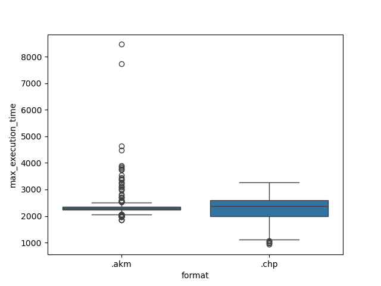

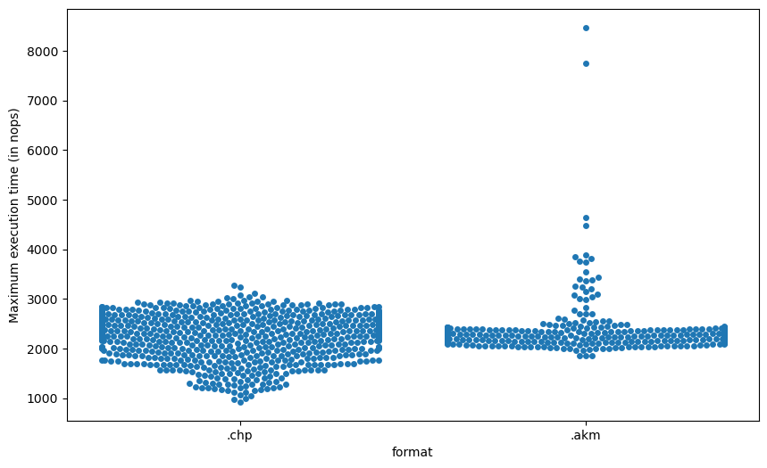

# Spider Charts by Player Format

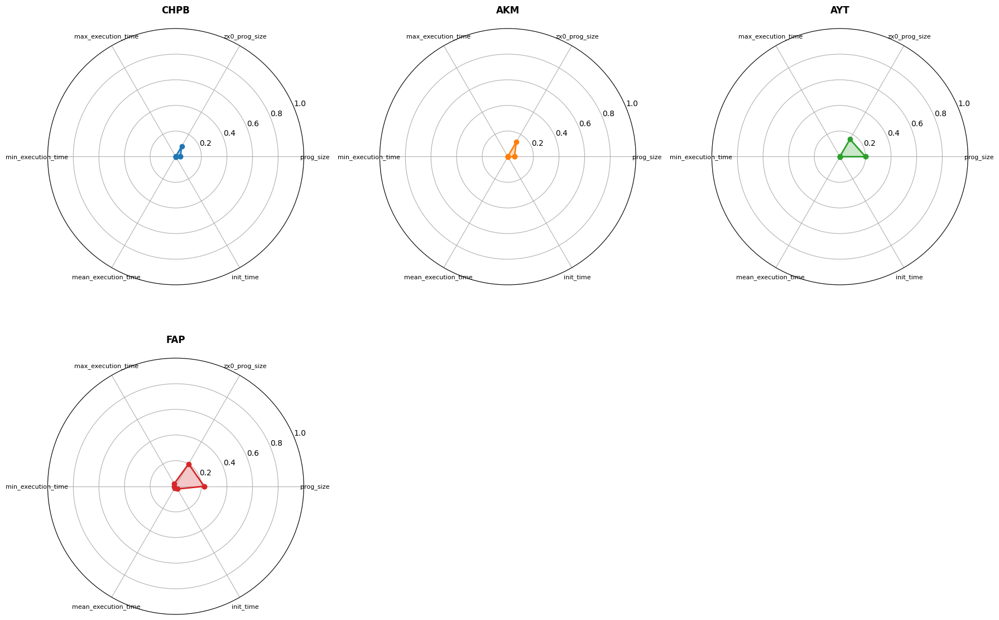

Note: In spider charts, values closer to the center (0.0) indicate better performance (lower size/time).

# Program Size vs Maximum Execution Time

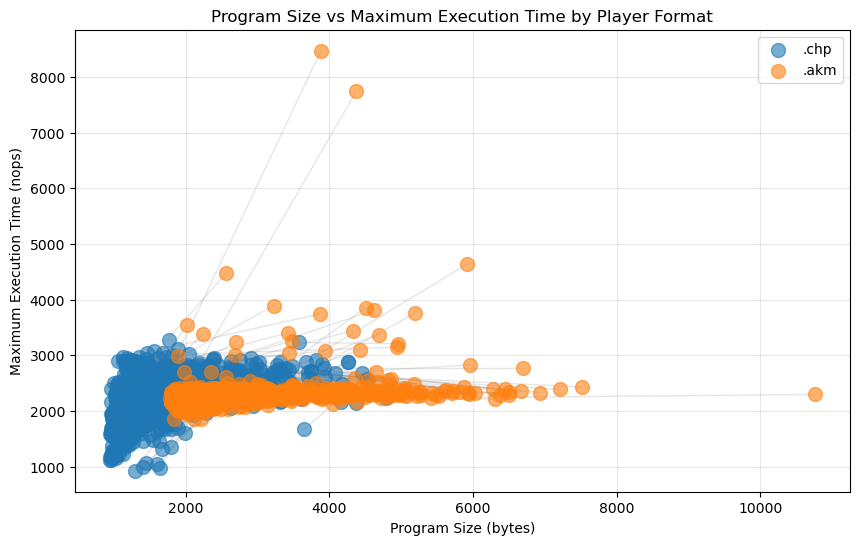

# Player Formats Comparison (Median Values)

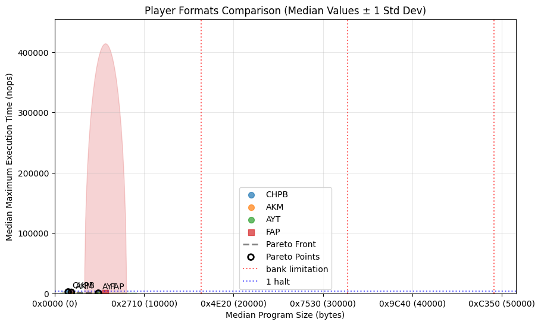

Note: Ellipses show ±1 standard deviation around median values. The dashed line represents the Pareto front (non-dominated players).
