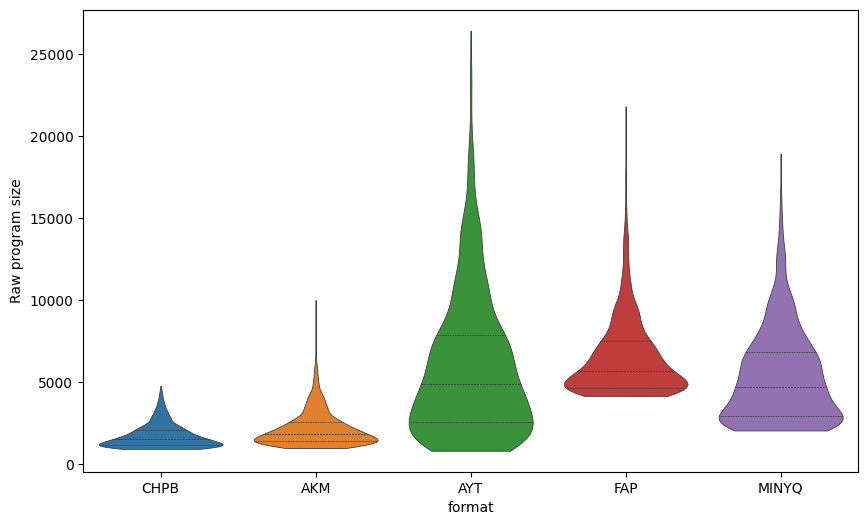
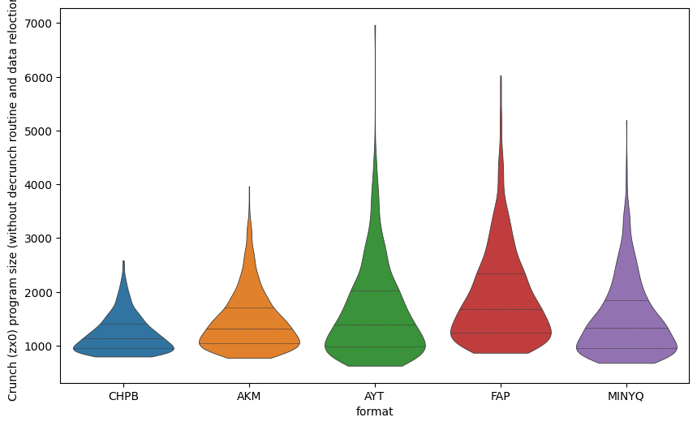
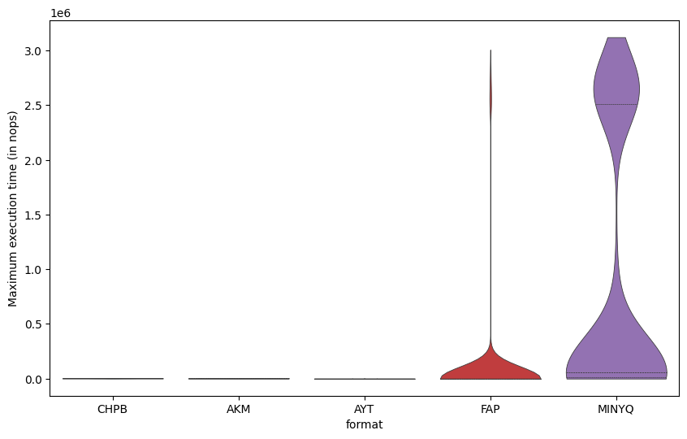

# Raw program size

|     | sources   |   AKM |   AYT |   CHPB |   FAP |
|----:|:----------|------:|------:|-------:|------:|
|   0 | ABADIA1   |  1742 |  4410 |   1919 |  5948 |
|   1 | ABADIA2   |  1600 |  1582 |   1428 |  4668 |
|   2 | ABADIA3   |  2126 |  4567 |   3361 |  5692 |
|   3 | ADDAMSF0  |  1602 |  5525 |   1672 |  5692 |
|   4 | ADDAMSF1  |  1626 |  5462 |   1724 |  5692 |
|   5 | ADDAMSF2  |  1654 |  4295 |   2005 |  5180 |
|   6 | ADDAMSF3  |  1042 |  1677 |   1032 |  4412 |
|   7 | AFTEROID  |  1633 |  4321 |   1975 |  5692 |
|   8 | AFTERWAR  |  3679 | 10924 |   3126 |  9276 |
|   9 | ALEHOP    |  2631 |  8847 |   1981 |  6972 |
|  10 | AMAUROTE  |  1421 |  1998 |   1154 |  4412 |
|  11 | AMAUROTF  |  1337 |  1724 |   1090 |  4412 |
|  12 | AMAUROTG  |  1064 |   870 |    947 |  4156 |
|  13 | AMAUROTH  |  2728 |  9357 |   2244 |  6972 |
|  14 | AMAUROTI  |  1026 |   887 |    947 |  4412 |
|  15 | AMAUROTJ  |  1481 |  1304 |    961 |  4412 |
|  16 | AMAUROTK  |  1220 |  1420 |   1036 |  4668 |
|  17 | AMAUROTL  |  1150 |   867 |   1008 |  4412 |
|  18 | AMC0      |  3542 |  8536 |   2800 |  7484 |
|  19 | AMC1      |  4845 | 14210 |   4772 |  9788 |
|  20 | AMC2      |  4961 | 13745 |   4505 |  9788 |
|  21 | AMC3      |  1284 |  1371 |   1108 |  4412 |
|  22 | AMC4      |  1148 |  1206 |   1062 |  4412 |
|  23 | ARCYESOD  |  1563 |  3581 |   1399 |  5180 |
|  24 | ARKA1C64  |  3876 |  9278 |   2141 |  8508 |
|  25 | ARKANO-M  |  1530 |  2325 |   1222 |  4668 |
|  26 | ARKANO-Z  |  1256 |  1991 |   1090 |  4668 |
|  27 | ARKANOID  |  1354 |  2295 |   1117 |  4668 |
|  28 | ARKANOIE  |  1248 |  1360 |    975 |  4412 |
|  29 | ARKANOIF  |  1224 |  1204 |    947 |  4412 |
|  30 | ARKANOIG  |  1315 |  1428 |   1019 |  4668 |
|  31 | ARKANOIH  |  1234 |  1370 |    958 |  4412 |
|  32 | ARKOID2A  |  1193 |  1674 |   1148 |  4412 |
|  33 | ARKOID2B  |  1156 |  1134 |   1024 |  4412 |
|  34 | ARKOID2C  |  1232 |  1947 |   1009 |  4668 |
|  35 | ARKOID2D  |  1158 |  1429 |   1071 |  4412 |
|  36 | ARKOID2E  |  1041 |   922 |   1014 |  4412 |
|  37 | ARKOS     |  1275 |  2257 |   1149 |  4668 |
|  38 | ARMYMOV1  |  1068 |  2445 |   1072 |  4668 |
|  39 | ARMYMOV2  |  1121 |  1878 |   1128 |  4412 |
|  40 | ASHTRAY   |  2672 | 13798 |   2958 | 11068 |
|  41 | ASPHALT   |  4063 |  7170 |   2389 |  6460 |
|  42 | ATEAM     |  1138 |  1559 |    996 |  4412 |
|  43 | ATOMINO3  |  2229 |  7527 |   1939 |  6460 |
|  44 | AUFMONTY  |  1313 |  4301 |   1286 |  5692 |
|  45 | AUFMONTZ  |  3869 | 21449 |   3300 | 13628 |
|  46 | AVENGER   |  2828 | 10425 |   1983 |  7740 |
|  47 | BACTRON   |  1923 |  5650 |   1750 |  5948 |
|  48 | BALLBRKR  |  1974 |  6318 |   1727 |  6716 |
|  49 | BATMAN10  |  1113 |  1588 |   1176 |  4412 |
|  50 | BATMAN11  |  1040 |   948 |   1017 |  4412 |
|  51 | BATMAN12  |  1020 |   983 |    973 |  4412 |
|  52 | BATMAN20  |  1505 |  1534 |   1095 |  4412 |
|  53 | BATMAN21  |  1804 |  6766 |   1596 |  6460 |
|  54 | BATMAN22  |  2694 | 13716 |   2940 | 10812 |
|  55 | BATMAN23  |  2323 |  6973 |   2199 |  6972 |
|  56 | BATMAN30  |  2309 |  7944 |   2355 |  9276 |
|  57 | BATMAN31  |  2708 |  7406 |   2002 |  7484 |
|  58 | BATMAN32  |  1864 |  4841 |   1608 |  5436 |
|  59 | BATMAN33  |  2426 |  5900 |   2134 |  5948 |
|  60 | BATMAN34  |  2317 |  6520 |   1898 |  6460 |
|  61 | BATMAN35  |  2798 | 10773 |   2433 |  7996 |
|  62 | BATMAN36  |  1290 |  1242 |   1056 |  4412 |
|  63 | BB128K-0  |  1061 |  1612 |   1044 |  4412 |
|  64 | BB128K-1  |  1636 |  5033 |   1446 |  5692 |
|  65 | BB128K-2  |  1024 |  1089 |    941 |  4412 |
|  66 | BB128K-3  |  1105 |  1285 |   1001 |  4412 |
|  67 | BEACHBUG  |  3093 | 10680 |   2170 | 10300 |
|  68 | BEVERLYH  |  3095 |  9890 |   2098 |  9276 |
|  69 | BEYNDIP1  |  2058 |  5784 |   1364 |  5948 |
|  70 | BEYNDIP2  |  6175 | 26433 |   4063 | 12604 |
|  71 | BIRDIE    |  1956 |  5575 |   1711 |  5692 |
|  72 | BLACKBRD  |  1614 |  6203 |   1495 |  6204 |
|  73 | BLKLMP64  |  5074 | 10882 |   2054 |  7228 |
|  74 | BLKLMP65  |  1278 |  2629 |   1079 |  4924 |
|  75 | BLKLMP66  |  1447 |  2839 |   1196 |  4924 |
|  76 | BLKLMPST  |  2328 |  5783 |   1990 |  6460 |
|  77 | BLKLMPSU  |  2821 |  8102 |   2373 |  7228 |
|  78 | BLKLMPSV  |  2092 |  1811 |   1092 |  4668 |
|  79 | BLKLMPZX  |  2172 |  4431 |   2168 |  5948 |
|  80 | BLKLMPZY  |  1198 |  1804 |   1043 |  4668 |
|  81 | BLOODBRS  |  3338 | 14338 |   2135 | 10044 |
|  82 | BMXSIM1   |  1537 |  3263 |   1297 |  4924 |
|  83 | BMXSIM2A  |  3109 |  5952 |   1543 |  6460 |
|  84 | BMXSIM2B  |  2117 |  4415 |   1505 |  5436 |
|  85 | BMXSIM2C  |  2944 |  4811 |   1436 |  5948 |
|  86 | BOBO0     |  2024 |  4203 |   1580 |  5948 |
|  87 | BOBO1     |  2858 |  5769 |   2946 |  5948 |
|  88 | BOBO2     |  3565 |  8055 |   3051 |  7484 |
|  89 | BOBO3     |  2870 |  6345 |   3316 |  7740 |
|  90 | BOBO4     |  2321 |  5457 |   1959 |  6204 |
|  91 | BOBO5     |  2369 |  7751 |   2012 |  6716 |
|  92 | BOBO6     |  1536 |  1881 |   1176 |  4668 |
|  93 | BOMBUZAL  |  3536 |  7631 |   1605 |  6716 |
|  94 | BOSCONIA  |  2679 |  8856 |   1921 |  6716 |
|  95 | BOSCONIB  |  1334 |  1807 |   1254 |  4412 |
|  96 | BOULDASH  |  1292 |  2476 |   1149 |  4668 |
|  97 | BOULDSHR  |  1168 |  2100 |   1056 |  4668 |
|  98 | BOUNDER   |  1313 |  2899 |   1198 |  4924 |
|  99 | BRAVSTAR  |  2534 |  8785 |   2320 | 10556 |
| 100 | BRNBLL-N  |  3520 |  9820 |   2108 |  9276 |
| 101 | BRONX     |  5198 | 13042 |   2291 |  9788 |
| 102 | BUBBLEMX  |  1326 |  3497 |   1236 |  5180 |
| 103 | BUBBLEST  |  1685 |  3991 |   1556 |  5436 |
| 104 | BUMPY     |  1637 |  4309 |   1400 |  5180 |
| 105 | BURNINR1  |  1972 |  9231 |   1660 |  7228 |
| 106 | BURNINR2  |  1667 |  5810 |   1419 |  7228 |
| 107 | BURNINR3  |  1528 |  5585 |   1490 |  6204 |
| 108 | BURNINR4  |  1561 |  4728 |   1259 |  6972 |
| 109 | BURNINR5  |  1146 |  1177 |    945 |  4412 |
| 110 | BURNRUB1  |  2578 |  9577 |   2372 |  7484 |
| 111 | BURNRUB2  |  1890 |  5721 |   1457 |  7996 |
| 112 | BURNRUB3  |  1760 |  5751 |   1622 |  6460 |
| 113 | BURNRUB4  |  1841 |  4715 |   1220 |  7484 |
| 114 | BURNRUB5  |  1140 |  1154 |    967 |  4412 |
| 115 | C64-180A  |  1603 |  4514 |   1471 |  6204 |
| 116 | C64-180B  |  2013 |  1514 |   1009 |  4412 |
| 117 | C64-180C  |  1405 |  2427 |   1192 |  4668 |
| 118 | CAMPEONE  |  1459 |  3243 |   1261 |  4668 |
| 119 | CATABALL  |  2602 |  8757 |   2765 |  8252 |
| 120 | CATABALM  |  1930 |  4853 |   2109 |  6972 |
| 121 | CAULDRN1  |  1234 |  2080 |   1051 |  4412 |
| 122 | CAULDRN2  |  2770 |  3365 |   1943 |  5180 |
| 123 | CAVEMANI  |  5190 | 15215 |   3880 | 21820 |
| 124 | CAVEMANJ  |  1893 |  4021 |   1587 |  6972 |
| 125 | CHAINRCT  |  3084 |  8900 |   2794 |  9020 |
| 126 | CHARDESI  |  2127 |  6215 |   1687 |  7228 |
| 127 | CHASEHQ1  |  2823 |  6179 |   2123 |  6204 |
| 128 | CHASEHQ2  |  1373 |  2100 |   1096 |  4668 |
| 129 | CHICAG30  |  1868 |  7807 |   1869 |  7228 |
| 130 | CHIMERA1  |  5922 | 13692 |   2739 | 12860 |
| 131 | CHIMERA2  |  1988 |  7326 |   1813 |  6972 |
| 132 | CHUBBYGR  |  2039 | 11538 |   2064 |  9788 |
| 133 | CHUBBYGS  |  1177 |  1577 |   1042 |  4412 |
| 134 | CMDTRACR  |  1424 |  5605 |   1480 |  5436 |
| 135 | COBRAC64  | 10001 | 13852 |   2775 | 10812 |
| 136 | COCOATM0  |  2109 |  6692 |   1873 |  8508 |
| 137 | COCOATM1  |  2247 |  9202 |   1787 |  8252 |
| 138 | COLISEUM  |  2426 |  5997 |   1385 |  5436 |
| 139 | COLT36    |  1755 |  4042 |   1341 |  5692 |
| 140 | COMBASC1  |  1721 |  3346 |   1242 |  4924 |
| 141 | COMBASC2  |  1921 |  4537 |   1466 |  5692 |
| 142 | COMBASC3  |  2554 |  3782 |   1436 |  5436 |
| 143 | COMBASC4  |  1344 |  2297 |   1276 |  4412 |
| 144 | COMBASC5  |  1865 |  2838 |   1486 |  4668 |
| 145 | COMICBKR  |  3374 |  9796 |   2396 |  9532 |
| 146 | COMICBKS  |  3494 | 11060 |   1972 |  9532 |
| 147 | COMICBKT  |  2714 |  4678 |   1394 |  5436 |
| 148 | COMICBKU  |  2623 |  5585 |   1459 |  6204 |
| 149 | COMMANDO  |  3395 | 17292 |   3416 | 14396 |
| 150 | COMMANDP  |  1348 |  3994 |   1184 |  5180 |
| 151 | COMMANDQ  |  1021 |  1425 |    987 |  4412 |
| 152 | COMMANDR  |  1463 |  5185 |   1486 |  5436 |
| 153 | COMMANDS  |  1171 |  2757 |   1131 |  4668 |
| 154 | COMMANDT  |  1002 |  1085 |    960 |  4156 |
| 155 | CORSARI1  |  2073 |  5579 |   1190 |  5948 |
| 156 | CORSARI2  |  1840 |  6979 |   1486 |  7740 |
| 157 | COSANOST  |  1810 |  6716 |   1296 |  6972 |
| 158 | COSTACP1  |  1450 |  3981 |   1773 |  5948 |
| 159 | COSTACP2  |  1329 |  2633 |   1619 |  4924 |
| 160 | CPC-1942  |  2296 |  9305 |   2688 |  8764 |
| 161 | CPC-1943  |  3131 |  6681 |   2456 |  6716 |
| 162 | CRAFTON1  |  1668 |  4085 |   1429 |  5180 |
| 163 | CRAFTON2  |  1587 |  4489 |   1204 |  5948 |
| 164 | CRAY_5    |  1465 |  5227 |   1267 |  5948 |
| 165 | CRAZYCM1  |  6764 | 18790 |   2595 | 16700 |
| 166 | CRAZYCM2  |  2233 |  6904 |   1951 |  6972 |
| 167 | CYBERBIG  |  4773 | 11405 |   2171 |  9532 |
| 168 | DALEYTOC  |  2217 |  8017 |   1824 |  6716 |
| 169 | DARKFUSN  |  2128 |  8250 |   1937 |  7228 |
| 170 | DAYMOTEN  |  3553 |  7701 |   1631 |  7996 |
| 171 | DDRAGON0  |  1514 |  1247 |    973 |  4412 |
| 172 | DDRAGON1  |  3944 | 11296 |   2744 | 11836 |
| 173 | DDRAGON2  |  1598 |  2000 |   1130 |  4668 |
| 174 | DEFCOM    |  2142 |  6746 |   1800 |  7228 |
| 175 | DEFLEKTR  |  2575 | 13044 |   2181 |  9276 |
| 176 | DELTA-IN  |  1953 |  3497 |   1837 |  5692 |
| 177 | DELTA-SL  |  2074 |  5744 |   1595 |  6204 |
| 178 | DELTA-ZK  |  2666 |  5358 |   1604 |  6716 |
| 179 | DESPERA0  |  1002 |   837 |    930 |  4156 |
| 180 | DESPERA1  |  3107 | 11583 |   2390 |  9532 |
| 181 | DESPERA2  |  1559 |  3837 |   1130 |  5180 |
| 182 | DESPERA3  |  2267 |  7815 |   1939 |  6972 |
| 183 | DESPOTIK  |  1392 |  3415 |   1294 |  5180 |
| 184 | DEVIANTS  |  1607 |  5206 |   1270 |  5692 |
| 185 | DIPDIP    |  1317 |  2552 |   1344 |  4668 |
| 186 | DIZZYDTR  |  1964 |  9831 |   1871 |  7996 |
| 187 | DIZZYPYF  |  2532 |  9653 |   1918 |  8508 |
| 188 | DOORDOOM  |  2181 |  5693 |   3134 |  5948 |
| 189 | DRAZEN64  |  1757 |  8343 |   1530 |  6972 |
| 190 | DRAZEN65  |  1643 |  6687 |   1369 |  6716 |
| 191 | DRDESTRU  |  2555 | 10621 |   2074 |  9020 |
| 192 | DRGNINJA  |  2270 | 11220 |   1910 | 10044 |
| 193 | DRLAIR10  |  1770 |  5165 |   1522 |  5436 |
| 194 | DRLAIR20  |  1920 |  5119 |   2080 |  5692 |
| 195 | DRLAIR21  |  2191 |  5680 |   1595 |  7996 |
| 196 | DRLAIR22  |  1682 |  4061 |   1742 |  5180 |
| 197 | DRLAIR23  |  1478 |  4559 |   1758 |  5692 |
| 198 | DRLAIR24  |  1794 |  6639 |   1908 |  6460 |
| 199 | DRLAIR25  |  1661 |  4169 |   1749 |  5692 |
| 200 | DRLAIR26  |  1677 |  5218 |   1814 |  5948 |
| 201 | DRLAIR27  |  1861 |  3571 |   1636 |  5436 |
| 202 | DRLAIR28  |  1783 |  6089 |   1930 |  6204 |
| 203 | DRLAIR29  |  1549 |  1837 |   1132 |  4668 |
| 204 | DROIDS    |  1662 |  3097 |   1678 |  4924 |
| 205 | DRUIDRMX  |  2257 |  2951 |   1305 |  5436 |
| 206 | DTHWISH3  |  3966 | 11348 |   2068 |  8508 |
| 207 | DUSTIN    |  1490 |  2564 |   1638 |  4668 |
| 208 | DYNADAN1  |  1477 |  3369 |   1384 |  5436 |
| 209 | DYNADUO1  |  4183 |  9660 |   2025 |  7228 |
| 210 | DYNADUO2  |  2120 |  3544 |   1294 |  5180 |
| 211 | DYNADUO3  |  4058 |  3574 |   1174 |  5180 |
| 212 | E-MOTION  |  1763 |  3783 |   1453 |  5436 |
| 213 | ELEKTRAG  |  4259 | 11279 |   2777 | 10300 |
| 214 | ELEVATOR  |  1869 |  3928 |   1372 |  5180 |
| 215 | ELIMNTR0  |  4302 | 14255 |   3883 | 11068 |
| 216 | ELIMNTR1  |  2058 |  7151 |   1989 |  6716 |
| 217 | ELIMNTR2  |  1736 |  4835 |   1433 |  5180 |
| 218 | ELIMNTR3  |  1135 |  1270 |   1022 |  4412 |
| 219 | EQUINOX   |  1625 |  5398 |   1759 |  6460 |
| 220 | ESPADA    |  1642 |  6366 |   1518 |  5948 |
| 221 | EXTRMNTR  |  1569 |  3752 |   1262 |  5436 |
| 222 | FERNANDZ  |  1899 |  5737 |   1506 |  5948 |
| 223 | FEUD1     |  1337 |  3361 |   1164 |  4668 |
| 224 | FEUD2     |  2204 |  4967 |   1544 |  5692 |
| 225 | FINDKEEP  |  2188 |  7575 |   1614 |  7484 |
| 226 | FINDKEEQ  |  1855 |  5389 |   1317 |  8252 |
| 227 | FIRELORD  |  2700 | 11763 |   2076 |  9532 |
| 228 | FIRELORE  |  1929 |  1613 |   1023 |  4668 |
| 229 | FLINTSTN  |  1922 |  5100 |   1371 |  5948 |
| 230 | FLINTSTO  |  2136 | 12378 |   1652 | 10044 |
| 231 | FLUFF1    |  1987 |  4429 |   1225 |  5436 |
| 232 | FLUFF2    |  2419 |  7340 |   1538 |  9276 |
| 233 | FMBASKT1  |  1066 |  2149 |   1028 |  4412 |
| 234 | FMBASKT2  |  1110 |  1767 |   1060 |  4412 |
| 235 | FOLLIN2B  |  2296 |  4627 |   1948 |  5948 |
| 236 | FOLLINOX  |  3589 |  8067 |   3244 |  6204 |
| 237 | FORMULA1  |  5692 | 15713 |   2743 | 11836 |
| 238 | FORMULE   |  2344 |  8067 |   2487 |  6716 |
| 239 | FOTYEAR1  |  4870 | 13820 |   2837 |  7484 |
| 240 | FOTYEAR2  |  2522 |  7937 |   1638 |  7228 |
| 241 | FOXBACK1  |  2349 |  7284 |   2363 |  6972 |
| 242 | FOXBACK2  |  3284 | 13213 |   3636 | 11324 |
| 243 | FOXBACK3  |  1208 |  1370 |    989 |  4412 |
| 244 | FOXBACK4  |  1125 |  1174 |    995 |  4412 |
| 245 | FREDDY_H  |  1446 |  3424 |   1643 |  4668 |
| 246 | FROGALOT  |  2554 |  7587 |   1607 |  8252 |
| 247 | FROSTY    |  1659 |  3851 |   1880 |  4924 |
| 248 | FUMIGATR  |  1580 |  3335 |   1331 |  4924 |
| 249 | FUNKYMUS  |  1306 |  2589 |   1270 |  4668 |
| 250 | FUNKYMUT  |  1135 |  1473 |   1055 |  4412 |
| 251 | FUTUREKN  |  2109 | 11510 |   1521 |  9020 |
| 252 | F_O_F_T_  |  3080 | 10223 |   2121 |  9276 |
| 253 | GALAX_3D  |  3907 | 14173 |   3157 | 10556 |
| 254 | GALIOUS1  |  2669 |  7849 |   2477 |  7228 |
| 255 | GALIOUS2  |  2155 |  4704 |   2233 |  5436 |
| 256 | GAUNTLET  |  1162 |  1266 |    990 |  4412 |
| 257 | GBASKET   |  1085 |  1427 |   1001 |  4412 |
| 258 | GEOFFCS1  |  1630 |  3002 |   1258 |  4924 |
| 259 | GEOFFCS2  |  1536 |  2233 |   1233 |  4668 |
| 260 | GEOFFCS3  |  2415 |  2252 |   1075 |  4668 |
| 261 | GEOFFCS4  |  1510 |  2242 |   1174 |  4668 |
| 262 | GEOFFCS5  |  1528 |  2612 |   1211 |  4668 |
| 263 | GEOFFCS6  |  1564 |  2253 |   1218 |  4668 |
| 264 | GHOSTCPC  |  3415 |  6934 |   1783 |  6972 |
| 265 | GHOSTMSX  |  2069 |  4220 |   1264 |  5436 |
| 266 | GILBERTE  |  2470 |  5969 |   1617 |  6972 |
| 267 | GLIDERDR  |  2861 |  7014 |   2083 |  8252 |
| 268 | GLIDERDS  |  1390 |  2054 |   1332 |  4924 |
| 269 | GNG0      |  3776 |  7511 |   1943 |  7996 |
| 270 | GNG1      |  4524 |  8185 |   2159 |  7484 |
| 271 | GNG2      |  3410 | 12366 |   2719 |  7484 |
| 272 | GONZALZ1  |  1492 |  3205 |   1611 |  4924 |
| 273 | GONZALZ2  |  1780 |  3449 |   1734 |  5180 |
| 274 | GONZALZ3  |  1357 |  2395 |   1523 |  4668 |
| 275 | GONZALZ4  |  1559 |  2850 |   1778 |  4924 |
| 276 | GOODY     |  2541 |  6813 |   1841 |  6204 |
| 277 | GPSIM64A  |  1911 |  7234 |   1451 |  5948 |
| 278 | GPSIMCPC  |  1796 |  5077 |   1866 |  5180 |
| 279 | GPSIMCPD  |  2062 |  7652 |   2167 |  7740 |
| 280 | GPSIMCPE  |  1300 |  1687 |   1045 |  4412 |
| 281 | GPX750CC  |  2749 |  8745 |   2298 |  6716 |
| 282 | GRANGEHL  |  1425 |  5737 |   1206 |  6204 |
| 283 | GREMLIND  |  2425 |  7802 |   2044 |  7228 |
| 284 | GRYZOR1   |  1747 |  4232 |   1726 |  5180 |
| 285 | GRYZOR2   |  1675 |  3799 |   1359 |  5180 |
| 286 | GUILTELL  |  1603 |  3161 |   1170 |  4924 |
| 287 | GUNFRITE  |  2243 |  6693 |   1734 |  6972 |
| 288 | GUNFRITF  |  1251 |  1197 |    964 |  4412 |
| 289 | GUNFRITG  |  1265 |  1204 |    971 |  4412 |
| 290 | GUNFRITH  |  1357 |  1144 |    980 |  4412 |
| 291 | GUNFRITI  |  1337 |  1126 |    988 |  4412 |
| 292 | GUNFRITJ  |  1346 |  1111 |   1015 |  4412 |
| 293 | GUNFRITK  |  1311 |  1073 |   1000 |  4412 |
| 294 | GUNFRITL  |  1246 |  1152 |    952 |  4412 |
| 295 | GUNFRITM  |  1151 |  1322 |    961 |  4412 |
| 296 | HAMMRBY1  |  2162 |  4997 |   1934 |  5436 |
| 297 | HAMMRBY2  |  1755 |  3646 |   1486 |  5180 |
| 298 | HAMMRBY3  |  1502 |  2967 |   1369 |  4924 |
| 299 | HAMMRBY4  |  2069 |  5219 |   1567 |  5436 |
| 300 | HATE-AST  |  2455 |  5745 |   1357 |  6972 |
| 301 | HATTRICK  |  2019 |  5204 |   1441 |  5436 |
| 302 | HEADHEEL  |  1287 |  2565 |   1299 |  4668 |
| 303 | HELTERSK  |  1630 |  3776 |   1410 |  5436 |
| 304 | HEROBOTX  |  2828 | 12266 |   2662 |  9788 |
| 305 | HEXAVIRU  |  1970 |  2954 |   1105 |  4668 |
| 306 | HEXAVIRV  |  4216 |  7602 |   2499 |  6716 |
| 307 | HISTEEL1  |  2154 |  5018 |   1396 |  6460 |
| 308 | HISTEEL2  |  1539 |  1617 |   1090 |  4412 |
| 309 | HISTEEL3  |  1552 |  1191 |    967 |  4412 |
| 310 | HOPRCOPR  |  2254 |  7667 |   1659 |  6972 |
| 311 | HOTSHOT   |  1892 |  4374 |   1589 |  5436 |
| 312 | HUMANRC4  |  2606 |  8526 |   1889 |  9532 |
| 313 | HUMPHREY  |  1736 |  5914 |   1820 |  5948 |
| 314 | HUNCHADV  |  2513 |  6055 |   2118 |  5948 |
| 315 | HUNCHMUZ  |  2005 |  7609 |   1904 |  7228 |
| 316 | HUNDRA    |  2699 |  7530 |   3040 |  7228 |
| 317 | HYDROFOL  |  2563 | 11639 |   2194 |  8508 |
| 318 | HYPERBWL  |  1377 |  3326 |   1267 |  4924 |
| 319 | H_A_T_E_  |  3569 |  9870 |   2096 |  7484 |
| 320 | I3TENIS1  |  3307 | 10043 |   2560 |  7740 |
| 321 | I3TENIS2  |  3456 |  9904 |   2211 |  7228 |
| 322 | IBALL2ST  |  4953 | 14205 |   3045 |  9276 |
| 323 | IKARIWAR  |  2715 |  9105 |   3586 |  9276 |
| 324 | IKPLUS    |  4068 | 23949 |   3924 | 17468 |
| 325 | IMPOSSML  |  3457 | 10649 |   2013 |  7228 |
| 326 | INDIANA3  |  1717 |  4904 |   1526 |  6460 |
| 327 | INSIDOUT  |  4286 | 12526 |   3065 |  9276 |
| 328 | JACKNIP2  |  2463 |  7199 |   2152 |  6460 |
| 329 | JSW1      |  2777 | 14173 |   2197 |  7996 |
| 330 | JSW2      |  1225 |  2325 |   1161 |  4668 |
| 331 | JSW64-RH  |  3283 | 17644 |   2820 | 13628 |
| 332 | JUPITERP  |  2782 |  8523 |   2364 |  6716 |
| 333 | KENDOWAR  |  2733 |  7653 |   2259 |  7996 |
| 334 | KENDOWAS  |  4198 |  8473 |   1943 |  7484 |
| 335 | KETTLE    |  3800 | 14778 |   3256 | 11068 |
| 336 | KILLRING  |  5172 | 13770 |   2893 |  8764 |
| 337 | KNIGHTYM  |  4520 | 14437 |   2296 |  9532 |
| 338 | KNIGHTYN  |  1859 |  8348 |   1780 |  7484 |
| 339 | KONGSB64  |  3165 |  6614 |   2321 |  7228 |
| 340 | KONGSTCK  |  1898 |  6251 |   1753 |  6204 |
| 341 | KRAKOUT   |  2461 | 13082 |   2399 |  7996 |
| 342 | KRAKOUU   |  1147 |  1426 |   1080 |  4412 |
| 343 | LASTMISN  |  2094 |  7723 |   1726 |  7228 |
| 344 | LAZRTAG1  |  4315 | 11036 |   2054 |  9532 |
| 345 | LAZRTAG2  |  1610 |  6041 |   1375 |  7484 |
| 346 | LEDSTORM  |  4736 | 13899 |   3170 |  9276 |
| 347 | LEDSTORN  |  2100 |  4422 |   1538 |  5948 |
| 348 | LEDSTORO  |  2428 |  6695 |   1627 |  8508 |
| 349 | LEVIATHN  |  3187 |  7148 |   1677 |  6972 |
| 350 | LINEFIR1  |  2223 |  6595 |   1870 |  6972 |
| 351 | LINEFIR2  |  1731 |  3815 |   1382 |  5692 |
| 352 | LINEKER1  |  2976 |  9588 |   1757 |  7484 |
| 353 | LINEKER2  |  2323 |  7339 |   1674 |  8252 |
| 354 | LITECORE  |  4463 | 15196 |   3367 | 12348 |
| 355 | LIVISTN0  |  1693 |  5346 |   1476 |  5436 |
| 356 | LIVISTN1  |  1629 |  4523 |   1792 |  5180 |
| 357 | LIVISTN2  |  1263 |  2507 |   1164 |  4668 |
| 358 | LOADSONG  |  1568 |  3443 |   1348 |  5180 |
| 359 | LOPEARS   |  1615 |  8168 |   1521 |  7740 |
| 360 | LORNA     |  1925 |  8269 |   2040 |  7484 |
| 361 | LWTENNIS  |  3305 | 14568 |   2493 | 12604 |
| 362 | MACH3     |  1818 |  4516 |   1491 |  5436 |
| 363 | MADBALLS  |  1998 |  6095 |   1719 |  6204 |
| 364 | MADDOG    |  1187 |  2220 |   1146 |  4412 |
| 365 | MADMIXG0  |  2125 |  7776 |   1797 |  6716 |
| 366 | MADMIXG1  |  2578 | 15361 |   1988 | 13628 |
| 367 | MADMIXG2  |  2185 | 10104 |   1783 |  9020 |
| 368 | MAGICJS1  |  2478 |  6353 |   2381 |  6460 |
| 369 | MAGICJS2  |  2648 |  7785 |   2236 |  6460 |
| 370 | MANICMN1  |  1237 |  2579 |   1107 |  4924 |
| 371 | MANICMN2  |  1098 |   988 |   1277 |  4156 |
| 372 | MARACAIB  |  1985 |  5833 |   1516 |  6204 |
| 373 | MASK1     |  3144 |  6708 |   1668 |  6460 |
| 374 | MASK2     |  2656 |  6639 |   1616 |  6716 |
| 375 | MASK3     |  3410 | 14242 |   2303 |  9532 |
| 376 | MASK4     |  1151 |  1279 |    952 |  4668 |
| 377 | MASK5     |  1576 |  2198 |   1177 |  4668 |
| 378 | MASTUNIV  |  5554 | 19901 |   3586 | 13628 |
| 379 | MATAHARI  |  1772 |  3935 |   1686 |  5948 |
| 380 | MATCHDY2  |  1555 |  2443 |   1291 |  4924 |
| 381 | MAZEMANI  |  3067 |  9129 |   3792 |  7740 |
| 382 | MAZEMANJ  |  1307 |  3293 |   1129 |  4924 |
| 383 | MAZEMANK  |  1075 |  1136 |    965 |  4412 |
| 384 | MAZEMANL  |  1316 |  1205 |   1082 |  4412 |
| 385 | MECHANIC  |  5527 | 11423 |   3247 | 13116 |
| 386 | MECHANID  |  3782 |  3757 |   1638 |  6204 |
| 387 | MECHANIE  |  1525 |  1607 |   1115 |  4668 |
| 388 | MEGANOVA  |  1513 |  4205 |   1477 |  5948 |
| 389 | MEGANOVB  |  1458 |  4246 |   1491 |  5948 |
| 390 | MEGAPHNW  |  2198 |  7147 |   2145 |  6716 |
| 391 | MEGAPHNX  |  2596 |  7131 |   2457 |  6716 |
| 392 | MEGAPHNY  |  2808 |  7059 |   2960 |  6460 |
| 393 | MEGAPHNZ  |  2541 |  7180 |   2457 |  6716 |
| 394 | MEGAPOCL  |  3949 | 13818 |   2932 | 11580 |
| 395 | MELTDOWN  |  3613 | 11693 |   2305 |  7740 |
| 396 | MENACE-1  |  1557 |  5842 |   1376 |  6204 |
| 397 | MENACE-2  |  1602 |  4259 |   1299 |  5436 |
| 398 | MENACE-3  |  2724 | 10955 |   1875 |  7740 |
| 399 | MERMAID1  |  1359 |  3233 |   1197 |  5436 |
| 400 | MERMAID2  |  1073 |  1061 |   1003 |  4412 |
| 401 | MERMAID3  |  1301 |  3231 |   1194 |  5180 |
| 402 | MERMAID4  |  1426 |  3387 |   1218 |  5692 |
| 403 | MERMAID5  |  1056 |  1305 |    940 |  4412 |
| 404 | METROCRS  |  1800 |  5996 |   1572 |  6972 |
| 405 | METROCRT  |  1381 |  2156 |   1092 |  4924 |
| 406 | METROCRU  |  1210 |  1168 |    935 |  4412 |
| 407 | METROCRV  |  1225 |  1294 |    957 |  4412 |
| 408 | METROCRW  |  1394 |  2442 |   1123 |  4924 |
| 409 | METROPLS  |  2131 |  7320 |   1515 |  6972 |
| 410 | MICROMUS  |  2276 |  8251 |   2130 |  7484 |
| 411 | MONACOGO  |  2944 |  8133 |   2739 |  6204 |
| 412 | MONACOGP  |  4206 | 16355 |   3567 | 12092 |
| 413 | MONACOGQ  |  1671 |  1247 |    992 |  4412 |
| 414 | MONACOGR  |  1731 |  1408 |   1464 |  4412 |
| 415 | MONACOGS  |  2347 |  7255 |   2148 |  6460 |
| 416 | MONTYRUN  |  3266 | 14524 |   2769 |  9020 |
| 417 | MONTYRUO  |  1235 |  1871 |   1097 |  4668 |
| 418 | MONTYRUP  |  1555 |  4445 |   1108 |  5436 |
| 419 | MOONTORC  |  3289 | 10134 |   2724 |  9020 |
| 420 | MORYFIL2  |  3668 | 10057 |   2688 |  7996 |
| 421 | MOT1      |  2049 |  7187 |   1584 |  6716 |
| 422 | MOT2      |  1549 |  4198 |   1174 |  4924 |
| 423 | MOT3      |  3380 |  4257 |   1241 |  5180 |
| 424 | MOTOS1    |  1423 |  2729 |   1257 |  4924 |
| 425 | MOTOS2    |  1902 |  2772 |   1260 |  4924 |
| 426 | MOTOS3    |  1509 |  3440 |   1205 |  5180 |
| 427 | MOUNTMIK  |  2280 | 12896 |   2536 |  8252 |
| 428 | MPHOENIX  |  2441 |  6891 |   2112 |  6460 |
| 429 | MRCRACKS  |  1380 |  2163 |   1158 |  4668 |
| 430 | MRCRACKT  |  1447 |  2791 |   1331 |  5180 |
| 431 | MRCRACKU  |  1055 |   920 |    951 |  4156 |
| 432 | MRCRACKV  |  1173 |  2012 |   1084 |  4924 |
| 433 | MRCRACKW  |  1070 |   830 |    962 |  4412 |
| 434 | MRCRACKX  |  1135 |  1314 |    995 |  4412 |
| 435 | MRCRACKY  |  1528 |  2589 |   1256 |  4924 |
| 436 | MRCRACKZ  |  1542 |  3454 |   1444 |  5180 |
| 437 | MRHELI    |  2689 |  6025 |   1414 |  6716 |
| 438 | MRWINO    |  2510 |  5488 |   1488 |  5948 |
| 439 | MUNSTERS  |  2656 |  7792 |   1890 |  9020 |
| 440 | MUTANZO1  |  1468 |  2312 |   1223 |  4924 |
| 441 | MUTANZO2  |  1267 |  2639 |   1127 |  5180 |
| 442 | MYHERO_1  |  1580 |  3676 |   1364 |  5436 |
| 443 | MYHERO_2  |  1459 |  3853 |   1378 |  5692 |
| 444 | MYHERO_3  |  1743 |  5936 |   1634 |  6460 |
| 445 | MYHERO_4  |  1186 |  1951 |   1085 |  4668 |
| 446 | MYHERO_5  |  1186 |  2073 |   1201 |  4668 |
| 447 | MYSTICAL  |  5188 | 18336 |   4438 | 14140 |
| 448 | MYTHOS    |  1535 |  3196 |   1633 |  4924 |
| 449 | M_U_L_E_  |  1691 |  6760 |   1355 |  5948 |
| 450 | M_U_L_F_  |  1289 |  2963 |   1082 |  4924 |
| 451 | M_U_L_G_  |  1156 |  1427 |    972 |  4412 |
| 452 | NAVYMOVS  |  1446 |  4197 |   1430 |  5436 |
| 453 | NAVYSLS1  |  5622 | 15951 |   3294 |  9532 |
| 454 | NAVYSLS2  |  2264 |  3691 |   1210 |  4924 |
| 455 | NAVYSLS3  |  1944 |  2205 |   1245 |  4924 |
| 456 | NAVYSLS4  |  2528 |  3309 |   1383 |  5180 |
| 457 | NAVYSLS5  |  1559 |  1413 |   1025 |  4412 |
| 458 | NAVYSLS6  |  2399 |  1693 |   1094 |  4668 |
| 459 | NAVYSLS7  |  1647 |  2250 |   1192 |  4668 |
| 460 | NEBULUS   |  6455 | 14594 |   3206 |  9788 |
| 461 | NEMESTWL  |  3531 | 16609 |   3691 | 11068 |
| 462 | NEVEREND  |  3132 | 11026 |   2522 |  9020 |
| 463 | NEVERS-S  |  1430 |  3879 |   1387 |  5180 |
| 464 | NINELIVE  |  2756 | 10907 |   4247 | 10044 |
| 465 | NINELIVS  |  2756 | 10909 |   4247 | 10044 |
| 466 | NINJSCTR  |  4659 | 19813 |   3669 | 17980 |
| 467 | NITESHFT  |  3061 |  8562 |   2306 |  8508 |
| 468 | NONAMED   |  1303 |  2691 |   1155 |  5180 |
| 469 | NORTHST1  |  2070 |  4659 |   1452 |  5180 |
| 470 | NORTHST2  |  1532 |  2553 |   1097 |  4924 |
| 471 | OCTOPLEX  |  4081 | 10532 |   2835 |  9276 |
| 472 | OCTOPLEY  |  3307 | 10586 |   2837 |  9276 |
| 473 | OCTOPLEZ  |  1190 |  1150 |   1097 |  4412 |
| 474 | OH_MUMMY  |  1039 |  1375 |    965 |  4412 |
| 475 | ONECOLN1  |  2754 |  8020 |   2312 |  6972 |
| 476 | ONEMANDR  |  1506 |  4580 |   1484 |  5180 |
| 477 | ONEMANDS  |  3605 | 18403 |   3293 | 15420 |
| 478 | OPGUNSHP  |  2609 | 10454 |   1882 |  9276 |
| 479 | OPGUNSHQ  |  1865 |  6329 |   1439 |  5692 |
| 480 | OPTBOLT0  |  1655 |  3384 |   1256 |  4924 |
| 481 | OPTBOLT1  |  1590 |  1372 |    983 |  4412 |
| 482 | OPTBOLT2  |  1629 |  2135 |   1013 |  4668 |
| 483 | OPWOLF0   |  1837 |  2237 |   1200 |  4668 |
| 484 | OPWOLF1   |  1382 |  1517 |   1547 |  4412 |
| 485 | OPWOLF2   |  1257 |  1193 |   1035 |  4412 |
| 486 | OPWOLF3   |  1535 |  1866 |   1258 |  4668 |
| 487 | OUTWORLD  |  4427 | 15682 |   3689 | 14140 |
| 488 | PACLAND0  |  1706 |  1195 |    950 |  4412 |
| 489 | PACLAND1  |  1877 |  3071 |   1473 |  5180 |
| 490 | PACLAND2  |  1393 |  2625 |   1190 |  4924 |
| 491 | PACLAND3  |  1918 |  3874 |   1458 |  5180 |
| 492 | PACLAND4  |  1256 |  1309 |    953 |  4412 |
| 493 | PACLAND5  |  1150 |  1313 |   1020 |  4412 |
| 494 | PACLAND6  |  2145 |  3904 |   1140 |  5180 |
| 495 | PACMANI0  |  1122 |  1343 |   1001 |  4412 |
| 496 | PACMANI1  |  2588 |  8994 |   2493 |  7996 |
| 497 | PACMANI2  |  2255 |  6872 |   1925 |  6204 |
| 498 | PACMANI3  |  1662 |  4532 |   1403 |  5180 |
| 499 | PERICODG  |  1825 |  7795 |   1549 |  7484 |
| 500 | PHANTIS1  |  1380 |  3673 |   1383 |  4924 |
| 501 | PHANTIS2  |  1462 |  4385 |   1490 |  5180 |
| 502 | PHNTMCLB  |  1500 |  2697 |   1295 |  4924 |
| 503 | PHOBOS-N  |  3531 | 10091 |   2058 |  8764 |
| 504 | PINKPANT  |  1637 |  5648 |   1231 |  5948 |
| 505 | PINKPNTH  |  2568 |  4235 |   1185 |  5436 |
| 506 | PIPPOLS0  |  1139 |  1575 |   1141 |  4412 |
| 507 | PIPPOLS1  |  1437 |  4091 |   1400 |  5692 |
| 508 | PIPPOLS2  |  1176 |  1717 |   1167 |  4412 |
| 509 | PIPPOLS3  |   983 |   816 |    938 |  4156 |
| 510 | PIPPOLS4  |  1175 |  1835 |   1152 |  4412 |
| 511 | PIPPOLS5  |  1080 |  1250 |   1124 |  4412 |
| 512 | PLATOON0  |  2659 |  7288 |   1598 |  8252 |
| 513 | PLATOON1  |  2200 | 10694 |   1824 |  7484 |
| 514 | PLATOON2  |  2047 |  7366 |   1571 |  8252 |
| 515 | PLATOON3  |  1587 |  6533 |   1615 |  5692 |
| 516 | PLATOON4  |  1405 |  3466 |   1228 |  5180 |
| 517 | PODEROSC  |  1207 |  2002 |   1202 |  4412 |
| 518 | POGOLYMP  |  4002 |  9986 |   2133 | 11580 |
| 519 | POOGABOO  |  1428 |  3484 |   1202 |  5436 |
| 520 | POWERPLY  |  3240 |  7608 |   4143 |  6204 |
| 521 | POWERPLZ  |  1284 |  3540 |   1085 |  4924 |
| 522 | PREHIST0  |  1900 |  5240 |   1870 |  5436 |
| 523 | PREHIST1  |  1693 |  4894 |   1812 |  5436 |
| 524 | PREHIST2  |  2132 |  7231 |   2265 |  6972 |
| 525 | PREHIST3  |  3278 | 12544 |   3004 |  8508 |
| 526 | PROHIBIT  |  4440 |  9704 |   3439 |  9532 |
| 527 | PROHIBIU  |  2920 |  9602 |   3193 |  7996 |
| 528 | PSYPIGSU  |  1397 |  2819 |   1252 |  4924 |
| 529 | PSYPIGSV  |  1253 |  1779 |   1032 |  4412 |
| 530 | PSYPIGSW  |  1261 |  1486 |   1003 |  4412 |
| 531 | PSYPIGSX  |  1315 |  1621 |   1106 |  4412 |
| 532 | PULSOIDS  |  3934 | 14433 |   2815 | 10812 |
| 533 | PULSOIDZ  |  2315 |  7422 |   2397 |  6716 |
| 534 | PUZZNIC0  |  3872 | 10660 |   2923 |  8508 |
| 535 | PUZZNIC1  |  3780 | 10620 |   2917 |  8508 |
| 536 | PUZZNIC2  |  2029 |  2546 |   1445 |  4924 |
| 537 | PYJAMA    |  1254 |  2651 |   1097 |  4668 |
| 538 | QUARTET4  |  1233 |  2915 |   1165 |  5180 |
| 539 | QUARTET5  |  1226 |  4195 |   1072 |  5180 |
| 540 | QUARTET6  |  2732 |  4032 |   1377 |  5180 |
| 541 | RACETIME  |  4064 |  8772 |   3166 |  7484 |
| 542 | RAMBO30   |  2097 |  8538 |   1516 |  7484 |
| 543 | RAMBO31   |  1266 |  1268 |    999 |  4412 |
| 544 | RAMBO32   |  1316 |  1261 |   1055 |  4412 |
| 545 | RAMPAGE   |  1330 |  3793 |   1236 |  4924 |
| 546 | RAMPAGF   |  3121 | 10196 |   1872 |  7740 |
| 547 | RAMPAGG   |  1660 |  2195 |   1150 |  4924 |
| 548 | RAMPARTS  |  4443 | 17447 |   3330 | 13628 |
| 549 | RAMPARTT  |  2039 |  4847 |   1281 |  6716 |
| 550 | RAMPARTU  |  1439 |  2402 |   1061 |  4668 |
| 551 | RAMPARTV  |  1214 |  1989 |   1041 |  4668 |
| 552 | RASPUTIH  |  3127 | 13923 |   4153 | 11580 |
| 553 | RASPUTIN  |  1832 |  3634 |   2021 |  4924 |
| 554 | RASTRSCN  |  3199 | 10512 |   2674 |  8252 |
| 555 | RENEGA10  |  1180 |  1072 |    966 |  4412 |
| 556 | RENEGA11  |  1401 |  3059 |   1294 |  4924 |
| 557 | RENEGA12  |  1406 |  3381 |   1339 |  4924 |
| 558 | RENEGA13  |  1361 |  3487 |   1361 |  5180 |
| 559 | RENEGA14  |  1359 |  3163 |   1224 |  4924 |
| 560 | RENEGA15  |  1153 |  1333 |   1038 |  4412 |
| 561 | RENEGA16  |  1171 |  1397 |   1049 |  4412 |
| 562 | RENEGA17  |  1116 |  1275 |   1009 |  4412 |
| 563 | RENEGA18  |  1108 |  1301 |    985 |  4412 |
| 564 | RENEGA19  |  1164 |  1675 |   1028 |  4412 |
| 565 | RENEGA1A  |  1361 |  3289 |   1168 |  4924 |
| 566 | RENEGA30  |  1502 |  1634 |   1137 |  4412 |
| 567 | RENEGA31  |  1527 |  5941 |   1221 |  5692 |
| 568 | RENEGA32  |  2408 |  8084 |   1851 |  8508 |
| 569 | RENEGA33  |  2297 |  7513 |   1749 |  7228 |
| 570 | RENEGA34  |  2129 |  7566 |   1990 |  7484 |
| 571 | RENEGA35  |  1167 |  1592 |   1058 |  4668 |
| 572 | RENEGA36  |  1082 |  1119 |    968 |  4412 |
| 573 | RENEGA37  |  1278 |  1301 |   1044 |  4412 |
| 574 | RENEGA38  |  1586 |  2157 |   1215 |  4668 |
| 575 | RESCATLA  |  2468 |  6218 |   2290 |  5948 |
| 576 | RESCATLB  |  4277 |  5826 |   3109 |  5948 |
| 577 | RICKDG1A  |  1676 |  5329 |   1451 |  5436 |
| 578 | RICKDG1B  |  1280 |  2841 |   1161 |  4924 |
| 579 | RICKDG1C  |  1190 |  2201 |   1001 |  4668 |
| 580 | RICKDG1D  |  1150 |  1428 |    991 |  4412 |
| 581 | RICKDG1E  |  1163 |  1939 |   1017 |  4668 |
| 582 | RICKDG1F  |  1128 |  1797 |    995 |  4412 |
| 583 | RICKDG1G  |  1277 |  1261 |    934 |  4412 |
| 584 | RICKDG2A  |  1531 |  5291 |   1269 |  5948 |
| 585 | RICKDG2B  |  1476 |  2564 |   1028 |  4668 |
| 586 | RICKDG2C  |  1366 |  2692 |   1038 |  4668 |
| 587 | RICKDG2D  |  1448 |  2025 |   1033 |  4668 |
| 588 | RICKDG2E  |  1082 |  1781 |    995 |  4412 |
| 589 | RICKDG2F  |  1493 |  1934 |   1023 |  4412 |
| 590 | RICKDG2G  |  1653 |  3953 |   1221 |  5436 |
| 591 | RICKDG2H  |  1239 |  1388 |    992 |  4412 |
| 592 | RLSTUNTX  |  3138 | 11967 |   2398 |  7996 |
| 593 | ROADBLST  |  2006 |  4879 |   1710 |  5436 |
| 594 | ROBIN     |  1448 |  3564 |   1219 |  4924 |
| 595 | ROBOCOP0  |  2839 | 10048 |   2004 | 10812 |
| 596 | ROBOCOP1  |  2123 |  7043 |   1585 |  7228 |
| 597 | ROBOCOP2  |  1386 |  3451 |   1179 |  4924 |
| 598 | ROBOCOP3  |  1511 |  1226 |    997 |  4412 |
| 599 | ROBOCOP4  |  1941 |  3507 |   1624 |  5180 |
| 600 | ROBOTCP0  |  1901 |  5477 |   1978 |  5692 |
| 601 | ROBOTCP1  |  1168 |  1095 |    982 |  4412 |
| 602 | ROBOTCP2  |  1184 |  1149 |   1040 |  4412 |
| 603 | ROBOTCP3  |  1210 |  1769 |   1127 |  4412 |
| 604 | ROCKNRLR  |  1587 |  7683 |   1342 |  6972 |
| 605 | ROINSPAC  |  1467 |  3625 |   1877 |  4924 |
| 606 | ROINTIME  |  1223 |  3571 |   1125 |  4924 |
| 607 | ROLANDGS  |  1050 |  1731 |    953 |  4412 |
| 608 | ROLLRON1  |  2409 |  9347 |   2528 |  7484 |
| 609 | ROLLRON2  |  2181 | 10351 |   1747 |  8252 |
| 610 | ROLLRON3  |  2369 |  6625 |   1351 |  6460 |
| 611 | ROLLRON4  |  1753 |  7889 |   1469 |  6460 |
| 612 | RTS-1998  |  3258 | 13252 |   3730 | 11324 |
| 613 | RTS-1999  |  2976 | 13226 |   3726 | 11068 |
| 614 | RUNGAUNT  |  1535 |  3551 |   1435 |  5692 |
| 615 | RYGAR     |  1456 |  3284 |   1330 |  4924 |
| 616 | RYGAS     |  1243 |  2391 |   1268 |  4668 |
| 617 | RYGAT     |  1112 |  1281 |   1017 |  4412 |
| 618 | RYGAU     |  1398 |  2632 |   1245 |  4924 |
| 619 | SABOTUR1  |  1176 |  1849 |   1114 |  4412 |
| 620 | SABOTUR2  |  2400 | 10193 |   2114 |  8508 |
| 621 | SANXION1  |  3810 | 18508 |   2895 | 15164 |
| 622 | SANXION2  |  1971 |  8930 |   1703 |  7228 |
| 623 | SAVAGE    |  5167 | 19311 |   3654 | 14652 |
| 624 | SAVAGF    |  3690 | 11909 |   2612 |  9020 |
| 625 | SAVAGG    |  1288 |  1143 |    992 |  4412 |
| 626 | SCOR3020  |  1875 |  7791 |   1568 |  8508 |
| 627 | SCUMBALL  |  3126 |  7279 |   1629 |  6972 |
| 628 | SEPULCRI  |  1384 |  2019 |   1463 |  4924 |
| 629 | SHADSKIM  |  1827 |  7763 |   1723 |  7484 |
| 630 | SHARRIR1  |  2153 |  7987 |   2008 |  7740 |
| 631 | SHARRIR2  |  1330 |  2371 |   1191 |  4412 |
| 632 | SHARRIR3  |  1711 |  3130 |   1377 |  5180 |
| 633 | SHARRIR4  |  1914 |  5629 |   2084 |  6460 |
| 634 | SHINOBI0  |  2323 |  4890 |   1380 |  6460 |
| 635 | SHINOBI1  |  2051 |  4295 |   1567 |  5436 |
| 636 | SHINOBI2  |  1500 |  3536 |   1170 |  5692 |
| 637 | SHINOBI3  |  1735 |  4380 |   1295 |  5948 |
| 638 | SHINOBI4  |  1197 |  1250 |   1057 |  4412 |
| 639 | SHINOBI5  |  2297 |  6524 |   1570 |  6204 |
| 640 | SHINOBI6  |  1146 |  2004 |   1039 |  4412 |
| 641 | SHINOBI7  |  1097 |  1117 |    966 |  4156 |
| 642 | SHINOBI8  |  1277 |  1452 |   1081 |  4412 |
| 643 | SHINOBI9  |  1658 |  2931 |   1184 |  4924 |
| 644 | SHOCKWYR  |  2721 | 13667 |   2572 |  8508 |
| 645 | SHRTCRCT  |  3431 | 15510 |   3339 |  8508 |
| 646 | SIDEWALK  |  2183 |  6273 |   2219 |  6716 |
| 647 | SILKWORM  |  5116 | 11221 |   2340 |  9020 |
| 648 | SIMPSONS  |  3445 |  7898 |   2396 |  7228 |
| 649 | SIRWOOD   |  1939 |  3383 |   1245 |  5180 |
| 650 | SKATECRZ  |  2650 | 10869 |   2058 |  9276 |
| 651 | SLAPFITE  |  2088 |  8487 |   1602 |  9276 |
| 652 | SLAPFITF  |  2830 | 11040 |   2377 |  8508 |
| 653 | SLNTSHDW  |  4097 | 12671 |   2313 |  9532 |
| 654 | SOLNEGRO  |  1279 |  2533 |   1092 |  4668 |
| 655 | SOLNEGRP  |  4006 |  8948 |   2338 |  7484 |
| 656 | SOLO      |  1671 |  4455 |   1426 |  5436 |
| 657 | SORCERY   |  1494 |  2105 |   1259 |  4668 |
| 658 | SPELLBND  |  5939 | 17857 |   3365 | 15676 |
| 659 | SPELLBNE  |  2004 | 10145 |   2378 |  7484 |
| 660 | SPIKYHAR  |  2061 |  3429 |   1616 |  5692 |
| 661 | SPIPEL20  |  1398 |  3257 |   1254 |  4924 |
| 662 | SPIPEL21  |  1155 |  1837 |   1037 |  4412 |
| 663 | SPIPEL22  |  1143 |  1727 |   1036 |  4412 |
| 664 | SPIPEL23  |  1148 |  1857 |   1032 |  4412 |
| 665 | SPIPEL24  |  1313 |  2535 |   1156 |  4668 |
| 666 | SPOTS94A  |  2084 |  6252 |   2091 |  6460 |
| 667 | SPOTS94B  |  2094 |  5818 |   1825 |  6972 |
| 668 | SPTENIS1  |  2404 |  7059 |   2226 |  6460 |
| 669 | SPTENIS2  |  2303 |  5937 |   2529 |  5692 |
| 670 | SPTENIS3  |  1319 |  2911 |   1160 |  4924 |
| 671 | SQUAROOT  |  2444 |  7605 |   1429 |  6972 |
| 672 | STAINLES  |  1829 |  6281 |   1880 |  5948 |
| 673 | STARBOWL  |  1364 |  3019 |   1244 |  4924 |
| 674 | STARDUST  |  3422 | 11212 |   1851 |  7740 |
| 675 | STARDUSU  |  1142 |  1193 |    984 |  4412 |
| 676 | STARION1  |  4144 |  5629 |   1409 |  6204 |
| 677 | STARWARS  |  1742 |  4595 |   1869 |  6204 |
| 678 | STEG1     |  1377 |  3320 |   1163 |  5948 |
| 679 | STEG2     |  2000 |  6040 |   1393 |  6204 |
| 680 | STIFFLIP  |  3293 | 11480 |   2543 |  9020 |
| 681 | STIFFLIQ  |  2006 |  6632 |   1896 |  7228 |
| 682 | STORMBRI  |  3622 | 14145 |   2173 |  9532 |
| 683 | STORMBRJ  |  2262 |  9044 |   2366 | 13372 |
| 684 | STORMLRD  |  3748 | 13102 |   3301 | 10044 |
| 685 | SUBBUTEO  |  2686 | 11253 |   2621 | 12348 |
| 686 | SUBWAYVG  |  2334 |  5017 |   1410 |  6972 |
| 687 | SUPERKID  |  1899 |  4475 |   1408 |  5692 |
| 688 | SUPERKIE  |  1772 |  4053 |   1350 |  5692 |
| 689 | SUPERKIF  |  2636 |  6384 |   2306 |  8508 |
| 690 | SUPRTRPR  |  1955 |  4044 |   2738 |  5180 |
| 691 | SUPSTOCK  |  1430 |  3709 |   1264 |  5692 |
| 692 | SUPWBOY1  |  1901 |  3233 |   1216 |  5180 |
| 693 | SUPWBOY2  |  2074 |  7192 |   1497 |  8252 |
| 694 | SURVIVOR  |  1667 |  4859 |   1523 |  5436 |
| 695 | SWTCHBLD  |  4106 | 14870 |   2958 | 11324 |
| 696 | SWTCHBLE  |  5749 | 17574 |   2896 | 13116 |
| 697 | TANGRAM1  |  3920 | 15929 |   2734 | 10300 |
| 698 | TANGRAM2  |  4293 | 22931 |   3913 | 12604 |
| 699 | TECHTED1  |  1442 |  3731 |   1577 |  5436 |
| 700 | TECHTED2  |  1323 |  1705 |   1387 |  4668 |
| 701 | TECHTED3  |  3879 |  7513 |   2304 |  7484 |
| 702 | TEMPTATN  |  2373 |  6991 |   1650 |  6204 |
| 703 | TETRIS1   |  2709 | 14221 |   3581 | 10300 |
| 704 | TETRIS2   |  1638 |  3333 |   1453 |  4924 |
| 705 | THANATOS  |  1689 |  5501 |   1894 |  6460 |
| 706 | THINGBBK  |  2351 | 11495 |   2361 |  9532 |
| 707 | THINGSPR  |  2756 |  9749 |   2353 |  8508 |
| 708 | THRUSTST  |  3884 | 16165 |   2933 | 12348 |
| 709 | THUNCATS  |  2729 | 11942 |   2318 |  9276 |
| 710 | THUNDRBD  |  3719 | 12029 |   2078 |  9532 |
| 711 | TIMEMACH  |  4668 | 15524 |   3763 | 12092 |
| 712 | TIMETRAX  |  2681 |  7349 |   2256 |  6460 |
| 713 | TINTINLN  |  2049 |  6600 |   1927 |  7740 |
| 714 | TITANIC   |  2623 |  9153 |   2601 |  7740 |
| 715 | TMHT1     |  2202 |  9269 |   1982 |  7484 |
| 716 | TNZS1     |  1989 |  4004 |   1544 |  5436 |
| 717 | TNZS2     |  1245 |  1358 |   1094 |  4412 |
| 718 | TNZS3     |  1359 |  1527 |   1065 |  4412 |
| 719 | TNZS4     |  1159 |  1207 |   1030 |  4412 |
| 720 | TNZS5     |  1258 |  1247 |   1018 |  4412 |
| 721 | TNZS6     |  1805 |  4260 |   1370 |  6204 |
| 722 | TOOBIN_1  |  2314 |  6289 |   1728 |  6460 |
| 723 | TOOBIN_2  |  1809 |  4074 |   1466 |  5692 |
| 724 | TOOBIN_3  |  1779 |  4539 |   1224 |  6204 |
| 725 | TOOBIN_4  |  1593 |  4371 |   1304 |  5948 |
| 726 | TOOBIN_5  |  1460 |  3617 |   1236 |  5180 |
| 727 | TORROSC0  |  1974 |  7514 |   1743 |  7228 |
| 728 | TORROSC1  |  1353 |  5853 |   1281 |  6972 |
| 729 | TORROSC2  |  1737 |  5766 |   1197 |  6716 |
| 730 | TOUR91    |  2345 |  8428 |   2925 |  6716 |
| 731 | TRAFFIC   |  2342 |  8809 |   2089 |  6460 |
| 732 | TRAILBLZ  |  1628 |  3888 |   1418 |  5180 |
| 733 | TRANSMUT  |  1493 |  7284 |   1263 |  6460 |
| 734 | TRAPDOOR  |  1909 |  4015 |   1564 |  5436 |
| 735 | TRIGGER   |  1940 |  5378 |   1900 |  5692 |
| 736 | TRIVIALP  |  1377 |  2210 |   1658 |  4668 |
| 737 | TROLL1    |  2541 |  6853 |   2045 |  6972 |
| 738 | TROLL2    |  2639 |  6516 |   2618 |  6716 |
| 739 | TROLL3    |  2123 |  5398 |   1680 |  6460 |
| 740 | TT-RACER  |  2544 |  3201 |   1390 |  5180 |
| 741 | TUAREG    |  1821 |  7280 |   1581 |  6716 |
| 742 | TUBARUBA  |  1972 |  4996 |   1731 |  6716 |
| 743 | TURBOGRL  |  1356 |  2870 |   1398 |  4668 |
| 744 | TWINTUV8  |  1962 |  4278 |   1331 |  5180 |
| 745 | TYPHOON   |  1307 |  2737 |   1104 |  4668 |
| 746 | ULISES    |  1623 |  4333 |   1466 |  5436 |
| 747 | UNDERWTR  |  1514 |  1902 |   1126 |  4668 |
| 748 | UNTOUCH0  |  1152 |  1062 |   1210 |  4156 |
| 749 | UNTOUCH1  |  2089 |  6343 |   1710 |  7228 |
| 750 | UNTOUCH2  |  1941 |  3820 |   1347 |  5436 |
| 751 | UNTOUCH3  |  2205 |  7385 |   1776 |  8252 |
| 752 | UNTOUCH4  |  1660 |  5172 |   1337 |  5692 |
| 753 | UNTOUCH5  |  1702 |  4033 |   1327 |  5436 |
| 754 | UNTOUCH6  |  1549 |  2785 |   1518 |  4668 |
| 755 | UNTOUCH7  |  2027 |  6746 |   1775 |  6716 |
| 756 | URIDIUM   |  3213 |  6321 |   2182 |  6460 |
| 757 | VAMPIRE1  |  1494 |  5183 |   1184 |  5948 |
| 758 | VAMPIRE2  |  1380 |  1085 |    957 |  4412 |
| 759 | VAMPIRE3  |  1185 |  1189 |    942 |  4412 |
| 760 | VAMPIRE4  |  1201 |   986 |    928 |  4412 |
| 761 | VERMINT1  |  4487 | 18754 |   3265 | 10812 |
| 762 | VERMINT2  |  1956 |  4284 |   1337 |  5436 |
| 763 | VERMINT3  |  2759 |  7753 |   2210 |  5948 |
| 764 | VIAJECEN  |  2005 |  6389 |   1800 |  6460 |
| 765 | VICTROAD  |  2072 |  7333 |   1788 |  7740 |
| 766 | VIKINGS   |  2505 | 11255 |   2201 |  7228 |
| 767 | VINDITR1  |  3866 | 13537 |   2096 | 10812 |
| 768 | VINDITR2  |  2583 |  3268 |   1179 |  4924 |
| 769 | VINDITR3  |  2052 |  9147 |   1713 |  7484 |
| 770 | VINDITR4  |  3579 | 14782 |   2594 |  9276 |
| 771 | VIXEN     |  3277 | 12057 |   3021 | 10812 |
| 772 | WARHAWK   |  4202 | 12664 |   3465 |  9276 |
| 773 | WECLMANS  |  2976 |  9307 |   1666 | 10300 |
| 774 | WECLMANT  |  1490 |  2811 |   1139 |  4924 |
| 775 | WELLSNFG  |  2043 |  9050 |   1659 |  8252 |
| 776 | WESTBNK1  |  1802 |  4981 |   1505 |  6204 |
| 777 | WESTBNK2  |  1259 |  3521 |   1170 |  5436 |
| 778 | WHERTIME  |  2670 |  6178 |   1809 |  6460 |
| 779 | WHOPPERC  |  1962 |  7755 |   1698 |  6716 |
| 780 | WINGSOD4  |  3626 | 17447 |   4353 | 13884 |
| 781 | WINGSOD5  |  2713 | 13781 |   2827 | 11068 |
| 782 | WIZBALLZ  |  1873 |  5271 |   1756 |  5436 |
| 783 | WRESTARS  |  1764 |  6115 |   1524 |  8508 |
| 784 | WRESTART  |  1708 |  4331 |   1411 |  5948 |
| 785 | XENON1    |  1796 | 12410 |   1586 |  9020 |
| 786 | XENON2    |  1766 |  6298 |   1473 |  6204 |
| 787 | XENON3    |  1201 |  4109 |   1152 |  5180 |
| 788 | XOR       |  1511 |  3739 |   1174 |  4924 |
| 789 | YOGIBEAR  |  1842 |  7651 |   2282 |  8764 |
| 790 | ZAPTBALS  |  3386 | 11770 |   2841 |  8508 |
| 791 | ZONA0     |  2095 |  8244 |   2262 |  7228 |
| 792 | ZONETROP  |  1764 |  5947 |   1730 |  5948 |
| 793 | ZONETROQ  |  1116 |  2141 |   1022 |  4412 |
| 794 | ZUB1      |  1611 |  2157 |   1524 |  4668 |
| 795 | ZUB2      |  1938 |  5370 |   1689 |  6204 |
| 796 | ZUB3      |  1301 |  1282 |   1179 |  4412 |
| 797 | ZUB4      |  2369 |  4216 |   1101 |  5436 |
| 798 | ZUB5      |  1179 |  2018 |   1104 |  4668 |
| 799 | ZUB6      |  1122 |  1457 |   1108 |  4412 |
| 800 | ZUB7      |  1200 |  1688 |   1062 |  4412 |
| 801 | ZYNAPS    |  5749 | 23416 |   4134 | 13372 |

Mean

| format   |       0 |
|:---------|--------:|
| AKM      | 2155.98 |
| AYT      | 5936.27 |
| CHPB     | 1726.05 |
| FAP      | 6513.63 |

 - CHPB vs AKM: dissimilar (best=CHPB)
 - CHPB vs AYT: dissimilar (best=CHPB)
 - CHPB vs FAP: dissimilar (best=CHPB)
 - AKM vs AYT: dissimilar (best=AKM)
 - AKM vs FAP: dissimilar (best=AKM)
 - AYT vs FAP: dissimilar (best=AYT)

# Crunch (zx0) program size (without decrunch routine and data reloction)

|     | sources   |   AKM |   AYT |   CHPB |   FAP |
|----:|:----------|------:|------:|-------:|------:|
|   0 | ABADIA1   |  1306 |  1302 |   1286 |  1792 |
|   1 | ABADIA2   |  1057 |   834 |    950 |  1140 |
|   2 | ABADIA3   |  1491 |  1316 |   1355 |  1589 |
|   3 | ADDAMSF0  |  1177 |  1703 |   1203 |  1983 |
|   4 | ADDAMSF1  |  1186 |  1668 |   1220 |  1905 |
|   5 | ADDAMSF2  |  1186 |  1285 |   1162 |  1556 |
|   6 | ADDAMSF3  |   812 |   810 |    857 |  1010 |
|   7 | AFTEROID  |  1267 |  1490 |   1258 |  1772 |
|   8 | AFTERWAR  |  2669 |  3024 |   2036 |  3262 |
|   9 | ALEHOP    |  1880 |  2307 |   1459 |  2346 |
|  10 | AMAUROTE  |  1026 |   857 |    945 |  1049 |
|  11 | AMAUROTF  |   987 |   832 |    900 |  1002 |
|  12 | AMAUROTG  |   823 |   648 |    814 |   887 |
|  13 | AMAUROTH  |  1910 |  2216 |   1480 |  2080 |
|  14 | AMAUROTI  |   803 |   669 |    811 |   914 |
|  15 | AMAUROTJ  |  1050 |   786 |    830 |  1023 |
|  16 | AMAUROTK  |   930 |   929 |    858 |  1108 |
|  17 | AMAUROTL  |   889 |   654 |    861 |   924 |
|  18 | AMC0      |  2273 |  2781 |   1672 |  2759 |
|  19 | AMC1      |  3206 |  4208 |   2562 |  4214 |
|  20 | AMC2      |  3155 |  3953 |   2396 |  4235 |
|  21 | AMC3      |   986 |   860 |    880 |  1032 |
|  22 | AMC4      |   892 |   801 |    860 |   958 |
|  23 | ARCYESOD  |  1208 |  1077 |   1113 |  1525 |
|  24 | ARKA1C64  |  2138 |  2523 |   1501 |  2632 |
|  25 | ARKANO-M  |  1162 |   984 |    958 |  1210 |
|  26 | ARKANO-Z  |   972 |   900 |    903 |  1174 |
|  27 | ARKANOID  |  1032 |   954 |    888 |  1209 |
|  28 | ARKANOIE  |   945 |   795 |    826 |  1027 |
|  29 | ARKANOIF  |   929 |   764 |    804 |  1029 |
|  30 | ARKANOIG  |  1004 |   837 |    854 |  1105 |
|  31 | ARKANOIH  |   930 |   775 |    823 |  1045 |
|  32 | ARKOID2A  |   899 |   814 |    892 |  1045 |
|  33 | ARKOID2B  |   910 |   747 |    853 |  1027 |
|  34 | ARKOID2C  |   857 |   696 |    859 |  1026 |
|  35 | ARKOID2D  |   880 |   729 |    871 |   998 |
|  36 | ARKOID2E  |   806 |   651 |    819 |   935 |
|  37 | ARKOS     |   940 |   819 |    938 |  1131 |
|  38 | ARMYMOV1  |   837 |   796 |    898 |  1097 |
|  39 | ARMYMOV2  |   881 |   711 |    934 |  1026 |
|  40 | ASHTRAY   |  1846 |  2954 |   1738 |  3714 |
|  41 | ASPHALT   |  1836 |  1639 |   1444 |  2242 |
|  42 | ATEAM     |   872 |   783 |    857 |  1066 |
|  43 | ATOMINO3  |  1640 |  1880 |   1335 |  2231 |
|  44 | AUFMONTY  |  1025 |  1184 |   1056 |  1644 |
|  45 | AUFMONTZ  |  2507 |  4000 |   2231 |  4683 |
|  46 | AVENGER   |  2024 |  2691 |   1396 |  2772 |
|  47 | BACTRON   |  1380 |  1600 |   1201 |  1930 |
|  48 | BALLBRKR  |  1400 |  1226 |   1308 |  1798 |
|  49 | BATMAN10  |   878 |   726 |    922 |   984 |
|  50 | BATMAN11  |   809 |   639 |    838 |   905 |
|  51 | BATMAN12  |   794 |   675 |    824 |   916 |
|  52 | BATMAN20  |  1048 |   828 |    891 |  1035 |
|  53 | BATMAN21  |  1355 |  2152 |   1145 |  1972 |
|  54 | BATMAN22  |  1829 |  3247 |   1758 |  3088 |
|  55 | BATMAN23  |  1560 |  1994 |   1362 |  1927 |
|  56 | BATMAN30  |  1563 |  1670 |   1579 |  2383 |
|  57 | BATMAN31  |  1814 |  1930 |   1282 |  2561 |
|  58 | BATMAN32  |  1323 |  1412 |   1152 |  1775 |
|  59 | BATMAN33  |  1644 |  1675 |   1411 |  2021 |
|  60 | BATMAN34  |  1418 |  1360 |   1361 |  1781 |
|  61 | BATMAN35  |  1889 |  2531 |   1624 |  2778 |
|  62 | BATMAN36  |   978 |   797 |    855 |  1052 |
|  63 | BB128K-0  |   830 |   714 |    870 |   951 |
|  64 | BB128K-1  |  1246 |  1407 |   1149 |  1671 |
|  65 | BB128K-2  |   801 |   720 |    810 |   947 |
|  66 | BB128K-3  |   848 |   718 |    846 |   996 |
|  67 | BEACHBUG  |  2128 |  1971 |   1587 |  2801 |
|  68 | BEVERLYH  |  1910 |  2614 |   1382 |  2826 |
|  69 | BEYNDIP1  |  1480 |  1764 |   1027 |  1632 |
|  70 | BEYNDIP2  |  3638 |  6966 |   2464 |  3386 |
|  71 | BIRDIE    |  1414 |  1764 |   1262 |  1771 |
|  72 | BLACKBRD  |  1230 |  1657 |   1174 |  1906 |
|  73 | BLKLMP64  |  2531 |  2783 |   1549 |  2713 |
|  74 | BLKLMP65  |   994 |  1000 |    907 |  1298 |
|  75 | BLKLMP66  |  1132 |  1184 |   1013 |  1487 |
|  76 | BLKLMPST  |  1426 |  1677 |   1264 |  2122 |
|  77 | BLKLMPSU  |  1802 |  2081 |   1603 |  2375 |
|  78 | BLKLMPSV  |  1115 |   947 |    921 |  1229 |
|  79 | BLKLMPZX  |  1466 |  1407 |   1321 |  1946 |
|  80 | BLKLMPZY  |   949 |   977 |    871 |  1178 |
|  81 | BLOODBRS  |  2250 |  2873 |   1556 |  3379 |
|  82 | BMXSIM1   |  1151 |  1110 |   1036 |  1302 |
|  83 | BMXSIM2A  |  1987 |  1677 |   1172 |  2069 |
|  84 | BMXSIM2B  |  1469 |  1360 |   1167 |  1544 |
|  85 | BMXSIM2C  |  1798 |  1479 |   1146 |  1820 |
|  86 | BOBO0     |  1408 |  1565 |   1062 |  1731 |
|  87 | BOBO1     |  1833 |  1644 |   1485 |  2081 |
|  88 | BOBO2     |  2208 |  2359 |   1676 |  2713 |
|  89 | BOBO3     |  1984 |  2285 |   1569 |  2924 |
|  90 | BOBO4     |  1687 |  1689 |   1314 |  2202 |
|  91 | BOBO5     |  1636 |  2031 |   1477 |  2081 |
|  92 | BOBO6     |  1135 |  1062 |    929 |  1286 |
|  93 | BOMBUZAL  |  1865 |  1310 |   1232 |  1728 |
|  94 | BOSCONIA  |  1780 |  2014 |   1389 |  2472 |
|  95 | BOSCONIB  |   978 |   840 |    933 |  1118 |
|  96 | BOULDASH  |  1024 |  1014 |    971 |  1247 |
|  97 | BOULDSHR  |   925 |   910 |    899 |  1128 |
|  98 | BOUNDER   |  1002 |   892 |    995 |  1307 |
|  99 | BRAVSTAR  |  1787 |  1901 |   1543 |  2716 |
| 100 | BRNBLL-N  |  1869 |  2320 |   1461 |  2639 |
| 101 | BRONX     |  2238 |  3912 |   1627 |  3519 |
| 102 | BUBBLEMX  |  1026 |  1080 |   1006 |  1404 |
| 103 | BUBBLEST  |  1247 |  1245 |   1201 |  1564 |
| 104 | BUMPY     |  1198 |  1339 |   1078 |  1640 |
| 105 | BURNINR1  |  1426 |  1954 |   1233 |  2396 |
| 106 | BURNINR2  |  1260 |  1635 |   1047 |  1935 |
| 107 | BURNINR3  |  1149 |  1572 |   1084 |  1672 |
| 108 | BURNINR4  |  1177 |  1391 |   1020 |  1890 |
| 109 | BURNINR5  |   894 |   789 |    812 |  1034 |
| 110 | BURNRUB1  |  1630 |  2124 |   1412 |  2523 |
| 111 | BURNRUB2  |  1355 |  1625 |   1062 |  2121 |
| 112 | BURNRUB3  |  1254 |  1778 |   1142 |  1775 |
| 113 | BURNRUB4  |  1306 |  1398 |   1007 |  1925 |
| 114 | BURNRUB5  |   890 |   768 |    826 |   958 |
| 115 | C64-180A  |  1261 |  1277 |   1112 |  1719 |
| 116 | C64-180B  |  1300 |   829 |    855 |  1055 |
| 117 | C64-180C  |  1120 |   984 |    974 |  1269 |
| 118 | CAMPEONE  |  1004 |  1049 |    978 |  1296 |
| 119 | CATABALL  |  1999 |  1840 |   1767 |  2577 |
| 120 | CATABALM  |  1435 |  1325 |   1318 |  1848 |
| 121 | CAULDRN1  |   925 |   787 |    887 |  1039 |
| 122 | CAULDRN2  |  1612 |  1335 |   1225 |  1591 |
| 123 | CAVEMANI  |  2980 |  3532 |   1980 |  3455 |
| 124 | CAVEMANJ  |  1266 |  1357 |   1081 |  1835 |
| 125 | CHAINRCT  |  1910 |  1737 |   1481 |  2323 |
| 126 | CHARDESI  |  1476 |  1563 |   1181 |  2042 |
| 127 | CHASEHQ1  |  1946 |  2104 |   1431 |  2311 |
| 128 | CHASEHQ2  |  1029 |   905 |    901 |  1132 |
| 129 | CHICAG30  |  1425 |  2329 |   1320 |  2358 |
| 130 | CHIMERA1  |  3066 |  2867 |   1851 |  3557 |
| 131 | CHIMERA2  |  1321 |  1641 |   1276 |  2057 |
| 132 | CHUBBYGR  |  1542 |  2427 |   1426 |  3075 |
| 133 | CHUBBYGS  |   905 |   910 |    862 |  1035 |
| 134 | CMDTRACR  |  1058 |  1578 |   1105 |  1543 |
| 135 | COBRAC64  |  3430 |  3570 |   1826 |  3685 |
| 136 | COCOATM0  |  1536 |  1620 |   1332 |  2282 |
| 137 | COCOATM1  |  1606 |  1692 |   1272 |  2335 |
| 138 | COLISEUM  |  1257 |  1534 |   1098 |  1530 |
| 139 | COLT36    |  1257 |  1442 |   1066 |  1536 |
| 140 | COMBASC1  |  1221 |  1126 |   1008 |  1436 |
| 141 | COMBASC2  |  1359 |  1257 |   1151 |  1586 |
| 142 | COMBASC3  |  1709 |  1448 |   1120 |  1691 |
| 143 | COMBASC4  |  1025 |   847 |   1004 |  1104 |
| 144 | COMBASC5  |  1326 |  1191 |   1112 |  1416 |
| 145 | COMICBKR  |  2014 |  2528 |   1704 |  2828 |
| 146 | COMICBKS  |  2086 |  2721 |   1472 |  2898 |
| 147 | COMICBKT  |  1942 |  1818 |   1125 |  1903 |
| 148 | COMICBKU  |  1793 |  1951 |   1205 |  2164 |
| 149 | COMMANDO  |  2206 |  3638 |   1961 |  5170 |
| 150 | COMMANDP  |  1002 |  1071 |    972 |  1233 |
| 151 | COMMANDQ  |   797 |   785 |    832 |   998 |
| 152 | COMMANDR  |  1150 |  1442 |   1167 |  1567 |
| 153 | COMMANDS  |   911 |   844 |    938 |  1136 |
| 154 | COMMANDT  |   788 |   640 |    820 |   884 |
| 155 | CORSARI1  |  1438 |  1619 |    992 |  1718 |
| 156 | CORSARI2  |  1316 |  1127 |   1069 |  1278 |
| 157 | COSANOST  |  1260 |  1381 |   1100 |  1767 |
| 158 | COSTACP1  |  1117 |  1245 |   1180 |  1632 |
| 159 | COSTACP2  |  1012 |   910 |   1064 |  1257 |
| 160 | CPC-1942  |  1605 |  1540 |   1607 |  1985 |
| 161 | CPC-1943  |  1942 |  1690 |   1519 |  2112 |
| 162 | CRAFTON1  |  1221 |  1431 |   1098 |  1738 |
| 163 | CRAFTON2  |  1173 |  1161 |    980 |  1536 |
| 164 | CRAY_5    |  1131 |  1456 |   1052 |  1665 |
| 165 | CRAZYCM1  |  3315 |  4452 |   1917 |  5711 |
| 166 | CRAZYCM2  |  1696 |  2057 |   1431 |  2201 |
| 167 | CYBERBIG  |  2507 |  3197 |   1598 |  3132 |
| 168 | DALEYTOC  |  1533 |  1549 |   1246 |  1954 |
| 169 | DARKFUSN  |  1538 |  2026 |   1290 |  2540 |
| 170 | DAYMOTEN  |  2002 |  2615 |   1193 |  2914 |
| 171 | DDRAGON0  |  1071 |   730 |    833 |   985 |
| 172 | DDRAGON1  |  2457 |  2834 |   1840 |  3233 |
| 173 | DDRAGON2  |  1195 |  1016 |    942 |  1289 |
| 174 | DEFCOM    |  1519 |  1650 |   1281 |  1982 |
| 175 | DEFLEKTR  |  1813 |  2668 |   1585 |  3012 |
| 176 | DELTA-IN  |  1220 |   934 |   1211 |  1126 |
| 177 | DELTA-SL  |  1352 |  1505 |   1147 |  1736 |
| 178 | DELTA-ZK  |  1611 |  1507 |   1247 |  1882 |
| 179 | DESPERA0  |   784 |   627 |    798 |   892 |
| 180 | DESPERA1  |  1994 |  2498 |   1577 |  2730 |
| 181 | DESPERA2  |  1183 |  1207 |    973 |  1444 |
| 182 | DESPERA3  |  1551 |  1739 |   1398 |  2396 |
| 183 | DESPOTIK  |  1028 |  1015 |   1020 |  1424 |
| 184 | DEVIANTS  |  1185 |  1459 |   1053 |  1614 |
| 185 | DIPDIP    |  1026 |   948 |   1011 |  1266 |
| 186 | DIZZYDTR  |  1488 |  2192 |   1389 |  2555 |
| 187 | DIZZYPYF  |  1814 |  3024 |   1427 |  2964 |
| 188 | DOORDOOM  |  1587 |  2032 |   1488 |  1916 |
| 189 | DRAZEN64  |  1254 |  2077 |   1123 |  2462 |
| 190 | DRAZEN65  |  1238 |  1731 |   1096 |  2165 |
| 191 | DRDESTRU  |  1701 |  2309 |   1447 |  2243 |
| 192 | DRGNINJA  |  1532 |  2169 |   1338 |  2279 |
| 193 | DRLAIR10  |  1341 |  1510 |   1230 |  1775 |
| 194 | DRLAIR20  |  1511 |  1640 |   1358 |  1891 |
| 195 | DRLAIR21  |  1570 |  1321 |   1194 |  1572 |
| 196 | DRLAIR22  |  1230 |  1246 |   1181 |  1461 |
| 197 | DRLAIR23  |  1149 |  1223 |   1216 |  1628 |
| 198 | DRLAIR24  |  1383 |  1905 |   1299 |  2046 |
| 199 | DRLAIR25  |  1264 |  1359 |   1176 |  1536 |
| 200 | DRLAIR26  |  1277 |  1310 |   1298 |  1663 |
| 201 | DRLAIR27  |  1369 |  1334 |   1153 |  1485 |
| 202 | DRLAIR28  |  1309 |  1483 |   1351 |  1584 |
| 203 | DRLAIR29  |  1134 |   989 |    899 |  1241 |
| 204 | DROIDS    |  1206 |  1052 |   1111 |  1380 |
| 205 | DRUIDRMX  |  1438 |  1138 |   1011 |  1595 |
| 206 | DTHWISH3  |  2226 |  2367 |   1475 |  2921 |
| 207 | DUSTIN    |  1124 |   971 |   1088 |  1316 |
| 208 | DYNADAN1  |  1117 |  1131 |   1057 |  1778 |
| 209 | DYNADUO1  |  2508 |  2342 |   1438 |  2503 |
| 210 | DYNADUO2  |  1423 |   946 |   1021 |  1171 |
| 211 | DYNADUO3  |  1409 |  1026 |    950 |  1187 |
| 212 | E-MOTION  |  1285 |  1424 |   1059 |  1787 |
| 213 | ELEKTRAG  |  2676 |  3175 |   1889 |  4137 |
| 214 | ELEVATOR  |  1344 |  1087 |   1076 |  1372 |
| 215 | ELIMNTR0  |  2675 |  3040 |   2116 |  4476 |
| 216 | ELIMNTR1  |  1540 |  1785 |   1209 |  2031 |
| 217 | ELIMNTR2  |  1260 |  1198 |   1053 |  1272 |
| 218 | ELIMNTR3  |   857 |   734 |    829 |  1008 |
| 219 | EQUINOX   |  1222 |  1186 |   1233 |  1576 |
| 220 | ESPADA    |  1225 |  1771 |   1129 |  1781 |
| 221 | EXTRMNTR  |  1170 |  1264 |   1010 |  1473 |
| 222 | FERNANDZ  |  1421 |  1689 |   1073 |  1785 |
| 223 | FEUD1     |  1003 |  1085 |    893 |  1249 |
| 224 | FEUD2     |  1413 |  1115 |   1100 |  1463 |
| 225 | FINDKEEP  |  1584 |  1862 |   1341 |  2364 |
| 226 | FINDKEEQ  |  1138 |   957 |    992 |  1745 |
| 227 | FIRELORD  |  1882 |  2764 |   1559 |  3139 |
| 228 | FIRELORE  |  1209 |   953 |    876 |  1161 |
| 229 | FLINTSTN  |  1384 |  2024 |   1101 |  1967 |
| 230 | FLINTSTO  |  1568 |  3386 |   1305 |  2945 |
| 231 | FLUFF1    |  1405 |  1042 |    986 |  1546 |
| 232 | FLUFF2    |  1648 |  1432 |   1151 |  2067 |
| 233 | FMBASKT1  |   841 |   851 |    875 |  1099 |
| 234 | FMBASKT2  |   861 |   863 |    877 |  1084 |
| 235 | FOLLIN2B  |  1647 |  1521 |   1282 |  1927 |
| 236 | FOLLINOX  |  1929 |  2049 |   1476 |  2244 |
| 237 | FORMULA1  |  3200 |  3679 |   1619 |  4133 |
| 238 | FORMULE   |  1619 |  1882 |   1448 |  2209 |
| 239 | FOTYEAR1  |  2712 |  3664 |   1926 |  3089 |
| 240 | FOTYEAR2  |  1721 |  2051 |   1232 |  2342 |
| 241 | FOXBACK1  |  1671 |  2131 |   1463 |  2284 |
| 242 | FOXBACK2  |  2220 |  3250 |   1983 |  3540 |
| 243 | FOXBACK3  |   951 |   904 |    845 |  1071 |
| 244 | FOXBACK4  |   882 |   797 |    841 |  1006 |
| 245 | FREDDY_H  |  1119 |  1059 |   1147 |  1168 |
| 246 | FROGALOT  |  1620 |  1713 |   1247 |  2006 |
| 247 | FROSTY    |  1247 |  1294 |   1222 |  1445 |
| 248 | FUMIGATR  |  1173 |  1124 |   1043 |  1330 |
| 249 | FUNKYMUS  |  1013 |   914 |   1005 |  1216 |
| 250 | FUNKYMUT  |   848 |   737 |    871 |   971 |
| 251 | FUTUREKN  |  1587 |  2580 |   1225 |  2397 |
| 252 | F_O_F_T_  |  1967 |  2046 |   1458 |  2282 |
| 253 | GALAX_3D  |  2262 |  2423 |   1773 |  3009 |
| 254 | GALIOUS1  |  1793 |  1644 |   1511 |  2121 |
| 255 | GALIOUS2  |  1474 |  1363 |   1353 |  1821 |
| 256 | GAUNTLET  |   865 |   734 |    810 |   996 |
| 257 | GBASKET   |   862 |   808 |    855 |  1037 |
| 258 | GEOFFCS1  |  1152 |  1182 |   1016 |  1403 |
| 259 | GEOFFCS2  |  1128 |  1009 |    949 |  1260 |
| 260 | GEOFFCS3  |  1447 |   996 |    899 |  1239 |
| 261 | GEOFFCS4  |  1156 |  1096 |    964 |  1388 |
| 262 | GEOFFCS5  |  1104 |  1329 |    974 |  1302 |
| 263 | GEOFFCS6  |  1089 |  1014 |    952 |  1262 |
| 264 | GHOSTCPC  |  1838 |  1887 |   1246 |  2394 |
| 265 | GHOSTMSX  |  1416 |  1258 |    987 |  1604 |
| 266 | GILBERTE  |  1612 |  1710 |   1252 |  2084 |
| 267 | GLIDERDR  |  1945 |  1959 |   1460 |  2434 |
| 268 | GLIDERDS  |  1031 |  1077 |    978 |  1326 |
| 269 | GNG0      |  2354 |  1931 |   1392 |  2620 |
| 270 | GNG1      |  2438 |  1964 |   1417 |  2607 |
| 271 | GNG2      |  2473 |  3031 |   1994 |  2977 |
| 272 | GONZALZ1  |  1072 |   892 |   1091 |  1227 |
| 273 | GONZALZ2  |  1199 |  1102 |   1160 |  1426 |
| 274 | GONZALZ3  |   981 |   936 |   1003 |  1194 |
| 275 | GONZALZ4  |  1137 |  1164 |   1145 |  1405 |
| 276 | GOODY     |  1687 |  2097 |   1268 |  2200 |
| 277 | GPSIM64A  |  1327 |  1625 |   1143 |  1708 |
| 278 | GPSIMCPC  |  1233 |  1170 |   1175 |  1506 |
| 279 | GPSIMCPD  |  1396 |  1671 |   1280 |  1658 |
| 280 | GPSIMCPE  |   929 |   772 |    855 |   980 |
| 281 | GPX750CC  |  1766 |  1848 |   1510 |  2296 |
| 282 | GRANGEHL  |  1067 |  1499 |    980 |  1635 |
| 283 | GREMLIND  |  1666 |  1967 |   1424 |  2706 |
| 284 | GRYZOR1   |  1294 |  1240 |   1163 |  1530 |
| 285 | GRYZOR2   |  1259 |  1382 |   1125 |  1544 |
| 286 | GUILTELL  |  1036 |  1007 |    969 |  1258 |
| 287 | GUNFRITE  |  1671 |  1790 |   1322 |  1932 |
| 288 | GUNFRITF  |   893 |   768 |    821 |   982 |
| 289 | GUNFRITG  |   904 |   788 |    827 |  1009 |
| 290 | GUNFRITH  |   889 |   700 |    827 |   952 |
| 291 | GUNFRITI  |   919 |   722 |    835 |   974 |
| 292 | GUNFRITJ  |   910 |   702 |    837 |   954 |
| 293 | GUNFRITK  |   913 |   731 |    843 |  1027 |
| 294 | GUNFRITL  |   890 |   786 |    812 |  1001 |
| 295 | GUNFRITM  |   880 |   770 |    825 |  1068 |
| 296 | HAMMRBY1  |  1572 |  1604 |   1259 |  1752 |
| 297 | HAMMRBY2  |  1303 |  1251 |   1111 |  1571 |
| 298 | HAMMRBY3  |  1114 |  1047 |   1050 |  1323 |
| 299 | HAMMRBY4  |  1427 |  1414 |   1105 |  1569 |
| 300 | HATE-AST  |  1690 |  1855 |   1086 |  2408 |
| 301 | HATTRICK  |  1346 |  1355 |   1028 |  1772 |
| 302 | HEADHEEL  |  1021 |  1081 |    970 |  1347 |
| 303 | HELTERSK  |  1264 |  1253 |   1111 |  1630 |
| 304 | HEROBOTX  |  1937 |  2971 |   1790 |  2858 |
| 305 | HEXAVIRU  |  1205 |   981 |    922 |  1188 |
| 306 | HEXAVIRV  |  1900 |  1986 |   1413 |  2346 |
| 307 | HISTEEL1  |  1392 |  1623 |   1041 |  1863 |
| 308 | HISTEEL2  |  1084 |   903 |    887 |  1049 |
| 309 | HISTEEL3  |  1109 |   790 |    833 |  1020 |
| 310 | HOPRCOPR  |  1622 |  2121 |   1249 |  2163 |
| 311 | HOTSHOT   |  1394 |  1419 |   1149 |  1549 |
| 312 | HUMANRC4  |  1764 |  1846 |   1353 |  2112 |
| 313 | HUMPHREY  |  1339 |  1608 |   1287 |  2172 |
| 314 | HUNCHADV  |  1530 |  1554 |   1561 |  1948 |
| 315 | HUNCHMUZ  |  1501 |  1999 |   1258 |  2481 |
| 316 | HUNDRA    |  1878 |  1886 |   1620 |  2006 |
| 317 | HYDROFOL  |  1903 |  2595 |   1652 |  2803 |
| 318 | HYPERBWL  |  1053 |  1007 |    988 |  1297 |
| 319 | H_A_T_E_  |  2200 |  2177 |   1479 |  2706 |
| 320 | I3TENIS1  |  2166 |  3106 |   1766 |  3024 |
| 321 | I3TENIS2  |  1917 |  2098 |   1516 |  2351 |
| 322 | IBALL2ST  |  3017 |  3961 |   1944 |  3606 |
| 323 | IKARIWAR  |  1793 |  1336 |   1837 |  1875 |
| 324 | IKPLUS    |  2562 |  4914 |   2222 |  5804 |
| 325 | IMPOSSML  |  2343 |  2303 |   1533 |  2561 |
| 326 | INDIANA3  |  1332 |  1705 |   1192 |  2005 |
| 327 | INSIDOUT  |  2249 |  3327 |   1648 |  3617 |
| 328 | JACKNIP2  |  1837 |  2320 |   1480 |  2471 |
| 329 | JSW1      |  1899 |  2968 |   1638 |  2684 |
| 330 | JSW2      |   956 |   941 |    966 |  1143 |
| 331 | JSW64-RH  |  2143 |  3674 |   1857 |  4031 |
| 332 | JUPITERP  |  2003 |  2078 |   1587 |  2139 |
| 333 | KENDOWAR  |  1773 |  1903 |   1447 |  2462 |
| 334 | KENDOWAS  |  2027 |  1980 |   1384 |  2398 |
| 335 | KETTLE    |  2764 |  4105 |   2201 |  4240 |
| 336 | KILLRING  |  2618 |  3097 |   1905 |  3204 |
| 337 | KNIGHTYM  |  2802 |  2586 |   1583 |  2644 |
| 338 | KNIGHTYN  |  1488 |  2005 |   1406 |  2313 |
| 339 | KONGSB64  |  2081 |  2593 |   1458 |  2921 |
| 340 | KONGSTCK  |  1521 |  2168 |   1296 |  2265 |
| 341 | KRAKOUT   |  1809 |  2713 |   1675 |  3003 |
| 342 | KRAKOUU   |   862 |   889 |    872 |  1061 |
| 343 | LASTMISN  |  1462 |  1585 |   1255 |  1976 |
| 344 | LAZRTAG1  |  2738 |  2578 |   1531 |  3297 |
| 345 | LAZRTAG2  |  1222 |  1941 |   1084 |  2136 |
| 346 | LEDSTORM  |  2750 |  3572 |   2011 |  3574 |
| 347 | LEDSTORN  |  1527 |  1673 |   1211 |  1919 |
| 348 | LEDSTORO  |  1465 |  1456 |   1142 |  1818 |
| 349 | LEVIATHN  |  2043 |  1938 |   1265 |  2207 |
| 350 | LINEFIR1  |  1451 |  1566 |   1287 |  2173 |
| 351 | LINEFIR2  |  1251 |  1019 |   1040 |  1514 |
| 352 | LINEKER1  |  2020 |  2223 |   1330 |  2543 |
| 353 | LINEKER2  |  1700 |  1830 |   1257 |  2724 |
| 354 | LITECORE  |  2615 |  3060 |   2018 |  3223 |
| 355 | LIVISTN0  |  1275 |  1374 |   1210 |  1573 |
| 356 | LIVISTN1  |  1186 |  1173 |   1186 |  1469 |
| 357 | LIVISTN2  |  1005 |  1070 |    969 |  1201 |
| 358 | LOADSONG  |  1058 |  1054 |    949 |  1475 |
| 359 | LOPEARS   |  1213 |  1778 |   1068 |  1801 |
| 360 | LORNA     |  1382 |  1827 |   1492 |  1935 |
| 361 | LWTENNIS  |  2185 |  2721 |   1691 |  3060 |
| 362 | MACH3     |  1275 |  1708 |   1101 |  1560 |
| 363 | MADBALLS  |  1405 |  1526 |   1271 |  1742 |
| 364 | MADDOG    |   928 |   885 |    949 |  1139 |
| 365 | MADMIXG0  |  1488 |  2251 |   1239 |  2289 |
| 366 | MADMIXG1  |  1629 |  2983 |   1310 |  2938 |
| 367 | MADMIXG2  |  1543 |  2280 |   1318 |  2240 |
| 368 | MAGICJS1  |  1817 |  1856 |   1514 |  2182 |
| 369 | MAGICJS2  |  1741 |  2010 |   1416 |  2153 |
| 370 | MANICMN1  |   974 |   975 |    918 |  1271 |
| 371 | MANICMN2  |   833 |   628 |    858 |   909 |
| 372 | MARACAIB  |  1471 |  1858 |   1177 |  2021 |
| 373 | MASK1     |  1827 |  2109 |   1276 |  2493 |
| 374 | MASK2     |  1832 |  2074 |   1241 |  2429 |
| 375 | MASK3     |  2348 |  3355 |   1607 |  3366 |
| 376 | MASK4     |   900 |   868 |    810 |  1122 |
| 377 | MASK5     |  1189 |  1040 |    951 |  1272 |
| 378 | MASTUNIV  |  3061 |  4330 |   2091 |  5148 |
| 379 | MATAHARI  |  1363 |  1346 |   1157 |  1768 |
| 380 | MATCHDY2  |  1130 |  1063 |    993 |  1376 |
| 381 | MAZEMANI  |  1963 |  1806 |   1686 |  2268 |
| 382 | MAZEMANJ  |   993 |  1030 |    933 |  1377 |
| 383 | MAZEMANK  |   823 |   660 |    824 |   914 |
| 384 | MAZEMANL  |   916 |   740 |    860 |   974 |
| 385 | MECHANIC  |  2681 |  2409 |   1862 |  3683 |
| 386 | MECHANID  |  1680 |  1374 |   1134 |  1821 |
| 387 | MECHANIE  |  1115 |   993 |    916 |  1255 |
| 388 | MEGANOVA  |  1121 |  1128 |   1125 |  1654 |
| 389 | MEGANOVB  |  1048 |  1218 |   1136 |  1680 |
| 390 | MEGAPHNW  |  1591 |  2045 |   1342 |  2429 |
| 391 | MEGAPHNX  |  1693 |  2156 |   1389 |  2370 |
| 392 | MEGAPHNY  |  1685 |  2136 |   1548 |  2381 |
| 393 | MEGAPHNZ  |  1637 |  2064 |   1389 |  2400 |
| 394 | MEGAPOCL  |  2736 |  3128 |   1893 |  3966 |
| 395 | MELTDOWN  |  2183 |  2420 |   1645 |  2699 |
| 396 | MENACE-1  |  1168 |  1732 |   1027 |  1543 |
| 397 | MENACE-2  |  1193 |  1276 |   1055 |  1549 |
| 398 | MENACE-3  |  1589 |  2728 |   1380 |  2295 |
| 399 | MERMAID1  |  1069 |  1215 |   1006 |  1629 |
| 400 | MERMAID2  |   839 |   695 |    842 |   985 |
| 401 | MERMAID3  |  1022 |  1197 |    994 |  1470 |
| 402 | MERMAID4  |  1090 |  1168 |   1002 |  1523 |
| 403 | MERMAID5  |   834 |   765 |    804 |  1029 |
| 404 | METROCRS  |  1395 |  1942 |   1112 |  2311 |
| 405 | METROCRT  |  1045 |   947 |    919 |  1348 |
| 406 | METROCRU  |   902 |   747 |    799 |   972 |
| 407 | METROCRV  |   917 |   807 |    809 |  1052 |
| 408 | METROCRW  |  1065 |  1143 |    895 |  1301 |
| 409 | METROPLS  |  1569 |  1825 |   1200 |  2059 |
| 410 | MICROMUS  |  1645 |  1861 |   1388 |  2035 |
| 411 | MONACOGO  |  1968 |  2432 |   1693 |  2446 |
| 412 | MONACOGP  |  2646 |  3782 |   2086 |  4386 |
| 413 | MONACOGQ  |  1210 |   847 |    840 |  1151 |
| 414 | MONACOGR  |  1100 |   779 |    932 |  1128 |
| 415 | MONACOGS  |  1586 |  2529 |   1371 |  2425 |
| 416 | MONTYRUN  |  2141 |  2838 |   1957 |  3031 |
| 417 | MONTYRUO  |   936 |  1010 |    926 |  1223 |
| 418 | MONTYRUP  |  1110 |  1084 |    928 |  1248 |
| 419 | MOONTORC  |  2039 |  2244 |   1437 |  2081 |
| 420 | MORYFIL2  |  2318 |  2441 |   1541 |  3015 |
| 421 | MOT1      |  1397 |  1615 |   1254 |  2122 |
| 422 | MOT2      |  1013 |  1212 |    938 |  1152 |
| 423 | MOT3      |  1388 |  1314 |   1034 |  1589 |
| 424 | MOTOS1    |  1023 |  1010 |    965 |  1249 |
| 425 | MOTOS2    |  1271 |  1146 |   1054 |  1432 |
| 426 | MOTOS3    |  1144 |  1274 |   1026 |  1509 |
| 427 | MOUNTMIK  |  1722 |  2825 |   1666 |  2979 |
| 428 | MPHOENIX  |  1694 |  1995 |   1341 |  2320 |
| 429 | MRCRACKS  |  1054 |   967 |    953 |  1256 |
| 430 | MRCRACKT  |  1117 |  1173 |   1049 |  1460 |
| 431 | MRCRACKU  |   828 |   689 |    803 |   898 |
| 432 | MRCRACKV  |   929 |  1099 |    908 |  1262 |
| 433 | MRCRACKW  |   828 |   639 |    816 |   925 |
| 434 | MRCRACKX  |   895 |   795 |    861 |  1042 |
| 435 | MRCRACKY  |  1128 |  1035 |    964 |  1354 |
| 436 | MRCRACKZ  |  1152 |  1290 |   1056 |  1584 |
| 437 | MRHELI    |  1578 |  1729 |   1107 |  2226 |
| 438 | MRWINO    |  1683 |  1317 |   1103 |  1820 |
| 439 | MUNSTERS  |  1803 |  1714 |   1348 |  2595 |
| 440 | MUTANZO1  |  1028 |   823 |    970 |  1203 |
| 441 | MUTANZO2  |   991 |   914 |    909 |  1164 |
| 442 | MYHERO_1  |  1246 |  1469 |   1122 |  1706 |
| 443 | MYHERO_2  |  1150 |  1520 |   1100 |  1715 |
| 444 | MYHERO_3  |  1310 |  2019 |   1235 |  1893 |
| 445 | MYHERO_4  |   942 |   932 |    906 |  1151 |
| 446 | MYHERO_5  |   946 |   988 |    942 |  1110 |
| 447 | MYSTICAL  |  2893 |  4192 |   2288 |  5201 |
| 448 | MYTHOS    |  1177 |  1045 |   1122 |  1374 |
| 449 | M_U_L_E_  |  1292 |  1568 |   1116 |  1805 |
| 450 | M_U_L_F_  |   994 |   911 |    916 |  1241 |
| 451 | M_U_L_G_  |   899 |   779 |    840 |  1069 |
| 452 | NAVYMOVS  |  1133 |  1277 |   1117 |  1590 |
| 453 | NAVYSLS1  |  3097 |  3819 |   2143 |  3556 |
| 454 | NAVYSLS2  |  1463 |  1166 |    987 |  1413 |
| 455 | NAVYSLS3  |  1330 |  1135 |    992 |  1357 |
| 456 | NAVYSLS4  |  1624 |  1349 |   1122 |  1537 |
| 457 | NAVYSLS5  |  1086 |   792 |    851 |  1062 |
| 458 | NAVYSLS6  |  1447 |   970 |    921 |  1237 |
| 459 | NAVYSLS7  |  1149 |   953 |    971 |  1144 |
| 460 | NEBULUS   |  2639 |  4487 |   1857 |  4128 |
| 461 | NEMESTWL  |  2324 |  3425 |   2099 |  3418 |
| 462 | NEVEREND  |  1753 |  1998 |   1664 |  2333 |
| 463 | NEVERS-S  |  1103 |  1165 |   1031 |  1434 |
| 464 | NINELIVE  |  1894 |  2622 |   1759 |  2943 |
| 465 | NINELIVS  |  1891 |  2617 |   1759 |  2930 |
| 466 | NINJSCTR  |  3030 |  3251 |   2254 |  3930 |
| 467 | NITESHFT  |  2003 |  2934 |   1550 |  3253 |
| 468 | NONAMED   |  1045 |   948 |    997 |  1386 |
| 469 | NORTHST1  |  1368 |  1319 |   1106 |  1548 |
| 470 | NORTHST2  |  1157 |   981 |    903 |  1376 |
| 471 | OCTOPLEX  |  2281 |  2212 |   1723 |  2469 |
| 472 | OCTOPLEY  |  2050 |  2211 |   1733 |  2488 |
| 473 | OCTOPLEZ  |   870 |   679 |    905 |   945 |
| 474 | OH_MUMMY  |   821 |   687 |    830 |   950 |
| 475 | ONECOLN1  |  1933 |  2638 |   1630 |  2807 |
| 476 | ONEMANDR  |  1181 |  1281 |   1176 |  1523 |
| 477 | ONEMANDS  |  2294 |  3234 |   2194 |  3972 |
| 478 | OPGUNSHP  |  1659 |  2748 |   1325 |  2555 |
| 479 | OPGUNSHQ  |  1263 |  1933 |   1062 |  1487 |
| 480 | OPTBOLT0  |  1192 |  1119 |   1006 |  1362 |
| 481 | OPTBOLT1  |  1056 |   787 |    835 |  1019 |
| 482 | OPTBOLT2  |  1168 |   988 |    863 |  1213 |
| 483 | OPWOLF0   |  1282 |   966 |    944 |  1165 |
| 484 | OPWOLF1   |  1019 |   829 |    974 |  1067 |
| 485 | OPWOLF2   |   978 |   713 |    875 |   964 |
| 486 | OPWOLF3   |  1160 |  1021 |    977 |  1201 |
| 487 | OUTWORLD  |  2658 |  3113 |   2022 |  3589 |
| 488 | PACLAND0  |  1124 |   749 |    808 |   976 |
| 489 | PACLAND1  |  1402 |  1323 |   1139 |  1660 |
| 490 | PACLAND2  |  1072 |  1035 |    971 |  1255 |
| 491 | PACLAND3  |  1400 |  1434 |   1139 |  1690 |
| 492 | PACLAND4  |   921 |   730 |    821 |  1013 |
| 493 | PACLAND5  |   897 |   787 |    866 |   980 |
| 494 | PACLAND6  |  1481 |  1355 |    957 |  1448 |
| 495 | PACMANI0  |   884 |   818 |    855 |  1095 |
| 496 | PACMANI1  |  1845 |  2379 |   1613 |  3064 |
| 497 | PACMANI2  |  1610 |  1903 |   1280 |  2126 |
| 498 | PACMANI3  |  1250 |  1381 |   1124 |  1566 |
| 499 | PERICODG  |  1297 |  2007 |   1139 |  2193 |
| 500 | PHANTIS1  |  1035 |   930 |   1062 |  1280 |
| 501 | PHANTIS2  |  1136 |  1384 |   1132 |  1588 |
| 502 | PHNTMCLB  |  1169 |  1083 |    949 |  1321 |
| 503 | PHOBOS-N  |  1889 |  2221 |   1419 |  2494 |
| 504 | PINKPANT  |  1256 |  1637 |   1039 |  1773 |
| 505 | PINKPNTH  |  1466 |  1296 |   1000 |  1601 |
| 506 | PIPPOLS0  |   909 |   804 |    906 |  1082 |
| 507 | PIPPOLS1  |  1111 |  1164 |   1062 |  1406 |
| 508 | PIPPOLS2  |   928 |   842 |    935 |  1119 |
| 509 | PIPPOLS3  |   775 |   627 |    805 |   868 |
| 510 | PIPPOLS4  |   928 |   960 |    932 |  1077 |
| 511 | PIPPOLS5  |   851 |   713 |    868 |   974 |
| 512 | PLATOON0  |  1646 |  1943 |   1217 |  1923 |
| 513 | PLATOON1  |  1381 |  1871 |   1329 |  1761 |
| 514 | PLATOON2  |  1434 |  1454 |   1163 |  1817 |
| 515 | PLATOON3  |  1151 |  1202 |   1155 |  1412 |
| 516 | PLATOON4  |  1026 |   980 |    974 |  1267 |
| 517 | PODEROSC  |   937 |   845 |    949 |  1088 |
| 518 | POGOLYMP  |  2279 |  2006 |   1500 |  2872 |
| 519 | POOGABOO  |  1095 |   959 |    994 |  1401 |
| 520 | POWERPLY  |  2005 |  1824 |   1664 |  2043 |
| 521 | POWERPLZ  |   970 |   999 |    910 |  1305 |
| 522 | PREHIST0  |  1361 |  1290 |   1314 |  1689 |
| 523 | PREHIST1  |  1202 |  1174 |   1225 |  1479 |
| 524 | PREHIST2  |  1526 |  1840 |   1256 |  2269 |
| 525 | PREHIST3  |  2214 |  2788 |   1843 |  3502 |
| 526 | PROHIBIT  |  2858 |  2795 |   1847 |  3358 |
| 527 | PROHIBIU  |  2096 |  3345 |   1779 |  3254 |
| 528 | PSYPIGSU  |  1059 |  1048 |   1002 |  1368 |
| 529 | PSYPIGSV  |   973 |   962 |    886 |  1172 |
| 530 | PSYPIGSW  |   947 |   952 |    871 |  1119 |
| 531 | PSYPIGSX  |   990 |   804 |    919 |  1108 |
| 532 | PULSOIDS  |  2514 |  3610 |   1866 |  3738 |
| 533 | PULSOIDZ  |  1610 |  1818 |   1510 |  2190 |
| 534 | PUZZNIC0  |  2474 |  2336 |   1738 |  2570 |
| 535 | PUZZNIC1  |  2386 |  2316 |   1746 |  2545 |
| 536 | PUZZNIC2  |  1371 |  1200 |   1045 |  1472 |
| 537 | PYJAMA    |   945 |   791 |    930 |  1138 |
| 538 | QUARTET4  |   924 |   855 |    899 |  1160 |
| 539 | QUARTET5  |   961 |  1479 |    905 |  1511 |
| 540 | QUARTET6  |  1679 |  1139 |   1161 |  1501 |
| 541 | RACETIME  |  2335 |  2203 |   1736 |  2537 |
| 542 | RAMBO30   |  1481 |  1500 |   1157 |  1745 |
| 543 | RAMBO31   |   961 |   845 |    834 |   996 |
| 544 | RAMBO32   |   993 |   924 |    867 |  1089 |
| 545 | RAMPAGE   |  1057 |  1321 |   1043 |  1459 |
| 546 | RAMPAGF   |  1968 |  2242 |   1284 |  2282 |
| 547 | RAMPAGG   |  1168 |  1043 |    929 |  1344 |
| 548 | RAMPARTS  |  2863 |  3513 |   2115 |  4433 |
| 549 | RAMPARTT  |  1385 |  1247 |   1038 |  1762 |
| 550 | RAMPARTU  |  1072 |  1192 |    903 |  1315 |
| 551 | RAMPARTV  |   953 |   964 |    882 |  1233 |
| 552 | RASPUTIH  |  2201 |  2413 |   2042 |  3141 |
| 553 | RASPUTIN  |  1292 |  1049 |   1260 |  1338 |
| 554 | RASTRSCN  |  2095 |  2437 |   1765 |  2740 |
| 555 | RENEGA10  |   854 |   690 |    821 |  1010 |
| 556 | RENEGA11  |  1022 |  1044 |    999 |  1292 |
| 557 | RENEGA12  |  1064 |  1189 |   1052 |  1445 |
| 558 | RENEGA13  |  1014 |  1271 |   1033 |  1552 |
| 559 | RENEGA14  |  1034 |  1018 |    979 |  1391 |
| 560 | RENEGA15  |   863 |   761 |    863 |  1025 |
| 561 | RENEGA16  |   895 |   833 |    883 |  1049 |
| 562 | RENEGA17  |   864 |   796 |    851 |  1035 |
| 563 | RENEGA18  |   864 |   778 |    844 |  1047 |
| 564 | RENEGA19  |   880 |   789 |    872 |  1043 |
| 565 | RENEGA1A  |  1031 |  1116 |    983 |  1413 |
| 566 | RENEGA30  |  1098 |   845 |    916 |  1086 |
| 567 | RENEGA31  |  1082 |  1232 |    988 |  1553 |
| 568 | RENEGA32  |  1640 |  1764 |   1233 |  2277 |
| 569 | RENEGA33  |  1602 |  1749 |   1296 |  2119 |
| 570 | RENEGA34  |  1383 |  1510 |   1320 |  1822 |
| 571 | RENEGA35  |   923 |   942 |    885 |  1098 |
| 572 | RENEGA36  |   851 |   712 |    835 |   954 |
| 573 | RENEGA37  |  1005 |   775 |    874 |  1023 |
| 574 | RENEGA38  |  1173 |   952 |    966 |  1229 |
| 575 | RESCATLA  |  1721 |  1935 |   1475 |  2142 |
| 576 | RESCATLB  |  2180 |  2181 |   1627 |  2138 |
| 577 | RICKDG1A  |  1150 |  1409 |   1136 |  1545 |
| 578 | RICKDG1B  |   978 |  1103 |    955 |  1359 |
| 579 | RICKDG1C  |   890 |   751 |    861 |  1082 |
| 580 | RICKDG1D  |   858 |   692 |    845 |   972 |
| 581 | RICKDG1E  |   861 |   739 |    856 |  1052 |
| 582 | RICKDG1F  |   878 |   782 |    863 |  1051 |
| 583 | RICKDG1G  |   835 |   679 |    807 |   963 |
| 584 | RICKDG2A  |  1183 |  1425 |   1029 |  1683 |
| 585 | RICKDG2B  |  1099 |   914 |    862 |  1115 |
| 586 | RICKDG2C  |  1035 |   841 |    879 |  1093 |
| 587 | RICKDG2D  |  1081 |   865 |    874 |  1142 |
| 588 | RICKDG2E  |   844 |   753 |    842 |  1053 |
| 589 | RICKDG2F  |  1079 |   806 |    851 |  1025 |
| 590 | RICKDG2G  |  1231 |   915 |   1000 |  1327 |
| 591 | RICKDG2H  |   950 |   796 |    845 |  1043 |
| 592 | RLSTUNTX  |  2105 |  2622 |   1560 |  2842 |
| 593 | ROADBLST  |  1427 |  1488 |   1152 |  1596 |
| 594 | ROBIN     |  1041 |  1320 |   1017 |  1373 |
| 595 | ROBOCOP0  |  1889 |  2109 |   1420 |  2230 |
| 596 | ROBOCOP1  |  1501 |  1586 |   1166 |  1745 |
| 597 | ROBOCOP2  |  1053 |   982 |    936 |  1236 |
| 598 | ROBOCOP3  |  1058 |   771 |    838 |  1031 |
| 599 | ROBOCOP4  |  1316 |  1309 |   1174 |  1457 |
| 600 | ROBOTCP0  |  1260 |  1103 |   1354 |  1514 |
| 601 | ROBOTCP1  |   896 |   727 |    817 |   971 |
| 602 | ROBOTCP2  |   919 |   690 |    863 |   966 |
| 603 | ROBOTCP3  |   916 |   752 |    896 |  1018 |
| 604 | ROCKNRLR  |  1216 |  1704 |   1098 |  1919 |
| 605 | ROINSPAC  |  1137 |  1032 |   1255 |  1376 |
| 606 | ROINTIME  |   952 |  1032 |    958 |  1227 |
| 607 | ROLANDGS  |   826 |   778 |    824 |   971 |
| 608 | ROLLRON1  |  1771 |  2635 |   1541 |  3162 |
| 609 | ROLLRON2  |  1520 |  2607 |   1255 |  2768 |
| 610 | ROLLRON3  |  1447 |  1417 |   1073 |  2046 |
| 611 | ROLLRON4  |  1284 |  2015 |   1114 |  2072 |
| 612 | RTS-1998  |  2238 |  2769 |   2054 |  3241 |
| 613 | RTS-1999  |  2134 |  2769 |   2047 |  3247 |
| 614 | RUNGAUNT  |  1123 |  1267 |   1074 |  1502 |
| 615 | RYGAR     |  1051 |  1016 |    976 |  1315 |
| 616 | RYGAS     |   956 |   887 |   1012 |  1134 |
| 617 | RYGAT     |   879 |   860 |    853 |  1015 |
| 618 | RYGAU     |  1044 |  1034 |    895 |  1263 |
| 619 | SABOTUR1  |   906 |   824 |    908 |  1026 |
| 620 | SABOTUR2  |  1758 |  2551 |   1537 |  2859 |
| 621 | SANXION1  |  2451 |  3097 |   1982 |  3318 |
| 622 | SANXION2  |  1582 |  2545 |   1392 |  2386 |
| 623 | SAVAGE    |  3246 |  4275 |   2129 |  4693 |
| 624 | SAVAGF    |  2208 |  2663 |   1740 |  2937 |
| 625 | SAVAGG    |   951 |   770 |    845 |  1017 |
| 626 | SCOR3020  |  1382 |  1843 |   1296 |  2666 |
| 627 | SCUMBALL  |  1856 |  2140 |   1322 |  2492 |
| 628 | SEPULCRI  |  1042 |   957 |   1006 |  1171 |
| 629 | SHADSKIM  |  1377 |  2229 |   1256 |  1896 |
| 630 | SHARRIR1  |  1446 |  1517 |   1336 |  2002 |
| 631 | SHARRIR2  |  1017 |   770 |    974 |  1087 |
| 632 | SHARRIR3  |  1085 |  1020 |   1046 |  1437 |
| 633 | SHARRIR4  |  1317 |  1271 |   1372 |  1835 |
| 634 | SHINOBI0  |  1592 |  1317 |   1082 |  1766 |
| 635 | SHINOBI1  |  1473 |  1321 |   1162 |  1718 |
| 636 | SHINOBI2  |  1138 |  1012 |    978 |  1350 |
| 637 | SHINOBI3  |  1309 |  1362 |   1048 |  1721 |
| 638 | SHINOBI4  |   933 |   813 |    875 |  1045 |
| 639 | SHINOBI5  |  1604 |  1707 |   1213 |  1891 |
| 640 | SHINOBI6  |   891 |   796 |    891 |  1048 |
| 641 | SHINOBI7  |   870 |   687 |    830 |   949 |
| 642 | SHINOBI8  |  1004 |   799 |    912 |  1128 |
| 643 | SHINOBI9  |  1229 |  1050 |    986 |  1379 |
| 644 | SHOCKWYR  |  2024 |  3103 |   1770 |  3500 |
| 645 | SHRTCRCT  |  2324 |  3718 |   1888 |  3170 |
| 646 | SIDEWALK  |  1587 |  1880 |   1407 |  2477 |
| 647 | SILKWORM  |  3094 |  2598 |   1602 |  3031 |
| 648 | SIMPSONS  |  2089 |  2809 |   1461 |  2865 |
| 649 | SIRWOOD   |  1289 |  1128 |   1020 |  1497 |
| 650 | SKATECRZ  |  1950 |  2705 |   1469 |  3464 |
| 651 | SLAPFITE  |  1472 |  1499 |   1227 |  1865 |
| 652 | SLAPFITF  |  1962 |  2320 |   1557 |  2509 |
| 653 | SLNTSHDW  |  1926 |  3270 |   1610 |  3472 |
| 654 | SOLNEGRO  |  1005 |   901 |    949 |  1141 |
| 655 | SOLNEGRP  |  2113 |  2528 |   1585 |  2891 |
| 656 | SOLO      |  1276 |  1305 |   1134 |  1647 |
| 657 | SORCERY   |  1091 |   967 |    967 |  1161 |
| 658 | SPELLBND  |  3236 |  4494 |   2340 |  5203 |
| 659 | SPELLBNE  |  1380 |  2111 |   1431 |  2286 |
| 660 | SPIKYHAR  |  1301 |  1197 |   1167 |  1547 |
| 661 | SPIPEL20  |  1081 |  1151 |   1043 |  1405 |
| 662 | SPIPEL21  |   904 |   846 |    879 |  1096 |
| 663 | SPIPEL22  |   886 |   812 |    869 |  1063 |
| 664 | SPIPEL23  |   906 |   864 |    885 |  1114 |
| 665 | SPIPEL24  |  1010 |  1018 |    972 |  1273 |
| 666 | SPOTS94A  |  1566 |  1553 |   1397 |  1878 |
| 667 | SPOTS94B  |  1529 |  1633 |   1265 |  2084 |
| 668 | SPTENIS1  |  1736 |  1959 |   1394 |  1976 |
| 669 | SPTENIS2  |  1598 |  1734 |   1425 |  1832 |
| 670 | SPTENIS3  |  1020 |   931 |    962 |  1313 |
| 671 | SQUAROOT  |  1565 |  2205 |   1154 |  2497 |
| 672 | STAINLES  |  1324 |  1361 |   1275 |  1569 |
| 673 | STARBOWL  |   993 |   930 |    970 |  1130 |
| 674 | STARDUST  |  1785 |  2404 |   1379 |  2402 |
| 675 | STARDUSU  |   854 |   701 |    840 |   975 |
| 676 | STARION1  |  2176 |  1519 |   1069 |  1853 |
| 677 | STARWARS  |  1283 |  1315 |   1122 |  1748 |
| 678 | STEG1     |  1057 |  1110 |    982 |  1461 |
| 679 | STEG2     |  1485 |  1535 |   1099 |  1886 |
| 680 | STIFFLIP  |  2426 |  3268 |   1913 |  3736 |
| 681 | STIFFLIQ  |  1558 |  2031 |   1449 |  2492 |
| 682 | STORMBRI  |  2308 |  2913 |   1551 |  3313 |
| 683 | STORMBRJ  |  1632 |  2219 |   1543 |  3209 |
| 684 | STORMLRD  |  2496 |  3976 |   2250 |  4285 |
| 685 | SUBBUTEO  |  1993 |  2952 |   1589 |  3754 |
| 686 | SUBWAYVG  |  1578 |  1267 |   1089 |  1724 |
| 687 | SUPERKID  |  1442 |  1567 |   1111 |  1806 |
| 688 | SUPERKIE  |  1332 |  1323 |   1075 |  1736 |
| 689 | SUPERKIF  |  1798 |  1866 |   1501 |  2823 |
| 690 | SUPRTRPR  |  1421 |  1323 |   1377 |  1730 |
| 691 | SUPSTOCK  |  1077 |  1142 |   1002 |  1435 |
| 692 | SUPWBOY1  |  1353 |  1385 |   1023 |  1602 |
| 693 | SUPWBOY2  |  1482 |  2118 |   1119 |  2337 |
| 694 | SURVIVOR  |  1310 |  1504 |   1233 |  1672 |
| 695 | SWTCHBLD  |  2577 |  3882 |   1860 |  4305 |
| 696 | SWTCHBLE  |  3161 |  3942 |   1874 |  3965 |
| 697 | TANGRAM1  |  2489 |  3481 |   1858 |  3526 |
| 698 | TANGRAM2  |  2784 |  4521 |   2497 |  4453 |
| 699 | TECHTED1  |  1129 |  1316 |   1149 |  1586 |
| 700 | TECHTED2  |  1009 |   767 |   1016 |  1122 |
| 701 | TECHTED3  |  1843 |  2289 |   1359 |  2610 |
| 702 | TEMPTATN  |  1479 |  1672 |   1249 |  1892 |
| 703 | TETRIS1   |  1866 |  3546 |   1787 |  2811 |
| 704 | TETRIS2   |  1264 |  1253 |   1072 |  1313 |
| 705 | THANATOS  |  1315 |  1464 |   1194 |  1681 |
| 706 | THINGBBK  |  1786 |  2624 |   1594 |  3420 |
| 707 | THINGSPR  |  2095 |  2129 |   1721 |  2837 |
| 708 | THRUSTST  |  2551 |  2803 |   1921 |  3313 |
| 709 | THUNCATS  |  1899 |  2394 |   1600 |  2798 |
| 710 | THUNDRBD  |  2402 |  2580 |   1630 |  3137 |
| 711 | TIMEMACH  |  2894 |  3625 |   2108 |  4685 |
| 712 | TIMETRAX  |  1823 |  1758 |   1487 |  1978 |
| 713 | TINTINLN  |  1526 |  2262 |   1397 |  2770 |
| 714 | TITANIC   |  1779 |  2284 |   1509 |  2094 |
| 715 | TMHT1     |  1467 |  1964 |   1361 |  2494 |
| 716 | TNZS1     |  1499 |  1594 |   1221 |  1850 |
| 717 | TNZS2     |   924 |   772 |    874 |  1028 |
| 718 | TNZS3     |   972 |   776 |    888 |  1077 |
| 719 | TNZS4     |   887 |   808 |    856 |   980 |
| 720 | TNZS5     |   966 |   825 |    861 |  1004 |
| 721 | TNZS6     |  1361 |  1349 |   1116 |  1902 |
| 722 | TOOBIN_1  |  1554 |  1478 |   1267 |  1873 |
| 723 | TOOBIN_2  |  1336 |  1344 |   1070 |  1751 |
| 724 | TOOBIN_3  |  1066 |  1555 |    968 |  1662 |
| 725 | TOOBIN_4  |  1155 |  1046 |   1017 |  1275 |
| 726 | TOOBIN_5  |  1100 |  1014 |   1004 |  1379 |
| 727 | TORROSC0  |  1394 |  1635 |   1231 |  1861 |
| 728 | TORROSC1  |  1055 |  1257 |   1008 |  1455 |
| 729 | TORROSC2  |  1154 |  1039 |    961 |  1284 |
| 730 | TOUR91    |  1671 |  1692 |   1613 |  2048 |
| 731 | TRAFFIC   |  1773 |  1966 |   1621 |  2272 |
| 732 | TRAILBLZ  |  1206 |  1497 |   1152 |  1695 |
| 733 | TRANSMUT  |  1108 |  1707 |    967 |  1680 |
| 734 | TRAPDOOR  |  1479 |  1612 |   1187 |  1776 |
| 735 | TRIGGER   |  1430 |  1594 |   1212 |  1906 |
| 736 | TRIVIALP  |  1076 |  1060 |   1048 |  1317 |
| 737 | TROLL1    |  1614 |  2324 |   1412 |  2791 |
| 738 | TROLL2    |  1680 |  2214 |   1527 |  2632 |
| 739 | TROLL3    |  1370 |  1812 |   1222 |  2131 |
| 740 | TT-RACER  |  1452 |  1320 |   1007 |  1536 |
| 741 | TUAREG    |  1306 |  1937 |   1174 |  1956 |
| 742 | TUBARUBA  |  1466 |  1690 |   1142 |  2208 |
| 743 | TURBOGRL  |  1063 |  1022 |   1078 |  1234 |
| 744 | TWINTUV8  |  1324 |  1324 |   1036 |  1343 |
| 745 | TYPHOON   |  1020 |  1033 |    943 |  1254 |
| 746 | ULISES    |  1161 |  1194 |   1121 |  1592 |
| 747 | UNDERWTR  |   970 |   858 |    913 |  1079 |
| 748 | UNTOUCH0  |   842 |   666 |    876 |   925 |
| 749 | UNTOUCH1  |  1548 |  1794 |   1294 |  2326 |
| 750 | UNTOUCH2  |  1421 |  1403 |   1123 |  1654 |
| 751 | UNTOUCH3  |  1655 |  2063 |   1356 |  2651 |
| 752 | UNTOUCH4  |  1249 |  1396 |   1070 |  1502 |
| 753 | UNTOUCH5  |  1308 |  1553 |   1075 |  1737 |
| 754 | UNTOUCH6  |  1185 |  1098 |   1080 |  1277 |
| 755 | UNTOUCH7  |  1284 |  1367 |   1285 |  1534 |
| 756 | URIDIUM   |  2101 |  2219 |   1468 |  2353 |
| 757 | VAMPIRE1  |  1141 |  1252 |    957 |  1431 |
| 758 | VAMPIRE2  |  1006 |   741 |    826 |   960 |
| 759 | VAMPIRE3  |   914 |   750 |    803 |   959 |
| 760 | VAMPIRE4  |   915 |   707 |    797 |   965 |
| 761 | VERMINT1  |  2764 |  3990 |   1962 |  3348 |
| 762 | VERMINT2  |  1369 |  1427 |    966 |  1406 |
| 763 | VERMINT3  |  1611 |  1780 |   1431 |  1492 |
| 764 | VIAJECEN  |  1408 |  1418 |   1257 |  1620 |
| 765 | VICTROAD  |  1507 |  1625 |   1322 |  1980 |
| 766 | VIKINGS   |  1899 |  2540 |   1643 |  2701 |
| 767 | VINDITR1  |  2338 |  2930 |   1526 |  3370 |
| 768 | VINDITR2  |  1561 |  1199 |    946 |  1235 |
| 769 | VINDITR3  |  1476 |  1976 |   1286 |  2207 |
| 770 | VINDITR4  |  2418 |  2736 |   1709 |  3157 |
| 771 | VIXEN     |  2220 |  2150 |   1641 |  2853 |
| 772 | WARHAWK   |  2713 |  2948 |   1923 |  3251 |
| 773 | WECLMANS  |  1869 |  1870 |   1241 |  2318 |
| 774 | WECLMANT  |  1111 |  1079 |    935 |  1413 |
| 775 | WELLSNFG  |  1445 |  1818 |   1280 |  2187 |
| 776 | WESTBNK1  |  1435 |  1852 |   1283 |  2378 |
| 777 | WESTBNK2  |   989 |  1200 |    974 |  1426 |
| 778 | WHERTIME  |  1650 |  1608 |   1273 |  2004 |
| 779 | WHOPPERC  |  1470 |  2274 |   1339 |  2432 |
| 780 | WINGSOD4  |  2252 |  3847 |   2212 |  4498 |
| 781 | WINGSOD5  |  1772 |  2767 |   1765 |  3233 |
| 782 | WIZBALLZ  |  1380 |  1630 |   1206 |  1558 |
| 783 | WRESTARS  |  1329 |  1476 |   1114 |  1851 |
| 784 | WRESTART  |  1283 |  1196 |   1051 |  1558 |
| 785 | XENON1    |  1305 |  2797 |   1184 |  2260 |
| 786 | XENON2    |  1252 |  1440 |   1134 |  1677 |
| 787 | XENON3    |   918 |  1164 |    927 |  1298 |
| 788 | XOR       |  1016 |  1046 |    941 |  1217 |
| 789 | YOGIBEAR  |  1295 |  1457 |   1414 |  1852 |
| 790 | ZAPTBALS  |  2221 |  2922 |   1695 |  3236 |
| 791 | ZONA0     |  1601 |  1847 |   1544 |  2149 |
| 792 | ZONETROP  |  1314 |  1452 |   1252 |  1782 |
| 793 | ZONETROQ  |   871 |   853 |    850 |  1093 |
| 794 | ZUB1      |  1159 |   977 |    999 |  1224 |
| 795 | ZUB2      |  1453 |  1433 |   1286 |  1797 |
| 796 | ZUB3      |   975 |   778 |    908 |   994 |
| 797 | ZUB4      |  1379 |  1136 |    914 |  1286 |
| 798 | ZUB5      |   906 |  1048 |    903 |  1222 |
| 799 | ZUB6      |   884 |   871 |    899 |  1026 |
| 800 | ZUB7      |   925 |   918 |    903 |  1108 |
| 801 | ZYNAPS    |  3967 |  6959 |   2587 |  6028 |

Mean

| format   |       0 |
|:---------|--------:|
| AKM      | 1459.04 |
| AYT      | 1629.59 |
| CHPB     | 1218.08 |
| FAP      | 1903.91 |

 - CHPB vs AKM: dissimilar (best=CHPB)
 - CHPB vs AYT: dissimilar (best=CHPB)
 - CHPB vs FAP: dissimilar (best=CHPB)
 - AKM vs AYT: dissimilar (best=AKM)
 - AKM vs FAP: dissimilar (best=AKM)
 - AYT vs FAP: dissimilar (best=AYT)

# Maximum execution time (in nops)

|     | sources   |   AKM |   AYT |   CHPB |     FAP |
|----:|:----------|------:|------:|-------:|--------:|
|   0 | ABADIA1   |  1673 |   362 |   2024 |     607 |
|   1 | ABADIA2   |  1552 |   144 |   1071 |     607 |
|   2 | ABADIA3   |  1818 |   332 |   2285 |     607 |
|   3 | ADDAMSF0  |  1567 |   392 |   1758 |     607 |
|   4 | ADDAMSF1  |  1567 |   392 |   1758 |     607 |
|   5 | ADDAMSF2  |  1721 |   422 |   2135 |     631 |
|   6 | ADDAMSF3  |  1728 |   361 |   1838 |     607 |
|   7 | AFTEROID  |  1639 |   269 |   1608 |     607 |
|   8 | AFTERWAR  |  1946 |   392 |   2486 |     607 |
|   9 | ALEHOP    |  1767 |   392 |   2492 |     607 |
|  10 | AMAUROTE  |  1855 |   362 |   2784 |     631 |
|  11 | AMAUROTF  |  1845 |   362 |   2351 |     631 |
|  12 | AMAUROTG  |  1840 |   270 |   2154 |    3167 |
|  13 | AMAUROTH  |  1981 |   422 |   2451 |     631 |
|  14 | AMAUROTI  |  1799 |   361 |   2393 |   57215 |
|  15 | AMAUROTJ  |  1799 |   331 |   1942 |       0 |
|  16 | AMAUROTK  |  1858 |   361 |   2525 | 2717766 |
|  17 | AMAUROTL  |  1813 |   270 |   2147 |       0 |
|  18 | AMC0      |  1873 |   362 |   2487 |     607 |
|  19 | AMC1      |  1873 |   362 |   2224 |     607 |
|  20 | AMC2      |  1880 |   392 |   2581 |     607 |
|  21 | AMC3      |  1777 |   331 |   1675 | 2669029 |
|  22 | AMC4      |  1808 |   301 |   1876 |   97470 |
|  23 | ARCYESOD  |  1638 |   301 |   1738 |     607 |
|  24 | ARKA1C64  |  1816 |   392 |   2427 |     607 |
|  25 | ARKANO-M  |  1745 |   362 |   2659 |     607 |
|  26 | ARKANO-Z  |  1855 |   330 |   2241 |     607 |
|  27 | ARKANOID  |  1725 |   332 |   2342 |     607 |
|  28 | ARKANOIE  |  1780 |   332 |   1562 |     607 |
|  29 | ARKANOIF  |  1630 |   332 |   1631 | 2734026 |
|  30 | ARKANOIG  |  1772 |   361 |   1864 |     607 |
|  31 | ARKANOIH  |  1459 |   332 |   1678 |     607 |
|  32 | ARKOID2A  |  1641 |   268 |   1665 |     607 |
|  33 | ARKOID2B  |  1517 |   238 |   1278 |   55963 |
|  34 | ARKOID2C  |  1512 |   268 |   1807 |     607 |
|  35 | ARKOID2D  |  1549 |   299 |   1493 |     607 |
|  36 | ARKOID2E  |  1473 |   299 |   1342 |       0 |
|  37 | ARKOS     |  1689 |   362 |   2210 |     607 |
|  38 | ARMYMOV1  |  1588 |   270 |   1620 |     607 |
|  39 | ARMYMOV2  |  1593 |   239 |   1724 |     607 |
|  40 | ASHTRAY   |  1784 |   392 |   2699 |     607 |
|  41 | ASPHALT   |  1760 |   392 |   2402 |     631 |
|  42 | ATEAM     |  1733 |   330 |   1955 |     607 |
|  43 | ATOMINO3  |  1793 |   392 |   2279 |     631 |
|  44 | AUFMONTY  |  1649 |   300 |   1674 |     607 |
|  45 | AUFMONTZ  |  1842 |   422 |   2154 |     607 |
|  46 | AVENGER   |  1755 |   392 |   2301 |     631 |
|  47 | BACTRON   |  1793 |   422 |   2500 |     607 |
|  48 | BALLBRKR  |  1742 |   362 |   2310 |     607 |
|  49 | BATMAN10  |  1764 |   361 |   2400 |     607 |
|  50 | BATMAN11  |  1755 |   362 |   1764 | 2698427 |
|  51 | BATMAN12  |  1788 |   392 |   1739 | 2502728 |
|  52 | BATMAN20  |  1693 |   362 |   2464 |     607 |
|  53 | BATMAN21  |  1801 |   392 |   2953 |     607 |
|  54 | BATMAN22  |  1886 |   392 |   2653 |     607 |
|  55 | BATMAN23  |  1915 |   362 |   2720 |     607 |
|  56 | BATMAN30  |  1799 |   392 |   2738 |     607 |
|  57 | BATMAN31  |  1866 |   392 |   2825 |     607 |
|  58 | BATMAN32  |  1798 |   392 |   2711 |     607 |
|  59 | BATMAN33  |  1853 |   362 |   2492 |     607 |
|  60 | BATMAN34  |  1848 |   361 |   2547 |     607 |
|  61 | BATMAN35  |  1839 |   392 |   2821 |     607 |
|  62 | BATMAN36  |  1800 |   362 |   1932 | 2503095 |
|  63 | BB128K-0  |  1792 |   331 |   2464 |     607 |
|  64 | BB128K-1  |  1826 |   361 |   2393 |     607 |
|  65 | BB128K-2  |  1690 |   361 |   1209 | 2504151 |
|  66 | BB128K-3  |  1754 |   332 |   2247 |     607 |
|  67 | BEACHBUG  |  1790 |   422 |   2614 |     631 |
|  68 | BEVERLYH  |  1848 |   362 |   2334 |     631 |
|  69 | BEYNDIP1  |  1851 |   392 |   2645 |     631 |
|  70 | BEYNDIP2  |  1846 |   361 |   2679 |     607 |
|  71 | BIRDIE    |  1742 |   301 |   2041 |     607 |
|  72 | BLACKBRD  |  1674 |   392 |   1910 |     607 |
|  73 | BLKLMP64  |  1864 |   392 |   2217 |     607 |
|  74 | BLKLMP65  |  1604 |   362 |   1410 |     607 |
|  75 | BLKLMP66  |  1934 |   330 |   1976 |     607 |
|  76 | BLKLMPST  |  1693 |   392 |   2141 |     607 |
|  77 | BLKLMPSU  |  1823 |   332 |   2665 |     607 |
|  78 | BLKLMPSV  |  1741 |   332 |   1806 |     607 |
|  79 | BLKLMPZX  |  1808 |   331 |   2306 |     607 |
|  80 | BLKLMPZY  |  1613 |   362 |   1795 |     607 |
|  81 | BLOODBRS  |  1784 |   422 |   2553 |     631 |
|  82 | BMXSIM1   |  1860 |   299 |   2388 |     607 |
|  83 | BMXSIM2A  |  1922 |   392 |   3076 |     607 |
|  84 | BMXSIM2B  |  1884 |   331 |   2443 |     607 |
|  85 | BMXSIM2C  |  1960 |   392 |   2778 |     607 |
|  86 | BOBO0     |  1679 |   422 |   1851 |     631 |
|  87 | BOBO1     |  1771 |   422 |   2455 |     631 |
|  88 | BOBO2     |  1820 |   422 |   2410 |     631 |
|  89 | BOBO3     |  1712 |   392 |   2176 |     631 |
|  90 | BOBO4     |  1803 |   392 |   2492 |     607 |
|  91 | BOBO5     |  1757 |   361 |   2366 |     607 |
|  92 | BOBO6     |  1765 |   392 |   2265 |     631 |
|  93 | BOMBUZAL  |  1818 |   422 |   2421 |     607 |
|  94 | BOSCONIA  |  1942 |   422 |   2737 |     631 |
|  95 | BOSCONIB  |  1783 |   362 |   2420 |     607 |
|  96 | BOULDASH  |  1613 |   268 |   1437 |     607 |
|  97 | BOULDSHR  |  1595 |   268 |   1507 |     607 |
|  98 | BOUNDER   |  1565 |   300 |   1564 |     607 |
|  99 | BRAVSTAR  |  1782 |   392 |   2687 |     607 |
| 100 | BRNBLL-N  |  1791 |   392 |   2485 |     631 |
| 101 | BRONX     |  1770 |   422 |   2546 |     631 |
| 102 | BUBBLEMX  |  1630 |   270 |   1536 |     607 |
| 103 | BUBBLEST  |  1786 |   300 |   2188 |     607 |
| 104 | BUMPY     |  1773 |   392 |   2418 |     607 |
| 105 | BURNINR1  |  1805 |   392 |   2616 |     607 |
| 106 | BURNINR2  |  1829 |   362 |   2832 |     607 |
| 107 | BURNINR3  |  1766 |   362 |   2596 |     607 |
| 108 | BURNINR4  |  1883 |   362 |   2901 |     631 |
| 109 | BURNINR5  |  1835 |   331 |   1697 |       0 |
| 110 | BURNRUB1  |  1843 |   392 |   2571 |     607 |
| 111 | BURNRUB2  |  1857 |   362 |   2859 |     607 |
| 112 | BURNRUB3  |  1843 |   332 |   2710 |     607 |
| 113 | BURNRUB4  |  1897 |   361 |   2877 |     607 |
| 114 | BURNRUB5  |  1857 |   331 |   1665 |   59392 |
| 115 | C64-180A  |  1764 |   422 |   2777 |     607 |
| 116 | C64-180B  |  1740 |   331 |   2057 |     607 |
| 117 | C64-180C  |  1747 |   422 |   2286 |     631 |
| 118 | CAMPEONE  |  1600 |   392 |   1808 |     631 |
| 119 | CATABALL  |  1818 |   362 |   2529 |     607 |
| 120 | CATABALM  |  1764 |   392 |   2589 |     631 |
| 121 | CAULDRN1  |  1895 |   239 |   2072 |     607 |
| 122 | CAULDRN2  |  1924 |   300 |   2448 |     607 |
| 123 | CAVEMANI  |  1824 |   392 |   2281 |     607 |
| 124 | CAVEMANJ  |  1890 |   331 |   2450 |     607 |
| 125 | CHAINRCT  |  1895 |   362 |   2575 |     607 |
| 126 | CHARDESI  |  1753 |   392 |   2729 |     607 |
| 127 | CHASEHQ1  |  1781 |   331 |   2160 |     607 |
| 128 | CHASEHQ2  |  1706 |   331 |   1967 |     607 |
| 129 | CHICAG30  |  1776 |   392 |   2598 |     607 |
| 130 | CHIMERA1  |  1875 |   422 |   2619 |     631 |
| 131 | CHIMERA2  |  1790 |   392 |   2471 |     607 |
| 132 | CHUBBYGR  |  1771 |   422 |   2517 |     631 |
| 133 | CHUBBYGS  |  1821 |   362 |   2189 |     631 |
| 134 | CMDTRACR  |  1840 |   392 |   2564 |     607 |
| 135 | COBRAC64  |  1817 |   392 |   2200 |     631 |
| 136 | COCOATM0  |  1865 |   392 |   2465 |     607 |
| 137 | COCOATM1  |  1743 |   422 |   2684 |     631 |
| 138 | COLISEUM  |  1751 |   361 |   2502 |     607 |
| 139 | COLT36    |  1764 |   331 |   2028 |     607 |
| 140 | COMBASC1  |  1808 |   422 |   2582 |     631 |
| 141 | COMBASC2  |  1818 |   392 |   2676 |     607 |
| 142 | COMBASC3  |  1874 |   392 |   2926 |     607 |
| 143 | COMBASC4  |  1944 |   330 |   2308 |     607 |
| 144 | COMBASC5  |  1905 |   392 |   2453 |     607 |
| 145 | COMICBKR  |  1748 |   392 |   2576 |     607 |
| 146 | COMICBKS  |  1778 |   422 |   2615 |     631 |
| 147 | COMICBKT  |  1735 |   392 |   2446 |     607 |
| 148 | COMICBKU  |  1718 |   392 |   2298 |     607 |
| 149 | COMMANDO  |  1894 |   392 |   2731 |     607 |
| 150 | COMMANDP  |  1862 |   362 |   2640 |     607 |
| 151 | COMMANDQ  |  1879 |   332 |   2501 |     607 |
| 152 | COMMANDR  |  1625 |   300 |   1561 |     607 |
| 153 | COMMANDS  |  1692 |   300 |   1668 |     607 |
| 154 | COMMANDT  |  1653 |   239 |   1558 |     607 |
| 155 | CORSARI1  |  1737 |   392 |   2264 |     607 |
| 156 | CORSARI2  |  1796 |   330 |   1788 |     607 |
| 157 | COSANOST  |  1650 |   331 |   1964 |     607 |
| 158 | COSTACP1  |  1565 |   268 |   1668 |     607 |
| 159 | COSTACP2  |  1518 |   207 |    974 |     607 |
| 160 | CPC-1942  |  1767 |   362 |   2433 |     607 |
| 161 | CPC-1943  |  1844 |   392 |   2678 |     607 |
| 162 | CRAFTON1  |  1826 |   330 |   1848 |     607 |
| 163 | CRAFTON2  |  1839 |   330 |   2176 |     607 |
| 164 | CRAY_5    |  1611 |   392 |   1894 |     607 |
| 165 | CRAZYCM1  |  1949 |   392 |   2728 |     607 |
| 166 | CRAZYCM2  |  1996 |   392 |   2456 |     607 |
| 167 | CYBERBIG  |  1802 |   422 |   2657 |     631 |
| 168 | DALEYTOC  |  1859 |   362 |   2571 |     607 |
| 169 | DARKFUSN  |  1795 |   361 |   2712 |     607 |
| 170 | DAYMOTEN  |  1862 |   422 |   2236 |     631 |
| 171 | DDRAGON0  |  1730 |   361 |   1659 |  257113 |
| 172 | DDRAGON1  |  1729 |   392 |   2651 |     607 |
| 173 | DDRAGON2  |  1731 |   361 |   2468 |     607 |
| 174 | DEFCOM    |  1872 |   422 |   2735 |     631 |
| 175 | DEFLEKTR  |  1833 |   362 |   2657 |     631 |
| 176 | DELTA-IN  |  1642 |   301 |   1760 |     607 |
| 177 | DELTA-SL  |  1796 |   331 |   2690 |     607 |
| 178 | DELTA-ZK  |  1875 |   301 |   2757 |     607 |
| 179 | DESPERA0  |  1629 |   270 |   1124 |       0 |
| 180 | DESPERA1  |  1826 |   392 |   2297 |     631 |
| 181 | DESPERA2  |  1694 |   392 |   2348 |     607 |
| 182 | DESPERA3  |  1820 |   422 |   2470 |     631 |
| 183 | DESPOTIK  |  1868 |   330 |   2357 |     607 |
| 184 | DEVIANTS  |  1793 |   392 |   2390 |     607 |
| 185 | DIPDIP    |  1659 |   300 |   1817 |     607 |
| 186 | DIZZYDTR  |  1723 |   392 |   2275 |     631 |
| 187 | DIZZYPYF  |  1777 |   422 |   2629 |     607 |
| 188 | DOORDOOM  |  1792 |   392 |   2225 |     607 |
| 189 | DRAZEN64  |  1756 |   422 |   2398 |     631 |
| 190 | DRAZEN65  |  1738 |   422 |   2489 |     631 |
| 191 | DRDESTRU  |  1804 |   422 |   2583 |     631 |
| 192 | DRGNINJA  |  1851 |   362 |   2791 |     607 |
| 193 | DRLAIR10  |  1850 |   392 |   2461 |     607 |
| 194 | DRLAIR20  |  1822 |   362 |   2467 |     607 |
| 195 | DRLAIR21  |  1902 |   300 |   2359 |     607 |
| 196 | DRLAIR22  |  1929 |   332 |   2577 |     607 |
| 197 | DRLAIR23  |  1867 |   392 |   2726 |     607 |
| 198 | DRLAIR24  |  1900 |   362 |   2413 |     607 |
| 199 | DRLAIR25  |  1854 |   332 |   2805 |     607 |
| 200 | DRLAIR26  |  1837 |   392 |   2484 |     607 |
| 201 | DRLAIR27  |  1824 |   332 |   2668 |     607 |
| 202 | DRLAIR28  |  1955 |   331 |   2676 |     607 |
| 203 | DRLAIR29  |  1761 |   392 |   2034 |     607 |
| 204 | DROIDS    |  1916 |   332 |   2415 |     607 |
| 205 | DRUIDRMX  |  1804 |   361 |   2367 |     607 |
| 206 | DTHWISH3  |  1866 |   392 |   2744 |     607 |
| 207 | DUSTIN    |  1544 |   301 |   1668 |     607 |
| 208 | DYNADAN1  |  1516 |   301 |   1450 |     607 |
| 209 | DYNADUO1  |  1900 |   392 |   3016 |     607 |
| 210 | DYNADUO2  |  2039 |   300 |   2905 |     607 |
| 211 | DYNADUO3  |  1898 |   331 |   2872 |     607 |
| 212 | E-MOTION  |  1754 |   392 |   2417 |     607 |
| 213 | ELEKTRAG  |  1898 |   392 |   2325 |     607 |
| 214 | ELEVATOR  |  1899 |   362 |   2303 |     607 |
| 215 | ELIMNTR0  |  1859 |   392 |   2839 |     607 |
| 216 | ELIMNTR1  |  1914 |   392 |   2087 |     607 |
| 217 | ELIMNTR2  |  1725 |   392 |   2064 |     607 |
| 218 | ELIMNTR3  |  1691 |   301 |   1755 |     607 |
| 219 | EQUINOX   |  1929 |   331 |   2513 |     607 |
| 220 | ESPADA    |  1751 |   392 |   2597 |     607 |
| 221 | EXTRMNTR  |  1870 |   330 |   2534 |     607 |
| 222 | FERNANDZ  |  1845 |   392 |   2708 |     607 |
| 223 | FEUD1     |  1834 |   392 |   2953 |     631 |
| 224 | FEUD2     |  1890 |   392 |   2691 |     631 |
| 225 | FINDKEEP  |  1630 |   299 |   1464 |     607 |
| 226 | FINDKEEQ  |  1751 |   331 |   2482 |     607 |
| 227 | FIRELORD  |  1794 |   362 |   2579 |     607 |
| 228 | FIRELORE  |  1832 |   301 |   1889 |     607 |
| 229 | FLINTSTN  |  1852 |   331 |   2190 |     607 |
| 230 | FLINTSTO  |  1829 |   331 |   2659 |     607 |
| 231 | FLUFF1    |  1797 |   392 |   2560 |     607 |
| 232 | FLUFF2    |  1792 |   392 |   2627 |     607 |
| 233 | FMBASKT1  |  1573 |   361 |   1459 |     607 |
| 234 | FMBASKT2  |  1511 |   392 |   1569 |     607 |
| 235 | FOLLIN2B  |  1845 |   362 |   2256 |     607 |
| 236 | FOLLINOX  |  1824 |   392 |   2665 |     607 |
| 237 | FORMULA1  |  1914 |   392 |   2716 |     607 |
| 238 | FORMULE   |  1700 |   392 |   2178 |     607 |
| 239 | FOTYEAR1  |  1890 |   422 |   2472 |     631 |
| 240 | FOTYEAR2  |  1825 |   392 |   2309 |     607 |
| 241 | FOXBACK1  |  1783 |   362 |   2465 |     607 |
| 242 | FOXBACK2  |  1644 |   268 |   1668 |     607 |
| 243 | FOXBACK3  |  1517 |   268 |   1282 | 2868479 |
| 244 | FOXBACK4  |  1620 |   268 |   1250 |   61441 |
| 245 | FREDDY_H  |  1792 |   361 |   2596 |     607 |
| 246 | FROGALOT  |  1718 |   361 |   2377 |     607 |
| 247 | FROSTY    |  1859 |   392 |   2090 |     631 |
| 248 | FUMIGATR  |  1856 |   362 |   2043 |     607 |
| 249 | FUNKYMUS  |  1767 |   362 |   1881 |     607 |
| 250 | FUNKYMUT  |  1608 |   270 |   1407 |     607 |
| 251 | FUTUREKN  |  1720 |   392 |   2157 |     607 |
| 252 | F_O_F_T_  |  1775 |   362 |   2501 |     607 |
| 253 | GALAX_3D  |  1773 |   362 |   2594 |     607 |
| 254 | GALIOUS1  |  1810 |   422 |   2407 |     631 |
| 255 | GALIOUS2  |  1799 |   422 |   2226 |     631 |
| 256 | GAUNTLET  |  1655 |   392 |   1548 | 2518579 |
| 257 | GBASKET   |  1898 |   299 |   1923 |     607 |
| 258 | GEOFFCS1  |  1798 |   392 |   2443 |     607 |
| 259 | GEOFFCS2  |  1817 |   392 |   1956 |     607 |
| 260 | GEOFFCS3  |  1766 |   392 |   2070 |     607 |
| 261 | GEOFFCS4  |  1749 |   392 |   2488 |     607 |
| 262 | GEOFFCS5  |  1787 |   362 |   2210 |     607 |
| 263 | GEOFFCS6  |  1933 |   362 |   2016 |     607 |
| 264 | GHOSTCPC  |  1798 |   422 |   2791 |     631 |
| 265 | GHOSTMSX  |  1702 |   422 |   2235 |     631 |
| 266 | GILBERTE  |  1875 |   392 |   2757 |     607 |
| 267 | GLIDERDR  |  1860 |   330 |   2345 |     607 |
| 268 | GLIDERDS  |  1815 |   270 |   2410 |     607 |
| 269 | GNG0      |  1861 |   422 |   2594 |     631 |
| 270 | GNG1      |  1861 |   422 |   2594 |     631 |
| 271 | GNG2      |  1804 |   392 |   2368 |     607 |
| 272 | GONZALZ1  |  1719 |   331 |   1948 |     607 |
| 273 | GONZALZ2  |  1788 |   331 |   2272 |     607 |
| 274 | GONZALZ3  |  1571 |   270 |   1476 |     607 |
| 275 | GONZALZ4  |  1573 |   270 |   1344 |     607 |
| 276 | GOODY     |  1818 |   392 |   1983 |     631 |
| 277 | GPSIM64A  |  1842 |   392 |   2868 |     607 |
| 278 | GPSIMCPC  |  1806 |   422 |   2490 |     631 |
| 279 | GPSIMCPD  |  1868 |   362 |   2819 |     607 |
| 280 | GPSIMCPE  |  1834 |   422 |   2901 |     607 |
| 281 | GPX750CC  |  1826 |   422 |   2449 |     631 |
| 282 | GRANGEHL  |  1932 |   299 |   2528 |     607 |
| 283 | GREMLIND  |  1889 |   422 |   2789 |     607 |
| 284 | GRYZOR1   |  1858 |   362 |   2487 |     607 |
| 285 | GRYZOR2   |  1834 |   331 |   2628 |     607 |
| 286 | GUILTELL  |  1716 |   361 |   2211 |     607 |
| 287 | GUNFRITE  |  1665 |   300 |   1744 |     607 |
| 288 | GUNFRITF  |  1667 |   270 |   1186 |       0 |
| 289 | GUNFRITG  |  1652 |   270 |   1163 |       0 |
| 290 | GUNFRITH  |  1632 |   270 |   1538 |   58314 |
| 291 | GUNFRITI  |  1657 |   270 |   1207 | 2566153 |
| 292 | GUNFRITJ  |  1629 |   270 |   1148 |   58314 |
| 293 | GUNFRITK  |  1617 |   238 |   1301 | 2542162 |
| 294 | GUNFRITL  |  1635 |   270 |   1154 |       0 |
| 295 | GUNFRITM  |  1518 |   270 |   1285 |     607 |
| 296 | HAMMRBY1  |  1738 |   362 |   2295 |     631 |
| 297 | HAMMRBY2  |  1741 |   392 |   2552 |     631 |
| 298 | HAMMRBY3  |  1763 |   362 |   2538 |     631 |
| 299 | HAMMRBY4  |  1616 |   392 |   1953 |     631 |
| 300 | HATE-AST  |  1806 |   392 |   2310 |     631 |
| 301 | HATTRICK  |  1625 |   422 |   2287 |     631 |
| 302 | HEADHEEL  |  1736 |   392 |   2194 |     607 |
| 303 | HELTERSK  |  1878 |   360 |   2408 |     607 |
| 304 | HEROBOTX  |  1820 |   422 |   2649 |     631 |
| 305 | HEXAVIRU  |  1760 |   392 |   2890 |     607 |
| 306 | HEXAVIRV  |  1817 |   422 |   2495 |     631 |
| 307 | HISTEEL1  |  1806 |   330 |   2683 |     607 |
| 308 | HISTEEL2  |  1776 |   300 |   2264 |     607 |
| 309 | HISTEEL3  |  1798 |   392 |   1859 |       0 |
| 310 | HOPRCOPR  |  1793 |   422 |   2697 |     631 |
| 311 | HOTSHOT   |  1806 |   422 |   2587 |     631 |
| 312 | HUMANRC4  |  1878 |   392 |   2662 |     607 |
| 313 | HUMPHREY  |  1700 |   392 |   2136 |     607 |
| 314 | HUNCHADV  |  1783 |   361 |   2345 |     607 |
| 315 | HUNCHMUZ  |  1881 |   422 |   2707 |     631 |
| 316 | HUNDRA    |  1769 |   362 |   2444 |     607 |
| 317 | HYDROFOL  |  1867 |   422 |   2675 |     607 |
| 318 | HYPERBWL  |  1741 |   360 |   2132 |     607 |
| 319 | H_A_T_E_  |  1962 |   422 |   2687 |     607 |
| 320 | I3TENIS1  |  1835 |   422 |   2410 |     631 |
| 321 | I3TENIS2  |  1789 |   422 |   2511 |     631 |
| 322 | IBALL2ST  |  1838 |   392 |   2658 |     607 |
| 323 | IKARIWAR  |  1819 |   300 |   2281 |     607 |
| 324 | IKPLUS    |  1805 |   392 |   2602 |     607 |
| 325 | IMPOSSML  |  1909 |   422 |   2261 |     631 |
| 326 | INDIANA3  |  1734 |   330 |   2296 |     607 |
| 327 | INSIDOUT  |  1794 |   422 |   2471 |     631 |
| 328 | JACKNIP2  |  1697 |   392 |   2333 |     607 |
| 329 | JSW1      |  1755 |   392 |   2071 |     607 |
| 330 | JSW2      |  1557 |   270 |   1391 |     607 |
| 331 | JSW64-RH  |  1774 |   392 |   2701 |     607 |
| 332 | JUPITERP  |  1950 |   362 |   2934 |     607 |
| 333 | KENDOWAR  |  1803 |   422 |   2734 |     631 |
| 334 | KENDOWAS  |  1788 |   392 |   2596 |     607 |
| 335 | KETTLE    |  1796 |   422 |   2295 |     631 |
| 336 | KILLRING  |  1844 |   361 |   2298 |     607 |
| 337 | KNIGHTYM  |  1807 |   422 |   2506 |     631 |
| 338 | KNIGHTYN  |  1813 |   362 |   2481 |     607 |
| 339 | KONGSB64  |  1752 |   392 |   2073 |     607 |
| 340 | KONGSTCK  |  1771 |   392 |   1999 |     607 |
| 341 | KRAKOUT   |  1836 |   422 |   2359 |     607 |
| 342 | KRAKOUU   |  1748 |   361 |   2050 |     683 |
| 343 | LASTMISN  |  1637 |   331 |   1773 |     607 |
| 344 | LAZRTAG1  |  1792 |   422 |   2618 |     631 |
| 345 | LAZRTAG2  |  1800 |   362 |   2637 |     607 |
| 346 | LEDSTORM  |  1826 |   422 |   2657 |     631 |
| 347 | LEDSTORN  |  1856 |   331 |   2358 |     607 |
| 348 | LEDSTORO  |  1893 |   392 |   2362 |     607 |
| 349 | LEVIATHN  |  1804 |   422 |   2786 |     631 |
| 350 | LINEFIR1  |  1842 |   392 |   2503 |     607 |
| 351 | LINEFIR2  |  1832 |   392 |   2479 |     607 |
| 352 | LINEKER1  |  1816 |   422 |   2423 |     631 |
| 353 | LINEKER2  |  1763 |   392 |   2423 |     607 |
| 354 | LITECORE  |  1783 |   422 |   2609 |     631 |
| 355 | LIVISTN0  |  1791 |   392 |   2332 |     631 |
| 356 | LIVISTN1  |  1651 |   392 |   1929 |     631 |
| 357 | LIVISTN2  |  1903 |   269 |   2420 |     607 |
| 358 | LOADSONG  |  1765 |   422 |   2266 |     631 |
| 359 | LOPEARS   |  1709 |   392 |   2357 |     631 |
| 360 | LORNA     |  1799 |   361 |   2489 |     607 |
| 361 | LWTENNIS  |  1773 |   422 |   2532 |     631 |
| 362 | MACH3     |  2126 |   392 |   2446 |     607 |
| 363 | MADBALLS  |  1843 |   362 |   2769 |     607 |
| 364 | MADDOG    |  1728 |   392 |   2272 |     607 |
| 365 | MADMIXG0  |  1718 |   422 |   2419 |     631 |
| 366 | MADMIXG1  |  1718 |   422 |   2424 |     631 |
| 367 | MADMIXG2  |  1779 |   361 |   2457 |     607 |
| 368 | MAGICJS1  |  1848 |   422 |   2958 |     607 |
| 369 | MAGICJS2  |  1848 |   422 |   2474 |     631 |
| 370 | MANICMN1  |  1563 |   301 |   1226 |     607 |
| 371 | MANICMN2  |  1513 |   144 |    925 |     607 |
| 372 | MARACAIB  |  1876 |   422 |   2514 |     631 |
| 373 | MASK1     |  1843 |   392 |   2069 |     607 |
| 374 | MASK2     |  1842 |   392 |   2023 |     607 |
| 375 | MASK3     |  1815 |   422 |   2737 |     631 |
| 376 | MASK4     |  1606 |   392 |   1572 |       0 |
| 377 | MASK5     |  1833 |   362 |   1986 |     607 |
| 378 | MASTUNIV  |  1735 |   422 |   2209 |     631 |
| 379 | MATAHARI  |  1836 |   362 |   2595 |     607 |
| 380 | MATCHDY2  |  1695 |   331 |   1778 |     607 |
| 381 | MAZEMANI  |  1767 |   422 |   2918 |     607 |
| 382 | MAZEMANJ  |  1857 |   392 |   2482 |     607 |
| 383 | MAZEMANK  |  1781 |   301 |   1857 |     607 |
| 384 | MAZEMANL  |  1726 |   301 |   1793 |     428 |
| 385 | MECHANIC  |  1859 |   361 |   2827 |     607 |
| 386 | MECHANID  |  1858 |   331 |   2735 |     607 |
| 387 | MECHANIE  |  1878 |   362 |   1990 |    3863 |
| 388 | MEGANOVA  |  1724 |   362 |   2432 |     607 |
| 389 | MEGANOVB  |  1715 |   362 |   2500 |     607 |
| 390 | MEGAPHNW  |  1767 |   422 |   2244 |     631 |
| 391 | MEGAPHNX  |  1746 |   422 |   2263 |     631 |
| 392 | MEGAPHNY  |  1737 |   422 |   2275 |     631 |
| 393 | MEGAPHNZ  |  1737 |   422 |   2263 |     631 |
| 394 | MEGAPOCL  |  1881 |   392 |   2571 |     607 |
| 395 | MELTDOWN  |  1840 |   392 |   2268 |     607 |
| 396 | MENACE-1  |  1855 |   422 |   2780 |     631 |
| 397 | MENACE-2  |  1926 |   422 |   2705 |     631 |
| 398 | MENACE-3  |  1811 |   422 |   2650 |     631 |
| 399 | MERMAID1  |  1664 |   270 |   1692 |     607 |
| 400 | MERMAID2  |  1662 |   239 |   1286 |   56614 |
| 401 | MERMAID3  |  1585 |   270 |   1394 |     607 |
| 402 | MERMAID4  |  1667 |   270 |   1803 |     607 |
| 403 | MERMAID5  |  1655 |   300 |   1124 |     607 |
| 404 | METROCRS  |  1689 |   332 |   1857 |     607 |
| 405 | METROCRT  |  1791 |   301 |   2031 |     607 |
| 406 | METROCRU  |  1805 |   332 |   1560 |       0 |
| 407 | METROCRV  |  1775 |   332 |   1559 |       0 |
| 408 | METROCRW  |  1733 |   332 |   2002 |     607 |
| 409 | METROPLS  |  1792 |   392 |   2440 |     631 |
| 410 | MICROMUS  |  1802 |   392 |   2342 |     631 |
| 411 | MONACOGO  |  1839 |   422 |   2617 |     631 |
| 412 | MONACOGP  |  1897 |   422 |   3229 |     631 |
| 413 | MONACOGQ  |  1861 |   362 |   1759 |       0 |
| 414 | MONACOGR  |  1917 |   331 |   2257 |     607 |
| 415 | MONACOGS  |  1830 |   422 |   2407 |     607 |
| 416 | MONTYRUN  |  1825 |   422 |   2373 |     607 |
| 417 | MONTYRUO  |  1713 |   271 |   1985 |     607 |
| 418 | MONTYRUP  |  1795 |   332 |   2281 |     607 |
| 419 | MOONTORC  |  1858 |   361 |   2736 |     607 |
| 420 | MORYFIL2  |  1774 |   422 |   2306 |     607 |
| 421 | MOT1      |  1632 |   361 |   1618 |     607 |
| 422 | MOT2      |  1704 |   392 |   2269 |     607 |
| 423 | MOT3      |  1762 |   361 |   1846 |     607 |
| 424 | MOTOS1    |  1796 |   362 |   2251 |     607 |
| 425 | MOTOS2    |  1777 |   392 |   2482 |     607 |
| 426 | MOTOS3    |  1811 |   392 |   2534 |     607 |
| 427 | MOUNTMIK  |  1816 |   392 |   2562 |     607 |
| 428 | MPHOENIX  |  1801 |   422 |   2485 |     631 |
| 429 | MRCRACKS  |  1669 |   268 |   1756 |     607 |
| 430 | MRCRACKT  |  1643 |   268 |   1733 |     607 |
| 431 | MRCRACKU  |  1748 |   331 |   1548 |    3496 |
| 432 | MRCRACKV  |  1649 |   361 |   1819 |     607 |
| 433 | MRCRACKW  |  1776 |   270 |   1681 |       0 |
| 434 | MRCRACKX  |  1660 |   331 |   1717 |       0 |
| 435 | MRCRACKY  |  1782 |   362 |   2514 |     607 |
| 436 | MRCRACKZ  |  1754 |   361 |   2540 |     607 |
| 437 | MRHELI    |  1778 |   422 |   2854 |     631 |
| 438 | MRWINO    |  1801 |   392 |   2643 |     631 |
| 439 | MUNSTERS  |  1803 |   422 |   2459 |     631 |
| 440 | MUTANZO1  |  1756 |   238 |   1495 |     607 |
| 441 | MUTANZO2  |  1940 |   299 |   1948 |     607 |
| 442 | MYHERO_1  |  1719 |   362 |   1911 |     607 |
| 443 | MYHERO_2  |  1693 |   392 |   2089 |     607 |
| 444 | MYHERO_3  |  1762 |   362 |   2161 |     607 |
| 445 | MYHERO_4  |  1754 |   362 |   2221 |     607 |
| 446 | MYHERO_5  |  1680 |   362 |   2329 |     607 |
| 447 | MYSTICAL  |  1820 |   422 |   2675 |     607 |
| 448 | MYTHOS    |  1757 |   331 |   2254 |     607 |
| 449 | M_U_L_E_  |  1725 |   392 |   2238 |     607 |
| 450 | M_U_L_F_  |  1754 |   392 |   2280 |     607 |
| 451 | M_U_L_G_  |  1750 |   422 |   1692 |   62069 |
| 452 | NAVYMOVS  |  1738 |   332 |   2016 |     607 |
| 453 | NAVYSLS1  |  1816 |   422 |   2718 |     631 |
| 454 | NAVYSLS2  |  1868 |   362 |   2920 |     607 |
| 455 | NAVYSLS3  |  1895 |   392 |   2146 |     607 |
| 456 | NAVYSLS4  |  1857 |   362 |   2588 |     607 |
| 457 | NAVYSLS5  |  1840 |   392 |   2008 |    1754 |
| 458 | NAVYSLS6  |  1771 |   332 |   1877 |     607 |
| 459 | NAVYSLS7  |  1859 |   392 |   2710 |     607 |
| 460 | NEBULUS   |  1901 |   392 |   2705 |     607 |
| 461 | NEMESTWL  |  1787 |   422 |   2610 |     607 |
| 462 | NEVEREND  |  1714 |   392 |   2181 |     607 |
| 463 | NEVERS-S  |  1824 |   362 |   2608 |     631 |
| 464 | NINELIVE  |  1927 |   422 |   2883 |     631 |
| 465 | NINELIVS  |  1927 |   422 |   2883 |     631 |
| 466 | NINJSCTR  |  1759 |   422 |   2352 |     631 |
| 467 | NITESHFT  |  2020 |   392 |   2819 |     607 |
| 468 | NONAMED   |  1762 |   237 |   1867 |     607 |
| 469 | NORTHST1  |  1829 |   392 |   2121 |     631 |
| 470 | NORTHST2  |  1758 |   392 |   2031 |     607 |
| 471 | OCTOPLEX  |  1817 |   422 |   2550 |     631 |
| 472 | OCTOPLEY  |  1817 |   422 |   2550 |     631 |
| 473 | OCTOPLEZ  |  1782 |   270 |   2280 |     607 |
| 474 | OH_MUMMY  |  1581 |   268 |   1277 |     607 |
| 475 | ONECOLN1  |  1863 |   422 |   2591 |     607 |
| 476 | ONEMANDR  |  1851 |   362 |   2547 |     631 |
| 477 | ONEMANDS  |  1889 |   422 |   2882 |     607 |
| 478 | OPGUNSHP  |  1850 |   392 |   2600 |     607 |
| 479 | OPGUNSHQ  |  1877 |   392 |   3036 |     607 |
| 480 | OPTBOLT0  |  1800 |   392 |   2536 |     607 |
| 481 | OPTBOLT1  |  1671 |   299 |   2020 |     607 |
| 482 | OPTBOLT2  |  1776 |   362 |   1973 |     607 |
| 483 | OPWOLF0   |  1903 |   331 |   2616 |     607 |
| 484 | OPWOLF1   |  1887 |   301 |   2366 |     607 |
| 485 | OPWOLF2   |  1797 |   301 |   2194 |     607 |
| 486 | OPWOLF3   |  1880 |   301 |   2290 |     607 |
| 487 | OUTWORLD  |  1792 |   422 |   2696 |     631 |
| 488 | PACLAND0  |  1545 |   332 |   1921 |       0 |
| 489 | PACLAND1  |  1931 |   330 |   2314 |     607 |
| 490 | PACLAND2  |  1682 |   362 |   2222 |     607 |
| 491 | PACLAND3  |  1810 |   332 |   2385 |     607 |
| 492 | PACLAND4  |  1569 |   332 |   1966 |     607 |
| 493 | PACLAND5  |  1801 |   301 |   2274 |     607 |
| 494 | PACLAND6  |  1654 |   392 |   2153 |     607 |
| 495 | PACMANI0  |  1783 |   332 |   2303 | 2560633 |
| 496 | PACMANI1  |  1792 |   422 |   2419 |     631 |
| 497 | PACMANI2  |  1767 |   422 |   2687 |     631 |
| 498 | PACMANI3  |  1724 |   362 |   2444 |     607 |
| 499 | PERICODG  |  1747 |   422 |   2562 |     631 |
| 500 | PHANTIS1  |  1764 |   361 |   2500 |     607 |
| 501 | PHANTIS2  |  1754 |   362 |   2269 |     607 |
| 502 | PHNTMCLB  |  1736 |   299 |   1954 |     607 |
| 503 | PHOBOS-N  |  1845 |   361 |   2699 |     607 |
| 504 | PINKPANT  |  1729 |   392 |   2034 |     631 |
| 505 | PINKPNTH  |  1810 |   361 |   2260 |     607 |
| 506 | PIPPOLS0  |  1683 |   331 |   1640 |     607 |
| 507 | PIPPOLS1  |  1665 |   268 |   1855 |     607 |
| 508 | PIPPOLS2  |  1711 |   362 |   1741 |     607 |
| 509 | PIPPOLS3  |  1739 |   301 |   1952 |    3071 |
| 510 | PIPPOLS4  |  1813 |   270 |   1964 |     607 |
| 511 | PIPPOLS5  |  1690 |   362 |   1823 | 1185637 |
| 512 | PLATOON0  |  1853 |   392 |   2798 |     607 |
| 513 | PLATOON1  |  1837 |   362 |   2692 |     607 |
| 514 | PLATOON2  |  1785 |   361 |   2502 |     607 |
| 515 | PLATOON3  |  1729 |   392 |   2404 |     607 |
| 516 | PLATOON4  |  1837 |   331 |   2857 |     607 |
| 517 | PODEROSC  |  1625 |   299 |   1737 |     607 |
| 518 | POGOLYMP  |  1800 |   392 |   2590 |     607 |
| 519 | POOGABOO  |  1919 |   300 |   2582 |     607 |
| 520 | POWERPLY  |  1767 |   331 |   2166 |     607 |
| 521 | POWERPLZ  |  1728 |   392 |   2189 |     631 |
| 522 | PREHIST0  |  1900 |   392 |   2224 |     607 |
| 523 | PREHIST1  |  1820 |   301 |   1994 |     607 |
| 524 | PREHIST2  |  1781 |   422 |   2461 |     631 |
| 525 | PREHIST3  |  1861 |   422 |   2874 |     631 |
| 526 | PROHIBIT  |  1840 |   392 |   2517 |     607 |
| 527 | PROHIBIU  |  1911 |   361 |   2299 |     607 |
| 528 | PSYPIGSU  |  1664 |   392 |   2406 |     607 |
| 529 | PSYPIGSV  |  1790 |   361 |   2139 |     607 |
| 530 | PSYPIGSW  |  1816 |   362 |   1679 |   11870 |
| 531 | PSYPIGSX  |  1809 |   362 |   2548 |     607 |
| 532 | PULSOIDS  |  1904 |   422 |   2498 |     607 |
| 533 | PULSOIDZ  |  1839 |   392 |   2466 |     631 |
| 534 | PUZZNIC0  |  1790 |   392 |   2421 |     631 |
| 535 | PUZZNIC1  |  1816 |   392 |   2421 |     631 |
| 536 | PUZZNIC2  |  1886 |   362 |   2398 |     607 |
| 537 | PYJAMA    |  1679 |   362 |   1976 |     607 |
| 538 | QUARTET4  |  1827 |   362 |   2765 |     631 |
| 539 | QUARTET5  |  1644 |   361 |   2394 |     607 |
| 540 | QUARTET6  |  1848 |   422 |   2673 |     631 |
| 541 | RACETIME  |  1855 |   422 |   2437 |     631 |
| 542 | RAMBO30   |  1797 |   362 |   2617 |     607 |
| 543 | RAMBO31   |  1842 |   331 |   1771 |   29759 |
| 544 | RAMBO32   |  1862 |   362 |   1913 | 2865867 |
| 545 | RAMPAGE   |  1562 |   299 |   1537 |     607 |
| 546 | RAMPAGF   |  1828 |   392 |   3109 |     607 |
| 547 | RAMPAGG   |  1935 |   361 |   2817 |     607 |
| 548 | RAMPARTS  |  1837 |   422 |   2350 |     607 |
| 549 | RAMPARTT  |  1669 |   332 |   2413 |     607 |
| 550 | RAMPARTU  |  1704 |   392 |   2255 |     607 |
| 551 | RAMPARTV  |  1768 |   332 |   2138 |     607 |
| 552 | RASPUTIH  |  1785 |   422 |   2476 |     631 |
| 553 | RASPUTIN  |  1798 |   392 |   2481 |     607 |
| 554 | RASTRSCN  |  1927 |   422 |   2719 |     631 |
| 555 | RENEGA10  |  1628 |   300 |   1266 |       0 |
| 556 | RENEGA11  |  1627 |   268 |   1847 |     607 |
| 557 | RENEGA12  |  1635 |   300 |   1667 |     607 |
| 558 | RENEGA13  |  1541 |   300 |   1597 |     607 |
| 559 | RENEGA14  |  1648 |   268 |   1853 |     607 |
| 560 | RENEGA15  |  1628 |   300 |   1369 |     607 |
| 561 | RENEGA16  |  1653 |   269 |   1229 |     607 |
| 562 | RENEGA17  |  1619 |   300 |   1181 | 2516601 |
| 563 | RENEGA18  |  1630 |   300 |   1214 |  102649 |
| 564 | RENEGA19  |  1643 |   268 |   1861 |     607 |
| 565 | RENEGA1A  |  1640 |   300 |   1673 |     607 |
| 566 | RENEGA30  |  1878 |   362 |   2482 |     607 |
| 567 | RENEGA31  |  1796 |   392 |   2915 |     607 |
| 568 | RENEGA32  |  1861 |   362 |   2902 |     607 |
| 569 | RENEGA33  |  1981 |   331 |   3279 |     607 |
| 570 | RENEGA34  |  1807 |   361 |   2611 |     607 |
| 571 | RENEGA35  |  1941 |   301 |   1987 |     607 |
| 572 | RENEGA36  |  1870 |   301 |   1757 |       0 |
| 573 | RENEGA37  |  1807 |   301 |   1885 |     607 |
| 574 | RENEGA38  |  1772 |   362 |   2399 |     607 |
| 575 | RESCATLA  |  1777 |   392 |   2366 |     631 |
| 576 | RESCATLB  |  1865 |   362 |   2451 |     631 |
| 577 | RICKDG1A  |  1742 |   392 |   2129 |     607 |
| 578 | RICKDG1B  |  1745 |   392 |   2301 |     607 |
| 579 | RICKDG1C  |  1559 |   361 |   1621 |     607 |
| 580 | RICKDG1D  |  1612 |   268 |   1548 |     607 |
| 581 | RICKDG1E  |  1642 |   268 |   1692 |     607 |
| 582 | RICKDG1F  |  1670 |   299 |   1213 |     607 |
| 583 | RICKDG1G  |  1638 |   269 |   1167 |     607 |
| 584 | RICKDG2A  |  1775 |   392 |   2672 |     607 |
| 585 | RICKDG2B  |  1702 |   331 |   1915 |     607 |
| 586 | RICKDG2C  |  1554 |   392 |   1741 |     607 |
| 587 | RICKDG2D  |  1755 |   301 |   2093 |     607 |
| 588 | RICKDG2E  |  1641 |   392 |   1731 |     607 |
| 589 | RICKDG2F  |  1699 |   301 |   1813 |     607 |
| 590 | RICKDG2G  |  1766 |   392 |   2249 |     607 |
| 591 | RICKDG2H  |  1751 |   392 |   1693 |     607 |
| 592 | RLSTUNTX  |  1721 |   422 |   2570 |     631 |
| 593 | ROADBLST  |  1739 |   392 |   2166 |     607 |
| 594 | ROBIN     |  1769 |   330 |   2257 |     607 |
| 595 | ROBOCOP0  |  1794 |   392 |   2407 |     631 |
| 596 | ROBOCOP1  |  1810 |   362 |   2506 |     607 |
| 597 | ROBOCOP2  |  1836 |   362 |   2808 |     607 |
| 598 | ROBOCOP3  |  1870 |   361 |   1642 | 2669446 |
| 599 | ROBOCOP4  |  1826 |   331 |   2347 |     607 |
| 600 | ROBOTCP0  |  1725 |   392 |   2748 |     607 |
| 601 | ROBOTCP1  |  1619 |   268 |   1671 |   61236 |
| 602 | ROBOTCP2  |  1757 |   361 |   1994 |   58319 |
| 603 | ROBOTCP3  |  1789 |   332 |   2664 |     607 |
| 604 | ROCKNRLR  |  1680 |   422 |   2407 |     607 |
| 605 | ROINSPAC  |  1614 |   301 |   1699 |     607 |
| 606 | ROINTIME  |  1553 |   299 |   1326 |     607 |
| 607 | ROLANDGS  |  1637 |   269 |   1370 |     607 |
| 608 | ROLLRON1  |  1855 |   392 |   2534 |     607 |
| 609 | ROLLRON2  |  1795 |   331 |   2582 |     607 |
| 610 | ROLLRON3  |  1906 |   392 |   2334 |     607 |
| 611 | ROLLRON4  |  1801 |   362 |   2403 |     607 |
| 612 | RTS-1998  |  1818 |   392 |   2723 |     607 |
| 613 | RTS-1999  |  1818 |   392 |   2723 |     607 |
| 614 | RUNGAUNT  |  1742 |   392 |   2503 |     607 |
| 615 | RYGAR     |  1647 |   362 |   2549 |     607 |
| 616 | RYGAS     |  1726 |   330 |   2515 |     607 |
| 617 | RYGAT     |  1757 |   330 |   2323 | 2500765 |
| 618 | RYGAU     |  1697 |   331 |   1967 |     607 |
| 619 | SABOTUR1  |  1562 |   237 |   1400 |     607 |
| 620 | SABOTUR2  |  1904 |   392 |   2547 |     607 |
| 621 | SANXION1  |  1868 |   392 |   2955 |     607 |
| 622 | SANXION2  |  1738 |   362 |   2166 |     607 |
| 623 | SAVAGE    |  1902 |   392 |   2877 |     607 |
| 624 | SAVAGF    |  1855 |   422 |   2899 |     631 |
| 625 | SAVAGG    |  1789 |   331 |   2288 | 3007547 |
| 626 | SCOR3020  |  1697 |   392 |   2132 |     607 |
| 627 | SCUMBALL  |  2039 |   422 |   2370 |     607 |
| 628 | SEPULCRI  |  1791 |   300 |   2606 |     607 |
| 629 | SHADSKIM  |  1814 |   392 |   2415 |     631 |
| 630 | SHARRIR1  |  1697 |   362 |   2331 |     607 |
| 631 | SHARRIR2  |  1746 |   331 |   2172 |     607 |
| 632 | SHARRIR3  |  1759 |   301 |   2542 |     607 |
| 633 | SHARRIR4  |  1710 |   362 |   2120 |     607 |
| 634 | SHINOBI0  |  1775 |   392 |   2170 |     631 |
| 635 | SHINOBI1  |  1829 |   362 |   2362 |     607 |
| 636 | SHINOBI2  |  1802 |   392 |   2413 |     607 |
| 637 | SHINOBI3  |  1690 |   331 |   1914 |     607 |
| 638 | SHINOBI4  |  1709 |   331 |   1890 |       0 |
| 639 | SHINOBI5  |  1828 |   422 |   2085 |     631 |
| 640 | SHINOBI6  |  1762 |   330 |   1948 |     607 |
| 641 | SHINOBI7  |  1775 |   362 |   1731 |    3424 |
| 642 | SHINOBI8  |  1853 |   331 |   2129 |     607 |
| 643 | SHINOBI9  |  1622 |   361 |   1828 |     607 |
| 644 | SHOCKWYR  |  1912 |   392 |   2304 |     607 |
| 645 | SHRTCRCT  |  1876 |   422 |   2525 |     631 |
| 646 | SIDEWALK  |  1771 |   392 |   2418 |     607 |
| 647 | SILKWORM  |  1866 |   392 |   2487 |     607 |
| 648 | SIMPSONS  |  1769 |   392 |   2369 |     607 |
| 649 | SIRWOOD   |  1885 |   331 |   2121 |     607 |
| 650 | SKATECRZ  |  1852 |   422 |   2626 |     631 |
| 651 | SLAPFITE  |  1768 |   392 |   2651 |     607 |
| 652 | SLAPFITF  |  1839 |   392 |   2614 |     607 |
| 653 | SLNTSHDW  |  2084 |   422 |   2808 |     631 |
| 654 | SOLNEGRO  |  1932 |   270 |   2003 |     607 |
| 655 | SOLNEGRP  |  1838 |   392 |   2079 |     631 |
| 656 | SOLO      |  1751 |   331 |   2025 |     607 |
| 657 | SORCERY   |  1726 |   300 |   1572 |     607 |
| 658 | SPELLBND  |  1811 |   392 |   2775 |     607 |
| 659 | SPELLBNE  |  1713 |   392 |   2429 |     607 |
| 660 | SPIKYHAR  |  1706 |   207 |   1695 |     607 |
| 661 | SPIPEL20  |  1740 |   392 |   2235 |     607 |
| 662 | SPIPEL21  |  1613 |   270 |   1490 |     607 |
| 663 | SPIPEL22  |  1613 |   270 |   1490 |     607 |
| 664 | SPIPEL23  |  1612 |   270 |   1489 |     607 |
| 665 | SPIPEL24  |  1637 |   270 |   1552 |     607 |
| 666 | SPOTS94A  |  1791 |   422 |   2809 |     607 |
| 667 | SPOTS94B  |  1794 |   362 |   2318 |     607 |
| 668 | SPTENIS1  |  1795 |   392 |   2557 |     631 |
| 669 | SPTENIS2  |  1874 |   362 |   2351 |     631 |
| 670 | SPTENIS3  |  1714 |   362 |   2250 |     631 |
| 671 | SQUAROOT  |  1736 |   422 |   2316 |     631 |
| 672 | STAINLES  |  1912 |   392 |   2477 |     631 |
| 673 | STARBOWL  |  1607 |   238 |   1445 |     607 |
| 674 | STARDUST  |  1737 |   392 |   2376 |     631 |
| 675 | STARDUSU  |  1727 |   361 |   1680 |       0 |
| 676 | STARION1  |  1814 |   362 |   2603 |     607 |
| 677 | STARWARS  |  1747 |   362 |   2133 |     607 |
| 678 | STEG1     |  1820 |   392 |   2492 |     607 |
| 679 | STEG2     |  1802 |   422 |   2585 |     631 |
| 680 | STIFFLIP  |  1822 |   422 |   2345 |     631 |
| 681 | STIFFLIQ  |  1823 |   361 |   2339 |     607 |
| 682 | STORMBRI  |  1778 |   422 |   2859 |     631 |
| 683 | STORMBRJ  |  1830 |   300 |   2224 |     607 |
| 684 | STORMLRD  |  1967 |   392 |   2741 |     607 |
| 685 | SUBBUTEO  |  1778 |   392 |   2770 |     607 |
| 686 | SUBWAYVG  |  1843 |   392 |   2342 |     607 |
| 687 | SUPERKID  |  1862 |   392 |   2837 |     607 |
| 688 | SUPERKIE  |  1814 |   392 |   2694 |     607 |
| 689 | SUPERKIF  |  1907 |   392 |   2715 |     607 |
| 690 | SUPRTRPR  |  1824 |   332 |   2381 |     607 |
| 691 | SUPSTOCK  |  1910 |   362 |   2842 |     607 |
| 692 | SUPWBOY1  |  1720 |   331 |   2113 |     607 |
| 693 | SUPWBOY2  |  1725 |   392 |   2393 |     607 |
| 694 | SURVIVOR  |  1736 |   392 |   2132 |     607 |
| 695 | SWTCHBLD  |  1901 |   392 |   2837 |     607 |
| 696 | SWTCHBLE  |  1808 |   392 |   2823 |     607 |
| 697 | TANGRAM1  |  1842 |   392 |   2914 |     607 |
| 698 | TANGRAM2  |  1822 |   422 |   2778 |     631 |
| 699 | TECHTED1  |  1482 |   176 |   1042 |     607 |
| 700 | TECHTED2  |  1479 |   144 |    996 |     607 |
| 701 | TECHTED3  |  1780 |   392 |   2063 |     607 |
| 702 | TEMPTATN  |  1688 |   299 |   1887 |     607 |
| 703 | TETRIS1   |  1704 |   392 |   2321 |     607 |
| 704 | TETRIS2   |  1798 |   362 |   2584 |     631 |
| 705 | THANATOS  |  1796 |   300 |   2729 |     607 |
| 706 | THINGBBK  |  1826 |   422 |   2921 |     631 |
| 707 | THINGSPR  |  1946 |   360 |   2663 |     607 |
| 708 | THRUSTST  |  1874 |   392 |   2640 |     607 |
| 709 | THUNCATS  |  1922 |   362 |   2777 |     607 |
| 710 | THUNDRBD  |  1747 |   392 |   2250 |     607 |
| 711 | TIMEMACH  |  1842 |   422 |   2526 |     631 |
| 712 | TIMETRAX  |  1910 |   330 |   2412 |     607 |
| 713 | TINTINLN  |  1899 |   392 |   2581 |     607 |
| 714 | TITANIC   |  1778 |   422 |   2402 |     631 |
| 715 | TMHT1     |  1783 |   422 |   2783 |     631 |
| 716 | TNZS1     |  1875 |   332 |   2673 |     607 |
| 717 | TNZS2     |  1661 |   300 |   1815 |     607 |
| 718 | TNZS3     |  1708 |   301 |   2206 |     607 |
| 719 | TNZS4     |  1673 |   270 |   1293 |  180761 |
| 720 | TNZS5     |  1721 |   270 |   1324 | 2715503 |
| 721 | TNZS6     |  1750 |   331 |   2203 |     607 |
| 722 | TOOBIN_1  |  1845 |   422 |   2399 |     631 |
| 723 | TOOBIN_2  |  1755 |   362 |   2498 |     607 |
| 724 | TOOBIN_3  |  1761 |   392 |   2549 |     607 |
| 725 | TOOBIN_4  |  1749 |   422 |   2536 |     631 |
| 726 | TOOBIN_5  |  1747 |   392 |   2534 |     631 |
| 727 | TORROSC0  |  1733 |   362 |   2449 |     607 |
| 728 | TORROSC1  |  1744 |   392 |   2467 |     607 |
| 729 | TORROSC2  |  1703 |   331 |   2305 |     607 |
| 730 | TOUR91    |  1692 |   392 |   2080 |     607 |
| 731 | TRAFFIC   |  1719 |   392 |   1934 |     607 |
| 732 | TRAILBLZ  |  1569 |   300 |   1734 |     607 |
| 733 | TRANSMUT  |  1794 |   422 |   2756 |     631 |
| 734 | TRAPDOOR  |  1806 |   422 |   2410 |     607 |
| 735 | TRIGGER   |  1837 |   392 |   2200 |     631 |
| 736 | TRIVIALP  |  1534 |   269 |   1322 |     607 |
| 737 | TROLL1    |  1781 |   392 |   2639 |     607 |
| 738 | TROLL2    |  1718 |   362 |   2047 |     607 |
| 739 | TROLL3    |  1666 |   332 |   1991 |     607 |
| 740 | TT-RACER  |  1762 |   362 |   2351 |     607 |
| 741 | TUAREG    |  1560 |   361 |   1939 |     607 |
| 742 | TUBARUBA  |  1769 |   331 |   2431 |     607 |
| 743 | TURBOGRL  |  1706 |   361 |   1968 |     607 |
| 744 | TWINTUV8  |  1905 |   361 |   2432 |     607 |
| 745 | TYPHOON   |  1906 |   362 |   2972 |     607 |
| 746 | ULISES    |  1757 |   331 |   2054 |     607 |
| 747 | UNDERWTR  |  1745 |   361 |   2043 |     607 |
| 748 | UNTOUCH0  |  1753 |   301 |   1873 |    3231 |
| 749 | UNTOUCH1  |  1763 |   331 |   2413 |     607 |
| 750 | UNTOUCH2  |  1764 |   332 |   2163 |     607 |
| 751 | UNTOUCH3  |  1797 |   392 |   2247 |     607 |
| 752 | UNTOUCH4  |  1916 |   362 |   2624 |     607 |
| 753 | UNTOUCH5  |  1802 |   331 |   2122 |     607 |
| 754 | UNTOUCH6  |  1737 |   392 |   1903 |     607 |
| 755 | UNTOUCH7  |  1758 |   331 |   2404 |     607 |
| 756 | URIDIUM   |  1902 |   422 |   2351 |     631 |
| 757 | VAMPIRE1  |  1867 |   332 |   2819 |     631 |
| 758 | VAMPIRE2  |  1770 |   270 |   1856 | 2521927 |
| 759 | VAMPIRE3  |  1690 |   301 |   1599 |     607 |
| 760 | VAMPIRE4  |  1788 |   331 |   1586 |   51525 |
| 761 | VERMINT1  |  1866 |   422 |   2746 |     607 |
| 762 | VERMINT2  |  1894 |   361 |   2975 |     607 |
| 763 | VERMINT3  |  1807 |   422 |   2772 |     631 |
| 764 | VIAJECEN  |  1736 |   331 |   2589 |     607 |
| 765 | VICTROAD  |  1908 |   361 |   3000 |     607 |
| 766 | VIKINGS   |  1842 |   422 |   2493 |     631 |
| 767 | VINDITR1  |  1836 |   361 |   2723 |     607 |
| 768 | VINDITR2  |  1801 |   332 |   2603 |     607 |
| 769 | VINDITR3  |  1940 |   332 |   2972 |     607 |
| 770 | VINDITR4  |  1866 |   362 |   2790 |     607 |
| 771 | VIXEN     |  1896 |   392 |   2753 |     607 |
| 772 | WARHAWK   |  1900 |   422 |   2812 |     607 |
| 773 | WECLMANS  |  1881 |   392 |   3036 |     607 |
| 774 | WECLMANT  |  1893 |   392 |   2902 |     607 |
| 775 | WELLSNFG  |  1822 |   422 |   2626 |     631 |
| 776 | WESTBNK1  |  1745 |   361 |   1819 |     607 |
| 777 | WESTBNK2  |  1566 |   270 |   1719 |     607 |
| 778 | WHERTIME  |  1832 |   392 |   2730 |     631 |
| 779 | WHOPPERC  |  1652 |   392 |   1672 |     607 |
| 780 | WINGSOD4  |  1709 |   392 |   2148 |     607 |
| 781 | WINGSOD5  |  1710 |   392 |   2404 |     607 |
| 782 | WIZBALLZ  |  1856 |   301 |   2425 |     607 |
| 783 | WRESTARS  |  1752 |   362 |   2657 |     631 |
| 784 | WRESTART  |  1894 |   392 |   2431 |     607 |
| 785 | XENON1    |  1719 |   392 |   2516 |     631 |
| 786 | XENON2    |  1683 |   422 |   2485 |     631 |
| 787 | XENON3    |  1782 |   392 |   2748 |     607 |
| 788 | XOR       |  1783 |   300 |   2126 |     607 |
| 789 | YOGIBEAR  |  1737 |   392 |   2512 |     607 |
| 790 | ZAPTBALS  |  1881 |   392 |   2645 |     607 |
| 791 | ZONA0     |  1801 |   422 |   1961 |     607 |
| 792 | ZONETROP  |  1787 |   392 |   2510 |     607 |
| 793 | ZONETROQ  |  1724 |   299 |   2458 |     607 |
| 794 | ZUB1      |  1784 |   362 |   2427 |     631 |
| 795 | ZUB2      |  1842 |   361 |   2781 |     607 |
| 796 | ZUB3      |  1731 |   330 |   1869 |    2602 |
| 797 | ZUB4      |  1635 |   392 |   2029 |     607 |
| 798 | ZUB5      |  1832 |   361 |   2386 |     607 |
| 799 | ZUB6      |  1783 |   392 |   2250 | 2504858 |
| 800 | ZUB7      |  1698 |   392 |   2205 |     607 |
| 801 | ZYNAPS    |  1850 |   422 |   2313 |     631 |

Mean

| format   |         0 |
|:---------|----------:|
| AKM      |  1777.53  |
| AYT      |   361.611 |
| CHPB     |  2272.59  |
| FAP      | 69412.4   |

 - CHPB vs AKM: dissimilar (best=AKM)
 - CHPB vs AYT: dissimilar (best=AYT)
 - CHPB vs FAP: dissimilar (best=CHPB)
 - AKM vs AYT: dissimilar (best=AYT)
 - AKM vs FAP: dissimilar (best=AKM)
 - AYT vs FAP: dissimilar (best=AYT)

# Spider Charts by Player Format

Note: In spider charts, values closer to the center (0.0) indicate better performance (lower size/time).

# Program Size vs Maximum Execution Time

# Player Formats Comparison (Median Values)

Note: Shaded regions show ±1 standard deviation (ellipse for circle markers, square for stable players). The dashed line represents the Pareto front (non-dominated players).
